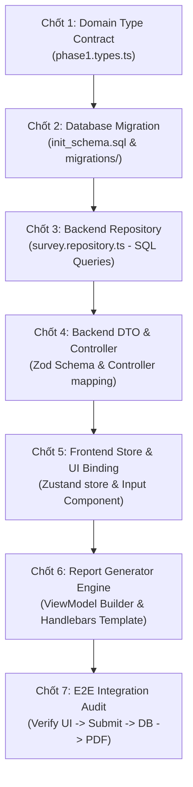
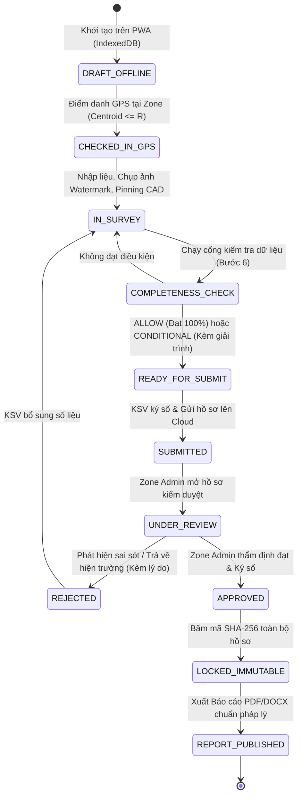
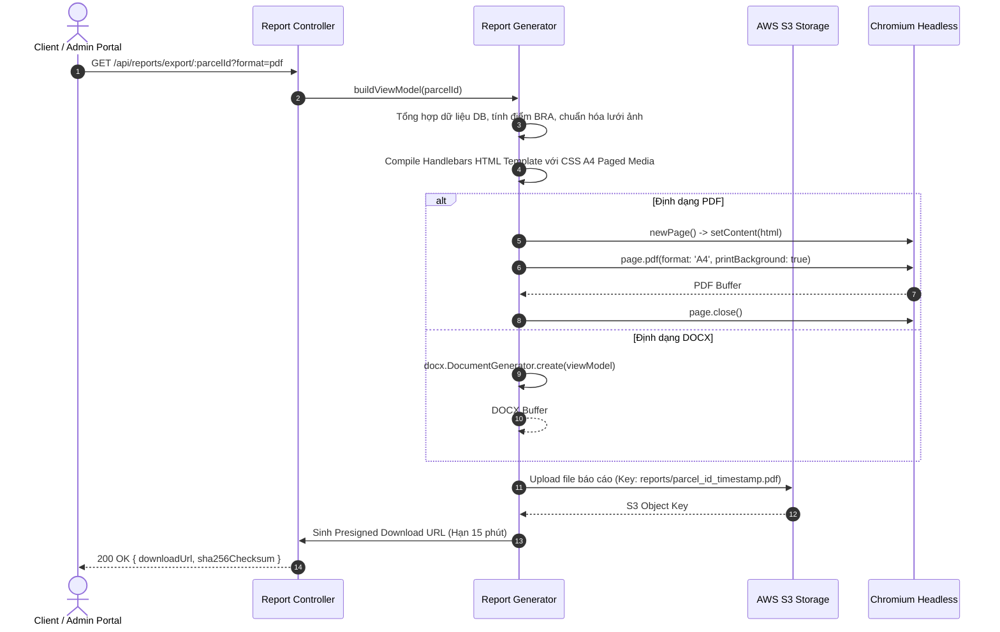

# HỆ THỐNG QUY TRÌNH TOÀN TRÌNH (SYSTEM WORKFLOWS) - METRO 2 BCS PLATFORM

Tài liệu này định nghĩa chi tiết **4 Quy trình Vận hành & Phát triển Cốt lõi (Core Workflows)** của nền tảng, thiết lập các chốt chặn chất lượng để đảm bảo tính đồng bộ toàn trình, tính bất biến pháp lý và hiệu năng hệ thống.

---

## 🔄 WORKFLOW 1: QUY TRÌNH PHÁT TRIỂN & ĐỒNG BỘ TRƯỜNG DỮ LIỆU TOÀN TRÌNH (E2E FEATURE SYNC WORKFLOW)

Quy trình này bắt buộc áp dụng khi **thêm mới, sửa đổi hoặc xóa bất kỳ trường dữ liệu nào** trong form khảo sát. Lập trình viên hoặc Agent **BẮT BUỘC** đi qua đủ 7 chốt chặn theo đúng thứ tự:



### Chi tiết 7 Chốt Chặn Kiểm Tra:

#### Chốt 1: Khai báo Domain Contract tại Frontend
* Tệp: `frontend/src/features/survey-phase1/types/phase1.types.ts` (hoặc types tương ứng).
* Xác định rõ kiểu dữ liệu: `string`, `number`, `boolean`, `string[]`, hoặc Enum.
* Tên trường tại Frontend sử dụng quy ước `camelCase` (ví dụ: `foundationDepthM`, `hasBasement`).

#### Chốt 2: CSDL & Migration (PostgreSQL / PostGIS)
* Tệp: `database/init_schema.sql` và tạo tệp migration mới trong `backend/database/migrations/YYYYMMDD_feature_name.sql`.
* Chọn kiểu dữ liệu SQL tương thích:
  * Số thực / Đo đạc: `NUMERIC(10, 2)` hoặc `DOUBLE PRECISION`.
  * Số nguyên: `INT` hoặc `SMALLINT`.
  * Logic: `BOOLEAN DEFAULT FALSE`.
  * Văn bản / Ghi chú: `TEXT` hoặc `VARCHAR(255)`.
  * Hình học không gian: `geometry(Geometry, 4326)`.
* Tên cột tại CSDL sử dụng quy ước `snake_case` (ví dụ: `foundation_depth_m`, `has_basement`).
* Cập nhật CSDL đang chạy qua Docker:
  ```bash
  docker exec metro2_postgres_postgis psql -U metro2_user -d metro2_gis_db -c "ALTER TABLE ... ADD COLUMN IF NOT EXISTS ...;"
  ```

#### Chốt 3: Backend Repository & Truy vấn SQL
* Tệp: `backend/src/modules/survey/survey.repository.ts`.
* Cập nhật cả 2 câu lệnh:
  1. Câu lệnh `INSERT INTO`: Bổ sung tên cột vào danh sách cột và thêm biến tham số (`$1, $2, ...`).
  2. Câu lệnh `UPDATE`: Bổ sung gán giá trị (`column_name = $X`).
* Xử lý chuyển đổi kiểu an toàn trước khi gán tham số:
  * Tránh lỗi ép kiểu chuỗi rỗng vào cột số: `payload.foundationDepthM !== undefined && payload.foundationDepthM !== '' ? Number(payload.foundationDepthM) : null`.

#### Chốt 4: Backend Controller & Zod Validation DTO
* Tệp: `backend/src/modules/survey/survey.controller.ts` & file Zod Schema tương ứng.
* Bổ sung trường vào Zod Schema validation:
  ```typescript
  foundationDepthM: z.number().nullable().optional()
  ```
* Kiểm tra hàm bóc tách payload từ `req.body`: Đảm bảo trường mới được lấy ra và gán vào DTO truyền xuống Service/Repository. *(Lỗi rụng dữ liệu hay gặp nhất: FE có gửi nhưng Controller không hứng)*.

#### Chốt 5: Frontend Store & UI Data Binding
* Tệp: Store tương ứng (ví dụ: `usePhase1SurveyStore.ts`) và Component giao diện.
* Kiểm tra thẻ nhập liệu `<input>`, `<select>`, `<textarea>`:
  * Thuộc tính `value` phải liên kết trực tiếp với biến trong `formData` của store.
  * Sự kiện `onChange` phải gọi hàm update của store (ví dụ: `updateFormData({ foundationDepthM: e.target.value })`).
  * Đảm bảo giá trị mặc định (default value) không bị `undefined`.

#### Chốt 6: Report Generator Engine & Handlebars Template
* Tệp: `backend/src/modules/report/generators/residential.generator.ts` và template `.hbs` tương ứng.
* Khớp biến vào ViewModel: Map trường từ Entity Database sang đối tượng truyền vào template Handlebars.
* Cập nhật tệp Handlebars: Hiển thị trường trên bảng kỹ thuật của báo cáo, xử lý fallback nếu không có dữ liệu: `{{#if foundationDepthM}}{{foundationDepthM}} m{{else}}---{{/if}}`.

#### Chốt 7: Kiểm thử Toàn trình & Báo cáo
* Chạy thử luồng nhập liệu từ form $\rightarrow$ Bấm lưu $\rightarrow$ Kiểm tra Network payload trong DevTools $\rightarrow$ Kiểm tra bản ghi trong Postgres $\rightarrow$ Bấm xuất PDF kiểm tra hiển thị.

---

## 📋 WORKFLOW 2: VÒNG ĐỜI DỮ LIỆU KHẢO SÁT & MÁY TRẠNG THÁI (SURVEY STATE MACHINE WORKFLOW)

Quy trình quản lý vòng đời một bộ hồ sơ khảo sát công trình từ thực địa đến lưu trữ pháp lý:



### Các Quy tắc Vận hành Trạng thái:
1. **Khởi tạo & Check-in GPS**:
   * Surveyor phải nằm trong bán kính cho phép tính từ trọng tâm hình học (`ST_Centroid`) của Zone phân công.
2. **Cổng Kiểm Tra Dữ Liệu (Completeness Gate)**:
   * Chỉ cho phép nộp khi cổng trả về `ALLOW` hoặc `CONDITIONAL`.
   * Nếu là `CONDITIONAL`: Bắt buộc phải có chuỗi giải trình lý do (ví dụ: *Chủ nhà đi vắng không vào được tầng 3*).
3. **Thẩm Định & Bất Biến (Immutability)**:
   * Khi trạng thái chuyển sang `APPROVED`, toàn bộ dữ liệu bị **LOCK** (Chặn toàn bộ API cập nhật).
   * Hệ thống sinh mã băm SHA-256 trên nội dung hồ sơ và chữ ký 3 bên (Chủ hộ, Surveyor, Zone Admin) để bảo chứng pháp lý trước Tòa án khi thi công metro.

---

## 📑 WORKFLOW 3: QUY TRÌNH KẾT XUẤT BÁO CÁO PHÁP LÝ (TECHNICAL REPORT EXPORT PIPELINE)

Quy trình tự động hóa chuyển đổi dữ liệu khảo sát thành Báo cáo kỹ thuật chuẩn Liên danh CRLG-CRSRI-TT:



### Tiêu Chuẩn Kỹ Thuật Khi Xuất Báo Cáo:
1. **Bố cục Ngắt Trang (CSS Paged Media)**:
   * Thiết lập `@page { size: A4; margin: 15mm 10mm 15mm 10mm; }`.
   * Các khối khuyết tật, bảng điểm BRA, cặp ảnh bối cảnh (CTX) và ảnh cận (CU) bắt buộc dùng:
     ```css
     .defect-card, .table-summary, .photo-row {
       page-break-inside: avoid;
       break-inside: avoid;
     }
     ```
2. **Inline Evidence Layout**:
   * Ảnh vết nứt có thước đo phải nằm trực tiếp trên cùng hàng hoặc bên cạnh mô tả khuyết tật, không dồn hết ảnh về cuối tài liệu.
3. **Quản lý Vòng đời Puppeteer**:
   * Phải bọc khối xử lý Puppeteer trong `try ... finally { if (page) await page.close(); }` để triệt tiêu tiến trình Chromium mồ côi (Zombie processes).

---

## 🛡️ WORKFLOW 4: QUY TRÌNH KIỂM SOÁT CHẤT LƯỢNG & BÀN GIAO (PRE-RELEASE VERIFICATION GATEWAY)

Trước khi nghiệm thu bất kỳ tính năng hoặc bugfix nào, Agent và Kỹ sư phải thực hiện đúng 4 bước kiểm thử nghiêm ngặt:

1. **Kiểm tra TypeScript & Clean Build**:
   * Chạy kiểm tra Frontend:
     ```bash
     cd frontend && npm run build
     ```
     *Yêu cầu: Exit code = 0, không có bất kỳ lỗi type `TSxxxx` nào.*
   * Chạy kiểm tra Backend:
     ```bash
     cd backend && npm run build
     ```
     *Yêu cầu: Exit code = 0, dist bundle sinh đầy đủ template báo cáo.*
2. **Kiểm tra Tính toàn vẹn CSDL (Migration Idempotency)**:
   * Mọi câu lệnh SQL thêm cột phải có mệnh đề phòng vệ: `ADD COLUMN IF NOT EXISTS`.
   * Kiểm tra tương thích dữ liệu cũ: Các bản ghi cũ không được bị gãy vỡ khi cột mới có giá trị `NULL`.
3. **Kiểm tra Không có Lỗi Hồi quy (Zero Regression)**:
   * Xác nhận tính tương thích với cả 3 luồng: Nhà dân thông thường, Tòa nhà chung cư mẹ, và Căn hộ con.
   * Xác nhận 5 module GPS không bị ảnh hưởng chéo.
4. **Chuẩn hóa Commit**:
   * Tuân thủ chuẩn Conventional Commits (ví dụ: `feat(survey): sync foundation depth field e2e`, `fix(report): prevent page break inside defect photos`).
