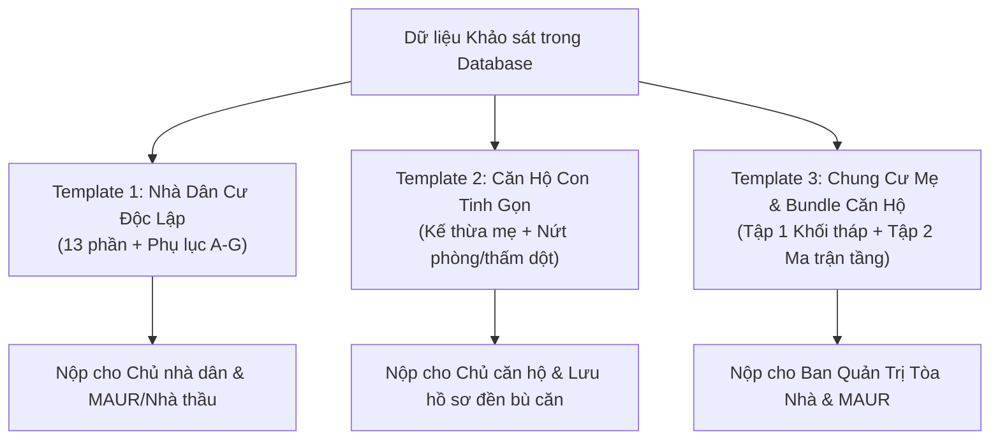

# BỘ QUY CHUẨN KIẾN TRÚC & HƯỚNG DẪN KỸ THUẬT XUẤT REPORT (BCS REPORT EXPORT)

Tài liệu này xác lập tiêu chuẩn kiến trúc phần mềm, công nghệ ngầm và quy cách 3 template báo cáo khảo sát hiện trạng Phase 1 phục vụ Dự án Tuyến Tàu điện ngầm số 2 TP.HCM (Bến Thành – Tham Lương), tuân thủ 100% hồ sơ mẫu chuẩn của **Liên danh CRLG–CRSRI–TT** tại `srs/export_report/Mau_Bao_cao_Khao_sat_Hien_trang_Phase1_CRLG-CRSRI-TT.docx.md`.

---

## 1. THIẾT KẾ MODULE BACKEND REPORT (CHỐNG SPAGHETTI CODE)

Để tránh tình trạng spaghetti code (dồn toàn bộ logic truy vấn DB, format dữ liệu, tạo HTML và xuất PDF vào 1 file controller/service khổng lồ), hệ thống backend áp dụng kiến trúc module phân lớp rõ ràng tại `backend/src/modules/report/`:

```
backend/src/modules/report/
├── report.controller.ts           # API Routing (Nhận request, validate params, stream file buffer)
├── report.service.ts              # Orchestrator (Query DB, nạp dữ liệu khảo sát, điều phối generator, tính hash SHA-256)
├── report.types.ts                # TypeScript Interfaces cho 3 loại báo cáo
├── engine/
│   ├── pdf-render.engine.ts       # Puppeteer Pool Singleton (Khởi tạo Chromium headless, in PDF A4, footer số trang)
│   └── docx-render.engine.ts      # Docxtemplater Engine (Dành cho xuất file Word khi cần chỉnh sửa)
├── generators/
│   ├── base-report.generator.ts   # Abstract Class chung: Format ngày tháng, tiền xử lý ảnh, tính toán điểm số
│   ├── residential.generator.ts   # Strategy Generator 1: Báo cáo Nhà dân cư độc lập (Nhà phố/Biệt thự)
│   ├── condo-unit.generator.ts    # Strategy Generator 2: Báo cáo Căn hộ con (Condo Child Unit)
│   └── condo-master.generator.ts  # Strategy Generator 3: Báo cáo Chung cư mẹ & Ma trận căn hộ con
└── templates/
    ├── partials/                  # Các khối giao diện dùng chung (Header dự án CRLG, Chữ ký số, Popover giải trình)
    │   ├── header-crlg.hbs
    │   ├── signatures-3party.hbs
    │   └── defect-table.hbs
    ├── residential/               # Template 1: Nhà dân cư bình thường (13 phần + Phụ lục A-G)
    │   ├── index.hbs
    │   └── styles.css
    ├── condo-unit/                # Template 2: Căn hộ con tinh gọn (Kế thừa tòa mẹ)
    │   ├── index.hbs
    │   └── styles.css
    └── condo-master/              # Template 3: Tòa nhà chung cư mẹ & Bảng tổng hợp căn hộ con
        ├── index.hbs
        └── styles.css
```

---

## 2. CÔNG NGHỆ NGẦM XUẤT PDF & BỐ TRÍ DỮ LIỆU / ẢNH

### 2.1. Công nghệ cốt lõi: **HTML5 + CSS Paged Media + Handlebars + Puppeteer (Chromium Headless)**
- **Tại sao chọn công nghệ này thay vì PDFKit hay ReportLab?**
  1. **Khả năng bố trí layout tuyệt đối**: Hỗ trợ CSS Grid & Flexbox, cho phép dàn trang các bảng biểu kỹ thuật 10-12 cột (như Sổ khuyết tật Defect Register) mà không bị tràn mép hay lệch dòng.
  2. **In ấn chuẩn trang A4 (Paged Media)**: Sử dụng CSS `@page { size: A4 portrait; margin: 15mm 12mm 15mm 12mm; }`, hỗ trợ ngắt trang thông minh `break-inside: avoid;` (không bao giờ để 1 bảng nứt hoặc 1 khung ảnh bị cắt đôi ở giữa 2 trang).
  3. **Độ nét tối đa (Hi-DPI Vector)**: Font chữ nhúng trực tiếp, bảng biểu sắc nét; xuất bản in PDF độ phân giải 300 DPI đáp ứng tiêu chuẩn nộp lưu trữ công trình đường sắt đô thị.
  4. **Số trang động**: Tự động đánh số trang pháp lý dạng `Trang X / Y` ở footer góc phải theo quy chuẩn kiểm soát tài liệu CRLG–CRSRI–TT.

### 2.2. Kỹ thuật chèn ảnh & Bố trí thước đo nứt (Crack Gauge):
- **Cơ chế nạp ảnh Zero-Network-Failure**:
  - Không nạp link URL trực tiếp trong lúc render Chromium (dễ bị timeout mạng).
  - Backend tải ảnh từ S3/Local Storage và chuyển thành **Base64 Data URI** (`data:image/jpeg;base64,...`) trước khi inject vào Handlebars template.
- **Bố cục khung ảnh nhận diện (P-01 đến P-04)**:
  - Dùng CSS Grid 2 cột: Khung cố định tỉ lệ 4:3, bo góc nhẹ, viền xám kỹ thuật.
  - Phía dưới ảnh là hộp thông tin (Metadata Strip): `Photo ID`, `Ngày giờ chụp (EXIF)`, `Tọa độ GPS WGS84` và `Ghi chú vị trí`.
- **Bố cục ảnh khuyết tật có thước đo (Phụ lục D)**:
  - Thiết kế dạng **Cặp ảnh đối chiếu (Pair Comparison)**:
    - *Ảnh trái*: Ảnh bối cảnh (Toàn cảnh mảng tường/cột bị nứt).
    - *Ảnh phải*: Ảnh chụp cận cảnh có đặt thước đo nứt (Crack gauge $\ge 0.1\text{mm}$).
  - Gắn nhãn tự động: Mã nứt `D-01`, Vùng `Z-01`, Bề rộng $w_{\text{max}} = 0.8\text{mm}$.
- **Nhúng Sơ đồ Bản đồ Hư hại (Damage Map)**:
  - Lấy chuỗi PNG Base64 từ phương thức `canvas.toDataURL()` của `FloorCadPinningCanvas` trên Web, chèn trực tiếp vào Phụ lục C với kích thước mở rộng toàn trang ngang (A4 Landscape) hoặc trang dọc lớn.

---

## 3. PHÂN BIỆT RÕ RÀNG 3 TEMPLATE CHO 3 LOẠI BÁO CÁO

Hệ thống cung cấp **3 template chuyên biệt** với mục đích sử dụng và chủ thể nhận báo cáo hoàn toàn khác nhau:



---

### TEMPLATE 1: BÁO CÁO KHẢO SÁT HIỆN TRẠNG NHÀ DÂN CƯ ĐỘC LẬP
*(Áp dụng: Nhà phố, biệt thự, nhà riêng lẻ, trụ sở thương mại thấp tầng)*
- **Đặc trưng**: Khảo sát từ móng lên đến mái của một thửa đất độc lập.
- **Nội dung gồm 13 phần chuẩn CRLG–CRSRI–TT**:
  1. *Thông tin chung*: Tim hầm Metro, khoảng cách ranh đất đến tim hầm, lý trình Chainage.
  2. *Mục đích, phạm vi, phương pháp & thiết bị đo*.
  3. *Đặc điểm công trình*: Hệ kết cấu chịu lực, loại móng (móng cọc/móng nông), CAT thông tin móng (1-5), năm xây dựng, lịch sử cơi nới/ngập lụt.
  4. *Phạm vi tiếp cận & Bộ 4 ảnh định danh ngoại thất*: P-01 (Số nhà/Lộ giới), P-02 (Toàn cảnh mặt đứng chính + chia tầng), P-03 (Mặt bên/Hẻm hông), P-04 (Mặt đường/Vỉa hè).
  5. *BCS Checklist*: Ghi nhận các chỉ báo nứt, lún, thấm, bong tróc.
  6. *Sổ khuyết tật (Defect Register)* & *Damage Map*: Ghim các điểm $Z$ (Vùng) và $E$ (Cấu kiện) trên toàn bộ các tầng (Trệt, Lầu 1, Lầu 2, Sân thượng).
  7. *Lún – Nghiêng – Biến dạng*: Đo độ nghiêng công trình phương X, Y theo $\permil$, độ võng dầm sàn nhịp lớn.
  8. *Đánh giá Burland 1977*: Cấp độ chủ đạo (Predominant) và cục bộ (Local max).
  9. *Đánh giá tình trạng hiện hữu ECS*: Thang điểm $E_1 \rightarrow E_6$ (Tổng 24đ), phân hạng GOOD/MEDIUM/DEFICIENT/CRITICAL.
  10. *Chỉ số dễ tổn thương VI*: Thang điểm $V_1 \rightarrow V_6$ (Tổng 24đ).
  11. *Cấp tác động Metro $I$*: Phân cấp $I_1 \rightarrow I_4$ dựa trên cự ly tim hầm.
  12. *Ma trận rủi ro cơ sở BRA*: Giao điểm $V \times I$.
  13. *Kết luận & Kiến nghị kỹ thuật*.
  - *Phụ lục A - G*: Bản đồ vị trí GIS, bản vẽ CAD mặt bằng, sơ đồ khuyết tật, hồ sơ ảnh có thước đo, biên bản hiện trường 3 bên.

---

### TEMPLATE 2: BÁO CÁO KHẢO SÁT HIỆN TRẠNG CĂN HỘ CON
*(Áp dụng: Từng căn hộ riêng lẻ trong khối tháp chung cư)*
- **Đặc trưng**: Tinh gọn, loại bỏ các mục không thuộc quyền sở hữu của chủ hộ, tập trung làm nổi bật hư hại nội thất làm căn cứ bồi thường độc lập cho hộ gia đình.
- **Nội dung điều chỉnh chuyên biệt**:
  - **Header & Nhận dạng**:
    - Nổi bật: **MÃ CĂN HỘ** (VD: `P.402`), **TẦNG / LẦU** (VD: `Tầng 4` hoặc `Tầng 18-19 Duplex`).
    - Dẫn chiếu trực thuộc: Tên Tòa nhà chung cư mẹ, Địa chỉ tòa nhà, Mã thửa dự án (`projectParcelCode`), Mã địa chính (`officialCadastralCode`).
  - **Kế thừa từ Tòa nhà mẹ (Ghi chú kế thừa, không khảo sát lại)**:
    - Móng cọc, tầng hầm $\rightarrow$ Kế thừa từ Báo cáo Master của Tòa mẹ.
    - Đo độ nghiêng toàn tòa $\rightarrow$ Kế thừa từ Tòa mẹ.
    - Cự ly tim hầm Metro & Lý trình $\rightarrow$ Kế thừa từ Tòa mẹ.
    - Bản vẽ hoàn công toàn tòa $\rightarrow$ Lưu trong hồ sơ Master (truy CAD sau).
  - **Trọng tâm riêng của Căn hộ con**:
    - *Ảnh định danh*: P-01 (Cửa chính & Biển số căn hộ), P-04 (Nội thất phòng khách); P-02 và P-03 ghi chú N/A hoặc chụp ban công/logia.
    - *Lịch sử riêng*: Ghi nhận việc đập thông tường phòng, cải tạo nội thất toilet.
    - *Hiện trạng đặc thù chung cư*: **Hiện tượng thấm dột từ căn hộ tầng trên xuống (Toilet / Trần)**.
    - *Sổ khuyết tật (Defect Register)*: Bảng vết nứt tường ngăn, dầm trần và sàn ban công bên trong căn hộ.
    - *Damage Map*: Mặt bằng bố trí các phòng bên trong căn hộ gắn mã vùng $Z$ và mã nứt $D$ (Hỗ trợ căn Duplex 2 tầng).
    - *Biên bản hiện trường*: Ký xác nhận trực tiếp giữa **Khảo sát viên** và **Chủ căn hộ / Người đang cư ngụ thực tế**.

---

### TEMPLATE 3: BÁO CÁO TỔNG THỂ TÒA NHÀ CHUNG CƯ & TẬP HỢP CĂN HỘ CON
*(Áp dụng: Bàn giao Ban Quản Trị Tòa Nhà, MAUR, Tư vấn Giám sát & Nhà thầu EPC)*
- **Đặc trưng**: Báo cáo phức hợp 2 trong 1 (Master Dossier & Multi-tier Bundle), cung cấp bức tranh toàn cảnh về độ an toàn của toàn khối tháp chung cư trước khi TBM đào qua.
- **Cấu trúc 3 tập tích hợp**:
  1. **Tập 1 - Hiện Trạng Khối Tháp Chung Cư Mẹ (Master Tower Section)**:
     - Toàn bộ hồ sơ địa chính, ranh đất GIS, cự ly tim hầm Metro, dự báo lún $S_{\text{max}}$.
     - Hồ sơ kết cấu móng cọc khoan nhồi / tường vây tầng hầm, độ nghiêng tổng thể khối tháp.
     - Bộ 4 ảnh toàn cảnh P-01 đến P-04 mặt đứng khối tháp.
     - Hiện trạng hạ tầng kỹ thuật dùng chung: Thang máy, Hệ thống PCCC sprinkler, Bể nước ngầm, Máy phát điện dự phòng, Hành lang thoát hiểm.
     - Đánh giá tổng hợp ECS, VI và Ma trận rủi ro BRA cho toàn khối tháp.
     - Đại diện ký xác nhận: **Ban Quản Lý / Ban Quản Trị Tòa Nhà**.
  2. **Tập 2 - Ma Trận Tổng Hợp Tiến Độ & Hư Hại Đa Tầng (Multi-tier Floor Matrix)**:
     - Bảng ma trận tổng hợp theo chiều cao tòa nhà (từ Tầng trệt lên Tầng thượng):
       - *Tầng 1*: 10 căn hộ (8 căn bình thường, 2 căn nứt nhẹ, 0 căn nứt kết cấu).
       - *Tầng 4*: 12 căn hộ (10 căn bình thường, 1 căn thấm dột, 1 căn nứt vách thạch cao).
       - ...
       - *Tổng hợp*: Tỷ lệ hoàn thành khảo sát (VD: 142/150 căn hộ đã ký biên bản; 8 căn vắng mặt có biên bản dán thông báo).
     - Phân loại danh sách các căn hộ có cờ cảnh báo kết cấu nguy hiểm (`HIGH` hoặc `CRITICAL`) để ưu tiên lắp đặt mốc quan trắc biến dạng tự động.
  3. **Tập 3 - Phụ Lục Danh Mục Báo Cáo Chi Tiết Từng Căn Hộ (Child Units Dossier Index)**:
     - Tập hợp tóm tắt hồ sơ biên bản hiện trường của từng căn hộ con để làm bộ chứng cứ pháp lý đầy đủ nộp lưu chiểu.

---

## 4. QUY TRÌNH BÀN GIAO & API ENDPOINTS CHO LẬP TRÌNH VIÊN:

```typescript
// 1. Xuất Báo cáo Nhà Dân cư độc lập
GET /api/v1/reports/surveys/:surveyId/export/pdf
GET /api/v1/reports/surveys/:surveyId/export/docx

// 2. Xuất Báo cáo Căn hộ con
GET /api/v1/reports/condo-units/:unitId/export/pdf
GET /api/v1/reports/condo-units/:unitId/export/docx

// 3. Xuất Báo cáo Tổng thể Tòa nhà Chung cư & Bundle Căn hộ con
GET /api/v1/reports/condo-masters/:parcelId/export/pdf?includeChildUnits=true
GET /api/v1/reports/condo-masters/:parcelId/export/matrix-excel
```
