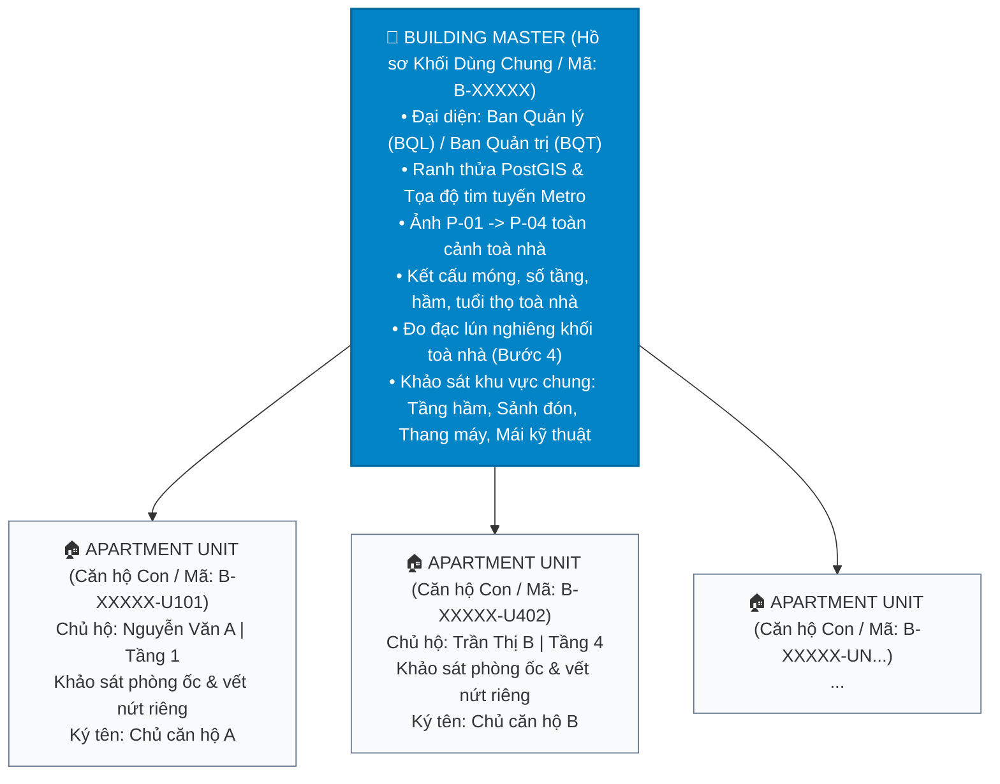

# Đặc Tả Nghiệp Vụ & Kỹ Thuật: Khảo Sát Tòa Nhà Nhiều Hộ / Chung Cư (Condominium & Multi-Unit Architecture)

> **Dự án:** Hệ thống Khảo sát Hiện trạng Công trình (KSQH) Tuyến Metro số 2 (Bến Thành - Tham Lương)  
> **Phiên bản:** 1.0.0  
> **Trạng thái:** Được phê duyệt kiến trúc (Approved)  
> **Nguyên tắc kỹ thuật:** Bảo toàn 100% tính tương thích ngược (Zero-Breaking Changes) với hơn 7.000 thửa nhà phố đơn lẻ hiện hữu.

---

## 1. Bối Cảnh & Vấn Đề Thực Địa (Problem Statement)

### 1.1. Thực trạng tại Vùng ảnh hưởng Tuyến Metro số 2
Dọc hành lang tuyến Metro số 2 (đoạn qua các trục Cách Mạng Tháng Tám, Trường Chinh...), bên cạnh các thửa nhà phố đơn lẻ, tồn tại rất nhiều công trình dạng:
1. **Chung cư cao tầng / Khu phức hợp thương mại:** Có hàng trăm căn hộ thuộc sở hữu của nhiều hộ dân riêng lẻ.
2. **Cư xá / Chung cư cũ / Nhà tập thể:** Công trình từ 3–5 tầng, xây dựng trước năm 1975 hoặc thập niên 80–90, kết cấu đã xuống cấp nhưng thuộc 1 thửa đất địa chính duy nhất và có nhiều hộ gia đình cùng sinh sống.

### 1.2. Hạn chế của Mô hình "Một Thửa Đất - Một Hồ Sơ" Hiện Hữu
Trong thiết kế ban đầu, mỗi mã quản lý `B-XXXXX` đại diện cho một thửa đất độc lập. Nếu áp dụng nguyên mẫu này cho Chung cư sẽ dẫn đến các bất cập nghiêm trọng:
* **Lãng phí thời gian & bộ nhớ thiết bị:** Nếu toà nhà có 80 căn hộ, cán bộ hiện trường phải đứng ngoài đường chụp lại 80 lần các ảnh `P-01` (biển tên chung cư), `P-02` (mặt đứng toà nhà), `P-03`, `P-04`, và nhập lặp lại 80 lần thông tin kết cấu móng toà nhà.
* **Xung đột & Nhầm lẫn Khuyết tật Kết cấu:** Vết nứt dầm cột chịu lực chính ở tầng hầm hoặc lún toàn khối toà nhà là khuyết tật của **Toàn bộ công trình (Chung)**, không thể gán tùy tiện vào hồ sơ của riêng Căn hộ 302 hay Căn hộ 501.
* **Bế tắc về Cơ sở Pháp lý & Đền bù sau này:** Khi thi công khiên đào TBM gây rung chấn hoặc lún, hệ thống không phân định được: đâu là trách nhiệm bồi thường cho Ban Quản trị / Quỹ bảo trì chung của tòa nhà (hư hỏng kết cấu móng, nứt hầm, nghiêng toà), và đâu là bồi thường cho cá nhân từng chủ căn hộ (nứt tường ngăn, vỡ gạch lát sàn bên trong căn hộ).

---

## 2. Mô Hình Dữ Liệu Cha - Con (Building Master & Unit Child Hierarchy)

Kiến trúc giải quyết triệt để vấn đề bằng cách phân định 2 cấp bậc hồ sơ rõ ràng:



### 2.1. Cấp Toà Nhà Tổng Thể (`Building Master`)
* **Mã dự án:** Cố định `B-XXXXX` theo lý trình Metro (VD: `B-00120`).
* **Phạm vi khảo sát:**
  * 4 bộ ảnh định danh `P-01` đến `P-04`.
  * Hồ sơ kết cấu chịu lực: Hệ móng (cọc nhồi/cọc ép), hệ khung BTCT, số tầng nổi, số tầng hầm.
  * Các không gian dùng chung: Tầng hầm bãi xe, sảnh chính, buồng thang thoát hiểm, phòng kỹ thuật điện nước, tầng mái/sê-nô.
  * Lún - nghiêng tổng thể toà nhà.
* **Người ký biên bản:** Đại diện Ban Quản Lý (BQL), Ban Quản Trị (BQT) hoặc Tổ trưởng dân phố đại diện.

### 2.2. Cấp Căn Hộ Thành Viên (`Apartment Unit`)
* **Mã định danh kép mở rộng:** `B-XXXXX-U[SốPhòng]` (VD: `B-00120-U402`).
* **Cơ chế thừa hưởng (Inheritance Engine):** Tự động kế thừa 100% dữ liệu gốc của toà nhà (Ảnh P01-P04, kết cấu móng, ranh GIS).
* **Phạm vi khảo sát riêng biệt:**
  * Định danh: Số căn hộ (VD: Căn 402, Block A), Lầu/Tầng.
  * Chủ hộ: Tên chủ sở hữu, SĐT, Số CCCD.
  * Hiện trạng bên trong căn hộ: Các phòng (Phòng khách, Bếp, Phòng ngủ, Ban công riêng), ghim các vết nứt cục bộ của căn hộ.
* **Người ký biên bản:** Trực tiếp Chủ sở hữu căn hộ ký trên màn hình thiết bị.

---

## 3. Thiết Kế Cơ Sở Dữ Liệu (Database Schema Migration)

Hệ thống bổ sung cấu trúc mới mà không can thiệp hay làm gián đoạn bảng hiện hữu:

```sql
-- 1. Bổ sung kiểu toà nhà vào bảng parcels
ALTER TABLE parcels 
ADD COLUMN IF NOT EXISTS building_type VARCHAR(32) NOT NULL DEFAULT 'STANDALONE',
ADD COLUMN IF NOT EXISTS total_units INT NOT NULL DEFAULT 1;

-- 2. Tạo bảng quản lý danh sách căn hộ thành viên
CREATE TABLE IF NOT EXISTS building_units (
    id UUID PRIMARY KEY DEFAULT uuid_generate_v4(),
    parcel_id UUID NOT NULL REFERENCES parcels(id) ON DELETE CASCADE,
    unit_code VARCHAR(32) NOT NULL,              -- VD: 'P.402', 'A-12.05'
    floor_number INT NOT NULL DEFAULT 1,          -- VD: 4
    owner_name VARCHAR(128),
    owner_phone VARCHAR(32),
    owner_id_card VARCHAR(32),
    status parcel_survey_status_enum NOT NULL DEFAULT 'NOT_SURVEYED',
    phase1_report_id UUID REFERENCES base_survey_reports(id) ON DELETE SET NULL,
    phase2_report_id UUID REFERENCES base_survey_reports(id) ON DELETE SET NULL,
    created_at TIMESTAMPTZ NOT NULL DEFAULT NOW(),
    updated_at TIMESTAMPTZ NOT NULL DEFAULT NOW(),
    CONSTRAINT uq_parcel_unit UNIQUE (parcel_id, unit_code)
);

CREATE INDEX IF NOT EXISTS idx_building_units_parcel ON building_units(parcel_id);
CREATE INDEX IF NOT EXISTS idx_building_units_status ON building_units(status);

-- 3. Mở rộng bảng base_survey_reports để liên kết phân cấp
ALTER TABLE base_survey_reports
ADD COLUMN IF NOT EXISTS unit_id UUID REFERENCES building_units(id) ON DELETE SET NULL,
ADD COLUMN IF NOT EXISTS parent_report_id UUID REFERENCES base_survey_reports(id) ON DELETE SET NULL,
ADD COLUMN IF NOT EXISTS report_type VARCHAR(32) NOT NULL DEFAULT 'STANDALONE'; -- 'STANDALONE' | 'BUILDING_MASTER' | 'UNIT_CHILD'

CREATE INDEX IF NOT EXISTS idx_reports_unit ON base_survey_reports(unit_id);
CREATE INDEX IF NOT EXISTS idx_reports_parent ON base_survey_reports(parent_report_id);
```

---

## 4. Đặc Tả Giao Diện & Trải Nghiệm Người Dùng (Surveyor UX Flow)

### 4.1. Bản Đồ GIS & Danh Sách Công Trình
* **Nhà phố đơn lẻ (`STANDALONE`):** Hiển thị bình thường. Bấm vào mở trực tiếp form khảo sát như cũ.
* **Chung cư (`CONDOMINIUM`):** Hiển thị biểu tượng tòa nhà kèm huy hiệu tiến độ (VD: `🏢 Chung cư Miếu Nổi (8/12 căn đã xong)`). Khi bấm vào, hệ thống mở **Hub Quản Lý Tòa Nhà (Building Hub)**.

### 4.2. Trung Tâm Điều Phối Tòa Nhà (Building Hub View)
Giao diện Hub bao gồm 2 khu vực trực quan:
1. **Khối Dùng Chung (Building Master):**
   * Hiển thị trạng thái khảo sát phần chung (Chưa làm / Đang làm / Đã duyệt).
   * Nút hành động: *"Khảo sát Khối chung (Master)"* $\rightarrow$ Mở form Phase 1 đầy đủ 8 bước để thu thập P01-P04, Hầm, Móng, Sảnh và lấy chữ ký BQL toà nhà.
2. **Lưới Danh Sách Căn Hộ (Apartment Units Grid):**
   * Bộ lọc theo Tầng (Tầng 1, Tầng 2, Tầng 3...) và trạng thái.
   * Nút *"Thêm Căn hộ mới"* (hoặc tạo nhanh theo danh sách).
   * Thẻ từng căn hộ: Hiển thị Mã căn (`P.402`), Chủ hộ, Trạng thái khảo sát.
   * Nút hành động: *"Khảo sát Căn này"*.

### 4.3. Chế Độ Khảo Sát Căn Hộ Tinh Gọn (Unit Fast-Survey Mode)
Khi Surveyor bấm khảo sát một căn hộ:
* Màn hình có thông báo: `✅ Đã tự động kế thừa ảnh mặt tiền P01-P04 & kết cấu móng từ Khối chung toà nhà`.
* Tự động ẩn hoặc thu gọn Bước 1 & Bước 2.1 (không yêu cầu chụp lại mặt đứng toà nhà hay khai lại loại móng).
* Surveyor chỉ thực hiện:
  1. Kiểm tra thông tin chủ căn hộ (Tên, SĐT).
  2. Đi từng phòng của căn hộ (Phòng khách, Phòng ngủ, Ban công...), chụp ảnh hiện trạng và chấm ghim vết nứt riêng của căn hộ.
  3. Chủ căn hộ ký tên xác nhận hiện trường.
* **Hiệu quả:** Rút ngắn thời gian khảo sát mỗi căn hộ xuống chỉ còn **5 - 8 phút** (thay vì 35 phút).

---

## 5. Ma Trận Pháp Lý & Căn Cứ Đền Bù Khi Xảy Ra Sự Cố

| Hiện tượng hư hỏng sau khi thi công Metro | Hồ sơ đối chiếu làm căn cứ | Đối tượng thụ hưởng / Trách nhiệm xử lý |
| :--- | :--- | :--- |
| **Lún toàn khối toà nhà, nứt dầm chuyển, nứt vách tầng hầm** | Báo cáo Master của Tòa nhà (`BUILDING_MASTER`) | Đền bù / gia cố cho **Ban Quản trị / Quỹ bảo trì chung của Tòa nhà** |
| **Nứt tường ngăn, bung gạch lát nền trong Căn hộ 402** | Báo cáo Căn hộ (`UNIT_CHILD` - `B-00120-U402`) | Bồi thường trực tiếp cho **Chủ sở hữu Căn hộ 402** |
| **Chủ căn hộ khiếu nại vết nứt cũ nhưng khai báo là mới** | Đối chiếu ảnh CU có thước đo Crack Scale Card trong biên bản căn hộ lập trước ngày thi công | **Khước từ đền bù** căn cứ trên chữ ký của chính chủ nhà |

---

## 6. Lộ Trình Triển Khai Kỹ Thuật (Next Steps)
1. **Migration CSDL:** Bổ sung các trường và bảng `building_units` vào Postgres/PostGIS.
2. **Backend API:** Thêm các module quản lý Units (`GET/POST /api/v1/parcels/:id/units`) và tích hợp `unitId` vào luồng khảo sát `SurveyService`.
3. **Frontend PWA:** Phát triển component `BuildingHubModal` và cập nhật `SurveyorHomeView`, `SurveyPhase1View` hỗ trợ chế độ Căn hộ tinh gọn.
4. **Kiểm thử Toàn diện (E2E & Unit Tests):** Đảm bảo 100% test suites cũ chạy thành công và viết bổ sung các test case mới cho Chung cư / Units.
