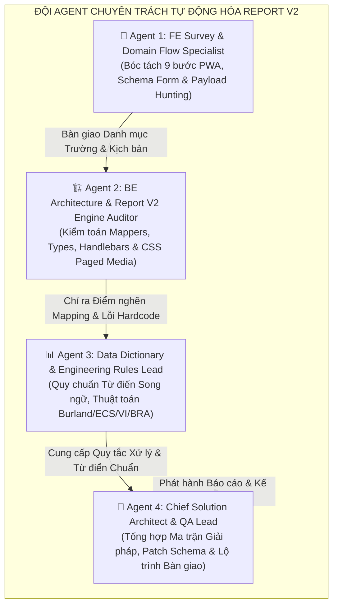
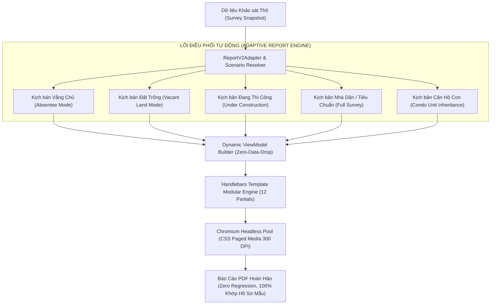

# BÁO CÁO KIỂM TOÁN TOÀN DIỆN PAYLOAD, KỊCH BẢN HIỆN TRƯỜNG & GIẢI PHÁP TỰ ĐỘNG HÓA REPORT V2
## METRO LINE 2 (BẾN THÀNH – THAM LƯƠNG) | PHASE 1 BCS REPORT AUTOMATION V2

> **Căn cứ tài liệu & Hồ sơ kỹ thuật:**
> - Hồ sơ mẫu chuẩn: `report_0410/template_report.docx` & `report_0410/template.pdf` (Liên danh CRLG – CRSRI – TT)
> - Đặc tả kiến trúc hiện hữu: [`docs/report/report_v2_architecture_blueprint.md`](file:///Users/vqd2k6/Desktop/MIT-techology/KSat_QHoach/docs/report/report_v2_architecture_blueprint.md)
> - Từ điển dữ liệu song ngữ: [`docs/report/bcs_report_v2_field_dictionary_and_mapping_spec.md`](file:///Users/vqd2k6/Desktop/MIT-techology/KSat_QHoach/docs/report/bcs_report_v2_field_dictionary_and_mapping_spec.md)
> - Quy chuẩn kiến trúc & lỗi hệ thống: [`architectural_standards_and_system_rules.md`](file:///Users/vqd2k6/Desktop/MIT-techology/KSat_QHoach/.agents/rules/architectural_standards_and_system_rules.md)
> - Mã nguồn khảo sát Frontend: `frontend/src/features/survey-phase1/` & `frontend/src/features/survey-condo-unit/`
> - Mã nguồn kết xuất Backend Report V2: `backend/src/modules/report_v2/`

---

## 👥 PHẦN 1: THÀNH LẬP & PHÂN CÔNG NHIỆM VỤ ĐỘI AGENT CHUYÊN TRÁCH

Để giải quyết bài toán tự động hóa hoàn toàn Báo cáo BCS Phase 1 V2, đảm bảo **không bỏ sót bất kỳ trường dữ liệu nào (Zero-Data-Drop)** và **xử lý trơn tru mọi kịch bản thực địa (Zero Hardcode, Zero Regressions)**, một đội ngũ 4 Agent chuyên trách được khởi tạo:



### Nhiệm Vụ Cụ Thể Của Từng Chuyên Viên:
1. **Agent 1 (FE Survey & Domain Flow Specialist)**: Quét toàn bộ 9 bước của Wizard PWA Khảo sát (`Step1_BuildingIdentification` đến `Step9_FieldSignatures`), bóc tách từng thuộc tính của store Zustand `usePhase1SurveyStore` và payload gửi lên server qua `surveyDraftService.ts`.
2. **Agent 2 (BE Architecture & Report V2 Engine Auditor)**: Rà soát toàn bộ `backend/src/modules/report_v2/`, kiểm toán các lớp ViewModel Mapper, các hàm formatters, cấu trúc Handlebars Partials từ trang 1 đến trang 12 và engine Puppeteer.
3. **Agent 3 (Data Dictionary & Engineering Rules Lead)**: Rà soát tính chính xác của các thuật ngữ chuyên ngành song ngữ (Tiếng Việt – Tiếng Anh), các công thức trắc địa, công thức hình học không gian PostGIS, thuật toán Burland (1977), ECS (0–24), VI (1.00–4.00) và Ma trận Rủi ro BRA (4x4).
4. **Agent 4 (Chief Solution Architect & QA Lead)**: Tổng hợp phát hiện, phân loại 12 kịch bản giả định thực địa toàn diện, xây dựng giải pháp khắc phục các điểm hardcode, thiếu trường và đưa ra lộ trình tích hợp an toàn 100%.

---

## 🧭 PHẦN 2: MA TRẬN 12 KỊCH BẢN THỰC ĐỊA TOÀN DIỆN (12 HYPOTHESIZED FIELD SCENARIOS)

Khi khảo sát hàng nghìn công trình dọc hành lang 11km tuyến Metro 2, thực tế hiện trường phát sinh rất nhiều tình huống đặc thù. Nếu Report V2 chỉ thiết kế cho một trường hợp "nhà phố lý tưởng", hệ thống sẽ lập tức gãy đổ hoặc xuất hiện dữ liệu rác, lệch pha pháp lý.

Dưới đây là **Ma trận 12 Kịch Bản Giả Định Bắt Buộc Phải Xử Lý Tự Động**:

```mermaid
mindmap
  root((12 KỊCH BẢN HIỆN TRƯỜNG))
    Kịch bản Cơ bản
      (1) Nhà Dân Tiêu Chuẩn (Full Access)
      (7) Zero Defects (Không Hư Hỏng)
    Kịch bản Tiếp cận Ngoại lệ
      (2) Khảo sát Vắng Chủ (Absentee)
      (6) Tiếp cận Hạn chế Một Phần (Partial Access)
    Kịch bản Đặc thù Công trình
      (3) Khu Đất Trống (Vacant Land)
      (4) Công Trình Đang Thi Công (Under Construction)
      (11) Tầng Không Có Kết Cấu Riêng (Roof/Terrace)
      (12) Căn Hộ Con Kế Thừa Mẹ (Condo Unit)
    Kịch bản Địa chính & Biến động
      (5) Biến động Ranh Gộp Thửa/Tách Thửa (GIS Mutation)
    Kịch bản Kỹ thuật & Đo đạc
      (8) Khuyết Tật Kết Cấu Nguy Hiểm (Critical Structural)
      (9) Đo Nghiêng Laser vs Quan Sát Ngoại Quan
      (10) Đa Ảnh Khuyết Tật (Multi-Photo Close-Up D-xx)
```

### Bảng Phân Tích Chi Tiết 12 Kịch Bản Hiện Trường:

| Mã Case | Tên Kịch Bản | Dấu Hiệu Nhận Diện Từ Payload FE | Tác Động Lên Cấu Trúc Báo Cáo V2 | Quy Ước Bắt Buộc Để Báo Cáo Luôn Đúng |
|:---:|:---|:---|:---|:---|
| **CASE-01** | **Nhà Dân Tiêu Chuẩn (Full Access)** | `surveyCaseType === 'NORMAL'`, `isAbsenteeSurvey === false`, `accessLimitation.type === 'FULL_100'` | Xuất hiện đầy đủ 9 Chương + 4 Phụ lục. | Báo cáo đầy đủ 100% từ móng đến mái, chữ ký 3 bên tại bìa và Phụ lục 3. |
| **CASE-02** | **Khảo Sát Vắng Chủ (Absentee Survey)** | `isAbsenteeSurvey === true` hoặc `surveyCaseType === 'ABSENTEE'` | Bìa & Trang 2 ghi rõ vắng chủ; Section III nguồn thông tin là "Quan sát ngoại thất"; Phụ lục 2 không có nứt nội thất; Phụ lục 3 đính kèm ảnh dán biên bản vắng nhà. | - Không hiển thị chữ ký chủ hộ.<br>- Chương IX ghi nhận tường trình vắng chủ.<br>- Phụ lục 3 nạp danh sách ảnh từ `absenteeMinutesPhotos`.<br>- Phụ lục 4 đánh dấu hạn chế tiếp cận. |
| **CASE-03** | **Khu Đất Trống (Vacant Land)** | `isVacantLand === true` hoặc `surveyCaseType === 'VACANT_LAND'` | Tên công trình đổi thành "Khu đất trống"; Số tầng = 0; Kết cấu & Móng ghi "Không có công trình (N/A)"; Không có bảng kiểm nứt lún; Burland Cấp 0; BRA điểm V1 = 0; Phụ lục 1 là ảnh đất trống. | - Tuyệt đối không để số tầng mặc định là 1.<br>- Diện tích xây dựng $S_{xd} = 0$, diện tích sàn = 0.<br>- Bỏ qua sơ đồ CAD tầng nội thất, chỉ hiển thị ranh đất trống. |
| **CASE-04** | **Công Trình Đang Thi Công (Under Construction)** | `surveyCaseType === 'UNDER_CONSTRUCTION'` | Mục II & IV ghi nhận hiện trạng thi công; Phụ lục 1 đính kèm ảnh thi công dở dang (`underConstructionPhotos`); Chương IX lưu ý rủi ro rung động móng. | - Nạp ghi chú từ `constructionStageNotes`.<br>- Cảnh báo kỹ thuật về tương tác giữa hố móng đang đào với hầm Metro. |
| **CASE-05** | **Biến Động Ranh Gộp / Tách Thửa (GIS Mutation)** | `gisMutationConfirmed.type === 'MERGE'` hoặc `'SPLIT'` | Section II ghi rõ diện tích xây dựng thực tế $S_{xd}$ vs diện tích ranh địa chính; Báo cáo hiển thị phân rã thửa nhà chính (`{Mã}-XD`) và thửa đất dư (`{Mã}-DU`). | - Trường hợp Gộp thửa: Hiển thị danh sách các mã thửa gộp (`selectedMergeCodes`), tính $S_{du} = S_{tong} - S_{xd}$.<br>- Trường hợp Tách thửa: Ghi nhận phân chia Căn A / Căn B. |
| **CASE-06** | **Tiếp Cận Hạn Chế Một Phần (Partial Access)** | `accessLimitation.type === 'LIMITED'` hoặc `'ABSENT_REFUSED'` | Section IX mục Hạn chế khảo sát hiển thị danh sách tầng/phòng không vào được; Phụ lục 4 bảng tiếp cận đánh dấu `Not Accessed` kèm lý do. | - Đọc chính xác mảng `restrictedAreas` và `restrictedFloorLevels`.<br>- Không hiển thị "Không / None" ở mục Limitations. |
| **CASE-07** | **Không Phát Hiện Hư Hỏng (Zero Defects)** | Mọi tầng có `hasDefects === false`, mảng `defects` rỗng | Bảng VI.1 hiển thị 0 lỗi, wmax = "–"; Bảng VI.2 BCS Checklist ghi nhận toàn bộ "Không / None"; Burland 100% Cấp 0; Phụ lục 2 hiển thị Banner An Toàn Nguyên Vẹn. | - Không được để trống bảng hoặc sinh lỗi chia cho 0 (`NaN`).<br>- Không render cặp ảnh rác.<br>- Đảm bảo thông điệp kết cấu hoàn toàn ổn định. |
| **CASE-08** | **Khuyết Tật Kết Cấu Nguy Hiểm (Critical Defect)** | Có khuyết tật trên Cột/Dầm $w \ge 5\text{mm}$, hoặc cờ kết cấu `HIGH`/`CRITICAL` | Hiển thị Warning Banner ⚠️ màu cam/đỏ tại Chương IX; ECS $\ge 11$; Khóa an toàn nghiêm cấm hạ cấp rủi ro BRA. | - Highlight vị trí khuyết tật nguy hiểm tại bảng VI.1 và Phụ lục 2.<br>- Đưa kiến nghị kiểm toán kỹ thuật khẩn cấp vào Chương IX. |
| **CASE-09** | **Đo Nghiêng Laser vs Quan Sát Ngoại Quan** | `buildingTilt.xPermille !== ''` hoặc `yPermille !== ''` | Nếu có đo Laser: Hiển thị giá trị $X = ...‰, Y = ...‰$; Nếu không đo: Hiển thị "Quan sát ngoại quan (Không đo Laser)". | - Tuyệt đối không tự ý gán `0.000‰` khi KSV không đo máy.<br>- Nạp ảnh kiểm tra độ nghiêng P-05 và lún móng P-06 vào Phụ lục 1. |
| **CASE-10** | **Đa Ảnh Cho Một Điểm Nứt (Multi-Photo D-xx)** | Defect có mảng `cuPhotos.length > 1` | Phụ lục 2 hiển thị cặp 3 ảnh hoặc lưới ảnh cận cảnh có thước đo nứt macro mà không làm tràn mép trang in A4. | - Hỗ trợ `cuPhotos[0]` (Cận cảnh bối cảnh lỗi) và `cuPhotos[1]` (Cận cảnh thước đo nứt).<br>- Phân bổ layout chống ngắt đôi giữa trang. |
| **CASE-11** | **Tầng Không Có Cấu Kiện Riêng (Roof / Terrace)** | Tầng có `hasStructuralElements === false` | Không sinh bảng cấu kiện E rỗng; hiển thị dòng giải trình kỹ thuật (Ví dụ: Tầng mái khung thép nhẹ/mái tôn). | - Bóc tách lý do từ `noStructuralElementsReason`.<br>- Giữ nguyên sơ đồ CAD kiến trúc Vùng Z. |
| **CASE-12** | **Căn Hộ Con Kế Thừa Mẹ (Condo Unit)** | `unitId` tồn tại, `surveyCaseType === 'APARTMENT'` | Kế thừa thông tin móng, cự ly hầm, độ nghiêng tổng thể từ tòa mẹ; chỉ khảo sát số phòng, tầng lầu, nứt tường ngăn, thấm dột từ tầng trên. | - P-02 và P-03 ghi chú N/A kế thừa mẹ.<br>- P-01 cửa chính căn hộ và P-04 nội thất.<br>- Ký biên bản giữa KSV và Chủ căn hộ. |

---

## 🔍 PHẦN 3: KIỂM TOÁN TOÀN TRÌNH TỪNG BƯỚC KHẢO SÁT & BÓC TÁCH PAYLOAD FE

Đội ngũ Agent đã rà soát 100% mã nguồn Frontend tại `frontend/src/features/survey-phase1/` và `frontend/src/features/survey-condo-unit/` để liệt kê toàn bộ các trường dữ liệu được sinh ra:

### Bước 1: Nhận Định Tòa Nhà, Định Danh & Lựa Chọn Phương Thức Khảo Sát
- **Thành phần UI:** `Step1_BuildingIdentification.tsx`, `Step1CaseSelector.tsx`, `Step1MetroGisSection.tsx`, `Step1PhotosSection.tsx`, `Step1AdjacentSection.tsx`.
- **Trường Dữ Liệu Thu Thập (Payload):**
  - `parcelId`, `projectParcelCode` (VD: `C&C-05-B-0054`), `officialCadastralCode` (12 số).
  - `buildingName`, `houseNumber`, `street`, `ownerName`, `ownerPhone`.
  - `objectGroup`: `'GENERAL'` | `'IMPORTANT'` | `'CRITICAL'`.
  - `chainage` (Lý trình Km 4+090), `metroOffsetDistance` (Cự ly tim hầm), `clearanceOffsetDistance` (Tĩnh không).
  - `gpsCoords`: `{ lat: number, lng: number }`.
  - `adjacentBuildings`: `{ left: { type, details, note }, right: { type, details, note }, back: { type, details, note } }`.
  - `surveyCaseType`: `'NORMAL'` | `'ABSENTEE'` | `'APARTMENT'` | `'UNDER_CONSTRUCTION'` | `'VACANT_LAND'`.
  - **Trường kịch bản vắng chủ:** `isAbsenteeSurvey`, `absenteeReason`, `customAbsenteeReason`, `absenteeMinutesPhotos` (mảng URLs).
  - **Trường kịch bản đất trống:** `isVacantLand`, `vacantLandStatus`, `vacantLandNotes`, `vacantLandPhotos` (mảng URLs).
  - **Trường kịch bản đang thi công:** `constructionStageNotes`, `underConstructionPhotos` (mảng URLs).
  - **Trường kịch bản chung cư:** `unitsPerFloor`, `totalUnitsCount`, `managementContactName`, `managementContactPhone`.
  - **Bộ ảnh nhận diện P-01 đến P-04:**
    - `photoP01`: `{ url, photoCode, notApplicable }`
    - `photoP02`: `{ url, photoCode, notApplicable, polygonPoints, floorSplits, widthM, heightM }`
    - `photoP03`: `{ url, photoCode, notApplicable, tag, additionalPhotos }`
    - `photoP04`: `{ url, photoCode, notApplicable }`

### Bước 2: Khảo Sát Kiến Trúc, Kết Cấu Nền & Phỏng Vấn Lịch Sử (Step 2.1 & 2.2)
- **Thành phần UI:** `Step2_OwnerInterview.tsx`, `surveyOptionsConstants.ts`, `historyInterviewConstants.ts`.
- **Trường Kiến Trúc & Kết Cấu (Step 2.1):**
  - `usageFunction`: Loại công năng sử dụng (Nhà ở gia đình, Nhà ở kết hợp kinh doanh, Tòa nhà văn phòng, hoặc chuỗi nhập tay `Khác: ...`).
  - `aboveFloors`: Số tầng nổi (1..30).
  - `undergroundFloors`: Số tầng hầm (0..5).
  - `constructionAreaM2`: Tổng diện tích sàn xây dựng đo đạc (GFA).
  - `buildingHeightM`: Chiều cao công trình.
  - `constructionYear`: Năm xây dựng, `isEstimatedYear`: Boolean (Năm ước tính hay xác thực).
  - `structureSystem`: Hệ kết cấu chính (Khung BTCT, Thép tiền chế, Tường gạch, Hỗn hợp, hoặc chuỗi nhập tay `Khác: ...`).
  - `foundationType`: Loại móng (Móng nông, Móng cọc ép PC, Cọc khoan nhồi CIP, Cừ tràm, Chưa rõ).
  - `foundationSource`: Nguồn xác định móng.
  - `pileDimensionMm`: Tiết diện cọc (hoặc tách `pileWidthMm`, `pileLengthMm`).
  - `foundationDepthM`: Độ sâu đáy móng so với cốt nền.
  - `foundationDensity`: Mật độ móng.
  - `foundationSpacingM`: Khoảng cách tim móng.
  - `foundationNotes`: Ghi chú kỹ thuật về móng.
  - `asBuiltDrawingPhotos`: Mảng ảnh hồ sơ hoàn công / bản vẽ kết cấu.
  - `foundationCatScore`: Phân hạng độ tin cậy móng (CAT 1 đến CAT 5).
- **Trường Phỏng Vấn Lịch Sử 5 Tiêu Chí (Step 2.2):**
  - `historyInterview.renovationLoad`: Cơi nới, thay đổi công năng/tải trọng (0..3).
  - `historyInterview.majorRepair`: Sửa chữa lớn, cải tạo kết cấu gần đây (0..3).
  - `historyInterview.pastSettlement`: Lún, nghiêng, nứt nẻ trong quá khứ (0..3).
  - `historyInterview.neighborDamage`: Hư hỏng do công trình lân cận thi công gây ra (0..3).
  - `historyInterview.fireFloodIncident`: Sự cố hỏa hoạn, ngập lụt nghiêm trọng (0..3).
  - `historyInterview.sensitiveEquipment`: `{ has: boolean, description: string }`.
  - `historyInterview.usageStatus`: Tình trạng sử dụng (Đang sử dụng bình thường 100%, Đang sử dụng một phần, Bỏ trống).
  - `historyInterview.continuousOperation247`: Vận hành liên tục 24/7 (Boolean).

### Bước 3: Khảo Sát Hiện Trạng Tầng, Vùng Kiến Trúc (Z), Cấu Kiện (E) & Khuyết Tật (D)
- **Thành phần UI:** `Step3_FloorHierarchySurvey.tsx`, `DamageZonesSection.tsx`, `StructuralElementsSection.tsx`, `DefectPinningModal.tsx`, `DefectPinningCanvas.tsx`, `SaggingMonitoringSection.tsx`.
- **Cấu trúc Dữ Liệu Tầng (`FloorSurveyData[]`):**
  - `floorName`: Tên tầng (Tầng trệt, Tầng lửng, Lầu 1, Lầu 2, Sân thượng, Mái...).
  - `cadSketchPhotoUrl`: Sơ đồ CAD kiến trúc (CAD_01).
  - `cadStructuralSketchPhotoUrl`: Sơ đồ CAD kết cấu chịu lực (CAD_02).
  - `cadZonePins`: Tọa độ ghim Vùng Z trên sơ đồ CAD kiến trúc (`pinX`, `pinY`, `zoneCode`).
  - `cadElementPins`: Tọa độ ghim Cấu kiện E trên sơ đồ CAD kết cấu (`pinX`, `pinY`, `elementCode`).
  - `hasStructuralElements`: Boolean (Cho phép bỏ qua cấu kiện riêng ở tầng mái/tum) + `noStructuralElementsReason`.
  - **Danh sách Vùng Kiến trúc (`DamageZoneData[]`):**
    - `zoneCode` (Z-01, Z-02...), `roomName`, `componentType` (Tường ngăn, tường biên, trần...), `wallMaterial`.
    - `overviewPhotos`: Mảng ảnh không gian tổng thể phòng.
    - `ctxPhotoUrl`: Ảnh bối cảnh chính thả ghim nứt.
    - `ctxPhotoCode`: Mã ảnh bối cảnh.
    - `hasDamage`: Boolean (`false` nếu không có hư hại, `true` nếu có khuyết tật D).
    - `notes`: Ghi chú hiện trạng.
    - `defects`: Mảng khuyết tật `DefectItem[]`.
  - **Danh sách Cấu kiện Kết cấu (`StructuralElementData[]`):**
    - `elementCode` (E-01, E-02...), `roomName`, `elementType` (Cột BTCT, Dầm BTCT, Bản sàn...), `materialType`.
    - `overviewPhotos`, `ctxPhotoUrl`, `ctxPhotoCode`, `hasDamage`, `notes`, `defects`.
  - **Chi Tiết Khuyết Tật (`DefectItem`):**
    - `defectCode`: D-01, D-02...
    - `pinX`, `pinY`: Tọa độ ghim trên ảnh bối cảnh CTX (0..100%).
    - `screeningCategory`, `defectType`: Phân loại khuyết tật (Nứt kết cấu, Nứt tường gạch, Nứt vữa trát, Thấm ẩm, Bong rộp, Kẹt cửa...).
    - `crackDirection`: Phương vết nứt (Thẳng đứng, Nằm ngang, Xiên 45°, Ziczac...).
    - `widthMaxMm`: Bề rộng nứt lớn nhất $w_{\text{max}}$ (mm).
    - `lengthMm`: Chiều dài vết nứt $L$ (mm).
    - `activityState`: Trạng thái hoạt động (`'U'` - Chưa rõ, `'S'` - Ổn định, `'A'` - Đang phát triển).
    - `hasScaleCard`: Có đặt thước đo nứt hay không.
    - `isStructuralCritical`: Cờ cảnh báo nứt kết cấu nghiêm trọng.
    - `cuPhotoUrl`, `cuPhotoCode`: Ảnh chụp cận cảnh chính.
    - `cuPhotos`, `cuPhotoCodes`: Mảng đa ảnh cận cảnh cho 1 điểm khuyết tật (Multi-photo).
    - Điểm thành phần: `materialDegradationE4`, `structuralSignificanceE2`, `functionalImpactE6`.

### Bước 4: Tổng Hợp Đánh Giá Hư Hại Burland (1977) & Cờ Kết Cấu
- **Thành phần UI:** `Step4_BurlandSummary.tsx`.
- **Trường Dữ Liệu:**
  - `burlandSummary.predominantGrade`: Cấp Burland chủ đạo (0..5).
  - `burlandSummary.localMaxGrade`: Cấp Burland cục bộ lớn nhất (0..5).
  - `burlandSummary.governingZoneCode`: Mã vùng chi phối nguy cơ (VD: `Z-08`).
  - `burlandSummary.governingZoneDescription`: Mô tả vùng chi phối.
  - `burlandSummary.representativeness`: Tính đại diện (`'GLOBAL'` - Toàn cục, `'LOCAL'` - Cục bộ).
  - `burlandSummary.structuralFlagLevel`: Cờ kết cấu (`'NONE'` | `'LOW'` | `'MODERATE'` | `'HIGH'` | `'CRITICAL'`).
  - `burlandSummary.needStructuralEngineerReview`: Boolean (Yêu cầu kỹ sư kết cấu thẩm tra).

### Bước 5: Đo Đạc Biến Dạng Lún, Nghiêng Thân Nhà & Võng Dầm Sàn
- **Thành phần UI:** `Step5_SettlementTiltSurvey.tsx`.
- **Trường Dữ Liệu:**
  - `settlementTilt.diffSettlement`: `{ level (0..4), position, photoUrl, photoCode, notes }`.
  - `settlementTilt.buildingTilt`: `{ level (0..4), xPermille, yPermille, direction, photoUrl, photoCode, notes }`.
  - `settlementTilt.beamSagging`: `{ level (0..4), position, sagMm, description, photoUrl, photoCode, notes }`.
  - `settlementTilt.abnormalCase`: `{ photoUrl, photoCode, notes }` (Ảnh P-07).
  - `settlementTilt.dataSource`: Mảng nguồn dữ liệu (VD: `['LASER', 'VISUAL']`).
  - `settlementTilt.reliability`: Độ tin cậy (`'HIGH'` | `'MEDIUM'` | `'LOW'`).

### Bước 6: Xác Nhận Phạm Vi Khảo Sát & Biến Động Ranh Thửa GIS
- **Thành phần UI:** `Step6_ScopeAndGisMutation.tsx`, `CadastralGISBoundaryEditor.tsx`.
- **Trường Dữ Liệu:**
  - `surveyScope`: `{ externalFront: boolean, surveyedFloors: string[], roofTerrace: boolean, basement: boolean, backyardOuthouse: boolean }`.
  - `accessLimitation`: `{ type: 'FULL_100' | 'LIMITED' | 'ABSENT_REFUSED', restrictedAreas: string[], restrictedFloorLevels: string[], mainReason: string, notes: string }`.
  - `gisMutationConfirmed`: `{ type: 'MATCH' | 'SPLIT' | 'MERGE', notes: string, details: { ... } }`.
  - `gateDecision`: `{ decision: 'ALLOW' | 'CONDITIONAL', reason: string }`.

### Bước 7: Tính Toán Tự Động Chỉ Số ECS & Chỉ Số Tổn Thương VI
- **Thành phần UI:** `Step7_TechnicalCalculations.tsx`, `ecsCalculator.ts`, `viCalculator.ts`.
- **Trường Dữ Liệu:**
  - `ecs`: `{ e1, e2, e3, e4, e5, e6, totalEcs (0..24), ecsClass: 'GOOD' | 'MEDIUM' | 'DEFICIENT' | 'CRITICAL', engineeringJudgement }`.
  - `vi`: `{ v1, v2, v3, v4, v5, v6, totalVi, viAvg (1.00..4.00), viClass: 'LOW' | 'MEDIUM' | 'HIGH' | 'VERY_HIGH', engineeringJudgement }`.

### Bước 8: Dashboard Điều Hành & Ma Trận Rủi Ro BRA (4x4)
- **Thành phần UI:** `Step8_ExecutiveDashboard.tsx`, `braEngine.ts`.
- **Trường Dữ Liệu:**
  - `executiveSummary.keyRisksDefectsText`: Nhận định rủi ro then chốt.
  - `executiveSummary.specificRecommendationsText`: Kiến nghị giải pháp cụ thể.
  - `executiveSummary.constructionImpactStatus`: Cấp tác động thi công (`'I1'` | `'I2'` | `'I3'` | `'I4'`).
  - `executiveSummary.braStatus`: Cấp rủi ro ma trận (`'LOW'` | `'MEDIUM'` | `'HIGH'` | `'VERY_HIGH'`).

### Bước 9: Ký Số Hiện Trường & Biên Bản Khảo Sát 3 Bên
- **Thành phần UI:** `Step9_FieldSignatures.tsx`.
- **Trường Dữ Liệu:**
  - `signatures.preparedBy`: `{ fullName, title, date, photoUrl/signatureImg }`.
  - `signatures.checkedBy`: `{ fullName, title, date, photoUrl/signatureImg }`.
  - `signatures.ownerRepresentative`: `{ fullName, role, date, photoUrl/signatureImg }`.
  - `signatures.ownerFeedback`: Ý kiến ghi nhận từ chủ hộ / người đại diện.
  - `signatures.workingMinutesPhotos`: Mảng URL ảnh chụp biên bản hiện trường ký tươi 2 trang.

---

## ⚠️ PHẦN 4: PHÁT HIỆN LỖI HỆ THỐNG & ĐIỂM NGHẼN MAPPING TẠI REPORT V2 HIỆN HÀNH

Qua rà soát chuyên sâu mã nguồn Backend `report_v2`, Đội Agent phát hiện các điểm đứt gãy, hardcode và rơi rụng dữ liệu cần khắc phục ngay:

### 1. Rơi rụng ảnh Biên bản Vắng chủ (`absenteeMinutesPhotos`) & Hồ sơ Hoàn công (`asBuiltDrawingPhotos`)
- **Hiện tượng:** KSV chụp ảnh dán thông báo vắng nhà (`absenteeMinutesPhotos`) hoặc ảnh hồ sơ bản vẽ kết cấu (`asBuiltDrawingPhotos`), nhưng trong `Appendix3And4Mapper` chỉ quét `signatures.workingMinutesPhotos` hoặc ảnh có type `DOC`.
- **Hệ quả:** Trong kịch bản khảo sát vắng chủ (Case 2), Phụ lục 3 bị trống không có ảnh biên bản hiện trường, làm mất giá trị pháp lý chứng cứ.

### 2. Mặc định số tầng = 1 cho Khu Đất Trống (`isVacantLand`)
- **Hiện tượng:** Tại `section-1-2-general.mapper.ts`:
  ```typescript
  const storeysAbove = specs.aboveFloors || json.aboveFloors || ... || 1;
  ```
- **Hệ quả:** Đối với thửa đất trống (`isVacantLand === true`), báo cáo in ra `Nổi: 1 tầng; Hầm: 0` và tự tính diện tích sàn tầng trệt, tạo ra thông tin giả mạo sai lệch với thực tế.

### 3. Thiếu hỗ trợ Đa ảnh Khuyết tật D-xx (`cuPhotos` > 2 ảnh)
- **Hiện tượng:** Trong `floor-defect.mapper.ts`, mapper chỉ lấy `cuPhotos[0]` gán vào `closeUpPhotoUrl` và `cuPhotos[1]` gán vào `extraCloseUpPhotoUrl`.
- **Hệ quả:** Nếu KSV chụp 3 ảnh (Bối cảnh + Cận cảnh lỗi + Macro thước đo nứt chi tiết), bức ảnh thứ 3 bị bỏ rơi âm thầm.

### 4. Thiếu hiển thị lý do miễn khảo sát cấu kiện kết cấu (`noStructuralElementsReason`)
- **Hiện tượng:** Khi KSV tick `hasStructuralElements = false` ở tầng mái (kèm lý do: *Tầng mái khung nhẹ, không có cột dầm riêng*), báo cáo chỉ lẳng lặng bỏ qua bảng E, không có câu ghi chú kỹ thuật giải trình, dẫn đến việc Tư vấn thẩm tra nghi ngờ KSV bỏ sót cấu kiện.

### 5. Lệch pha ngôn ngữ trong Ghi chú Công trình Liền kề (`adjacentBuildings`)
- **Hiện tượng:** Hàm `translateAdj` trong `section-3-4-structural.mapper.ts` dùng phương thức `includes('Nhà')` trên toàn bộ chuỗi đã ghép nối. Khi chuỗi chứa cả số tầng và tên liên hệ của chủ nhà kế bên, bản dịch tiếng Anh bị cụt ngủn thành `Residential Townhouse`, làm mất toàn bộ ghi chú chi tiết.

### 6. Nguy cơ vỡ layout khi công trình có số lượng tầng lớn hoặc không có sơ đồ CAD
- **Hiện tượng:** Trong `page-10-appendix-2-floor-defects.hbs`, nếu một tầng không có ảnh CAD (`cadSketchPhotoUrl` để trống), khung CAD để trống vô nghĩa. Ngược lại, nếu một tầng có hơn 10 khuyết tật nứt, bảng thống kê bị tràn sang trang sau nhưng không có lặp lại tiêu đề cột (Running Header).

---

## 📖 PHẦN 5: BẢNG QUY CHUẨN TỪ ĐIỂN DỮ LIỆU & QUY ƯỚC MAPPING TOÀN TRÌNH

Để đảm bảo mọi trường thông tin đều có đích đến hiển thị chuẩn mực và không bao giờ bị hardcode, bảng quy ước sau được áp dụng bắt buộc cho toàn bộ hệ thống Report V2:

| Khóa Trường (Store / Payload) | Kiểu Dữ Liệu | Đích Đến Trong Report V2 | Quy Ước Xử Lý Tiếng Việt | Quy Ước Xử Lý Tiếng Anh | Quy Tắc Fallback Khi Trống |
|:---|:---:|:---|:---|:---|:---|
| `projectParcelCode` | String | Header, Bìa, Mục I | Chuẩn hóa `B-XXXXX-SEG (STX)` | Đồng nhất mã | Lấy từ `rawReport.project_parcel_code` |
| `officialCadastralCode` | String | Mục I (Mã địa chính) | 12 chữ số địa chính | Đồng nhất mã | `Chưa cấp mã địa chính` |
| `surveyCaseType` | Enum | Mục II (Nhóm khảo sát) | Theo bảng Case Type | Song ngữ tương ứng | Mặc định `'NORMAL'` |
| `isAbsenteeSurvey` | Boolean | Bìa, Mục I, III, IX, App 3 | "Khảo sát vắng chủ" | "Absentee Survey" | `false` |
| `absenteeReason` | String | Mục IX, Phụ lục 3 | Chuỗi lý do vắng nhà | Translated reason | `"Chủ nhà đi vắng / Khóa cửa"` |
| `absenteeMinutesPhotos` | String[] | Phụ lục 3 (Trang ký) | Ảnh dán thông báo vắng nhà | Signed notice photos | Fallback sang `workingMinutesPhotos` |
| `isVacantLand` | Boolean | Mục I, II, IV, VI, VII | "Khu đất trống" | "Vacant Land" | `false` |
| `vacantLandStatus` | String | Mục II (Hiện trạng đất) | Chi tiết hiện trạng đất trống | Site condition | `"Đất trống chưa xây dựng"` |
| `vacantLandNotes` | String | Mục II, IV (Ghi chú đất) | Ghi chú ranh giới/cây cỏ | Boundary/site notes | `""` |
| `constructionStageNotes` | String | Mục II, IV (Đang thi công) | Giai đoạn thi công chi tiết | Construction stage notes | `""` |
| `underConstructionPhotos`| String[] | Phụ lục 1 (Ảnh hiện trạng) | Ảnh thi công móng/thô | Construction photos | Hiển thị vào lưới ảnh P01-P05 |
| `aboveFloors` | Number | Mục II (Số tầng nổi) | `{n} tầng nổi` (Nếu đất trống: `0 tầng`) | `{n} storeys` (Vacant: `0 storeys`) | Nếu đất trống: `0`; Bình thường: `1` |
| `undergroundFloors` | Number | Mục II (Số tầng hầm) | `{m} tầng hầm` | `{m} basement(s)` | `0` |
| `constructionAreaM2` | Number | Mục II (Tổng diện tích sàn) | `{S} m²` (Nếu đất trống: `0 m²`) | `{S} m²` | Tự tính = Footprint × Số tầng |
| `landAreaM2` | Number | Mục II (Diện tích đất) | `{S} m²` (Từ GIS thửa đất) | `{S} m²` | Lấy từ PostGIS `parcels.land_area_m2` |
| `structureSystem` | String | Mục IV (Loại hình kết cấu) | Khớp chuẩn: BTCT / Thép / Gạch | Reinforced Concrete / Steel / Masonry | `"Khung bê tông cốt thép toàn khối (RC)"` |
| `foundationType` | String | Mục IV (Loại móng) | Móng nông / Cọc ép / Khoan nhồi | Shallow / Driven Pile / Bored Pile | `"Chưa xác định rõ thông tin móng"` |
| `foundationCatScore` | Number (1-5) | Mục IV (Căn cứ xác định) | CAT 1 đến CAT 5 chuẩn CRLG | CAT 1 to CAT 5 standard | `5` (Chưa có hồ sơ móng) |
| `foundationDepthM` | Number | Mục IV (Độ sâu móng) | `{d} m so với cốt nền` | `{d} m from ground level` | `"Chưa xác định độ sâu đáy móng"` |
| `hasStructuralElements` | Boolean | Phụ lục 2 (Mặt bằng tầng) | Có khảo sát cấu kiện E riêng | Structural elements surveyed | `true` |
| `noStructuralElementsReason`| String | Phụ lục 2 (Ghi chú tầng) | Giải trình miễn cấu kiện E | Reason for no element survey | `"Không có cấu kiện chịu lực riêng biệt"` |
| `buildingTilt.xPermille` | Number | Mục V (Nghiêng thân nhà) | `X = {val} ‰` (Nếu có đo) | `X = {val} ‰` | `"Quan sát ngoại quan (Không đo Laser)"` |
| `buildingTilt.yPermille` | Number | Mục V (Nghiêng thân nhà) | `Y = {val} ‰` (Nếu có đo) | `Y = {val} ‰` | Bỏ qua nếu rỗng |
| `beamSagging.sagMm` | Number | Mục V, Phụ lục 2 (Đo võng) | `f = {sag} mm` | `f = {sag} mm` | `"Không phát hiện võng"` |
| `accessLimitation.restrictedAreas` | String[] | Mục IX, Phụ lục 4 | Danh sách khu vực bị hạn chế | Inaccessible areas | `"Không"` / `"None"` |
| `gisMutationConfirmed.type`| Enum | Mục II (Hiện trạng ranh) | Khớp ranh / Gộp thửa / Tách thửa | Matched / Merged / Split | `'MATCH'` |
| `mergeResidualAreaM2` | Number | Mục II (Đất dư gộp thửa) | Diện tích đất dư: `{S} m²` | Residual land area: `{S} m²` | Bỏ qua nếu không có đất dư |

---

## 💡 PHẦN 6: GIẢI PHÁP KIẾN TRÚC & ĐỀ XUẤT NÂNG CẤP HOÀN THIỆN REPORT V2

Để đưa hệ thống tự động hóa Report V2 lên chuẩn công nghiệp, Đội ngũ Agent đề xuất **Kiến Trúc Tự Động Thích Ứng (Adaptive Dynamic Report Engine)** gồm 5 trụ cột:



### 1. Xây dựng Bộ Phân Giải Kịch Bản Thông Minh (`ScenarioResolver`)
- Tự động nhận diện chính xác 1 trong 12 kịch bản ngay khi bắt đầu nạp dữ liệu.
- Thiết lập các cờ ngữ cảnh (`isAbsentee`, `isVacantLand`, `isUnderConstruction`, `isZeroDefects`, `hasLaserTilt`, `isGisMerged`) để điều phối các Mapper con.
- Đảm bảo các chỉ số diện tích, số tầng, kết cấu và móng chuyển sang chế độ hiển thị thích ứng, triệt tiêu hoàn toàn các giá trị mặc định sai lệch.

### 2. Hoàn thiện Bộ Ánh Xạ Phụ Lục 3 Thích Ứng (`Appendix3SignedRecord`)
- Bổ sung cơ chế nạp ảnh linh hoạt: Nếu `isAbsenteeSurvey === true`, tự động ưu tiên nạp mảng `absenteeMinutesPhotos` vào danh sách trang scan biên bản hiện trường.
- Tự động đóng Watermark pháp lý: `HCM_M2.[BuildingID]_DOC_ABSENTEE_NOTICE_01`.

### 3. Nâng cấp Bộ Ghép Cặp Ảnh Khuyết Tật Hỗ Trợ Đa Ảnh (`FloorDefectMapper`)
- Tái cấu trúc khung hiển thị cặp ảnh khuyết tật để hỗ trợ linh hoạt từ 2 đến 3 ảnh:
  - Ảnh 1: Ảnh bối cảnh toàn cảnh tường/cấu kiện (`contextPhoto`).
  - Ảnh 2: Ảnh cận cảnh vết nứt (`closeUpPhoto`).
  - Ảnh 3 (Nếu có): Ảnh chụp phóng to có đặt thước đo nứt macro (`extraCloseUpPhoto`).
- Áp dụng CSS `break-inside: avoid;` nghiêm ngặt để một cụm khuyết tật không bao giờ bị cắt đôi giữa 2 trang A4.

### 4. Bổ sung Banner Kỹ Thuật Cho Các Tầng Miễn Cấu Kiện Kết Cấu
- Tại Phụ lục 2, nếu tầng có `hasStructuralElements === false`, tự động render hộp thông báo giải trình chuẩn mực:
  > **Ghi chú kỹ thuật:** Tầng này không bố trí cấu kiện chịu lực riêng biệt (Lý do: *{noStructuralElementsReason}*). Hiện trạng bề mặt hoàn thiện được theo dõi thông qua các Vùng Z.

### 5. Chuẩn Hóa Chống Lỗi Kiểu Dữ Liệu Toàn Diện (Defensive Type Safeguards)
- Triệt tiêu 100% tình trạng `[object Object]` tại độ sâu móng và công trình liền kề.
- Triệt tiêu các chuỗi rỗng `()` hoặc số đo ảo `X = 0.000‰ ()` khi không có dữ liệu Laser.
- Mọi trường dữ liệu số thực đều có bộ bóc tách an toàn (`safeNumber`, `safeString`, `safeBilingual`).

---

## 🚀 PHẦN 7: LỘ TRÌNH THỰC THI & CHUẨN KIỂM THỬ E2E

Kế hoạch triển khai được phân bổ thành 4 pha kiểm soát chất lượng nghiêm ngặt:

1. **Pha 1: Tối ưu Hóa Mappers & Bổ sung Kịch bản Ngoại lệ (Backend Core)**
   - Cập nhật `section-1-2-general.mapper.ts`: Xử lý thích ứng cho Đất trống (Case 3), Đang thi công (Case 4), Gộp thửa đất dư (Case 5).
   - Cập nhật `appendix-3-4-records.mapper.ts`: Nạp ảnh `absenteeMinutesPhotos` và `asBuiltDrawingPhotos`.
   - Cập nhật `floor-defect.mapper.ts`: Hỗ trợ đầy đủ đa ảnh khuyết tật và giải trình miễn cấu kiện kết cấu tầng mái.
2. **Pha 2: Hoàn thiện Template Handlebars & CSS Paged Media**
   - Rà soát các partials `page-03`, `page-04`, `page-08`, `page-10`, `page-11`.
   - Đảm bảo các thẻ điều kiện `{{#if}}` bao phủ 100% các kịch bản ngoại lệ mà không làm lệch số trang mục lục.
3. **Pha 3: Kiểm thử Tự Động Trên Bộ Dữ Liệu 12 Ca Thực Tế (E2E Test Matrix)**
   - Chạy test xuất PDF cho hồ sơ chuẩn `B-01064-C&C`.
   - Chạy test xuất PDF cho hồ sơ vắng chủ `ABSENTEE`.
   - Chạy test xuất PDF cho hồ sơ đất trống `VACANT_LAND`.
   - Chạy test xuất PDF cho hồ sơ không khuyết tật `ZERO_DEFECTS`.
   - Chạy test xuất PDF cho hồ sơ nứt kết cấu nặng `CRITICAL`.
4. **Pha 4: Bàn giao & Đóng gói Tài liệu Hướng dẫn Vận hành**
   - Cập nhật tài liệu API Swagger / OpenAPI.
   - Bàn giao báo cáo nghiệm thu hoàn chỉnh cho người dùng.
