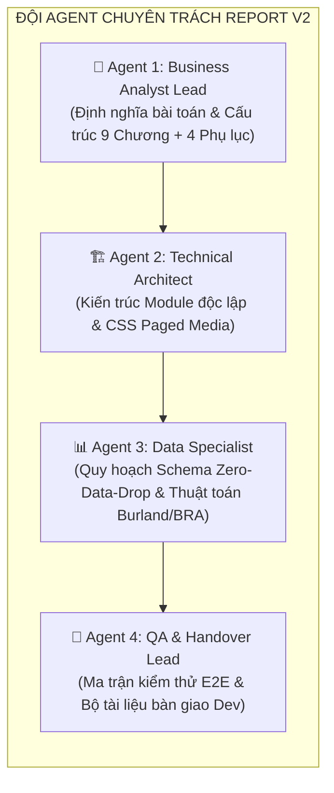
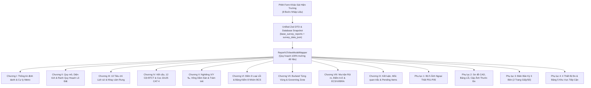
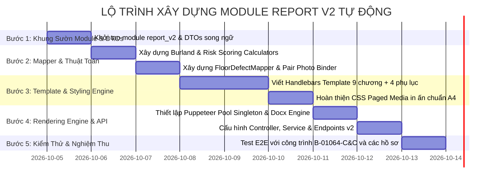

# KẾ HOẠCH TRIỂN KHAI & ĐẶC TẢ KIẾN TRÚC MODULE REPORT V2 (BCS METRO 2)
> **Căn cứ tài liệu mẫu:** `report_0410/template_report.docx`  
> **Tiêu chuẩn pháp lý:** Liên danh CRLG – CRSRI – TT | Dự án Tuyến Tàu điện ngầm số 2 TP.HCM (Bến Thành – Tham Lương)  
> **Đơn vị xây dựng:** Đội ngũ Agent Chuyên Trách (BA Lead, Technical Architect, Data Specialist, QA/Dev Lead)  
> **Cập nhật ngày 04/10/2026:** Đã tích hợp các quyết định của người dùng và Kế hoạch Quy hoạch Dữ liệu Toàn trình Chống Rơi Rụng Thông Tin (Zero-Data-Drop Architecture).

---

## 🧭 CÁC NGUYÊN TẮC NGHIỆP VỤ ĐÃ THỐNG NHẤT VỚI NGƯỜI DÙNG

1. **Ưu tiên triển khai:** Tập trung xây dựng hoàn chỉnh và nghiệm thu trước cho **Nhà Dân Cư Độc Lập** (*Residential Standalone Building* - từ móng đến mái theo đúng hồ sơ mẫu `B-01064-C&C`). Sau đó mở rộng sang Căn Hộ Con (*Condo Unit*) và Chung Cư Mẹ (*Condo Master*).
2. **Quy tắc tính Điểm A (Mục VIII.2):** Giữ nguyên tắc tự động hóa: Khi chưa có số liệu mô phỏng hầm từ bên thiết kế được duyệt ($S_{\text{max}} = 0\text{ mm}, \text{PPV} = 0\text{ mm/s}$), điểm A tự động để trạng thái `Chờ (Pending)` và tổng điểm BRA hiển thị dạng `26 + A`.
3. **Định dạng xuất:** Ưu tiên số 1 là **PDF A4 in ấn chuẩn kỹ thuật 300 DPI** (thông qua Chromium Headless Pool + CSS Paged Media), định dạng DOCX sẽ được hoàn thiện song song phục vụ lưu trữ biên tập.
4. **Chiến lược dữ liệu (Zero Data Drop):** Tái thiết kế quy hoạch luồng dữ liệu toàn trình để **100% các trường thông tin khảo sát hiện trường thu thập qua PWA** đều có vị trí hiển thị chuẩn mực trên báo cáo, tuyệt đối không để rơi rụng hoặc bỏ phí công sức khảo sát hiện trường.

---

## 👥 THÀNH PHẦN & PHÂN NHIỆM ĐỘI AGENT CHUYÊN TRÁCH



---

## 📌 PHẦN 1: BÀI TOÁN & PHÂN TÍCH GAP ANALYSIS (PROBLEM DEFINITION)

### 1.1. Hiện trạng Module Báo cáo cũ (V1)
- **Vấn đề cấu trúc:** Template V1 tại `backend/src/modules/report/templates/residential/index.hbs` sử dụng bố cục cũ, chủ yếu là tiếng Việt, chưa đáp ứng chuẩn song ngữ quốc tế của Liên danh CRLG – CRSRI – TT.
- **Rơi rụng dữ liệu (Data Drop):** Surveyor ngoài hiện trường thu thập rất nhiều trường chi tiết (kích thước cọc, khoảng cách tĩnh không, biến động ranh thửa Căn A/Căn B, độ võng sàn, thiết bị đo kiểm, cơi nới ngập lụt...), nhưng module cũ bỏ qua khiến báo cáo in ra nhiều chỗ bị thiếu hoặc hiển thị "Chưa ghi nhận".
- **Lỗi ngắt trang:** Hình ảnh nứt và thước đo thường bị tràn mép, bảng biểu bị cắt đôi giữa trang.

### 1.2. Mẫu chuẩn mới `report_0410/template_report.docx` (Target V2)
File `template_report.docx` thiết lập bộ tiêu chuẩn toàn diện:
1. **100% Song ngữ Việt - Anh (Bilingual)** toàn bộ tiêu đề, nhãn, bảng, ghi chú.
2. **Khung duyệt 3 bên trang bìa**: Người lập – Người kiểm tra – Người phê duyệt kèm chữ ký số và ngày ký.
3. **Cấu trúc 9 Chương La Mã (I – IX)** & **4 Phụ lục Kỹ thuật**.
4. **Bảo toàn 100% dữ liệu khảo sát**: Mọi thông tin hiện trường từ PWA đều được quy hoạch hiển thị đúng ngữ cảnh kỹ thuật.

---

## 🗂️ PHẦN 2: KẾ HOẠCH QUY HOẠCH DỮ LIỆU TOÀN TRÌNH (ZERO-DATA-DROP ARCHITECTURE)

Để giải quyết triệt để nỗi lo *"thu thập rất nhiều trường nhưng bị bỏ"* của người dùng, Đội Agent xây dựng **Ma trận Phân bổ Toàn trình (End-to-End Data Allocation Matrix)**:



### Bảng Ánh Xạ Chi Tiết 100% Trường Khảo Sát PWA $\rightarrow$ Báo Cáo Mới 0410:

| Bước PWA | Trường Dữ Liệu Thu Thập Trên PWA | Vị Trí Phân Bổ Trên Báo Cáo 0410 | Trạng Thái Quy Hoạch |
| :--- | :--- | :--- | :--- |
| **Bước 1** | `chainage` (Lý trình Km 0+000) | Chương I - Thông tin chung | Đã quy hoạch |
| **Bước 1** | `metroOffsetDistance` (Cự ly tim hầm) | Chương I & Chương II (30m) | Đã quy hoạch |
| **Bước 1** | `clearanceOffsetDistance` (Tĩnh không) | Chương II - Kích thước & Khoảng cách (5.2m) | Đã quy hoạch |
| **Bước 1** | `gpsCoords` (Lat, Lng WGS-84) | Chương I & Footer ảnh Phụ lục 1 | Đã quy hoạch |
| **Bước 1** | `objectGroup` (Công trình thông thường/nhạy cảm) | Chương II - Nhóm đối tượng khảo sát | Đã quy hoạch |
| **Bước 1** | `surveyCaseType`, `isAbsenteeSurvey`, `absenteeReason` | Chương II & Chương IX - Ghi nhận trường hợp khảo sát | Đã quy hoạch |
| **Bước 1** | `underConstructionPhotos`, `constructionStageNotes` | Chương II - Ghi chú hiện trạng thi công | Đã quy hoạch |
| **Bước 1** | `isVacantLand`, `vacantLandStatus`, `vacantLandNotes` | Chương II - Trạng thái đất trống | Đã quy hoạch |
| **Bước 1** | `adjacentBuildings` (Trái, Phải, Sau) | Chương IV - Bảng công trình liền kề | Đã quy hoạch |
| **Bước 2** | `photoP01` (Biển số nhà / tên công trình) | Phụ lục 1 - Ảnh P-01 | Đã quy hoạch |
| **Bước 2** | `photoP02` (Mặt đứng chính, polygon, chia tầng) | Phụ lục 1 - Ảnh P-02 | Đã quy hoạch |
| **Bước 2** | `photoP03` (Mặt bên / hẻm hông / tag vị trí) | Phụ lục 1 - Ảnh P-03 | Đã quy hoạch |
| **Bước 2** | `photoP04` (Bối cảnh đường phố & Metro) | Phụ lục 1 - Ảnh P-04 | Đã quy hoạch |
| **Bước 2** | `photoP05` / ảnh kiểm tra nghiêng mặt tiền | Phụ lục 1 - Ảnh P-05 & Chương V | Đã quy hoạch |
| **Bước 2** | `usageFunction` (Cửa hàng / Quán ăn / Nhà ở) | Chương II - Công năng sử dụng | Đã quy hoạch |
| **Bước 2** | `aboveFloors`, `undergroundFloors` | Chương II - Số tầng nổi / ngầm | Đã quy hoạch |
| **Bước 2** | `constructionAreaM2`, `buildingHeightM` | Chương II - Diện tích sàn, Chiều cao | Đã quy hoạch |
| **Bước 2** | `constructionYear`, `isEstimatedYear` | Chương II - Năm xây dựng | Đã quy hoạch |
| **Bước 2** | `structureSystem`, `structuralForm` | Chương IV - Hệ kết cấu chính, Dạng chịu lực | Đã quy hoạch |
| **Bước 2** | `foundationType`, `foundationDepthM` | Chương IV - Loại móng, Chiều sâu móng | Đã quy hoạch |
| **Bước 2** | `pileDimensionMm` / `pileWidthMm x pileLengthMm` | Chương IV - Quy cách/tiết diện cọc (22x25 cm) | Đã quy hoạch |
| **Bước 2** | `foundationDensity`, `foundationSpacingM` | Chương IV - Mật độ / khoảng cách móng | Đã quy hoạch |
| **Bước 2** | `foundationCatScore` (CAT 1-5), `foundationSource` | Chương IV - Cơ sở xác định móng (CAT 4/5) | Đã quy hoạch |
| **Bước 2** | `foundationNotes` (Ghi chú mâu thuẫn cọc/nông) | Chương IV - Ghi chú kỹ thuật móng | Đã quy hoạch |
| **Bước 2** | `asBuiltDrawingPhotos` | Chương IV & Chương IX - Đối chiếu bản vẽ hoàn công | Đã quy hoạch |
| **Bước 2** | `surroundingGround` (Điều kiện nền đất xung quanh) | Chương IV - Điều kiện nền | Đã quy hoạch |
| **Bước 3** | `historyInterview.renovationLoad` (Cơi nới) | Chương III - Lịch sử cơi nới mở rộng | Đã quy hoạch |
| **Bước 3** | `historyInterview.majorRepair` (Sửa chữa lớn) | Chương III - Lịch sử sửa chữa | Đã quy hoạch |
| **Bước 3** | `historyInterview.pastSettlement` (Lún nghiêng cũ) | Chương III - Lịch sử lún/nghiêng | Đã quy hoạch |
| **Bước 3** | `historyInterview.neighborDamage` (Lân cận gây hại) | Chương III - Hư hỏng do công trình lân cận | Đã quy hoạch |
| **Bước 3** | `historyInterview.fireFloodIncident` (Cháy/Ngập) | Chương III - Lịch sử hỏa hoạn, ngập nước | Đã quy hoạch |
| **Bước 3** | `historyInterview.sensitiveEquipment` ({has, desc}) | Chương III & Chương VIII - Thiết bị nhạy rung | Đã quy hoạch |
| **Bước 3** | `historyInterview.usageStatus`, `continuous247` | Chương III - Tình trạng sử dụng, vận hành 24/7 | Đã quy hoạch |
| **Bước 4** | `cadSketchPhotoUrl` / `cadCanvas` (Sơ đồ mặt bằng tầng) | Phụ lục 2 - Bản vẽ CAD Damage Map từng tầng | Đã quy hoạch |
| **Bước 4** | `cadZonePins` (Tọa độ ghim vùng $Z$) | Phụ lục 2 - Ghim sơ đồ hư hỏng vùng $Z$ | Đã quy hoạch |
| **Bước 4** | `cadElementPins` (Tọa độ ghim cấu kiện $E$) | Phụ lục 2 - Ghim sơ đồ bố trí kết cấu $E$ | Đã quy hoạch |
| **Bước 4** | `zones` (Mã vùng, tên phòng, vật liệu, bề mặt) | Phụ lục 2 - Bảng hiện trạng vùng $Z$ kèm ảnh | Đã quy hoạch |
| **Bước 4** | `structuralElements` (12 Cột BTCT, dầm, sàn) | Phụ lục 2 - Bảng cấu kiện chịu lực $E$ kèm ảnh | Đã quy hoạch |
| **Bước 4** | `defects` ($D_i$: loại nứt, $w_{\text{max}}$, dài $L$, phương, trạng thái trám, cờ kết cấu) | Phụ lục 2 - Bảng tổng hợp lỗi & Chi tiết | Đã quy hoạch |
| **Bước 4** | `defects.contextPhotoUrl` & `closeUpPhotoUrl` | Phụ lục 2 - **Cặp ảnh đối chiếu có thước đo nứt** | Đã quy hoạch |
| **Bước 5** | `gisMutationConfirmed` / Thông tin lô | Chương II - Diện tích & Ranh địa chính thửa đất (Tập trung 100% vào lô khảo sát, loại bỏ bóc tách Căn A/B) | Đã quy hoạch |
| **Bước 6** | `settlementTilt.diffSettlement` (Lún lệch, vị trí) | Chương V - Bằng chứng lún lệch | Đã quy hoạch |
| **Bước 6** | `settlementTilt.buildingTilt` ($X, Y$ ‰, hướng) | Chương V - Độ nghiêng công trình ($X=0‰, Y=0‰$) | Đã quy hoạch |
| **Bước 6** | `settlementTilt.beamSagging` (Độ võng dầm sàn mm) | Chương V & Phụ lục 2 - Bảng đo võng dầm/sàn | Đã quy hoạch |
| **Bước 6** | `settlementTilt.dataSource`, `reliability` | Chương V - Cơ sở xác định & Độ tin cậy | Đã quy hoạch |
| **Bước 7** | `bcsChecklist` (8 nhóm chỉ báo hiện trạng) | Chương VI - Bảng kiểm dấu hiệu hiện trạng BCS | Đã quy hoạch |
| **Bước 7** | `burlandSummary` (Chủ đạo, Cục bộ, Vùng chi phối) | Chương VII - Phân loại Burland 1977 | Đã quy hoạch |
| **Bước 7** | `ecs` ($E_1 \rightarrow E_6$, ecsClass) | Chương VIII.4 - Tiêu chí ECS ($E_1 \rightarrow E_4$) | Đã quy hoạch |
| **Bước 7** | `vi` ($V_1 \rightarrow V_6$, viAvg, viClass) | Chương VIII.4 - Chỉ số tổn thương VI | Đã quy hoạch |
| **Bước 7** | `executiveSummary` (Rủi ro chính, kiến nghị) | Chương IX - Kết luận & Kiến nghị kỹ thuật | Đã quy hoạch |
| **Bước 8** | `signatures.preparedBy`, `checkedBy` | Bìa & Trang ký duyệt 3 bên | Đã quy hoạch |
| **Bước 8** | `signatures.ownerRepresentative`, `ownerFeedback` | Chương IX & Phụ lục 3 - Biên bản 3 bên | Đã quy hoạch |
| **Bước 8** | `signatures.workingMinutesPhotos` (Ảnh ký tươi) | Phụ lục 3 - Ảnh biên bản hiện trường 2 trang | Đã quy hoạch |
| **Bước 8** | `surveyEquipment` (Camera GPS, Thước nứt, Laser, Đo nghiêng) | Phụ lục 4 - Bảng thiết bị đo đạc | Đã quy hoạch |
| **Bước 8** | `accessLimitation`, `surveyScope` (Phạm vi tiếp cận) | Phụ lục 4 - Bảng phân loại tiếp cận 5 khu vực | Đã quy hoạch |

---

## 🏛️ PHẦN 3: THIẾT KẾ KIẾN TRÚC PHÂN LỚP REPORT V2 (INDEPENDENT MODULE)

Mã nguồn mới nằm độc lập tại `backend/src/modules/report_v2/`:

```
backend/src/modules/report_v2/
├── report-v2.controller.ts             # API Routing độc lập (/api/v2/reports/...)
├── report-v2.service.ts                # Orchestrator chính: nạp DB, tính toán, gọi engine
├── report-v2.types.ts                  # Toàn bộ TypeScript DTOs & ViewModels song ngữ
├── mappers/
│   ├── report-v2-viewmodel.mapper.ts   # Mapper tổng: DB Raw -> ReportV2ViewModel
│   ├── burland-calculator.ts           # Thuật toán Burland (Chủ đạo, Cục bộ, Governing Zone)
│   ├── risk-scoring-calculator.ts      # Chấm điểm rủi ro A-E, ECS (E1-E4), VI (V1-V6), BRA
│   ├── cadastral-info.mapper.ts        # Xử lý diện tích khuôn viên, diện tích xây dựng & tọa độ lô đất
│   └── floor-defect.mapper.ts          # Nhóm khuyết tật tầng, ghép cặp ảnh thước đo
├── engine/
│   ├── pdf-render-v2.engine.ts         # Puppeteer Pool Singleton, CSS Paged Media, Footer động
│   └── docx-render-v2.engine.ts        # Engine xuất file Word Docx dựa trên template mẫu
├── templates/
│   ├── residential/                    # Template Báo cáo Nhà Dân cư độc lập V2
│   │   ├── index.hbs                   # Handlebars Template chính 9 chương + 4 phụ lục
│   │   └── styles.css                  # CSS Paged Media (A4 Portrait/Landscape, ngắt trang)
│   └── partials/                       # Các khối giao diện song ngữ tái sử dụng
│       ├── header-bilingual.hbs        # Header dự án Metro 2 song ngữ
│       ├── approval-signatures.hbs     # Khung ký 3 bên
│       ├── defect-pair-photo.hbs       # Cặp ảnh bối cảnh & cận cảnh thước đo
│       └── floor-defect-table.hbs      # Bảng tổng hợp khuyết tật từng tầng
└── utils/
    ├── image-base64.utils.ts           # Tải ảnh S3/Local và convert Base64 Data URI
    └── report-override-v2.utils.ts     # Tiện ích ghi đè dữ liệu in-memory xem trước
```

---

## 📐 PHẦN 4: THUẬT TOÁN TÍNH TOÁN NGHIỆP VỤ BẮT BUỘC (CORE ALGORITHMS)

### 4.1. Thuật toán xác định Cấp Burland 1977
- Xác định cấp Burland $B(Z_k)$ cho từng vùng dựa trên bề rộng nứt lớn nhất $w_{\text{max}}$:
  - $w < 0.1\text{ mm} \rightarrow$ Cấp 0 (Không đáng kể).
  - $0.1 \le w \le 1.0\text{ mm} \rightarrow$ Cấp 1 (Rất nhẹ).
  - $1.0 < w \le 5.0\text{ mm} \rightarrow$ Cấp 2 (Nhẹ).
  - $5.0 < w \le 15.0\text{ mm} \rightarrow$ Cấp 3 (Trung bình).
  - $15.0 < w \le 25.0\text{ mm} \rightarrow$ Cấp 4 (Nặng).
  - $w > 25.0\text{ mm} \rightarrow$ Cấp 5 (Rất nặng).
- **Cấp Burland cục bộ lớn nhất (Local Max):** $\max_{k=1}^N B(Z_k)$ (Ví dụ: `Cấp 2 - Nhẹ`).
- **Vùng chi phối rủi ro (Governing Zone):** Vùng đạt $\max B(Z_k)$ (Ví dụ: `Trệt Z-08`).
- **Cấp Burland chủ đạo (Predominant Grade):** Cấp xuất hiện ở $\ge 50\%$ số vùng (Ví dụ: `Cấp 0 - Không đáng kể (11/12 vùng)`).

### 4.2. Thuật toán chấm điểm rủi ro công trình (Building Risk Assessment Scoring)
- Thang điểm tổng 100:
  - **Chỉ số A (Tác động thi công - max 35đ):** Tự động gán `Chờ (Pending)` khi chưa có mô phỏng lún được phê duyệt.
  - **Chỉ số B (Tình trạng công trình - max 25đ):** ECS = Trung bình $\rightarrow 8$ điểm.
  - **Chỉ số C (Móng & Địa kỹ thuật - max 15đ):** Móng nông tốt $\rightarrow 5$ điểm (Móng hỗn hợp/không rõ = 10đ).
  - **Chỉ số D (Cự ly tim hầm Metro - max 15đ):** Cự ly 30m trong vùng ảnh hưởng $\rightarrow 10$ điểm.
  - **Chỉ số E (Tầm quan trọng công trình - max 10đ):** Công trình thông thường $\rightarrow 3$ điểm.
- **Tổng điểm BRA:** $B + C + D + E + A = 26 + A$ (Đúng theo mẫu chuẩn và lựa chọn của người dùng).
- **Cấp độ rủi ro:** $\le 30$ điểm: Rủi ro thấp (Low Risk).

---

## 🛠️ PHẦN 5: KỸ THUẬT IN ẤN A4 ĐỈNH CAO (CSS PAGED MEDIA)

1. **Quy cách `@page` & Footer đánh số trang tự động:**
   ```css
   @page {
     size: A4 portrait;
     margin: 15mm 12mm 15mm 12mm;
     @bottom-right {
       content: "Trang " counter(page) " / " counter(pages);
       font-size: 8pt;
       font-family: Arial, sans-serif;
       color: #64748b;
     }
     @bottom-left {
       content: "Liên danh CRLG - CRSRI - TT | Metro Line 2";
       font-size: 8pt;
       font-family: Arial, sans-serif;
       color: #64748b;
     }
   }
   ```
2. **Chống gãy bảng và cặp ảnh khuyết tật (`break-inside: avoid`):**
   Mọi cặp ảnh khuyết tật (ảnh bối cảnh + ảnh cận cảnh thước đo $w_{\text{max}}$) đều có CSS:
   ```css
   .defect-pair-container {
     page-break-inside: avoid;
     break-inside: avoid;
     display: grid;
     grid-template-columns: 1fr 1fr;
     gap: 8px;
   }
   ```
3. **Cơ chế nạp ảnh Base64 Data URI (Zero Network Failure):**
   Tất cả ảnh (P-01 đến P-05, ảnh khuyết tật, ảnh bản vẽ CAD, ảnh biên bản) được backend chuyển đổi thành Base64 Data URI trước khi nạp vào Handlebars, triệt tiêu 100% tình trạng mất ảnh do nghẽn mạng hay Safari crash.

---

## 🏷️ PHẦN 7: QUY CHUẨN ĐỊNH DANH BÁO CÁO & MÃ CÔNG TRÌNH (IDENTIFIER SPECIFICATIONS)

Nhằm đáp ứng yêu cầu pháp lý nghiêm ngặt của Liên danh CRLG – CRSRI – TT và Chủ đầu tư MAUR, hệ thống định danh trong Báo cáo V2 được chuẩn hóa theo 8 chỉ số trọng yếu:

### 1. Mã Công Trình / Thửa Đất (Building ID / Project Parcel Code)
* **Quy tắc hoán vị (Permutation Rule):**
  - **Mã cũ trong CSDL:** `[Segment]-[Zone]-[B-Number]` (Ví dụ: `C&C-01-B-0081`, `TBM-09-B-01064`).
  - **Mã chuẩn hóa mới:** Hoán chuyển đưa tiền tố công trình lên đầu theo đúng chuẩn `template_report.docx`:
    ```
    B-[5 chữ số STT]-[Phân đoạn] ([Ký hiệu Ga/Zone])
    Ví dụ: B-00081-C&C (ST1)  hoặc  B-01064-C&C (ST5) / B-01064-C&C (S1.05)
    ```
* **Ý nghĩa nghiệp vụ:**
  - `B-01064`: Mã số định danh duy nhất của công trình tòa nhà (Building ID).
  - `C&C` / `TBM`: Hạng mục Metro liên quan (Cut & Cover hoặc Khiên đào TBM).
  - `(ST5)` / `(S1.05)`: Ký hiệu nhà ga hoặc phân đoạn thi công thực tế theo biên bản hiện trường.

### 2. Số Hiệu Báo Cáo (Report No.) & Kiểm Soát Phiên Bản (Revision)
* Mỗi lần xuất báo cáo (*Export Execution*), hệ thống tự động sinh số hiệu định danh duy nhất theo cấu trúc:
  ```
  REPORT-[BuildingID]-[Phase]-[Timestamp/ExportSeq] (Rev. [XX])
  Ví dụ xuất lần đầu: REPORT-B-01064-C&C-PHASE1-1790480320866 (Rev. 00)
  Ví dụ cập nhật lần 1: REPORT-B-01064-C&C-PHASE1-1790489921000 (Rev. 01)
  ```
* **Số No. Lưu Chiểu Pháp Lý (Official Document Filing Number):**
  - Dành cho công tác bàn giao hồ sơ giấy cho MAUR:
    `Số: [STT]/BCS-P1/CRLG-[Năm]` (Ví dụ: `Số: 1064/BCS-P1/CRLG-2026`).

### 3. Hệ Thống 7 Chỉ Số Định Danh Cốt Lõi Trên Toàn Trình Báo Cáo:
1. **Building ID (Mã công trình):** `B-01064-C&C (ST5)` - Định danh duy nhất của lô/tòa nhà khảo sát, hiển thị trên Header bìa và mọi trang A4.
2. **Survey ID (Mã khảo sát):** `P-6789` (hoặc `KS-01064`) - Mã đợt khảo sát thực địa của tổ đo đạc.
3. **Report No. (Số hiệu báo cáo & Rev):** `REPORT-B-01064-C&C-PHASE1-... (Rev. 00)` - Đánh dấu phiên bản xuất bản pháp lý.
4. **Cadastral Code (Mã địa chính 12 số):** `271330130431` - Mã số thửa đất địa chính Nhà nước cấp cho lô đất.
5. **Defect ID (Mã khuyết tật):** `D-01`, `D-02`... kèm phân loại `Finish Crack-D-01` hoặc `Structural Crack-D-02`.
6. **Spatial Pins (Mã vùng & Cấu kiện):** `Z-01` ... `Z-09` (Vùng kiến trúc) và `E-01` ... `E-09` (Cấu kiện kết cấu).
7. **Photo Chain ID (Mã chuỗi ảnh bằng chứng):**
   - Ngoại thất: `P-01` (Biển số), `P-02` (Mặt chính), `P-03` (Mặt hông), `P-04` (Bối cảnh Metro), `P-05` (Nghiêng mặt tiền).
   - Nội thất & Khuyết tật: `P-06` đến `P-43` (Đánh số tăng dần liên tục xuyên suốt báo cáo, gắn chặt với tọa độ GPS và timestamp EXIF).

---

## 🚀 PHẦN 8: LỘ TRÌNH THỰC THI STEP-BY-STEP CHO ĐỘI DEV



### Bước 1: Khởi tạo module độc lập & Định nghĩa Types
- Tạo thư mục `backend/src/modules/report_v2/`.
- Định nghĩa file `report-v2.types.ts` bao phủ toàn bộ các interface của 9 chương và 4 phụ lục song ngữ.
- Giữ nguyên `backend/src/modules/report/` để duy trì tương thích ngược 100%.

### Bước 2: Phát triển Mapper & Thuật toán tính toán
- Tạo `backend/src/modules/report_v2/mappers/burland-calculator.ts` thực thi phân tích cấp chủ đạo, cấp cục bộ và governing zone.
- Tạo `backend/src/modules/report_v2/mappers/risk-scoring-calculator.ts` chấm điểm A-E và ma trận $V \times I$.
- Tạo `backend/src/modules/report_v2/mappers/cadastral-info.mapper.ts` chuẩn hóa thông tin địa chính, diện tích khuôn viên và diện tích xây dựng của lô đất.
- Tạo `backend/src/modules/report_v2/mappers/floor-defect.mapper.ts` gom nhóm tầng và ghép cặp ảnh khuyết tật có thước đo.

### Bước 3: Xây dựng Handlebars Template & CSS Paged Media
- Viết file `backend/src/modules/report_v2/templates/residential/index.hbs` với đầy đủ 9 chương và 4 phụ lục song ngữ.
- Viết file `styles.css` tối ưu in ấn A4 portrait và landscape, căn lề, viền bảng nét đơn kỹ thuật, nhãn màu cho cấp Burland/ECS/VI.

### Bước 4: Tích hợp Puppeteer Pool & Docx Engine
- Xây dựng `pdf-render-v2.engine.ts` với cơ chế quản lý vòng đời Chromium: timeout 30s, auto-kill zombie process, in PDF độ phân giải cao kèm footer đánh số trang động `Trang X / Y`.
- Tích hợp `docx-render-v2.engine.ts` dựa trên file mẫu `report_0410/template_report.docx` để xuất file Word có thể chỉnh sửa.

### Bước 5: Xây dựng API Controller & Trigger trên Frontend
- Thiết lập endpoint API mới:
  - `GET /api/v2/reports/surveys/:surveyId/export/pdf`
  - `GET /api/v2/reports/surveys/:surveyId/export/docx`
  - `GET /api/v2/reports/surveys/:surveyId/preview/html`
- Trên giao diện Frontend (`features/zone-management/components/phase1-export`): Bổ sung nút "Xuất Báo cáo Mẫu Mới (Phase 1 V2 - 0410)".

### Bước 6: Kiểm thử E2E & Nghiệm thu
- Kiểm thử tự động với dữ liệu của công trình thực tế `B-01064-C&C`.
- Đối chiếu file PDF xuất ra từ hệ thống tự động với file `report_0410/template_report.docx`:
  - Độ chính xác dữ liệu: 100%.
  - Ngắt trang: Không cắt đôi bảng, không tách rời ảnh và thước đo.
  - Tốc độ render: Dưới 15 giây cho báo cáo đầy đủ 50-60 trang.
