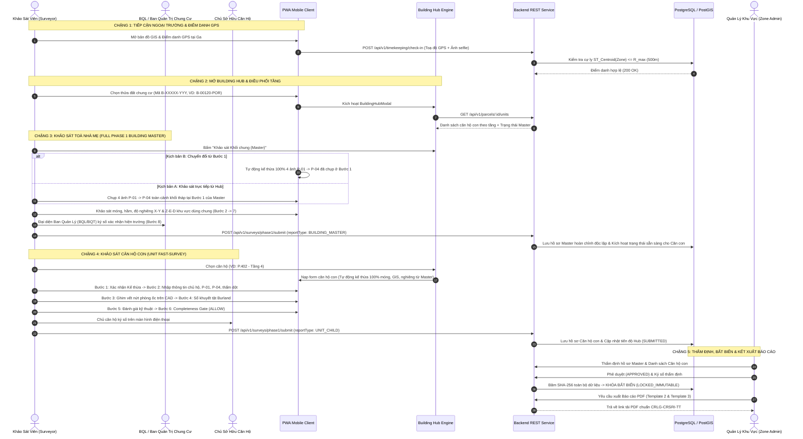
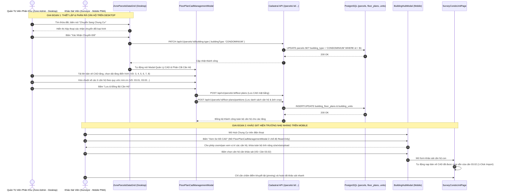
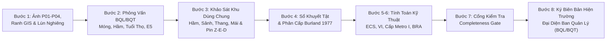
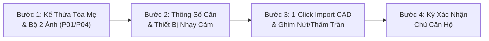
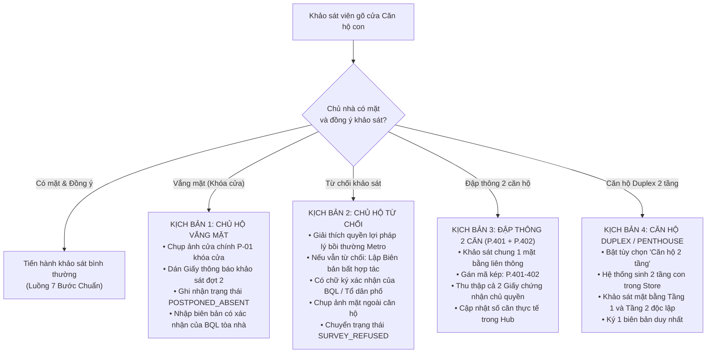

# TẬP 1: QUY TRÌNH TOÀN TRÌNH (E2E) & HÀNH TRÌNH NGƯỜI DÙNG
## (END-TO-END PROCESS & USER JOURNEY SPECIFICATION)

> **Tài liệu trực thuộc:** [Bộ đặc tả Khảo sát Chung cư Tuyến Metro Số 2](./README.md)  
> **Phiên bản:** 2.0.0 (Production Release)  
> **Đối tượng áp dụng:** Kỹ sư hiện trường (Surveyor), Quản lý khu vực (Zone Admin), Ban Quản Trị Tòa Nhà (BQT/BQL), Chủ sở hữu căn hộ, Ban Quản Lý Đường Sắt Đô Thị (MAUR).

---

## 1. SƠ ĐỒ TOÀN TRÌNH 5 CHẶNG (5-STAGE E2E WORKFLOW)

Quy trình khảo sát công trình nhiều hộ / chung cư được chuẩn hóa thành chu trình 5 chặng khép kín, phân định ranh giới rõ ràng giữa tác nghiệp thực địa, cơ chế kế thừa dữ liệu và kiểm định pháp lý:

---

## 2. CHI TIẾT CÁC CHẶNG TÁC NGHIỆP THỰC ĐỊA

### Chặng 1: Tiếp Cận Ngoại Trường & Điểm Danh GPS
1. **Tiếp cận phân khu:**
   * Khảo sát viên di chuyển đến khu vực Ga phụ trách dọc tuyến Metro Số 2 (ví dụ: Ga S3 - Dân Chủ hoặc Ga S5 - Lê Thị Riêng).
   * Mở ứng dụng PWA Metro 2 BCS trên thiết bị di động.
2. **Điểm danh GPS bắt buộc:**
   * Hệ thống yêu cầu điểm danh trước khi mở bất kỳ form khảo sát nào.
   * Surveyor chụp ảnh selfie hiện trường và lấy tọa độ GPS thời gian thực.
   * Backend kiểm tra khoảng cách trắc địa bằng PostGIS so với trọng tâm hình học (`ST_Centroid`) của Zone:
     $$\text{Distance} = \text{ST\_DistanceSphere}(\text{GPS}_{\text{surveyor}}, \text{ST\_Centroid}(\text{geom}_{\text{zone}})) \le R_{\text{allow}} = 500\text{m}$$
3. **Nhận diện & Chuyển đổi công trình trên bản đồ số GIS (GIS Identification & Type Mutation):**

   #### 3.1. Thực tiễn hiện trường & Nguyên nhân phân loại nhầm ban đầu
   * Dữ liệu địa chính đầu vào của dự án Metro 2 được số hóa từ bản đồ địa chính 2D cũ. Nhiều chung cư cũ (như Cư xá Miếu Nổi, Cư xá Thanh Đa, nhà tập thể 3–5 tầng trên đường Cách Mạng Tháng Tám và Trường Chinh) chỉ được cấp **một mã thửa đất duy nhất** mà không có phân rã căn hộ con, dẫn đến hệ thống mặc định gán cờ `buildingType = 'STANDALONE'` (Nhà riêng lẻ độc lập).
   * Khi Khảo sát viên (KSV) đến tọa độ thực địa, quan sát thấy công trình thực tế là khối nhà nhiều căn hộ thuộc nhiều hộ dân khác nhau sinh sống, KSV bắt buộc phải kích hoạt quy trình nhận diện hoặc chuyển đổi loại hình để tránh làm sai lệch hồ sơ pháp lý đền bù.

   #### 3.2. Trường hợp A: Công trình đã được định danh là Chung cư (`buildingType = 'CONDOMINIUM'`)
   * **Hiển thị trực quan trên Lớp bản đồ Leaflet Sweep GIS (`ParcelsLayer`):**
     * *Mã màu chuyên biệt:* Ranh thửa polygon của chung cư được tô màu **Tím Kỹ Thuật** (`#7c3aed`), phân biệt rõ với màu xanh lá (`#10b981` - Đã duyệt) và màu vàng/xám của nhà phố thông thường.
     * *Hiệu ứng viền & nền:* Độ dày viền $2.5\text{px}$ (dày hơn viền $1.5\text{px}$ của nhà dân). Nếu chưa khảo sát (`NOT_SURVEYED`), đường viền hiển thị nét đứt kỹ thuật (`dashArray: '4, 4'`) với màu nền tím nhạt (`#8b5cf6`, độ mờ 60%). Khi đã có căn hộ được khảo sát, viền chuyển sang nét liền đậm.
     * *Trạng thái được chọn (Selected Polygon):* Viền mở rộng lên $3.5\text{px}$, màu xanh dương đậm (`#0284c7`), độ mờ tăng lên 80%.
   * **Hộp thoại chi tiết đáy màn hình (`ParcelDetailBottomSheet`):**
     * Tiêu đề hiển thị mã dự án `B-XXXXX-YYY` (VD: `B-00120-POR`) kèm Huy hiệu tím nổi bật:
       `🏢 Chung cư (X/Y căn đã duyệt)`
     * Nút hành động chính (Primary CTA): Thay vì hiển thị *"Bắt đầu khảo sát Phase 1"* như nhà riêng, nút được chuyển đổi chuyên biệt thành:
       **`[🏢 Mở Hub Chung Cư / Căn Hộ]`** (kèm icon tòa nhà).
   * **Thẻ công trình trong Danh sách (`ParcelCardItem` trên `SurveyorHomeView`):**
     * Thẻ hiển thị huy hiệu `🏢 Chung cư ({completedUnits}/{totalUnits} căn)`.
     * Khi Surveyor bấm vào thẻ, ứng dụng không mở form đơn lẻ mà kích hoạt trực tiếp `onOpenBuildingHub(parcel)`.

   #### 3.3. Trường hợp B: Công trình ban đầu là Nhà riêng lẻ được chuyển đổi sang Chung cư (`STANDALONE` $\rightarrow$ `CONDOMINIUM`)
   
   Nhằm bảo đảm tính toàn vẹn dữ liệu kỹ thuật và tối ưu công năng thao tác, hệ thống phân định rõ ranh giới trách nhiệm:
   * **Khảo sát viên (KSV) ngoài hiện trường (Mobile PWA):** Sử dụng điện thoại di động trong điều kiện nắng gió ngoài hiện trường, thao tác kéo vẽ CAD phức tạp trên màn hình nhỏ rất khó chuẩn xác và tiềm ẩn rủi ro phá vỡ cấu trúc địa chính. Do đó, KSV được phân quyền **Chỉ Đọc (Read-Only)** đối với bản vẽ CAD tầng và không được tự ý chuyển đổi ranh thửa sang Chung cư. Nếu phát hiện công trình là chung cư tại mục 1.7 (`Step1CaseSelector.tsx`), hệ thống sẽ hiển thị thông báo hướng dẫn KSV liên hệ Zone Admin để cấu hình mặt bằng trên Cổng Quản Trị.
   * **Quản trị viên phân khu (Zone Admin) trên Desktop Portal:** Sử dụng màn hình lớn, chuột và bàn phím để chuyển đổi loại hình công trình, tải lên bản vẽ CAD mặt bằng kiến trúc toàn tầng và dùng công cụ **CAD Slicer** để phân chia các ô căn hộ con một cách chuẩn xác trước khi phân bổ cho KSV.

   * **Quy chuẩn kỹ thuật và kiểm soát an toàn:**
     1. **Rào chắn phân quyền Backend (RBAC Enforcement):**
        * Endpoint `PATCH /api/v1/parcels/:id/building-type`: Yêu cầu quyền `ZONE_ADMIN` hoặc `SUPER_ADMIN`.
        * Endpoint `POST /api/v1/parcels/:id/floor-plans`: Yêu cầu quyền `ZONE_ADMIN` hoặc `SUPER_ADMIN`.
        * Endpoint `POST /api/v1/parcels/:id/floor-plans/partitions`: Yêu cầu quyền `ZONE_ADMIN` hoặc `SUPER_ADMIN`.
        * Các endpoint truy vấn `GET /parcels/:id/floor-plans`, `GET /parcels/:id/units`: Mở quyền cho `SURVEYOR` để nạp dữ liệu khảo sát và hiển thị sơ đồ mặt bằng tham chiếu.
     2. **Cơ chế khóa giao diện trên Mobile PWA:**
        * Tại `Step1CaseSelector.tsx`: Option 3 "Chung cư" hiển thị nhãn "Zone Admin". Khi KSV chọn option này, nút xác nhận chuyển đổi bị khóa, thay vào đó hiển thị hộp cảnh báo giải thích quy trình chuẩn hóa CAD của Zone Admin.
        * Tại `BuildingHubHeader.tsx`: Nút mở CAD trên thanh tiêu đề hiển thị nhãn **"Xem Sơ Đồ CAD"** và truyền thuộc tính `readOnly={true}` vào `FloorPlanCadManagementModal`.
        * Tại `FloorPlanCadManagementModal.tsx`: Khi `readOnly = true`, ẩn nút upload CAD, ẩn nút đổi file, ẩn nút "Lưu Phân Chia Căn Hộ", ẩn input sửa tên phòng và nút xóa ô căn hộ; cho phép KSV chạm/click vào từng ô để xem thông tin chi tiết và thao tác zoom/pan mượt mà.

---

### Chặng 2: Mở Building Hub & Điều Phối Tầng Lầu
Building Hub là trung tâm chỉ huy số của toàn bộ tòa nhà, hiển thị đầy đủ thông tin:
1. **Thẻ định danh khối Master (Header):**
   * Mã dự án chuẩn Metro 2: `B-XXXXX-YYY` (VD: `B-00120-POR`, `B-00105-C&C`, `B-01580-DEP`).
   * Mã địa chính gốc: Số tờ / Số thửa địa chính.
   * Tên chung cư, Địa chỉ, Số tầng nổi, Số tầng hầm.
   * Cự ly tim hầm Metro (m) và Lý trình Tuyến ray (Chainage: Km X+YYY).
   * Mã quy ước căn hộ con trực thuộc: `B-XXXXX-YYY-U[SốPhòng]` (VD: `B-00120-POR-U402`).
2. **Khối Quản Trị Khối Chung (Building Master Section):**
   * Hiển thị trạng thái khảo sát phần chung: `CHƯA KHẢO SÁT`, `ĐANG LÀM`, hoặc `ĐÃ DUYỆT`.
   * Banner cảnh báo (`MasterWarningBanner`): Nhắc nhở Surveyor nên ưu tiên khảo sát khối dùng chung trước để hoàn thiện thông số móng cọc và độ nghiêng cho các căn hộ con thừa hưởng.
3. **Bảng Điều Khiển Lãnh Đạo (Executive Dashboard):**
   * 4 thẻ chỉ số KPI trực quan:
     * `Đã hoàn thành (APPROVED)`: Số căn hộ đã được Zone Admin duyệt.
     * `Chờ thẩm định (SUBMITTED)`: Số căn hộ đã nộp hồ sơ, chờ duyệt.
     * `Đang khảo sát (IN_PROGRESS)`: Số căn hộ đang lưu nháp trên thiết bị.
     * `Vắng mặt / Tạm hoãn (POSTPONED_ABSENT)`: Số căn hộ chưa tiếp cận được.
4. **Quản Lý Ma Trận Tầng & Căn Hộ Con:**
   * Bộ lọc tầng thông minh: Tất cả tầng, Tầng 1, Tầng 2, Tầng 3..., Tầng Duplex.
   * Thanh tìm kiếm nhanh theo số phòng (VD: `402`, `12.05`) hoặc tên chủ hộ.
   * Nút **"Thêm Căn Hộ Mới"**: Mở modal nhập nhanh Mã phòng (`unitCode`) và Tầng lầu (`floorNumber`).

---

### Chặng 3: Khảo Sát Khối Tháp Dùng Chung (Building Master Survey)

Khảo sát khối tháp dùng chung **BẢN CHẤT LÀ MỘT CUỘC KHẢO SÁT PHASE 1 ĐẦY ĐỦ (FULL PHASE 1 BCS)** gồm đầy đủ 8–9 bước như nhà dân thông thường, nhưng phạm vi tập trung vào **hệ thống kết cấu chịu lực chính và toàn bộ không gian công cộng dùng chung** của khối tháp:

#### 3.1. Cơ chế thu thập & Kế thừa Bộ 4 ảnh ngoại thất P-01 -> P-04
Khắc phục triệt để sự trùng lặp và lãng phí thời gian hiện trường theo 2 kịch bản:
* **Kịch bản A (Khảo sát trực tiếp từ Hub):** Nếu thửa đất đã là `CONDOMINIUM` từ đầu, KSV bấm *"Khảo sát Khối chung (Master)"* trên Hub, mở form Master và chụp Bộ 4 ảnh ngoại thất tại Bước 1:
  - `P-01`: Cổng chính / Biển tên chung cư / Lộ giới đường tiếp cận.
  - `P-02`: Toàn cảnh mặt đứng chính khối tháp (chụp góc rộng từ phía đối diện).
  - `P-03`: Mặt bên hông / Khoảng lùi kỹ thuật / Khe lún tiếp giáp công trình lân cận.
  - `P-04`: Hiện trạng vỉa hè / Mặt đường / Rãnh thoát nước trước tòa nhà.
* **Kịch bản B (Chuyển đổi từ form Phase 1 tại Bước 1):** KSV đã chụp đủ `P-01` đến `P-04` trước khi chọn chuyển đổi sang Chung cư:
  - **Hệ thống tự động giữ nguyên và chuyển giao 100% Bộ 4 ảnh P-01 -> P-04** cùng dữ liệu lún nghiêng ngoại thất sang bản nháp của Tòa Master (`metro2_draft_phase1_${parcelId}`).
  - Khi KSV mở Hub và bấm *"Khảo sát Khối chung (Master)"*, Bước 1 của Master **đã sẵn sàng đầy đủ 4 ảnh**, KSV không phải chụp lại mà có thể đi thẳng sang Bước 2.

#### 3.2. Nội dung các bước khảo sát tiếp theo của Tòa Master
1. **Bước 2: Phỏng vấn Đại diện Ban Quản Lý / Ban Quản Trị tòa nhà:**
   - Thu thập thông số kết cấu móng: Móng cọc khoan nhồi ($\phi 1000 - \phi 1500$), cọc ép BTCT, móng bè hầm.
   - Cấp tin cậy móng (CAT 1 đến 5 theo TCVN / Eurocode), chiều sâu chôn móng ($D_f$).
   - Số tầng nổi, số tầng hầm, kết cấu tường vây hầm (Diaphragm wall), tuổi thọ và năm đưa vào sử dụng.
   - Phỏng vấn lịch sử công trình (Chỉ số $E_5$): Tiền sử cơi nới, sửa chữa lớn, lún nứt cũ, sự cố ngập hầm, rung chấn lân cận.
2. **Bước 3: Khảo sát chi tiết không gian dùng chung & Pinning CAD (Damage Map):**
   - Khởi tạo các tầng/khu vực dùng chung:
     * `Tầng hầm 1 & Tầng hầm 2` (Bãi đỗ xe, trạm bơm, bể nước ngầm, máy phát điện dự phòng).
     * `Tầng trệt & Sảnh đón` (Khu sinh hoạt cộng đồng, buồng kỹ thuật điện).
     * `Các tầng lầu điển hình` (Hành lang công cộng, buồng thang bộ thoát hiểm, giếng thang máy).
     * `Tầng mái & Sân thượng` (Hệ thống sê-nô thoát nước mái, tháp giải nhiệt, phòng kỹ thuật thang máy).
   - **Ghim đầy đủ các mã định danh kỹ thuật:**
     * Mã Vùng: `Z-01` (Sảnh trệt), `Z-02` (Hầm B1).
     * Mã Cấu kiện: `E-01` (Cột BTCT chịu lực), `E-02` (Dầm chuyển hầm), `E-03` (Vách tường vây).
     * Mã Khuyết tật nứt: `D-01`, `D-02`, `D-03`...
   - **Quy chuẩn Cặp ảnh đối chiếu (Pair Comparison):** Mỗi vết nứt $D$ khu vực chung bắt buộc có ảnh bối cảnh (CTX) và ảnh cận cảnh (CU) áp sát thước đo vết nứt (Crack Scale Card $\ge 0.1\text{mm}$).
3. **Bước 4: Sổ khuyết tật Defect Register & Phân cấp Burland 1977 toàn tòa:**
   - Tổng hợp toàn bộ các vết nứt khu vực chung, phân loại cấp độ tổn thương (Cấp 0 đến Cấp 5).
   - Kích hoạt cờ cảnh báo kỹ sư kết cấu (`needStructuralEngineerReview = true`) nếu có nứt dầm chuyển hoặc nứt tường vây hầm.
4. **Bước 5 & 6: Tính toán kỹ thuật ECS, VI, Cấp Metro I & Ma trận Rủi ro BRA:**
   - Tính toán đầy đủ cho toàn khối tháp, xác định hạng rủi ro cơ sở (`LOW`, `MEDIUM`, `HIGH`, `VERY_HIGH`).
5. **Bước 7: Cổng kiểm tra tính đầy đủ Completeness Gate:**
   - Xác nhận trạng thái `ALLOW` hoặc `CONDITIONAL` kèm giải trình lý do kỹ thuật.
6. **Bước 8: Ký biên bản hiện trường:**
   - Ký số trực tiếp giữa **Khảo sát viên hiện trường** và **Đại diện Ban Quản Lý (BQL) / Ban Quản Trị (BQT) / Chủ đầu tư tòa nhà**.
   - Bấm nộp hồ sơ Master $\rightarrow$ Backend lưu bản ghi `base_survey_reports` với `report_type = 'BUILDING_MASTER'`, `unit_id = NULL`.

#### 3.3. Ranh giới độc lập tuyệt đối giữa Khảo sát Tòa Mẹ (Master) và Căn Hộ Con (Child Unit)
* **Tính độc lập của Tòa Master:** Tòa Master là một bộ hồ sơ pháp lý hoàn chỉnh độc lập (`BUILDING_MASTER`). Hồ sơ Master được nộp và thẩm định độc lập bởi Zone Admin, không phụ thuộc vào tiến độ khảo sát của các căn hộ con.
* **Tính độc lập của Căn hộ con:** Khi KSV vào khảo sát Căn hộ con, căn hộ con kế thừa các hằng số kỹ thuật nền tảng từ Cha (Mã dự án `B-XXXXX-YYY`, Ranh GIS, Cự ly hầm, Lý trình, Loại móng, Độ nghiêng toàn tòa) và tiến hành khảo sát sở hữu riêng (phòng ốc bên trong, vết nứt tường ngăn, thấm dột trần, võng sàn, ký chủ hộ). Căn con hoàn toàn độc lập, **tuyệt đối không can thiệp, không làm biến động và không ghi đè bất kỳ dữ liệu nào của Tòa Master**.

---

### Chặng 4: Khảo Sát Từng Căn Hộ Con (Condo Child Unit Fast-Survey)
Sau khi bấm "Khảo sát căn này" trên Building Hub, giao diện kích hoạt chế độ **Fast-Survey 4 bước siêu tốc (5 - 8 phút/căn)**:

#### Bước 1: Xác Nhận Kế Thừa Dữ Liệu Tòa Mẹ & Bộ 2 Ảnh Nhận Diện
* **Bảng tổng kết read-only:** Mã dự án cha (`B-XXXXX-YYY`), tên tòa nhà, địa chỉ số nhà, lý trình Metro, cự ly hầm Metro, hệ móng cọc, cấp rủi ro BRA của tòa nhà. KSV bấm xác nhận để đi tiếp.
* **Quy chuẩn Bộ 2 ảnh nhận diện căn hộ con:**
  * `P-01`: **Biển số phòng gắn trên cửa căn hộ** (*Bắt buộc chụp cận cảnh thấy rõ số phòng, VD: `03.03`*).
  * `P-04`: **Tổng quan cửa căn hộ thấy rõ số nhà và lối đi hành lang** (*Chụp góc rộng đứng từ hành lang chung bao quát cửa chính căn hộ và hành lang đi lại tiếp cận*).
  * `P-02` & `P-03`: *Mặc định miễn trừ (N/A) vì căn hộ tầng cao không chụp mặt tiền toàn tháp*.

#### Bước 2: Thông Số Riêng Của Căn Hộ & Phỏng Vấn Chủ Hộ
* **Định danh căn hộ chuẩn hóa:**
  * Mã căn hộ theo quy ước: **`mm.nn`** (`mm`: số tầng, `nn`: số phòng. VD: Tầng 3 phòng 03 $\rightarrow$ `03.03` $\rightarrow$ Mã đầy đủ toàn hệ thống: `B-XXXXX-YYY-U03.03`).
  * Số tầng / lầu (`floorNumber`): `3`.
* **Thông tin chủ sở hữu / Người đang cư ngụ:**
  * Họ và tên chủ hộ, Số điện thoại liên lạc, Số CCCD / CMND / Passport.
  * Tình trạng cư trú: `CHỦ_HỘ_Ở`, `CHO_THUÊ`, `BỎ_TRỐNG_CHƯA_VỀ_Ở`, `VẮNG_MẶT_KHÓA_CỬA`.
* **Thông số căn hộ & Thiết bị nhạy cảm:**
  * Diện tích thông thủy căn hộ ($m^2$) theo sổ hồng hoặc hợp đồng mua bán.
  * Trang thiết bị nhạy cảm rung chấn: Đàn piano cơ lớn, dàn âm thanh đắt tiền, bể cá thủy sinh lớn...
  * Lịch sử sửa chữa nội thất riêng: Có đập/dời tường ngăn, cải tạo nền gạch/trần thạch cao mới không.
  * *(Lược bỏ hoàn toàn: Số phòng ngủ, số WC, Hướng ban công Metro)*.

#### Bước 3: 1-Click Import CAD Mặt Bằng Căn Hộ & Chấm Điểm Thả Ghim Khuyết Tật
* **Cơ chế Import CAD Siêu Tốc (Không Cần Vẽ Lại):**
  * Hệ thống tự động nạp bản vẽ CAD riêng của căn hộ `03.03` đã được cắt mảnh từ bản vẽ mặt bằng Tầng 3 (thực hiện ở Master CAD Slicer).
  * Nếu mở từ bản đồ tầng: KSV chạm ngón tay vào ô `03.03` trên sơ đồ Tầng 3 $\rightarrow$ Bấm **"📥 Import CAD Căn 03.03"** $\rightarrow$ Mặt bằng căn hộ hiện ra ngay lập tức trên canvas.
* **Chấm điểm thả ghim khuyết tật & kiểm tra biến dạng:**
  * **Ghim nứt tường / dầm sàn ($D_{01}, D_{02}$):** Chạm trực tiếp lên mặt bằng CAD $\rightarrow$ Nhập bề rộng vết nứt $w$ (mm) $\rightarrow$ Chụp ảnh cận cảnh $CU \ge 0.1\text{mm}$ có thước đo Crack Scale Card.
  * **Thấm dột từ căn hộ tầng trên (`upperFloorWaterLeakage`):** Ghi nhận các vết ố vàng, rò rỉ nước từ sàn nhà vệ sinh/ban công của căn hộ tầng trên dội xuống (phân định rõ nguyên nhân do sinh hoạt tầng trên, không phải do chấn động Metro).
  * **Kẹt cửa / biến dạng (`doorJammingStatus`):** Kiểm tra cửa chính, cửa ban công có bị xệ cánh, cạ nền hoặc kẹt khung nhôm kính do biến dạng không.

#### Bước 4: Ký Biên Bản 2 Bên Hiện Trường & Nộp Hồ Sơ
* **Ý kiến chủ hộ:** Ghi nhận ngắn gọn ý kiến/nguyện vọng của chủ hộ vào mục `ownerRemarks`.
* **Ký số trực tiếp trên màn hình cảm ứng PWA:**
  1. **Chủ sở hữu căn hộ / Người cư ngụ thực tế**: Ký và ghi rõ họ tên.
  2. **Khảo sát viên hiện trường**: Ký xác nhận số liệu đo đạc.
* Chụp 1-2 ảnh Biên bản giấy có chữ ký tay hai bên (`workingMinutesPhotos`) nếu lập biên bản giấy tại hiện trường.
* Bấm **"Nộp Hồ Sơ Khảo Sát Căn Hộ"**:
  * Payload được gửi lên Backend qua `POST /api/v1/surveys/phase1/submit` kèm cờ `reportType = 'CONDO_UNIT'`.
  * Trạng thái căn hộ trong CSDL chuyển thành `SUBMITTED`.
  * Building Hub cập nhật tức thì tỷ lệ hoàn thành trên Executive Dashboard.

---

### Chặng 5: Kiểm Duyệt, Bất Biến & Xuất Báo Cáo Pháp Lý
1. **Kiểm duyệt cấp Zone Admin (Portal):**
   * Zone Admin mở danh sách hồ sơ cần duyệt của Ga.
   * Đối với công trình chung cư: Zone Admin kiểm tra tính toàn vẹn của Báo cáo Master và duyệt từng hồ sơ Căn hộ con.
   * Nếu có sai sót (ví dụ: ảnh mờ không đọc được thước đo nứt): Zone Admin bấm **Từ chối (REJECTED)** kèm lý do cụ thể $\rightarrow$ Hồ sơ trả về thiết bị của Surveyor để chụp lại.
2. **Khóa dữ liệu bất biến (Immutability Lock):**
   * Khi Zone Admin bấm **Phê duyệt (APPROVED)**:
     * Hệ thống tự động tính mã băm mật mã học SHA-256 trên toàn bộ payload hồ sơ khảo sát và chữ ký số.
     * Ghi nhận vào bảng `audit_logs` với timestamp đồng bộ UTC.
     * Chuyển trạng thái hồ sơ sang `LOCKED_IMMUTABLE`. Mọi API `PUT / PATCH` vào hồ sơ này từ lúc này sẽ bị Middleware chặn lại (`403 Forbidden`).
3. **Kết xuất Báo cáo PDF:**
   * Xuất **Template 2** cho từng căn hộ con để bàn giao chủ sở hữu.
   * Xuất **Template 3** cho Ban Quản trị tòa nhà và Ban Quản Lý Đường Sắt Đô Thị MAUR.

---

## 3. QUY TRÌNH XỬ LÝ CÁC TÌNH HUỐNG NGOẠI LỆ HIỆN TRƯỜNG (EDGE CASES)

### Kịch bản 1: Chủ hộ vắng mặt (`POSTPONED_ABSENT`)
* **Thực tế:** Nhiều căn hộ chung cư dùng để đầu tư, cho thuê hoặc chủ nhà đi công tác dài ngày.
* **Quy chuẩn xử lý:**
  1. KSV chụp ảnh cửa chính căn hộ đang khóa cửa (lưu vào mã `P-01_ABSENT`).
  2. Dán Phiếu Thông Báo Khảo Sát Hiện Trạng (kèm số hotline của Tổ khảo sát và hạn phản hồi 03 ngày).
  3. Mở thẻ căn hộ trên Hub, chọn **"Ghi nhận vắng mặt"**:
     * Trạng thái cập nhật: `POSTPONED_ABSENT`.
     * Nhập ghi chú: Ngày giờ tiếp cận, tình trạng chuông cửa, số điện thoại liên lạc nhưng không nghe máy.
     * Mời bảo vệ tầng hoặc đại diện BQL ký xác nhận vào Biên bản ghi nhận vắng mặt.
  4. Hệ thống không tính căn này vào cờ lỗi khi chốt báo cáo đợt 1 của tòa nhà, nhưng đưa vào phụ lục "Danh sách căn hộ cần khảo sát bổ sung đợt 2".

### Kịch bản 2: Chủ hộ từ chối hợp tác (`SURVEY_REFUSED`)
* **Thực tế:** Chủ nhà sợ phiền toái, nghi ngờ lừa đảo hoặc lo ngại việc ghi nhận vết nứt làm giảm giá trị bán lại của căn hộ.
* **Quy chuẩn xử lý:**
  1. KSV phối hợp với Ban Quản Trị / Cán bộ Địa chính Phường giải thích rõ: Khảo sát hiện trạng là **bảo vệ quyền lợi bồi thường của chính chủ hộ** khi khiên đào TBM đi qua gây rung chấn.
  2. Nếu chủ nhà kiên quyết từ chối:
     * KSV cùng đại diện BQL / Công an khu vực lập **"Biên bản khước từ quyền khảo sát hiện trạng công trình"**.
     * Ghi rõ nội dung: *"Chủ hộ tự chịu trách nhiệm về các phát sinh nứt lún nội thất sau này nếu không có số liệu đối chứng ban đầu"*.
     * Chụp ảnh cửa chính căn hộ và biên bản có chữ ký của người chứng kiến.
     * Cập nhật trạng thái căn hộ: `SURVEY_REFUSED`.

### Kịch bản 3: Hai căn hộ đập thông làm một (Merged Units)
* **Thực tế:** Chủ sở hữu mua 2 căn cạnh nhau (VD: Căn 501 và 502) và đập bỏ tường ngăn để tạo không gian lớn.
* **Quy chuẩn xử lý:**
  1. Trong Building Hub, KSV chọn chức năng **"Gộp căn hộ khảo sát"**.
  2. Mã căn hộ được chuẩn hóa thành `P.501-502`.
  3. Mặt bằng CAD nội thất được vẽ liên thông.
  4. Thông tin chủ hộ thu thập theo Giấy chứng nhận quyền sở hữu (nếu đứng tên 1 người hoặc đồng sở hữu).
  5. Khi xuất báo cáo, hệ thống tự động sinh 1 bộ báo cáo duy nhất đại diện cho cả 2 mã căn địa chính, đảm bảo không bỏ sót số liệu.

### Kịch bản 4: Căn hộ Duplex / Penthouse 2 tầng lầu
* **Thực tế:** Căn hộ thông tầng nằm tại các tầng áp mái (VD: Tầng 18 và Tầng 19).
* **Quy chuẩn xử lý:**
  1. Tại Bước 2 của biểu mẫu khảo sát căn hộ con, Surveyor gạt toggle:
     $$\text{Loại hình căn hộ} = \text{"Căn hộ thông tầng (Duplex / Penthouse)"}$$
  2. Nhập cao trình: Tầng dưới (`18`), Tầng trên (`19`).
  3. Store tự động sinh ra 2 thực thể tầng con:
     * `Tầng 18 (Tầng Dưới) - Căn P.18.01`
     * `Tầng 19 (Tầng Trên) - Căn P.18.01`
  4. Tại Bước 3 (CAD Pinning), KSV có 2 tab mặt bằng riêng biệt để ghim vết nứt cho từng tầng lầu.
  5. Báo cáo xuất ra thể hiện rõ 2 mặt bằng tầng nhưng thuộc cùng 1 mã hồ sơ và 1 chữ ký pháp lý.

---

## 4. MA TRẬN PHÁP LÝ & CĂN CỨ ĐỐI CHIẾU BỒI THƯỜNG (INDEMNIFICATION MATRIX)

Để bảo vệ tuyệt đối quyền lợi của Chủ đầu tư (MAUR) và người dân, bảng ma trận phân định trách nhiệm sau đây là căn cứ pháp lý bất biến được áp dụng:

| Hiện tượng hư hỏng ghi nhận sau khi TBM đào qua | Hồ sơ đối chiếu ban đầu | Chủ thể thụ hưởng / Nhận bồi thường | Cơ chế xử lý kỹ thuật |
| :--- | :--- | :--- | :--- |
| **Nghiêng toàn khối tháp, lún lệch vượt ngưỡng thiết kế, nứt dầm chuyển tầng hầm** | Báo cáo Master Tòa Nhà (`BUILDING_MASTER` - Template 3) | **Ban Quản Trị / Quỹ bảo trì chung của Tòa Nhà** | Nhà thầu EPC thực hiện phụt vữa gia cố móng cọc, đền bù chi phí xử lý nghiêng cho toàn tòa. |
| **Nứt tường ngăn bên trong Căn hộ 402, vỡ gạch lát sàn phòng khách** | Báo cáo Căn Hộ Con (`UNIT_CHILD` - `B-XXXXX-YYY-U402` - Template 2) | **Chủ sở hữu hợp pháp của Căn hộ 402** | Bảo hiểm công trình chi trả trực tiếp cho chủ hộ căn cứ vào biên bản hiện trường ban đầu. |
| **Chủ căn hộ khiếu nại vết nứt mới xuất hiện, đòi bồi thường 100 triệu VNĐ** | Đối chiếu ảnh cận cảnh (CU) có thước đo Crack Gauge trong hồ sơ khảo sát ban đầu | **Khước từ bồi thường** | Chứng minh vết nứt đã tồn tại trước ngày khởi công (bề rộng vết nứt không thay đổi so với ảnh ban đầu có chữ ký chủ nhà). |
| **Thấm dột trần toilet Căn hộ 301 do căn hộ 401 phía trên sửa chữa** | Báo cáo Căn Hộ Con của Căn 301 và Căn 401 | **Tranh chấp dân sự giữa 2 chủ căn hộ** | Khẳng định không phải do rung chấn Metro gây ra (đối chiếu hạng mục khảo sát thấm dột Bước 2). |
