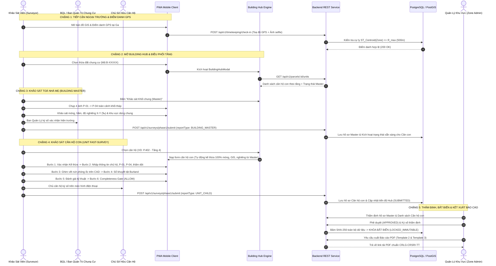
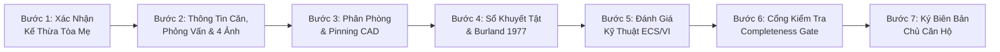
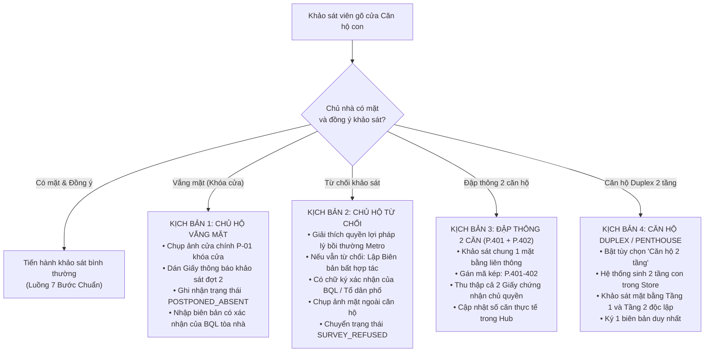

# TẬP 1: QUY TRÌNH TOÀN TRÌNH (E2E) & HÀNH TRÌNH NGƯỜI DÙNG
## (END-TO-END PROCESS & USER JOURNEY SPECIFICATION)

> **Tài liệu trực thuộc:** [Bộ đặc tả Khảo sát Chung cư Tuyến Metro Số 2](./README.md)  
> **Phiên bản:** 2.0.0 (Production Release)  
> **Đối tượng áp dụng:** Kỹ sư hiện trường (Surveyor), Quản lý khu vực (Zone Admin), Ban Quản Trị Tòa Nhà (BQT/BQL), Chủ sở hữu căn hộ, Ban Quản Lý Đường Sắt Đô Thị (MAUR).

---

## 1. SƠ ĐỒ TOÀN TRÌNH 5 CHẶNG (5-STAGE E2E WORKFLOW)

Quy trình khảo sát công trình nhiều hộ / chung cư được chuẩn hóa thành chu trình 5 chặng khép kín, phân định ranh giới rõ ràng giữa tác nghiệp thực địa, cơ chế kế thừa dữ liệu và kiểm định pháp lý:

---

## 2. CHI TIẾT CÁC CHẶNG TÁC NGHIỆP THỰC ĐỊA

### Chặng 1: Tiếp Cận Ngoại Trường & Điểm Danh GPS
1. **Tiếp cận phân khu:**
   * Khảo sát viên di chuyển đến khu vực Ga phụ trách dọc tuyến Metro Số 2 (ví dụ: Ga S3 - Dân Chủ hoặc Ga S5 - Lê Thị Riêng).
   * Mở ứng dụng PWA Metro 2 BCS trên thiết bị di động.
2. **Điểm danh GPS bắt buộc:**
   * Hệ thống yêu cầu điểm danh trước khi mở bất kỳ form khảo sát nào.
   * Surveyor chụp ảnh selfie hiện trường và lấy tọa độ GPS thời gian thực.
   * Backend kiểm tra khoảng cách trắc địa bằng PostGIS so với trọng tâm hình học (`ST_Centroid`) của Zone:
     $$\text{Distance} = \text{ST\_DistanceSphere}(\text{GPS}_{\text{surveyor}}, \text{ST\_Centroid}(\text{geom}_{\text{zone}})) \le R_{\text{allow}} = 500\text{m}$$
3. **Nhận diện & Chuyển đổi công trình trên bản đồ số GIS:**
   * *Trường hợp A (Đã phân loại là Chung cư):* Thửa đất hiển thị biểu tượng tòa nhà cao tầng `🏢`, kèm huy hiệu tiến độ (ví dụ: `🏢 Chung cư Miếu Nổi (8/12 căn đã duyệt)`). Bấm vào thửa đất $\rightarrow$ Hệ thống mở trực tiếp **Building Hub**.
   * *Trường hợp B (Phân loại nhầm là Nhà riêng lẻ):* Thửa đất ban đầu lưu là `STANDALONE`. Khi đến nơi, Surveyor phát hiện đây là chung cư cũ/nhà tập thể nhiều hộ:
     * Surveyor mở form Phase 1, tại **Bước 1 (Định danh công trình)**, chọn chuyển đổi:
       $$\text{Loại hình công trình} = \text{"Chung cư / Tòa nhà nhiều hộ"} \implies \text{buildingType} = \text{'CONDOMINIUM'}$$
     * Hệ thống tự động gọi API `PATCH /api/v1/parcels/:id` cập nhật CSDL, sau đó tự động chuyển hướng giao diện vào **Building Hub**.

---

### Chặng 2: Mở Building Hub & Điều Phối Tầng Lầu
Building Hub là trung tâm chỉ huy số của toàn bộ tòa nhà, hiển thị đầy đủ thông tin:
1. **Thẻ định danh khối Master (Header):**
   * Mã dự án: `B-XXXXX` (VD: `B-00120`).
   * Mã địa chính gốc: Số tờ / Số thửa địa chính.
   * Tên chung cư, Địa chỉ, Số tầng nổi, Số tầng hầm.
   * Cự ly tim hầm Metro (m) và Lý trình Tuyến ray (Chainage: Km X+YYY).
2. **Khối Quản Trị Khối Chung (Building Master Section):**
   * Hiển thị trạng thái khảo sát phần chung: `CHƯA KHẢO SÁT`, `ĐANG LÀM`, hoặc `ĐÃ DUYỆT`.
   * Banner cảnh báo (`MasterWarningBanner`): Nhắc nhở Surveyor nên ưu tiên khảo sát khối dùng chung trước để hoàn thiện thông số móng cọc và độ nghiêng cho các căn hộ con thừa hưởng.
3. **Bảng Điều Khiển Lãnh Đạo (Executive Dashboard):**
   * 4 thẻ chỉ số KPI trực quan:
     * `Đã hoàn thành (APPROVED)`: Số căn hộ đã được Zone Admin duyệt.
     * `Chờ thẩm định (SUBMITTED)`: Số căn hộ đã nộp hồ sơ, chờ duyệt.
     * `Đang khảo sát (IN_PROGRESS)`: Số căn hộ đang lưu nháp trên thiết bị.
     * `Vắng mặt / Tạm hoãn (POSTPONED_ABSENT)`: Số căn hộ chưa tiếp cận được.
4. **Quản Lý Ma Trận Tầng & Căn Hộ Con:**
   * Bộ lọc tầng thông minh: Tất cả tầng, Tầng 1, Tầng 2, Tầng 3..., Tầng Duplex.
   * Thanh tìm kiếm nhanh theo số phòng (VD: `402`, `12.05`) hoặc tên chủ hộ.
   * Nút **"Thêm Căn Hộ Mới"**: Mở modal nhập nhanh Mã phòng (`unitCode`) và Tầng lầu (`floorNumber`).

---

### Chặng 3: Khảo Sát Khối Tháp Dùng Chung (Building Master Survey)
Khảo sát khối tháp dùng chung được thực hiện độc lập, phục vụ lập hồ sơ pháp lý đối chiếu cho toàn bộ kết cấu công trình:
1. **Bộ 4 ảnh nhận diện ngoại thất toàn cảnh khối tháp:**
   * `P-01`: Biển tên chung cư / Cổng chính / Lộ giới đường tiếp cận.
   * `P-02`: Mặt đứng chính toàn cảnh khối tháp (chụp từ góc rộng phía đối diện).
   * `P-03`: Mặt bên hông / Khoảng lùi kỹ thuật / Khe lún tiếp giáp công trình lân cận.
   * `P-04`: Hiện trạng vỉa hè / Mặt đường / Rãnh thoát nước trước tòa nhà.
2. **Khảo sát hệ thống kết cấu móng & tầng hầm:**
   * Hệ móng chịu lực: Móng cọc khoan nhồi ($\phi 1000 - \phi 1500$), móng cọc ép BTCT, móng bè hầm.
   * Cấp tin cậy móng (CAT 1 đến 5 theo TCVN / Eurocode).
   * Hiện trạng tường vây tầng hầm (Diaphragm wall), mạch ngừng thi công, sàn tầng hầm bãi xe (kiểm tra nứt võng, thấm mao dẫn mạch nước ngầm).
3. **Đo đạc trắc địa biến dạng toàn khối:**
   * Đo độ nghiêng khối tháp theo 2 phương trực giao X và Y bằng máy kinh vĩ quang học / laser:
     $$\Delta_{\text{tilt, X}} (\permil), \quad \Delta_{\text{tilt, Y}} (\permil)$$
   * Đo lún không đều giữa các khối tháp / khe nhiệt / khe lún.
4. **Khảo sát các hệ thống hạ tầng dùng chung:**
   * Sảnh đón chính và hành lang công cộng.
   * Buồng thang bộ thoát hiểm và hệ thống tăng áp hút khói.
   * Giếng thang máy (vận hành, độ rung lắc).
   * Hệ thống phòng cháy chữa cháy (PCCC sprinkler, họng nước vách tường).
   * Bể nước ngầm sinh hoạt / Trạm biến áp ngầm / Máy phát điện dự phòng.
   * Tầng mái, sê-nô thoát nước mưa, tháp giải nhiệt.
5. **Ký biên bản hiện trường khối Master:**
   * Ký số xác nhận 3 bên: **Khảo sát viên**, **Đại diện Ban Quản Lý (BQL) / Ban Quản Trị (BQT) / Tổ trưởng dân phố**, và **Zone Admin**.

---

### Chặng 4: Khảo Sát Từng Căn Hộ Con (Condo Child Unit Fast-Survey)
Sau khi bấm "Khảo sát căn này" trên Building Hub, giao diện kích hoạt chế độ **Fast-Survey 7 bước**:

#### Bước 1: Xác Nhận Kế Thừa Dữ Liệu Tòa Mẹ (Parent Inheritance Confirmation)
* Hiển thị bảng tổng kết read-only: Mã quản lý dự án mẹ, địa chỉ tòa nhà, lý trình tuyến Metro, cự ly tim hầm Metro, hệ móng cọc, độ nghiêng tổng thể tòa nhà.
* Surveyor đối soát nhanh thông tin và nhấn nút xác nhận để sang Bước 2 (không nhập lại các trường này).

#### Bước 2: Thông Tin Riêng Biệt Của Căn Hộ & Phỏng Vấn Chủ Hộ
* **Định danh căn hộ:**
  * Mã căn hộ (VD: `P.402`, `A-12.05`).
  * Loại hình: Căn hộ 1 tầng tiêu chuẩn hoặc Căn hộ 2 tầng thông tầng (Duplex / Penthouse).
  * Cao trình tầng: Tầng dưới, Tầng trên (nếu là Duplex).
* **Thông tin chủ sở hữu / Người đang cư ngụ:**
  * Họ và tên chủ hộ, Số điện thoại liên lạc, Số CCCD / CMND.
* **Phỏng vấn lịch sử & tình trạng khai thác (Chỉ số $E_5$ Cộng Hưởng):**
  * Đập thông tường ngăn phòng, thay đổi vị trí bếp/WC, cơi nới ban công.
  * Tiền sử nứt tường, lún võng sàn trước đây.
  * Trang thiết bị nhạy cảm với rung động (phòng lab tư nhân, đàn dương cầm giá trị cao).
* **Quy chuẩn Bộ 4 ảnh căn hộ con:**
  * `P-01`: Cửa chính căn hộ & Biển số phòng (*Bắt buộc chụp rõ nét*).
  * `P-02`: Mặt đứng khối tháp (*Mặc định tick N/A - Kế thừa từ Tòa nhà mẹ*).
  * `P-03`: Ban công / Logia riêng (*Mặc định tick N/A hoặc chụp nếu có ban công*).
  * `P-04`: Toàn cảnh nội thất phòng khách (*Bắt buộc chụp góc rộng*).
* **Chỉ tiêu đặc thù chung cư cao tầng:**
  * **Hiện tượng thấm dột từ căn hộ tầng trên:** Kiểm tra trần thạch cao, hộp kỹ thuật vệ sinh, xung quanh phễu thu sàn toilet tầng trên.
  * **Đo độ võng cục bộ dầm sàn căn hộ:** Đo độ võng dầm nhịp lớn bằng thước laser (nếu có dấu hiệu nứt võng).

#### Bước 3: Phân Vùng Kiến Trúc & Ghim Khuyết Tật (CAD Floor Damage Map)
* Khởi tạo danh mục không gian sở hữu riêng: `Phòng khách`, `Bếp`, `Phòng ngủ Master`, `Phòng ngủ 2`, `Toilet 1`, `Toilet 2`, `Ban công`.
* Tải mặt bằng bố trí căn hộ (hoặc vẽ phác họa trên Canvas màn hình).
* Ghim các mã định danh kỹ thuật ngắn gọn:
  * Mã Vùng: `Z-01` (Phòng khách), `Z-02` (Phòng ngủ).
  * Mã Cấu Kiện: `E-01` (Tường ngăn gạch), `E-02` (Dầm trần bê tông).
  * Mã Khuyết Tật: `D-01` (Vết nứt chéo), `D-02` (Vệt ố thấm nước).
* **Quy tắc Cặp ảnh đối chiếu (Pair Comparison):** Mỗi khuyết tật phải có 2 ảnh:
  * *Ảnh bối cảnh (CTX):* Chụp toàn cảnh mảng tường để thấy rõ vị trí tương quan.
  * *Ảnh cận cảnh (CU):* Chụp trực diện có đặt **thước đo bề rộng vết nứt (Crack Scale Card $\ge 0.1\text{mm}$)**.

#### Bước 4: Sổ Khuyết Tật (Defect Register) & Phân Cấp Burland 1977
* Tổng hợp bảng danh mục khuyết tật trong căn hộ: Vị trí, mô tả, chiều dài ($L$), bề rộng vết nứt tối đa ($w_{\text{max}}$).
* Đánh giá cấp độ tổn thương theo tiêu chuẩn quốc tế Burland (1977):
  * Cấp độ chủ đạo (Predominant Damage Category): Từ Cấp 0 (Không đáng kể) đến Cấp 2 (Nhẹ).
  * Cấp độ cục bộ tối đa (Local Maximum Damage Category): Ghi nhận vết nứt cá biệt nghiêm trọng nhất.

#### Bước 5: Đánh Giá Kỹ Thuật (ECS, VI & Ma Trận Rủi Ro BRA Căn Hộ)
* Đánh giá hiện trạng căn hộ ECS ($E_1 \rightarrow E_6$, tối đa 24 điểm).
* Đánh giá chỉ số dễ tổn thương VI ($V_1 \rightarrow V_6$, tối đa 24 điểm).
* Cấp tác động thi công tuyến Metro ($I$): Kế thừa theo cự ly tim hầm của tòa mẹ ($I_1 \rightarrow I_4$).
* Tính toán Ma trận Rủi ro Cơ sở:
  $$\text{Risk Level} = V \times I \implies \{\text{LOW}, \text{MEDIUM}, \text{HIGH}, \text{VERY\_HIGH}\}$$

#### Bước 6: Cổng Kiểm Tra Dữ Liệu Hiện Trường (Completeness Gate)
* Hệ thống tự động kiểm tra toàn bộ dữ liệu form căn hộ:
  * Trạng thái **`ALLOW`**: Đầy đủ 100% trường bắt buộc (Mã căn, Chủ hộ, SĐT, P-01, P-04, Bản vẽ phòng, Tọa độ GPS). Cho phép nộp hồ sơ ngay.
  * Trạng thái **`CONDITIONAL`**: Thiếu một số mục phụ (ví dụ: Chủ nhà khóa cửa phòng ngủ phụ không cho vào). Bắt buộc Surveyor phải nhập chuỗi giải trình lý do kỹ thuật trước khi mở nút nộp.

#### Bước 7: Ký Biên Bản 3 Bên Hiện Trường & Nộp Hồ Sơ
* Ký số trực tiếp trên màn hình cảm ứng:
  1. **Chủ sở hữu căn hộ / Người cư ngụ thực tế**: Ký và ghi rõ họ tên.
  2. **Khảo sát viên hiện trường**: Ký xác nhận số liệu đo đạc.
* Bấm **"Nộp Hồ Sơ Khảo Sát Căn Hộ"**:
  * PWA gửi payload lên Backend qua `POST /api/v1/surveys/phase1/submit` kèm cờ `reportType = 'UNIT_CHILD'`.
  * Trạng thái của căn hộ trong CSDL chuyển thành `SUBMITTED`.
  * Building Hub cập nhật tức thì tỷ lệ hoàn thành trên Executive Dashboard.

---

### Chặng 5: Kiểm Duyệt, Bất Biến & Xuất Báo Cáo Pháp Lý
1. **Kiểm duyệt cấp Zone Admin (Portal):**
   * Zone Admin mở danh sách hồ sơ cần duyệt của Ga.
   * Đối với công trình chung cư: Zone Admin kiểm tra tính toàn vẹn của Báo cáo Master và duyệt từng hồ sơ Căn hộ con.
   * Nếu có sai sót (ví dụ: ảnh mờ không đọc được thước đo nứt): Zone Admin bấm **Từ chối (REJECTED)** kèm lý do cụ thể $\rightarrow$ Hồ sơ trả về thiết bị của Surveyor để chụp lại.
2. **Khóa dữ liệu bất biến (Immutability Lock):**
   * Khi Zone Admin bấm **Phê duyệt (APPROVED)**:
     * Hệ thống tự động tính mã băm mật mã học SHA-256 trên toàn bộ payload hồ sơ khảo sát và chữ ký số.
     * Ghi nhận vào bảng `audit_logs` với timestamp đồng bộ UTC.
     * Chuyển trạng thái hồ sơ sang `LOCKED_IMMUTABLE`. Mọi API `PUT / PATCH` vào hồ sơ này từ lúc này sẽ bị Middleware chặn lại (`403 Forbidden`).
3. **Kết xuất Báo cáo PDF:**
   * Xuất **Template 2** cho từng căn hộ con để bàn giao chủ sở hữu.
   * Xuất **Template 3** cho Ban Quản trị tòa nhà và Ban Quản Lý Đường Sắt Đô Thị MAUR.

---

## 3. QUY TRÌNH XỬ LÝ CÁC TÌNH HUỐNG NGOẠI LỆ HIỆN TRƯỜNG (EDGE CASES)

### Kịch bản 1: Chủ hộ vắng mặt (`POSTPONED_ABSENT`)
* **Thực tế:** Nhiều căn hộ chung cư dùng để đầu tư, cho thuê hoặc chủ nhà đi công tác dài ngày.
* **Quy chuẩn xử lý:**
  1. KSV chụp ảnh cửa chính căn hộ đang khóa cửa (lưu vào mã `P-01_ABSENT`).
  2. Dán Phiếu Thông Báo Khảo Sát Hiện Trạng (kèm số hotline của Tổ khảo sát và hạn phản hồi 03 ngày).
  3. Mở thẻ căn hộ trên Hub, chọn **"Ghi nhận vắng mặt"**:
     * Trạng thái cập nhật: `POSTPONED_ABSENT`.
     * Nhập ghi chú: Ngày giờ tiếp cận, tình trạng chuông cửa, số điện thoại liên lạc nhưng không nghe máy.
     * Mời bảo vệ tầng hoặc đại diện BQL ký xác nhận vào Biên bản ghi nhận vắng mặt.
  4. Hệ thống không tính căn này vào cờ lỗi khi chốt báo cáo đợt 1 của tòa nhà, nhưng đưa vào phụ lục "Danh sách căn hộ cần khảo sát bổ sung đợt 2".

### Kịch bản 2: Chủ hộ từ chối hợp tác (`SURVEY_REFUSED`)
* **Thực tế:** Chủ nhà sợ phiền toái, nghi ngờ lừa đảo hoặc lo ngại việc ghi nhận vết nứt làm giảm giá trị bán lại của căn hộ.
* **Quy chuẩn xử lý:**
  1. KSV phối hợp với Ban Quản Trị / Cán bộ Địa chính Phường giải thích rõ: Khảo sát hiện trạng là **bảo vệ quyền lợi bồi thường của chính chủ hộ** khi khiên đào TBM đi qua gây rung chấn.
  2. Nếu chủ nhà kiên quyết từ chối:
     * KSV cùng đại diện BQL / Công an khu vực lập **"Biên bản khước từ quyền khảo sát hiện trạng công trình"**.
     * Ghi rõ nội dung: *"Chủ hộ tự chịu trách nhiệm về các phát sinh nứt lún nội thất sau này nếu không có số liệu đối chứng ban đầu"*.
     * Chụp ảnh cửa chính căn hộ và biên bản có chữ ký của người chứng kiến.
     * Cập nhật trạng thái căn hộ: `SURVEY_REFUSED`.

### Kịch bản 3: Hai căn hộ đập thông làm một (Merged Units)
* **Thực tế:** Chủ sở hữu mua 2 căn cạnh nhau (VD: Căn 501 và 502) và đập bỏ tường ngăn để tạo không gian lớn.
* **Quy chuẩn xử lý:**
  1. Trong Building Hub, KSV chọn chức năng **"Gộp căn hộ khảo sát"**.
  2. Mã căn hộ được chuẩn hóa thành `P.501-502`.
  3. Mặt bằng CAD nội thất được vẽ liên thông.
  4. Thông tin chủ hộ thu thập theo Giấy chứng nhận quyền sở hữu (nếu đứng tên 1 người hoặc đồng sở hữu).
  5. Khi xuất báo cáo, hệ thống tự động sinh 1 bộ báo cáo duy nhất đại diện cho cả 2 mã căn địa chính, đảm bảo không bỏ sót số liệu.

### Kịch bản 4: Căn hộ Duplex / Penthouse 2 tầng lầu
* **Thực tế:** Căn hộ thông tầng nằm tại các tầng áp mái (VD: Tầng 18 và Tầng 19).
* **Quy chuẩn xử lý:**
  1. Tại Bước 2 của biểu mẫu khảo sát căn hộ con, Surveyor gạt toggle:
     $$\text{Loại hình căn hộ} = \text{"Căn hộ thông tầng (Duplex / Penthouse)"}$$
  2. Nhập cao trình: Tầng dưới (`18`), Tầng trên (`19`).
  3. Store tự động sinh ra 2 thực thể tầng con:
     * `Tầng 18 (Tầng Dưới) - Căn P.18.01`
     * `Tầng 19 (Tầng Trên) - Căn P.18.01`
  4. Tại Bước 3 (CAD Pinning), KSV có 2 tab mặt bằng riêng biệt để ghim vết nứt cho từng tầng lầu.
  5. Báo cáo xuất ra thể hiện rõ 2 mặt bằng tầng nhưng thuộc cùng 1 mã hồ sơ và 1 chữ ký pháp lý.

---

## 4. MA TRẬN PHÁP LÝ & CĂN CỨ ĐỐI CHIẾU BỒI THƯỜNG (INDEMNIFICATION MATRIX)

Để bảo vệ tuyệt đối quyền lợi của Chủ đầu tư (MAUR) và người dân, bảng ma trận phân định trách nhiệm sau đây là căn cứ pháp lý bất biến được áp dụng:

| Hiện tượng hư hỏng ghi nhận sau khi TBM đào qua | Hồ sơ đối chiếu ban đầu | Chủ thể thụ hưởng / Nhận bồi thường | Cơ chế xử lý kỹ thuật |
| :--- | :--- | :--- | :--- |
| **Nghiêng toàn khối tháp, lún lệch vượt ngưỡng thiết kế, nứt dầm chuyển tầng hầm** | Báo cáo Master Tòa Nhà (`BUILDING_MASTER` - Template 3) | **Ban Quản Trị / Quỹ bảo trì chung của Tòa Nhà** | Nhà thầu EPC thực hiện phụt vữa gia cố móng cọc, đền bù chi phí xử lý nghiêng cho toàn tòa. |
| **Nứt tường ngăn bên trong Căn hộ 402, vỡ gạch lát sàn phòng khách** | Báo cáo Căn Hộ Con (`UNIT_CHILD` - `B-XXXXX-U402` - Template 2) | **Chủ sở hữu hợp pháp của Căn hộ 402** | Bảo hiểm công trình chi trả trực tiếp cho chủ hộ căn cứ vào biên bản hiện trường ban đầu. |
| **Chủ căn hộ khiếu nại vết nứt mới xuất hiện, đòi bồi thường 100 triệu VNĐ** | Đối chiếu ảnh cận cảnh (CU) có thước đo Crack Gauge trong hồ sơ khảo sát ban đầu | **Khước từ bồi thường** | Chứng minh vết nứt đã tồn tại trước ngày khởi công (bề rộng vết nứt không thay đổi so với ảnh ban đầu có chữ ký chủ nhà). |
| **Thấm dột trần toilet Căn hộ 301 do căn hộ 401 phía trên sửa chữa** | Báo cáo Căn Hộ Con của Căn 301 và Căn 401 | **Tranh chấp dân sự giữa 2 chủ căn hộ** | Khẳng định không phải do rung chấn Metro gây ra (đối chiếu hạng mục khảo sát thấm dột Bước 2). |
