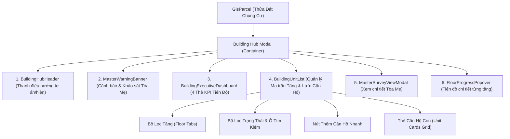
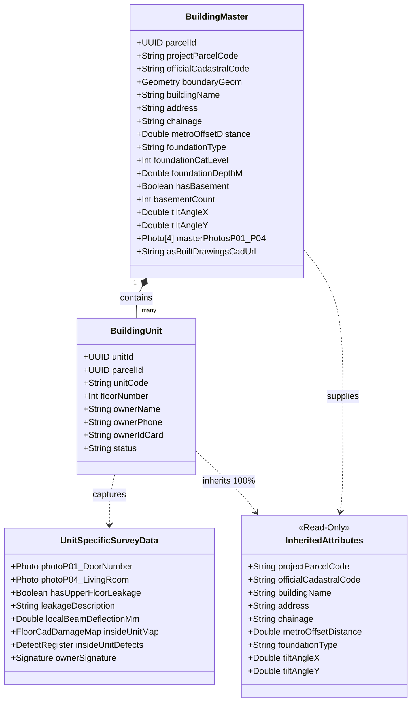

# TẬP 2: ĐẶC TẢ TRUNG TÂM ĐIỀU PHỐI (BUILDING HUB) & CƠ CHẾ KẾ THỪA OOP
## (BUILDING HUB ORCHESTRATION & DATA INHERITANCE ENGINE)

> **Tài liệu trực thuộc:** [Bộ đặc tả Khảo sát Chung cư Tuyến Metro Số 2](./README.md)  
> **Phiên bản:** 2.0.0 (Production Release)  
> **Mã nguồn tương ứng:**
> - Frontend Hub Container: `frontend/src/components/survey/BuildingHubModal.tsx`
> - Hook State: `frontend/src/components/survey/building-hub/hooks/useBuildingHubState.ts`
> - Subcomponents: `frontend/src/components/survey/building-hub/components/*`

---

## 1. VAI TRÒ KIẾN TRÚC CỦA BUILDING HUB (ARCHITECTURAL ROLE)

Building Hub là thành phần điều phối trung tâm (Central Orchestrator) giải quyết bài toán quản lý phức hợp cho các công trình đa hộ. Thay vì xem mỗi căn hộ như một thửa đất rời rạc gây phân mảnh bản đồ GIS, Building Hub gom toàn bộ các căn hộ con vào một khối quản lý thống nhất trực thuộc **Thửa đất Tòa nhà Mẹ (`BuildingMaster`)**.

---

## 2. ĐẶC TẢ GIAO DIỆN & CÁC THÀNH PHẦN CON (UI SPECIFICATIONS)

### 2.1. Thanh Điều Hướng Trên Cùng (BuildingHubHeader)
* **Tính năng tự ẩn/hiện theo chiều cuộn (Scroll-driven auto-hide):**
  * Nhằm tối ưu diện tích hiển thị trên màn hình điện thoại hiện trường (PWA Mobile), Header tự động trượt lên ẩn đi khi người dùng cuộn xuống (`scrollTop > 45px` và `scrollTop > lastScrollTop`) và hiện lại ngay lập tức khi cuộn ngược lên.
* **Các thành phần hiển thị:**
  * Biểu tượng tòa tháp `🏢` kèm tên chung cư hoặc địa chỉ tòa nhà.
  * Huy hiệu định danh: Mã dự án `B-XXXXX-YYY` và Số tầng (ví dụ: `B-00120-POR • 12 Tầng`).
  * Nút **"Hồ Sơ Tòa Mẹ"**: Mở modal xem nhanh các thông số kết cấu móng và ảnh mặt đứng khối tháp.
  * Nút **"Đóng (X)"**: Đóng Hub, lưu giữ trạng thái cuộn và quay về bản đồ GIS / Trang chủ.

### 2.2. Banner Cảnh Báo Khối Dùng Chung (MasterWarningBanner)
* **Logic kích hoạt:**
  * Nếu tòa nhà mẹ chưa hoàn tất khảo sát (`isMasterSurveyDone === false`), banner màu vàng hổ phách (Amber Warning) sẽ hiển thị ở vị trí ưu tiên cao nhất.
* **Nội dung cảnh báo nghiệp vụ:**
  * *"Chưa hoàn tất khảo sát khối tháp dùng chung (Master Tower). Nên thực hiện khảo sát khối chung trước để các căn hộ con tự động kế thừa thông số móng cọc, cự ly hầm và độ nghiêng tòa nhà."*
* **Nút hành động:**
  * **"Khảo sát Khối chung (Master) ngay"**: Chuyển sang luồng `SurveyCondoMasterPage` (khảo sát đầy đủ 8 bước Phase 1 cho phần dùng chung).
  * *Cơ chế nạp sẵn ảnh ngoại thất:* Nếu KSV vừa chuyển đổi từ Bước 1 form Phase 1, toàn bộ 4 ảnh `P-01` $\rightarrow$ `P-04` đã chụp ngoại thất được hệ thống chuyển giao nguyên vẹn vào bản nháp Master, KSV không phải chụp lại.
  * *Lưu ý nghiệp vụ:* Hệ thống **không cấm** Surveyor khảo sát căn hộ con trước nếu Ban Quản Lý vắng mặt, nhưng sẽ gắn cờ cảnh báo chờ hoàn tất hồ sơ mẹ trước khi Zone Admin phê duyệt toàn tòa.

### 2.3. Bảng Điều Khiển Lãnh Đạo (BuildingExecutiveDashboard)
Gồm 4 thẻ chỉ số KPI phản ánh tiến độ thời gian thực:

| Chỉ Số KPI | Màu Sắc | Ý Nghĩa Nghiệp Vụ | Trạng Thái Căn Hộ Tương Ứng |
| :--- | :--- | :--- | :--- |
| **Đã duyệt (Approved)** | Xanh lá (Emerald) | Hồ sơ căn hộ đã thẩm định đạt, băm SHA-256 | `status = 'APPROVED'` |
| **Chờ duyệt (Pending)** | Xanh lam (Sky) | KSV đã nộp hồ sơ, đang chờ Zone Admin ký | `status = 'SUBMITTED'` |
| **Đang làm (In Progress)** | Cam (Amber) | Bản nháp đang nhập dở trên thiết bị di động | `status = 'IN_PROGRESS'` |
| **Vắng mặt (Absent)** | Đỏ / Xám (Rose) | Đã tiếp cận nhưng chủ nhà khóa cửa | `status = 'POSTPONED_ABSENT'` |

* **Nút "Xem Tiến Độ Tầng":** Mở popover `FloorProgressPopover` hiển thị biểu đồ thanh ngang (Progress bar) cho từng tầng lầu từ tầng trệt lên tầng áp mái.

### 2.4. Danh Sách & Quản Lý Căn Hộ Con (BuildingUnitList)
1. **Thanh công cụ lọc & tìm kiếm:**
   * **Bộ lọc tầng (Floor Tabs):** Trượt ngang mượt mà, cho phép chọn `Tất cả tầng`, `Tầng 1`, `Tầng 2`, `Tầng 3`... Kèm số lượng căn của mỗi tầng.
   * **Ô tìm kiếm tức thì (Instant Search):** Tìm theo số phòng (ví dụ: gõ `402`, `101`) hoặc tên chủ hộ, phản hồi dưới 50ms.
   * **Bộ lọc trạng thái:** Dropdown lọc theo `TẤT CẢ`, `CHƯA KHẢO SÁT`, `ĐANG LÀM`, `CHỜ DUYỆT`, `ĐÃ DUYỆT`, `VẮNG MẶT`.
2. **Nút Thêm Căn Hộ Nhanh (Add Unit Modal):**
   * Cho phép KSV bổ sung nhanh căn hộ phát sinh tại hiện trường mà không cần quyền Admin:
     * Nhập số phòng: `unitCode` (VD: `P.402` hoặc `A-12.05`).
     * Chọn tầng: `floorNumber` (VD: `4`).
   * Bấm Lưu $\rightarrow$ Gọi API `POST /api/v1/parcels/:id/units` $\rightarrow$ Thẻ căn hộ xuất hiện ngay trên lưới.
3. **Thẻ Căn Hộ Thành Viên (Unit Card):**
   * *Góc trái:* Huy hiệu số phòng nổi bật (`03.03`) kèm biểu tượng tầng lầu.
   * *Thông tin thân thẻ:* Tên chủ hộ, Số điện thoại (nếu có), trạng thái khảo sát.
   * *Nút hành động theo ngữ cảnh:*
     * Chưa khảo sát / Đang làm: Nút **"Khảo Sát Căn Này"** (màu xanh thương hiệu).
     * Đã nộp / Đã duyệt: Nút **"Xem Hồ Sơ"** hoặc **"Xuất Báo Cáo Căn"**.
     * Vắng mặt: Nút **"Ghi nhận vắng mặt"** hoặc **"Khảo sát lại"**.

### 2.5. Công Cụ Quản Lý Mặt Bằng Tầng & Chia Cắt Căn Hộ (Floor Plan CAD Slicer)
* **Vị trí kích hoạt:** Nút biểu tượng **"📐 Bản Vẽ Tầng & CAD"** đặt cạnh bộ lọc tầng trên Building Hub.
* **Mục đích nghiệp vụ:** 
  * Cho phép Kỹ sư Master / Quản trị viên tải lên 1 bản vẽ CAD mặt bằng chung cho toàn bộ một tầng (hoặc một dải tầng điển hình, ví dụ Tầng 3 đến Tầng 8).
  * Công cụ **CAD Slicer (Floor Partition Canvas)** cho phép kéo thả các ô bao chữ nhật hoặc vẽ đa giác bao quanh từng căn hộ (`03.01`, `03.02`, `03.03`...).
  * **Tự động sinh căn hộ con:** Khi lưu các ô phân chia, hệ thống tự động tạo các bản ghi `building_units` tương ứng với mã chuẩn `mm.nn`.
  * **Tự động Crop CAD Căn Hộ:** Trình duyệt sử dụng Canvas ngầm crop vùng mặt bằng của riêng từng căn $\rightarrow$ lưu thành `unit_cad_url`.
  * Khi KSV bước vào khảo sát căn `03.03`, bản vẽ CAD riêng của căn đã sẵn sàng, KSV chỉ việc chấm điểm nứt/thấm ngay mà **không cần vẽ lại hay tìm file upload**.

---

## 3. CƠ CHẾ KẾ THỪA DỮ LIỆU HƯỚNG ĐỐI TƯỢNG (OOP INHERITANCE ENGINE)

### 3.1. Nguyên Lý Kế Thừa Bất Biến
Mỗi căn hộ con (`BuildingUnit`) là một thể hiện (instance) nằm trong phạm vi không gian và kết cấu của Tòa nhà Mẹ (`BuildingMaster`).
Do đó, khi kích hoạt form khảo sát căn hộ con (`SurveyCondoUnitPage`), hàm khởi tạo `initializeForm(parcel, unit)` sẽ kích hoạt **Bộ máy kế thừa (Inheritance Engine)** để tự động sao chép các thông số nền tảng mà không yêu cầu Surveyor phải nhập lại:

### 3.2. Bảng Ánh Xạ Thuộc Tính Kế Thừa Chi Tiết (Detailed Field Mapping)

| Thuộc Tính Kế Thừa | Nguồn Dữ Liệu (Tòa Mẹ) | Đích Đến Trong Form Căn Hộ Con | Cơ Chế Hiển Thị Trên PWA |
| :--- | :--- | :--- | :--- |
| **Mã quản lý dự án** | `parcel.project_parcel_code` | `formData.parentBuildingInfo.projectParcelCode` | Read-only Font Mono nổi bật |
| **Mã địa chính gốc** | `parcel.official_cadastral_code` | `formData.parentBuildingInfo.officialCadastralCode` | Read-only Font Mono |
| **Tên tòa nhà chung cư** | `parcel.building_name` | `formData.parentBuildingInfo.buildingName` | Read-only Text |
| **Địa chỉ công trình** | `parcel.house_number`, `parcel.street` | `formData.parentBuildingInfo.address` | Read-only Text |
| **Lý trình Tuyến ray** | `parcel.chainage` | `formData.chainage` | Read-only Text (Km X+YYY) |
| **Cự ly tim hầm Metro** | `parcel.metro_offset_distance` | `formData.metroOffsetDistance` | Read-only Badge (Mét) |
| **Loại kết cấu móng** | `masterReport.buildingSpecs.foundationType` | `formData.buildingSpecs.foundationType` | Kế thừa ngầm, ẩn khỏi form |
| **Cấp tin cậy móng (CAT)** | `masterReport.buildingSpecs.foundationCatLevel` | `formData.buildingSpecs.foundationCatLevel` | Kế thừa ngầm |
| **Tầng hầm & Tường vây** | `masterReport.buildingSpecs.hasBasement` | `formData.buildingSpecs.hasBasement` | Kế thừa ngầm |
| **Độ nghiêng toàn khối X, Y**| `masterReport.buildingSpecs.tiltAngleX, Y` | `formData.buildingSpecs.tiltAngleX, Y` | Hiển thị Read-only Badge ($\permil$) |
| **Bản vẽ hoàn công Master** | `masterReport.asBuiltDrawingsCadUrl` | `formData.parentBuildingInfo.asBuiltDrawingsCadUrl` | Liên kết tra cứu đính kèm |
| **Ảnh P-02 (Mặt đứng tháp)**| `masterReport.photoP02` | `formData.photoP02` | Mặc định tick `notApplicable = true` |
| **Ảnh P-03 (Mặt bên tháp)** | `masterReport.photoP03` | `formData.photoP03` | Mặc định tick `notApplicable = true` |

### 3.3. Xử Lý Nghịch Lý Khảo Sát Đảo (Khảo sát Căn hộ con trước Tòa Mẹ)
* **Tình huống thực tế:** Khảo sát viên đến hiện trường, Ban Quản Lý tòa nhà đi vắng không thể tiếp cận phòng kỹ thuật/móng cọc, nhưng các chủ căn hộ đang ở nhà và sẵn sàng cho khảo sát phòng ốc.
* **Giải pháp kiến trúc:**
  1. Cho phép Surveyor mở khảo sát Căn hộ con bình thường.
  2. Các trường móng cọc và độ nghiêng toàn tòa sẽ nhận giá trị placeholder an toàn:
     * `foundationType = 'Kế thừa khối chung (Đang cập nhật)'`
     * `buildingTilt = 'Chờ đồng bộ từ Báo cáo Master'`
  3. Căn hộ con vẫn được chụp ảnh, ghim nứt, tính điểm Burland và lấy chữ ký chủ nhà bình thường.
  4. Sau khi hồ sơ Master được nộp và phê duyệt, Backend Database tự động chạy trigger cập nhật liên kết `parent_report_id` vào toàn bộ các căn hộ con thuộc thửa đất đó, bảo đảm khi xuất báo cáo PDF các căn con đều đầy đủ 100% dữ liệu gốc của tòa mẹ.

---

## 4. CHIẾN LƯỢC ĐỒNG BỘ TRẠNG THÁI & CHỐNG MẤT DỮ LIỆU (STATE SYNC STRATEGY)

Để ngăn ngừa triệt để **Lỗi Hệ thống số 5 (Lỗi Bất Đồng Bộ Dữ Liệu & Ghi Đè Trạng Thái Form)**:
1. **Độc lập Store giữa Master và Căn Con:**
   * Mặc dù dùng chung cấu trúc `Phase1SurveyFormData`, nhưng khi mở căn hộ con, store nạp `unitId` riêng biệt. Key lưu nháp IndexedDB / LocalStorage được phân tách tuyệt đối:
     * Tòa mẹ: `metro2_draft_phase1_${parcelId}`
     * Căn hộ con: `metro2_draft_phase1_${parcelId}_unit_${unitId}`
2. **Đồng bộ ngầm định kỳ 2 phút (Periodic Background Auto-Sync):**
   * Mỗi 120 giây, nếu cờ `isDirty === true`, Hook tự động gửi payload bản nháp lên endpoint `POST /api/v1/surveys/phase1/draft` để lưu trữ an toàn trên Cloud.
3. **Cơ chế khóa phiên Surveyor (Session Concurrency Lock):**
   * Nếu có 2 Surveyor cùng mở một tòa nhà trên 2 thiết bị khác nhau:
     * KSV 1 đang khảo sát Tòa mẹ $\rightarrow$ KSV 2 vẫn có thể khảo sát Căn 402 song song mà không bị xung đột bản ghi.
     * Nếu KSV 2 cố tình mở Căn 402 mà KSV 1 đang nhập dở $\rightarrow$ Hệ thống kích hoạt modal cảnh báo `ActiveSurveyorLockedModal` kèm thông tin KSV 1 (Tên, SĐT, Thời điểm bắt đầu) để ngăn chặn ghi đè chéo dữ liệu.
