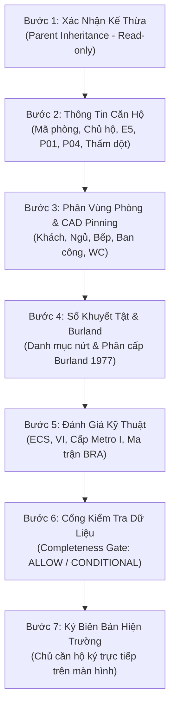

# TẬP 3: ĐẶC TẢ BIỂU MẪU KHẢO SÁT CĂN HỘ CON TINH GỌN (CONDO UNIT FAST-SURVEY)
## (CHILD UNIT FAST-SURVEY WIZARD & DEFECT PINNING SPECIFICATION)

> **Tài liệu trực thuộc:** [Bộ đặc tả Khảo sát Chung cư Tuyến Metro Số 2](./README.md)  
> **Phiên bản:** 2.0.0 (Production Release)  
> **Mã nguồn tương ứng:**
> - View Container: `frontend/src/features/survey-condo-unit/views/SurveyCondoUnitPage.tsx`
> - Wizard Navbar: `frontend/src/features/survey-condo-unit/components/CondoUnitWizardNav.tsx`
> - Component Bước 1: `frontend/src/features/survey-condo-unit/components/Step1_ParentInheritanceConfirmation.tsx`
> - Component Bước 2: `frontend/src/features/survey-condo-unit/components/Step2_UnitSpecificInformation.tsx`

---

## 1. MỤC TIÊU NGHIỆP VỤ & NGUYÊN TẮC TINH GỌN (RATIONALE)

Trong các khối tháp chung cư với hàng trăm hộ dân, việc bắt buộc cán bộ hiện trường phải đi qua biểu mẫu 9 bước đầy đủ như nhà dân đơn lẻ (chụp lại biển tên chung cư, đo lại độ nghiêng khối tháp, nhập lại kết cấu móng cọc) sẽ gây lãng phí nghiêm trọng thời gian và làm đầy bộ nhớ thiết bị di động.

Biểu mẫu **Khảo sát Căn hộ con tinh gọn (Condo Unit Fast-Survey)** được tái cấu trúc thành **7 bước chuẩn hóa**:
* **Rút ngắn thời gian:** Giảm từ 35–45 phút xuống chỉ còn **5–8 phút/căn hộ**.
* **Tập trung sở hữu riêng:** Chỉ thu thập thông tin chủ căn hộ, ảnh nhận diện cửa phòng, hiện trạng trần tường nội thất, vết nứt cục bộ và hiện tượng thấm dột từ tầng trên.
* **Bảo toàn bằng chứng pháp lý:** Vẫn bảo đảm đủ cặp ảnh đối chiếu có thước đo vết nứt (Crack Scale Card $\ge 0.1\text{mm}$) và chữ ký số trực tiếp của chính chủ hộ.



---

## 2. ĐẶC TẢ CHI TIẾT TỪNG BƯỚC KHẢO SÁT (STEP-BY-STEP SPECIFICATION)

### BƯỚC 1: XÁC NHẬN KẾ THỪA DỮ LIỆU TÒA MẸ (STEP 1 - PARENT INHERITANCE CONFIRMATION)
* **Giao diện:** Thẻ thông tin Clean Light nền trắng, đường viền xám kỹ thuật, huy hiệu xanh ngọc (Teal).
* **Nội dung hiển thị dạng Read-only:**
  1. *Mã Quản Lý Dự Án (Parent Parcel Code):* `B-XXXXX` (Font Monospace đậm).
  2. *Mã Địa Chính Gốc:* Số tờ / Số thửa địa chính.
  3. *Tên Tòa Nhà / Khối Tháp Chung Cư:* Ví dụ: *Chung cư Miếu Nổi - Lô A*.
  4. *Địa Chỉ Thực Tế Tòa Nhà:* Số nhà, tên đường, Phường, Quận.
  5. *Lý Trình Tuyến Metro (Chainage):* Km X+YYY.
  6. *Cự Ly Tới Tim Hầm Metro:* Ví dụ: `12.5m` (khoảng cách trắc địa gần nhất).
  7. *Thông Số Móng & Độ Nghiêng:* Móng cọc nhồi / cọc ép; Độ nghiêng toàn khối X, Y ($\permil$).
* **Thao tác người dùng:**
  * Surveyor đối soát nhanh thông tin với thực tế hiện trường.
  * Bấm nút **"Xác Nhận Đúng Tòa Nhà & Điền Thông Tin Căn Hộ Con ➔"** để chuyển ngay sang Bước 2.

---

### BƯỚC 2: THÔNG TIN RIÊNG CĂN HỘ, PHỎNG VẤN & BỘ 4 ẢNH (STEP 2 - UNIT SPECIFIC INFORMATION)

#### 2.1. Định Danh Căn Hộ & Cấu Hình Tầng Lầu
* **Mã số căn hộ (`unitCode`):** Bắt buộc nhập (VD: `P.402`, `A-12.05`).
* **Loại hình căn hộ:**
  * *Căn hộ 1 tầng tiêu chuẩn (Mặc định):* Khảo sát 1 mặt bằng duy nhất.
  * *Căn hộ 2 tầng thông tầng (Duplex / Penthouse):* Cho phép nhập tầng dưới (VD: `18`) và tầng trên (VD: `19`). Store tự động sinh 2 mặt bằng tầng con để ghim khuyết tật độc lập.

#### 2.2. Thông Tin Chủ Hộ / Người Đang Cư Ngụ
* **Họ và tên chủ sở hữu:** Bắt buộc nhập.
* **Số điện thoại liên lạc:** Chuẩn hóa định dạng 10 số.
* **Số CCCD / CMND:** Nhập số căn cước để bảo đảm căn cứ đối chiếu pháp lý khi nhận tiền bồi thường.

#### 2.3. Phỏng Vấn Lịch Sử Sử Dụng & Chỉ Số $E_5$ Cộng Hưởng
Khảo sát viên hỏi nhanh chủ nhà 5 câu hỏi then chốt (thang điểm 0–4 điểm mỗi câu):
1. *Cơi nới - Thay đổi tải trọng:* Đập tường ngăn, cơi nới ban công, xây thêm gác lửng.
2. *Sửa chữa lớn - Cải tạo nội thất:* Thay toàn bộ gạch nền, làm lại hệ trần thạch cao, sửa chữa WC.
3. *Hiện tượng lún - nứt trước đây:* Đã từng xuất hiện vết nứt tường hoặc nghiêng võng trước ngày khảo sát.
4. *Hư hỏng do công trình lân cận:* Rung chấn do xe tải trên trục đường chính hoặc công trình bên cạnh ép cọc.
5. *Sự cố nghiêm trọng:* Cháy nổ, ngập nước cục bộ do vỡ đường ống cấp thoát nước.
* **Quy tắc tính điểm $E_5$ Cộng Hưởng:** Nếu có từ 2 câu hỏi trở lên có điểm $\ge 3$, hệ thống tự động kích hoạt cờ cộng hưởng rủi ro: $E_5 = 4$ (Nguy hiểm).

#### 2.4. Quy Chuẩn Bộ 4 Ảnh Định Danh Căn Hộ Con
Khác với nhà phố đơn lẻ, Bộ 4 ảnh căn hộ con được thiết kế chuyên biệt để vừa tiết kiệm thời gian, vừa bảo toàn giá trị pháp lý:

| Mã Ảnh | Vị Trí / Nội Dung Chụp | Quy Cách Kỹ Thuật | Yêu Cầu Hiện Trường |
| :--- | :--- | :--- | :--- |
| **`P-01`** | **Cửa chính & Biển số căn hộ** | Bắt buộc chụp nét số phòng | Chụp từ hành lang đối diện, thấy rõ biển số căn (VD: `P.402`) và ổ khóa cửa chính. |
| **`P-02`** | **Mặt đứng khối tháp** | **Mặc định tick `N/A`** | Không cần chụp lại; tự động kế thừa ảnh P-02 của Tòa nhà mẹ. |
| **`P-03`** | **Ban công / Logia riêng** | **Mặc định tick `N/A`** | Nếu căn hộ có ban công quay về hướng tuyến Metro thì chụp; nếu không có thì giữ nguyên `N/A`. |
| **`P-04`** | **Toàn cảnh nội thất phòng khách** | Bắt buộc chụp góc rộng | Đứng từ cửa chính chụp bao quát toàn bộ trần, tường và sàn phòng khách. |

#### 2.5. Chỉ Tiêu Đặc Thù Chung Cư: Hiện Tượng Thấm Dột Từ Tầng Trên
* **Đặc thù kỹ thuật:** 70% khiếu nại tại các tòa nhà chung cư liên quan đến việc rò rỉ nước từ hộp gen kỹ thuật hoặc phễu thu sàn nhà vệ sinh của căn hộ tầng trên xuống trần căn hộ tầng dưới.
* **Quy chuẩn ghi nhận:**
  * Toggle: *Có hiện tượng thấm dột từ tầng trên hay không?* (`hasUpperFloorLeakage`).
  * Nếu CÓ: Bắt buộc chọn vị trí (*Trần thạch cao phòng khách*, *Trần hộp gaine Toilet*, *Vách tường tiếp giáp ban công*) và chụp ảnh bằng chứng vệt ố vàng / bong tróc sơn do ẩm mốc.
  * Mục đích: Ngăn chặn triệt để tình trạng chủ căn hộ tầng dưới đổ lỗi cho máy khoan hầm Metro làm trần nhà bị ố mốc.

#### 2.6. Đo Biến Dạng Dầm Sàn Cục Bộ Trong Căn Hộ
* **Độ nghiêng công trình:** Hiển thị dạng Read-only badge kế thừa từ Tòa mẹ (không yêu cầu đo lại trong căn hộ).
* **Đo độ võng dầm sàn cục bộ:** Nếu phát hiện dầm phòng khách có vết nứt hoặc sàn bị võng, Surveyor dùng thước laser đo cự ly giữa nhịp ($L$) và khoảng cách võng tối đa ($f_{\text{max}}$) theo đơn vị milimet:
  $$\Delta_{\text{sag}} = \frac{f_{\text{max}}}{L} \quad (\text{so sánh với ngưỡng an toàn } 1/500)$$

---

### BƯỚC 3: PHÂN VÙNG PHÒNG & GHIM KHUYẾT TẬT CAD (STEP 3 - FLOOR HIERARCHY & CAD PINNING)

#### 3.1. Phân Chia Không Gian Sở Hữu Riêng
Surveyor bấm chọn nhanh các phòng hiện hữu trong căn hộ:
* `Phòng khách & Bếp` (Khu vực sinh hoạt chung).
* `Phòng ngủ 1 (Master)`, `Phòng ngủ 2`, `Phòng ngủ 3`.
* `Ban công / Logia phơi đồ`.
* `Nhà vệ sinh 1 (Chung)`, `Nhà vệ sinh 2 (Khép kín)`.

#### 3.2. Sơ Đồ Mặt Bằng Căn Hộ (CAD Damage Map) & Gắn Ghim Ngắn Gọn
* Surveyor tải ảnh sơ đồ mặt bằng căn hộ (do BQL cấp) hoặc chụp phác họa vẽ tay trên màn hình Canvas.
* **Quy tắc dán nhãn pin ngắn gọn (Tuyệt đối không hiển thị chuỗi dài làm che bản vẽ):**
  * **Mã Vùng kiến trúc:** `Z-01` (Phòng khách), `Z-02` (Phòng ngủ 1).
  * **Mã Cấu kiện kết cấu:** `E-01` (Tường ngăn gạch), `E-02` (Dầm trần bê tông).
  * **Mã Khuyết tật:** `D-01`, `D-02`, `D-03`...

#### 3.3. Quy Chuẩn Cặp Ảnh Đối Chiếu Có Thước Đo (Crack Gauge Pair Comparison)
Mỗi vết nứt $D$ ghi nhận bên trong căn hộ bắt buộc phải có **Cặp ảnh đối chiếu (Pair Comparison)**:
1. **Ảnh bối cảnh (Context Photo - CTX):** Chụp cách xa 1.5m – 2m để thấy rõ vết nứt nằm ở bức tường nào, góc trên cửa hay chân tường.
2. **Ảnh cận cảnh (Close-Up Photo - CU):** Chụp cự ly 10cm – 30cm, **áp sát thước đo vết nứt (Crack Scale Card)** vào điểm nứt rộng nhất:
   * Thước đo phải hiển thị rõ các vạch phân độ: $0.1\text{mm}, 0.2\text{mm}, 0.5\text{mm}, 1.0\text{mm}$.
   * Ảnh CU phải hiển thị rõ vết nứt trùng khớp với vạch đo nào trên thước.
   * Server tự động đóng watermark GPS, Mã căn hộ và Timestamp lên ảnh.

---

### BƯỚC 4: SỔ KHUYẾT TẬT & PHÂN CẤP BURLAND 1977 (STEP 4 - DEFECT REGISTER)
* Hệ thống tự động tổng hợp toàn bộ các điểm nứt $D$ đã ghim ở Bước 3 thành bảng danh mục:
  * Số thứ tự, Mã nứt (`D-01`), Vị trí (`Phòng khách - Tường E-01`), Chiều dài ($L$), Bề rộng tối đa ($w_{\text{max}}$).
* **Phân cấp tổn thương theo Burland (1977):**
  * *Cấp 0 (Không đáng kể):* Vết nứt sợi tóc $w \le 0.1\text{mm}$.
  * *Cấp 1 (Rất nhẹ):* Vết nứt mảnh $w \le 1.0\text{mm}$, dễ trét vá và sơn lại.
  * *Cấp 2 (Nhẹ):* Vết nứt $w \le 5.0\text{mm}$, có thể tự sửa chữa cục bộ.
  * *Cấp 3 (Trung bình):* Vết nứt $w = 5 - 15\text{mm}$, cần thợ chuyên nghiệp xử lý.
  * *Cấp 4-5 (Nghiêm trọng):* Vết nứt $w > 15\text{mm}$, đe dọa an toàn kết cấu.
* **Cờ cảnh báo kỹ sư kết cấu:** Nếu $w_{\text{max}} \ge 2.0\text{mm}$ hoặc xuất hiện nứt chéo dầm bê tông, hệ thống tự động bật cờ:
  `needStructuralEngineerReview = true`

---

### BƯỚC 5: ĐÁNH GIÁ KỸ THUẬT (STEP 5 - TECHNICAL CALCULATIONS)
1. **Chỉ số Tình trạng Hiện hữu (ECS - Existing Condition Score):**
   * Tổng điểm 6 thành phần: $E_1$ (Móng - kế thừa), $E_2$ (Khung chịu lực - kế thừa), $E_3$ (Tường & hoàn thiện căn hộ), $E_4$ (Mái/Trần), $E_5$ (Lịch sử sử dụng căn hộ), $E_6$ (Môi trường & rung động).
   * Phân loại: `GOOD` (Tốt), `MEDIUM` (Trung bình), `DEFICIENT` (Kém), `CRITICAL` (Nguy hiểm).
2. **Chỉ số Dễ Tổn Thương (VI - Vulnerability Index):**
   * Tính toán $V_1 \rightarrow V_6$ (kế thừa tuổi thọ và kết cấu từ tòa mẹ, kết hợp tình trạng nứt nội thất của căn hộ).
3. **Cấp tác động thi công Metro ($I$):**
   * Kế thừa từ khoảng cách tim hầm của Tòa nhà mẹ:
     * $I_1$: Khoảng cách $D \le 10\text{m}$ (Rất lớn).
     * $I_2$: Khoảng cách $10\text{m} < D \le 25\text{m}$ (Lớn).
     * $I_3$: Khoảng cách $25\text{m} < D \le 50\text{m}$ (Trung bình).
     * $I_4$: Khoảng cách $D > 50\text{m}$ (Nhỏ).
4. **Ma Trận Rủi Ro Cơ Sở (Baseline Risk Assessment - BRA):**
   * Tích số $V \times I \implies$ Xếp hạng rủi ro kỹ thuật: `LOW`, `MEDIUM`, `HIGH`, `VERY_HIGH`.

---

### BƯỚC 6: CỔNG KIỂM TRA DỮ LIỆU HIỆN TRƯỜNG (STEP 6 - COMPLETENESS GATE)
Cổng kiểm soát tính đầy đủ chỉ cho phép 2 trạng thái dứt khoát:
1. **`ALLOW` (Đạt 100%):**
   * Đầy đủ Mã căn, Tên chủ hộ, SĐT, Số CCCD.
   * Đầy đủ ảnh `P-01` (Cửa phòng) và `P-04` (Nội thất).
   * Đã có ít nhất 1 phòng và mặt bằng sơ đồ khuyết tật.
   * Tọa độ GPS hợp lệ.
   * $\implies$ Mở khóa nút chuyển sang Bước 7 (Ký biên bản).
2. **`CONDITIONAL` (Cho phép có điều kiện):**
   * Thiếu một số mục thứ yếu (ví dụ: Chủ nhà không cho chụp ảnh phòng ngủ phụ do riêng tư).
   * Bắt buộc KSV phải **nhập văn bản giải trình lý do** (tối thiểu 15 ký tự).
   * $\implies$ Hệ thống ghi nhận chuỗi giải trình vào trường `completenessExplanation` và cho phép sang Bước 7.

---

### BƯỚC 7: KÝ BIÊN BẢN HIỆN TRƯỜNG & NỘP HỒ SƠ (STEP 7 - FIELD SIGNATURES)
* **Ký số trên màn hình cảm ứng:**
  1. **Chủ sở hữu / Người đang cư ngụ thực tế:** Ký bằng ngón tay/bút cảm ứng trên Canvas. Hệ thống lưu chuỗi Base64 Data URI và thời điểm ký.
  2. **Khảo sát viên hiện trường:** Ký xác nhận chịu trách nhiệm về số liệu đo đạc.
* **Nộp hồ sơ (Submit Action):**
  * KSV bấm nút **"Nộp Hồ Sơ Khảo Sát Căn Hộ"**.
  * Modal xác nhận hiển thị: *"Xác nhận nộp hồ sơ Căn hộ P.402? Sau khi nộp, hồ sơ sẽ chuyển sang trạng thái 'Chờ duyệt' và không thể chỉnh sửa."*
  * PWA gửi payload lên Backend:
    ```json
    {
      "parcelId": "uuid-parcel-master",
      "unitId": "uuid-unit-child",
      "reportType": "UNIT_CHILD",
      "surveyData": { ... },
      "status": "COMPLETED",
      "completedAt": "2026-10-08T04:30:00.000Z"
    }
    ```
  * Xóa bản nháp trên thiết bị di động (`clearDraft()`).
  * Trả về Building Hub, cập nhật huy hiệu căn hộ thành **"Đã nộp (Chờ duyệt)"**.
