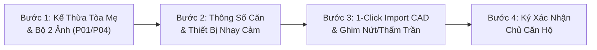

# TẬP 3: ĐẶC TẢ BIỂU MẪU KHẢO SÁT CĂN HỘ CON TINH GỌN (CONDO UNIT FAST-SURVEY)
## (CHILD UNIT FAST-SURVEY WIZARD, CAD AUTO-IMPORT & DEFECT PINNING)

> **Tài liệu trực thuộc:** [Bộ đặc tả Khảo sát Chung cư Tuyến Metro Số 2](./README.md)  
> **Phiên bản:** 3.0.0 (Production Master Partition & CAD Import Release)  
> **Mã nguồn tương ứng:**
> - View Container: `frontend/src/features/survey-condo-unit/views/SurveyCondoUnitPage.tsx`
> - Wizard Navbar: `frontend/src/features/survey-condo-unit/components/CondoUnitWizardNav.tsx`
> - Component Bước 1: `frontend/src/features/survey-condo-unit/components/Step1_ParentInheritanceConfirmation.tsx`
> - Component Bước 2: `frontend/src/features/survey-condo-unit/components/Step2_UnitSpecificInformation.tsx`
> - Component Bước 3: `frontend/src/features/survey-condo-unit/components/Step3_UnitDefectsAndSettlement.tsx`
> - Component Bước 4: `frontend/src/features/survey-condo-unit/components/Step4_UnitSignatures.tsx`

---

## 1. MỤC TIÊU NGHIỆP VỤ & NGUYÊN TẮC TINH GỌN (RATIONALE)

Trong các khối tháp chung cư với hàng trăm hộ dân, việc bắt buộc cán bộ hiện trường phải đi qua biểu mẫu 9 bước đầy đủ như nhà dân đơn lẻ (chụp lại biển tên chung cư, đo lại độ nghiêng khối tháp, nhập lại kết cấu móng cọc, làm đột biến GIS) sẽ gây lãng phí nghiêm trọng thời gian và làm đầy bộ nhớ thiết bị di động.

Biểu mẫu **Khảo sát Căn hộ con tinh gọn (Condo Unit Fast-Survey)** được tinh gọn chuẩn hóa thành **4 bước thực địa siêu tốc**:
* **Rút ngắn thời gian:** Giảm từ 35–45 phút xuống chỉ còn **5–8 phút/căn hộ**.
* **Đột phá CAD Auto-Import:** Kỹ sư **không cần vẽ lại mặt bằng**, hệ thống tự động import CAD đã cắt từ Tòa Master.
* **Tập trung sở hữu riêng:** Chỉ thu thập thông tin chủ căn hộ, ảnh nhận diện cửa phòng và hành lang, hiện trạng trần tường nội thất, vết nứt cục bộ, thấm dột trần từ lầu trên dội xuống và kẹt cửa sổ/cửa đi.
* **Bảo toàn bằng chứng pháp lý:** Vẫn bảo đảm đủ cặp ảnh đối chiếu có thước đo vết nứt (Crack Scale Card $\ge 0.1\text{mm}$) và chữ ký số trực tiếp của chính chủ hộ.



---

## 2. ĐẶC TẢ CHI TIẾT 4 BƯỚC KHẢO SÁT CĂN HỘ CON

### BƯỚC 1: XÁC NHẬN KẾ THỪA DỮ LIỆU TÒA MẸ & BỘ 2 ẢNH TIẾP CẬN

#### 1.1. Bảng Thông Tin Kế Thừa Read-only
* **Mã Quản Lý Dự Án Mẹ:** `B-XXXXX-YYY` (VD: `B-00120-POR`, `B-00105-C&C`).
* **Số Tờ / Số Thửa Bản Đồ Địa Chính:** Kế thừa từ Tòa nhà mẹ.
* **Tên Tòa Nhà / Khối Tháp Chung Cư:** Ví dụ: *Chung cư Saigon Riverside - Tháp A1*.
* **Địa Chỉ Số Nhà Thực Tế:** Kế thừa số nhà, tên đường, phường, quận.
* **Lý Trình Tuyến Metro & Cự Ly Tim Hầm:** Km X+YYY và cự ly trắc địa ngắn nhất tới hầm Metro.
* **Hệ Kết Cấu Móng & Cấp Rủi Ro BRA:** Kế thừa cấp rủi ro $I_1 \rightarrow I_4$ từ khối tháp Master.
* Surveyor đối soát nhanh thông tin và nhấn nút xác nhận để đi tiếp (không nhập lại các trường này).

#### 1.2. Quy Chuẩn Bộ 2 Ảnh Nhận Diện Căn Hộ Con Theo Bối Cảnh Tiếp Cận Thực Địa
Khác với nhà phố đơn lẻ, Bộ ảnh căn hộ con được rút gọn thành **2 ảnh thiết yếu**, phù hợp tuyệt đối với bối cảnh đi lại trong chung cư:

| Mã Ảnh | Vị Trí / Nội Dung Chụp | Quy Cách Kỹ Thuật | Yêu Cầu Hiện Trường |
| :--- | :--- | :--- | :--- |
| **`P-01`** | **Biển số phòng gắn trên cửa căn hộ** | Bắt buộc chụp cận cảnh thấy rõ số phòng | Đứng trước cửa căn hộ chụp rõ biển số phòng (VD: `03.03`) và ổ khóa cửa chính. |
| **`P-04`** | **Tổng quan cửa căn hộ thấy rõ số nhà và lối đi hành lang** | Bắt buộc chụp góc rộng từ hành lang | Đứng từ hành lang chung chụp lùi xa bao quát toàn bộ cửa chính căn hộ và bối cảnh hành lang tiếp cận trước cửa. |
| **`P-02` & `P-03`** | **Mặt đứng khối tháp & Góc nghiêng ngoại vi** | **Miễn trừ hoàn toàn (`N/A`)** | Căn hộ tầng cao không chụp mặt tiền toàn tháp; tự động kế thừa từ Tòa Master. |

---

### BƯỚC 2: THÔNG SỐ RIÊNG CĂN HỘ & PHỎNG VẤN CHỦ HỘ

#### 2.1. Định Danh Căn Hộ Chuẩn Hóa Theo Quy Ước `mm.nn`
* **Mã số căn hộ (`unitCode`):** Quy ước chuẩn **`mm.nn`** trong đó `mm` là số tầng, `nn` là số thứ tự phòng (VD: Tầng 3 phòng 03 $\rightarrow$ `03.03`).
* **Mã định danh đầy đủ toàn hệ thống:** `B-XXXXX-YYY-Umm.nn` (VD: `B-00120-POR-U03.03`).
* **Số tầng / Lầu (`floorNumber`):** Số nguyên (VD: `3`, `12`). Tầng trệt = 1.

#### 2.2. Thông Tin Chủ Hộ / Người Đang Cư Ngụ
* **Họ và tên chủ sở hữu:** Bắt buộc nhập.
* **Số điện thoại liên lạc:** Chuẩn hóa định dạng 10 số.
* **Số CCCD / CMND / Passport:** Nhập số căn cước để bảo đảm căn cứ đối chiếu pháp lý khi nhận tiền bồi thường.
* **Tình trạng cư trú (`residentStatus`):**
  - `CHỦ_HỘ_Ở`: Chủ sở hữu đang trực tiếp sinh sống.
  - `CHO_THUÊ`: Căn hộ đang cho thuê nguyên căn.
  - `BỎ_TRỐNG_CHƯA_VỀ_Ở`: Nhà bàn giao thô hoặc chưa có người ở.
  - `VẮNG_MẶT_KHÓA_CỬA`: Đã gõ cửa nhiều lần nhưng khóa cửa vắng mặt.

#### 2.3. Thông Số Diện Tích & Thiết Bị Nhạy Cảm
* **Diện tích thông thủy căn hộ (`unitAreaM2`):** Số thực (VD: `75.5` $m^2$) theo sổ hồng hoặc hợp đồng mua bán.
* **Trang thiết bị nhạy cảm rung chấn (`sensitiveEquipment`):** Đàn piano cơ lớn, dàn âm thanh đắt tiền, bể cá thủy sinh lớn... Ghi chú chi tiết nếu có.
* **Lịch sử sửa chữa nội thất riêng:** Có đập thông tường ngăn, thay đổi vị trí bếp/WC, cơi nới hoặc làm mới trần thạch cao so với nguyên bản không.
* *(Lược bỏ hoàn toàn: Số phòng ngủ, số WC, Hướng ban công Metro)*.

---

### BƯỚC 3: 1-CLICK IMPORT CAD CĂN HỘ & CHẤM ĐIỂM NỨT / THẤM TRẦN

#### 3.1. Cơ Chế 1-Click Import CAD Mặt Bằng Căn Hộ (Không Cần Vẽ Lại)
* **Tự động nạp CAD:** Nếu Tòa Master đã được cắt chia mặt bằng bằng công cụ **Master CAD Slicer**, hệ thống tự động tải ngay ảnh mặt bằng riêng của căn `03.03` vào `FloorCadPinningCanvas`.
* **Dự phòng mở từ sơ đồ tầng:** KSV có thể bấm "Xem Sơ Đồ Tầng 3" $\rightarrow$ Bản đồ Tầng 3 hiện ra với các ô căn hộ highlight $\rightarrow$ Chạm vào ô `03.03` $\rightarrow$ Nút **"📥 Import CAD Căn 03.03"** kích hoạt $\rightarrow$ Nạp ngay mặt bằng căn `03.03`.
* Kỹ sư **không phải vẽ tay, không phải đo đạc lại mặt bằng**.

#### 3.2. Chấm Điểm Thả Ghim Khuyết Tật Nứt Tường / Bản Sàn
* Chạm trực tiếp lên vị trí khuyết tật trên bản vẽ CAD căn hộ:
  * Tự động sinh mã ghim: `D-01`, `D-02`, `D-03`...
  * Nhập bề rộng vết nứt $w$ (mm) và chiều dài $l$ (m).
  * **Chụp ảnh cận cảnh (Close-Up - CU):** Áp sát thước đo vết nứt (**Crack Scale Card $\ge 0.1\text{mm}$**) vào điểm nứt rộng nhất.

#### 3.3. Hạng Mục Đặc Thù 1: Hiện Tượng Thấm Dột Từ Căn Hộ Tầng Trên (`upperFloorWaterLeakage`)
* Toggle: *Có hiện tượng thấm dột từ trần căn hộ tầng trên không?*
* Nếu CÓ: Thả ghim vị trí thấm dột (khu WC, trần thạch cao phòng khách, chân hộp gen kỹ thuật).
* Phân định rõ: Hiện tượng thấm dột do sinh hoạt, thoát sàn của căn hộ tầng trên dội xuống (không phải do tác động chấn động của dự án Metro).

#### 3.4. Hạng Mục Đặc Thù 2: Kiểm Tra Kẹt Cửa & Biến Dạng (`doorJammingStatus`)
* Kiểm tra cửa chính, cửa thông phòng, cửa sổ lùa ban công:
  - `NORMAL`: Đóng mở bình thường, nhẹ nhàng.
  - `JAMMED`: Bị kẹt khung bao, khó đóng mở.
  - `RUBBING_FLOOR`: Xệ cánh, cạ mặt nền gạch.
  - `CRACKED_GLASS`: Nứt rạn kính ban công / cửa sổ.

---

### BƯỚC 4: KÝ BIÊN BẢN 2 BÊN HIỆN TRƯỜNG & NỘP HỒ SƠ

#### 4.1. Ý Kiến Ghi Chú Của Chủ Hộ (`ownerRemarks`)
* Ghi nhận ngắn gọn ý kiến, kiến nghị hoặc cam kết của chủ hộ về hiện trạng căn nhà trước khi dự án Metro khởi công.

#### 4.2. Ký Số Điện Tử Trực Tiếp
* **Chữ ký Kỹ sư khảo sát (`preparedBy`):** Ký và ghi rõ họ tên.
* **Chữ ký Chủ căn hộ (`ownerRepresentative`):** Ký trực tiếp bằng ngón tay / bút cảm ứng trên màn hình Canvas của PWA.

#### 4.3. Chụp Ảnh Biên Bản Giấy Hiện Trường (`workingMinutesPhotos`)
* Nếu lập biên bản giấy tại hiện trường có chữ ký tươi hai bên, KSV chụp 1–2 ảnh đính kèm vào hồ sơ số để làm bằng chứng đối chiếu.

#### 4.4. Nộp Hồ Sơ Khảo Sát Căn Hộ
* KSV bấm nút **"Nộp Hồ Sơ Khảo Sát Căn Hộ"**.
* PWA gửi payload lên Backend:
  ```json
  {
    "parcelId": "uuid-parcel-master",
    "unitId": "uuid-unit-child",
    "reportType": "CONDO_UNIT",
    "surveyData": {
      "unitCode": "03.03",
      "floorNumber": 3,
      "ownerName": "Nguyễn Văn A",
      "ownerPhone": "0901234567",
      "ownerIdCard": "079090123456",
      "unitAreaM2": 75.5,
      "residentStatus": "CHỦ_HỘ_Ở",
      "photoP01": { "url": "blob:..." },
      "photoP04": { "url": "blob:..." },
      "unitCadUrl": "https://.../cad_03_03.png",
      "upperFloorWaterLeakage": { "has": false },
      "doorJammingStatus": "NORMAL",
      "defects": [ ... ],
      "signatures": { ... }
    },
    "status": "SUBMITTED"
  }
  ```
* Hồ sơ được lưu trữ an toàn trong PostgreSQL, chuyển trạng thái thành `SUBMITTED`, cập nhật tỷ lệ tiến độ trên Building Hub.

---

## 3. MA TRẬN RÀNG BUỘC KỸ THUẬT (TECHNICAL CONSTRAINTS)

1. **Ràng Buộc Kế Thừa Trước Khi Xuất Báo Cáo:**
   - Căn hộ con có thể được khảo sát độc lập, nhưng để xuất Báo cáo PDF Template 2 chính thức, Tòa Master phải đạt tối thiểu trạng thái `SUBMITTED` hoặc `APPROVED` để đảm bảo các thông số kết cấu móng và cấp rủi ro BRA kế thừa đã có giá trị pháp lý.
2. **Ràng Buộc Định Dạng Mã Căn:**
   - Mã căn phải theo cú pháp `mm.nn` hoặc số phòng rõ ràng, không được để trống hoặc trùng lặp trong cùng một tòa nhà.
3. **Ràng Buộc Thước Đo Vết Nứt CU:**
   - Mọi ảnh CU vết nứt phải có thước đo Crack Scale Card với độ chia tối thiểu $\ge 0.1\text{mm}$.
