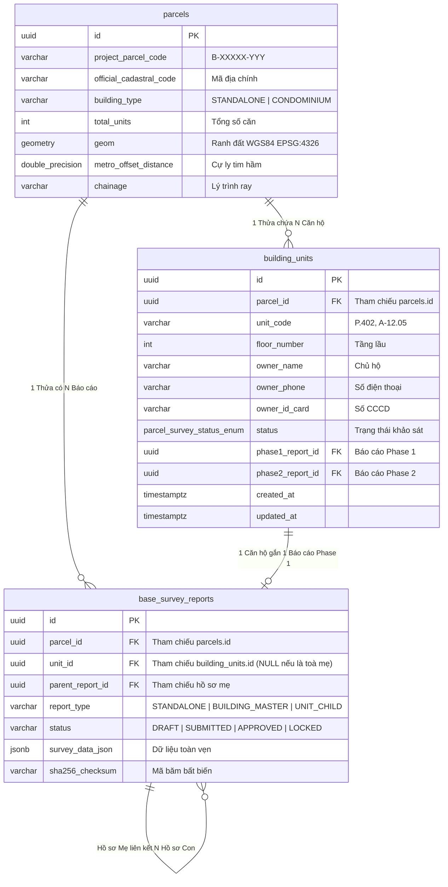
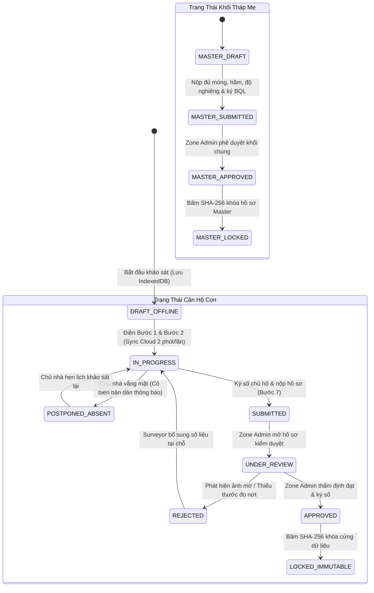

# TẬP 4: ĐẶC TẢ CƠ SỞ DỮ LIỆU, DANH MỤC API & MÁY TRẠNG THÁI
## (DATABASE SCHEMA, REST APIS & STATE MACHINE SPECIFICATION)

> **Tài liệu trực thuộc:** [Bộ đặc tả Khảo sát Chung cư Tuyến Metro Số 2](./README.md)  
> **Phiên bản:** 2.0.0 (Production Release)  
> **Mã nguồn tương ứng:**
> - Database Startup: `backend/src/database/db.ts`
> - Migration: `backend/database/migrations/20261003_add_assigned_surveyor_and_units.sql`
> - Controller: `backend/src/modules/cadastral/cadastral.controller.ts`, `backend/src/modules/survey/survey.controller.ts`
> - Repository: `backend/src/modules/cadastral/cadastral.repository.ts`, `backend/src/modules/survey/repositories/*`

---

## 1. MÔ HÌNH DỮ LIỆU QUAN HỆ & POSTGIS SCHEMA (ERD)

Kiến trúc mở rộng CSDL áp dụng nguyên tắc **Zero-Breaking Changes**, không làm thay đổi các bảng cốt lõi hiện hữu mà bổ sung các thực thể phụ thuộc thông qua khóa ngoại linh hoạt:



---

## 2. CHI TIẾT LƯỢC ĐỒ CSDL (DATABASE SCHEMA SPECIFICATION)

### 2.1. Cập nhật bảng `parcels`
```sql
-- Bổ sung trường loại hình công trình và tổng số căn hộ
ALTER TABLE parcels 
  ADD COLUMN IF NOT EXISTS building_type VARCHAR(32) NOT NULL DEFAULT 'STANDALONE',
  ADD COLUMN IF NOT EXISTS total_units INT NOT NULL DEFAULT 1;

CREATE INDEX IF NOT EXISTS idx_parcels_building_type ON parcels(building_type);
```

### 2.2. Tạo bảng quản lý căn hộ con `building_units`
```sql
CREATE TABLE IF NOT EXISTS building_units (
    id UUID PRIMARY KEY DEFAULT uuid_generate_v4(),
    parcel_id UUID NOT NULL REFERENCES parcels(id) ON DELETE CASCADE,
    unit_code VARCHAR(32) NOT NULL,                 -- Ví dụ: 'P.402', 'A-12.05'
    floor_number INT NOT NULL DEFAULT 1,             -- Tầng 1, 2, 3...
    owner_name VARCHAR(128),                         -- Họ tên chủ sở hữu
    owner_phone VARCHAR(32),                         -- Số điện thoại liên lạc
    owner_id_card VARCHAR(32),                       -- Số CMND / CCCD
    status parcel_survey_status_enum NOT NULL DEFAULT 'NOT_SURVEYED',
    phase1_report_id UUID,                           -- Liên kết sang base_survey_reports
    phase2_report_id UUID,
    created_at TIMESTAMPTZ NOT NULL DEFAULT NOW(),
    updated_at TIMESTAMPTZ NOT NULL DEFAULT NOW(),
    CONSTRAINT uq_parcel_unit UNIQUE (parcel_id, unit_code)
);

CREATE INDEX IF NOT EXISTS idx_building_units_parcel ON building_units(parcel_id);
CREATE INDEX IF NOT EXISTS idx_building_units_status ON building_units(status);
CREATE INDEX IF NOT EXISTS idx_building_units_floor ON building_units(parcel_id, floor_number);
```

### 2.3. Mở rộng bảng `base_survey_reports`
```sql
ALTER TABLE base_survey_reports
  ADD COLUMN IF NOT EXISTS unit_id UUID REFERENCES building_units(id) ON DELETE SET NULL,
  ADD COLUMN IF NOT EXISTS parent_report_id UUID REFERENCES base_survey_reports(id) ON DELETE SET NULL,
  ADD COLUMN IF NOT EXISTS report_type VARCHAR(32) NOT NULL DEFAULT 'STANDALONE',
  ADD COLUMN IF NOT EXISTS sha256_checksum VARCHAR(64);

CREATE INDEX IF NOT EXISTS idx_reports_unit ON base_survey_reports(unit_id);
CREATE INDEX IF NOT EXISTS idx_reports_parent ON base_survey_reports(parent_report_id);
CREATE INDEX IF NOT EXISTS idx_reports_type ON base_survey_reports(report_type);
```

### 2.4. Bảng Mặt Bằng Tầng & Phân Chia CAD: `building_floor_plans`
```sql
CREATE TABLE IF NOT EXISTS building_floor_plans (
    id UUID PRIMARY KEY DEFAULT uuid_generate_v4(),
    parcel_id UUID NOT NULL REFERENCES parcels(id) ON DELETE CASCADE,
    floor_number INT NOT NULL,                  -- Số tầng đại diện (VD: 3)
    floor_name VARCHAR(64) NOT NULL,            -- VD: "Tầng 3" hoặc "Tầng điển hình 3-10"
    applicable_floors INT[] DEFAULT '{}',       -- Danh sách các tầng áp dụng layout này (ARRAY[3,4,5,6,7,8])
    cad_photo_url TEXT NOT NULL,                -- URL ảnh bản vẽ CAD mặt bằng tầng
    cad_photo_code VARCHAR(32),                 -- Mã ảnh P_CAD_F03
    image_width INT,                            -- Chiều rộng ảnh (px)
    image_height INT,                           -- Chiều cao ảnh (px)
    created_at TIMESTAMPTZ NOT NULL DEFAULT NOW(),
    updated_at TIMESTAMPTZ NOT NULL DEFAULT NOW(),
    CONSTRAINT uq_parcel_floor_number UNIQUE (parcel_id, floor_number)
);

CREATE INDEX IF NOT EXISTS idx_floor_plans_parcel ON building_floor_plans(parcel_id);

-- Mở rộng bảng building_units lưu thông tin phân chia CAD của từng căn
ALTER TABLE building_units
  ADD COLUMN IF NOT EXISTS floor_plan_id UUID REFERENCES building_floor_plans(id) ON DELETE SET NULL,
  ADD COLUMN IF NOT EXISTS cad_bbox JSONB,       -- Khung bao { x, y, width, height } (% tương đối)
  ADD COLUMN IF NOT EXISTS cad_polygon JSONB,    -- Tọa độ đa giác [{x, y}, ...] cho căn góc
  ADD COLUMN IF NOT EXISTS unit_cad_url TEXT,    -- URL ảnh bản vẽ CAD đã crop của riêng căn này
  ADD COLUMN IF NOT EXISTS resident_status VARCHAR(32) DEFAULT 'CHỦ_HỘ_Ở';
```

---

## 3. DANH MỤC API RESTFUL ĐIỀU PHỐI (API CONTRACTS)

### 3.1. Nhóm API Quản Lý Bản Vẽ Mặt Bằng Tầng & CAD Slicer (Floor Plans API)

#### 1. Upload & lưu cấu hình bản vẽ CAD tầng
* **Endpoint:** `POST /api/v1/parcels/:id/floor-plans`
* **Quyền hạn:** `SURVEYOR`, `ZONE_ADMIN`, `SUPER_ADMIN`
* **Payload:**
```json
{
  "floorNumber": 3,
  "floorName": "Tầng điển hình 3-8",
  "applicableFloors": [3, 4, 5, 6, 7, 8],
  "cadPhotoUrl": "https://.../cad_typical_floor_3_8.png",
  "imageWidth": 2400,
  "imageHeight": 1600
}
```

#### 2. Lấy thông tin bản vẽ và danh sách ô phân chia căn hộ của tầng
* **Endpoint:** `GET /api/v1/parcels/:id/floor-plans/:floor`
* **Response (200 OK):** Trả về chi tiết `floorPlan` kèm danh sách căn hộ và tọa độ `cad_bbox` / `cad_polygon`.

#### 3. Lưu danh sách phân chia ô căn hộ (CAD Slicer Partitions)
* **Endpoint:** `POST /api/v1/parcels/:id/floor-plans/partitions`
* **Payload:**
```json
{
  "floorNumber": 3,
  "partitions": [
    {
      "unitCode": "03.01",
      "bbox": { "x": 10.5, "y": 20.0, "width": 15.0, "height": 18.0 },
      "unitCadUrl": "https://.../cad_crop_03_01.png"
    },
    {
      "unitCode": "03.02",
      "bbox": { "x": 26.0, "y": 20.0, "width": 14.5, "height": 18.0 },
      "unitCadUrl": "https://.../cad_crop_03_02.png"
    }
  ]
}
```
* **Hành vi hệ thống:** Cập nhật tọa độ ô cắt vào `building_units`. Nếu căn hộ chưa tồn tại trong CSDL, hệ thống **tự động tạo mới bản ghi `building_units`** theo mã `mm.nn`!

---

### 3.2. Nhóm API Quản Lý Căn Hộ Thuộc Tòa Nhà (Building Units API)

#### 1. Lấy danh sách căn hộ theo tòa nhà
* **Endpoint:** `GET /api/v1/parcels/:id/units`
* **Quyền hạn:** `SURVEYOR`, `ZONE_ADMIN`, `SUPER_ADMIN`, `GUEST` (kèm PII masking)
* **Response (200 OK):**
```json
{
  "success": true,
  "data": {
    "parcelId": "c4d5e6f7-1111-2222-3333-444455556666",
    "projectParcelCode": "B-00120-POR",
    "buildingName": "Chung cư Miếu Nổi Lô A",
    "totalUnits": 14,
    "completedUnitsCount": 8,
    "units": [
      {
        "id": "u-101-uuid",
        "parcel_id": "c4d5e6f7-1111-2222-3333-444455556666",
        "unit_code": "P.101",
        "floor_number": 1,
        "owner_name": "Nguyễn Văn An",
        "owner_phone": "0901234567",
        "status": "APPROVED",
        "phase1_report_id": "rep-p1-101"
      }
    ]
  }
}
```

#### 2. Cập nhật Loại hình Công trình (Building Type Mutation)
* **Endpoint:** `PATCH /api/v1/parcels/:id/building-type`
* **Quyền hạn:** `ZONE_ADMIN`, `SUPER_ADMIN` (Khóa đối với `SURVEYOR` để bảo đảm chuẩn hóa số liệu trên Desktop)
* **Payload:**
```json
{
  "buildingType": "CONDOMINIUM",
  "totalUnits": 50
}
```

#### 3. Upload Bản vẽ CAD Mặt bằng Toàn tầng
* **Endpoint:** `POST /api/v1/parcels/:id/floor-plans`
* **Quyền hạn:** `ZONE_ADMIN`, `SUPER_ADMIN`
* **Payload:**
```json
{
  "floorNumber": 3,
  "floorName": "Tầng điển hình 3-8",
  "applicableFloors": [3, 4, 5, 6, 7, 8],
  "cadPhotoUrl": "https://r2.metro2-survey.vn/cad/floor_3_plan.png"
}
```

#### 4. Phân chia Cắt Căn hộ CAD & Đồng bộ Tầng điển hình
* **Endpoint:** `POST /api/v1/parcels/:id/floor-plans/partitions`
* **Quyền hạn:** `ZONE_ADMIN`, `SUPER_ADMIN`
* **Payload:**
```json
{
  "floorNumber": 3,
  "floorPlanId": "fp-uuid-1234",
  "partitions": [
    {
      "unitCode": "03.01",
      "floorNumber": 3,
      "bbox": { "x": 10.5, "y": 15.2, "width": 25.0, "height": 30.0 },
      "unitCadUrl": "https://r2.metro2-survey.vn/cad/crop_03_01.jpg"
    }
  ]
}
```

#### 5. Truy vấn Bản vẽ CAD & Sơ đồ Tầng (Client / Fieldwork)
* **Endpoint:** `GET /api/v1/parcels/:id/floor-plans` & `GET /api/v1/parcels/:id/floor-plans/:floor`
* **Quyền hạn:** `SURVEYOR`, `ZONE_ADMIN`, `SUPER_ADMIN` (KSV sử dụng ở chế độ Read-Only)

#### 6. Thêm căn hộ đơn lẻ thủ công
* **Endpoint:** `POST /api/v1/parcels/:id/units`
* **Quyền hạn:** `ZONE_ADMIN`, `SUPER_ADMIN`
* **Payload:**
```json
{
  "unitCode": "03.02",
  "floorNumber": 3,
  "ownerName": "Trần Thị Bích",
  "ownerPhone": "0912345678",
  "ownerIdCard": "079088123456"
}
```

---

### 3.2. Nhóm API Khảo Sát & Nộp Hồ Sơ Toàn Phần (Survey Submission API)

#### 1. Nộp hồ sơ toàn phần (Submit Survey Package)
* **Endpoint:** `POST /api/v1/surveys/phase1/submit`
* **Quyền hạn:** `SURVEYOR` (đã đăng nhập và có điểm danh GPS hợp lệ)
* **Validation Schema (Zod DTO):**
```typescript
export const Phase1SubmitPackageSchema = z.object({
  parcelId: z.string().uuid('Mã thửa đất không hợp lệ'),
  unitId: z.string().uuid().optional().nullable(),
  reportType: z.enum(['STANDALONE', 'BUILDING_MASTER', 'UNIT_CHILD']),
  surveyData: z.record(z.any()), // Cấu trúc Phase1SurveyFormData
  status: z.enum(['COMPLETED', 'SUBMITTED']),
  completedAt: z.string().datetime(),
});
```
* **Logic xử lý Backend:**
  1. Nếu `reportType === 'BUILDING_MASTER'`:
     * Khởi tạo bản ghi `base_survey_reports` với `unit_id = NULL`, `report_type = 'BUILDING_MASTER'`.
     * Lưu ảnh mặt đứng khối tháp vào `survey_identification_photos`.
     * Lưu thông số móng cọc, tường vây hầm vào `building_specifications`.
     * Cập nhật trạng thái của thửa đất `parcels.survey_status = 'SUBMITTED'`.
  2. Nếu `reportType === 'UNIT_CHILD'`:
     * Khởi tạo bản ghi `base_survey_reports` với `unit_id = cleanUnitId`, `report_type = 'UNIT_CHILD'`.
     * Tự động truy vấn hồ sơ master để gán `parent_report_id`.
     * Cập nhật thông tin chủ hộ vào `building_units` (`owner_name`, `owner_phone`, `owner_id_card`).
     * Cập nhật trạng thái căn hộ trong `building_units.status = 'SUBMITTED'`.

#### 2. Lấy hồ sơ Tòa nhà Mẹ để phục vụ Kế thừa
* **Endpoint:** `GET /api/v1/parcels/:id/phase1-report`
* **Response (200 OK):** Trả về toàn bộ thuộc tính móng, hầm, độ nghiêng, ảnh P01-P04 của khối Master để client hiển thị tại Bước 1 Căn con.

---

## 4. MÁY TRẠNG THÁI VÒNG ĐỜI HỒ SƠ KHẢO SÁT (STATE MACHINE)

Vòng đời của hồ sơ Chung cư mẹ và Căn hộ con được điều khiển bằng Máy trạng thái 2 cấp (Dual-tier State Machine):



### Các Quy tắc Bất Biến của Máy Trạng Thái:
1. **Quy tắc Độc Lập Tiến Độ:**
   * Căn hộ con có thể đạt trạng thái `APPROVED` ngay cả khi các căn hộ khác cùng tầng đang ở trạng thái `POSTPONED_ABSENT` hoặc `IN_PROGRESS`.
2. **Quy tắc Khóa Bất Biến (Data Immutability Gate):**
   * Ngay khi chuyển sang `APPROVED`, toàn bộ payload dữ liệu JSON, ảnh hiện trường và chữ ký số sẽ được hàm băm SHA-256 mã hóa:
     $$\text{Checksum} = \text{SHA256}(\text{survey\_data\_json} + \text{surveyor\_sig} + \text{owner\_sig} + \text{timestamp})$$
   * Ghi nhận vào bảng `audit_logs`. Bất kỳ yêu cầu `UPDATE/DELETE` nào vào bản ghi này từ thời điểm này sẽ bị chặn cứng ở tầng Middleware (`403 Forbidden - Record is cryptographically locked`).

---

## 5. CƠ CHẾ KHÓA PHIÊN & BÀN GIAO CA TRỰC HIỆN TRƯỜNG (CONCURRENCY & SHIFT HANDOVER)

Nhằm triệt tiêu **Lỗi Hệ thống số 5 (Lỗi Bất Đồng Bộ Dữ Liệu & Ghi Đè Trạng Thái Form)** khi có nhiều kỹ sư cùng tác nghiệp trong một tòa nhà:
1. **Khóa phiên căn hộ (Unit Session Lock):**
   * Khi Surveyor A mở khảo sát Căn 402, client gửi heartbeat giữ phiên:
     `POST /api/v1/surveys/phase1/lock { parcelId, unitId: '402', surveyorId }` (Timeout: 5 phút).
   * Nếu Surveyor B mở cùng Căn 402, hệ thống hiển thị modal cảnh báo `ActiveSurveyorLockedModal`:
     *"Căn hộ này đang được Kỹ sư Nguyễn Văn A khảo sát (Bắt đầu lúc 09:15). Vui lòng không ghi đè."*
2. **Cơ chế Bàn giao ca trực (Shift Handover Protocol):**
   * Nếu Surveyor A hết ca làm việc hoặc hết pin điện thoại, Surveyor B có thể bấm nút **"Tiếp quản hồ sơ nháp (Takeover)"**:
     * Hệ thống gửi yêu cầu xác nhận kèm mã OTP hoặc xác nhận qua Zone Admin.
     * Sau khi tiếp quản, quyền sở hữu bản nháp trên Cloud được chuyển giao cho Surveyor B, tránh việc phải khảo sát lại từ đầu.
