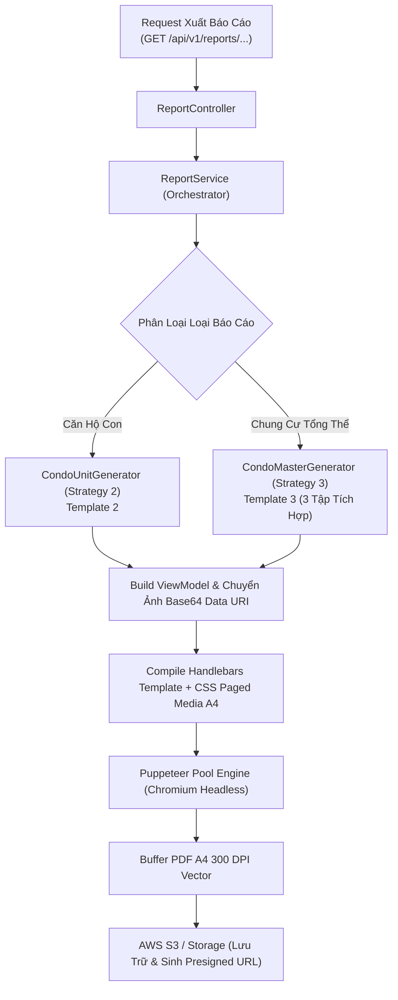
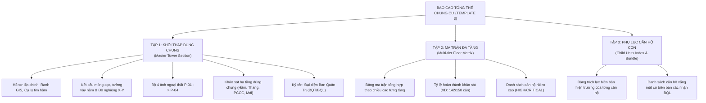

# TẬP 5: QUY CHUẨN KẾT XUẤT BÁO CÁO PHÁP LÝ (TEMPLATE 2 & TEMPLATE 3)
## (TECHNICAL REPORT EXPORT PIPELINE - CRLG-CRSRI-TT STANDARDS)

> **Tài liệu trực thuộc:** [Bộ đặc tả Khảo sát Chung cư Tuyến Metro Số 2](./README.md)  
> **Phiên bản:** 2.0.0 (Production Release)  
> **Tiêu chuẩn pháp lý:** Tuân thủ 100% biểu mẫu chuẩn của **Liên danh CRLG–CRSRI–TT** phục vụ Dự án Tuyến Tàu điện ngầm số 2 TP.HCM (Bến Thành – Tham Lương).  
> **Mã nguồn tương ứng:**
> - Orchestrator: `backend/src/modules/report/report.service.ts`
> - Engine Puppeteer: `backend/src/modules/report/engine/pdf-render.engine.ts`
> - Unit Strategy: `backend/src/modules/report/generators/condo-unit.generator.ts`
> - Master Strategy: `backend/src/modules/report/generators/condo-master.generator.ts`

---

## 1. KIẾN TRÚC MODULE REPORT & CƠ CHẾ RENDER CHROMIUM HEADLESS

Để đáp ứng tiêu chuẩn lưu chiểu công trình đường sắt đô thị và chống tràn bộ nhớ máy chủ (ngăn chặn **Lỗi Hệ thống số 4: Puppeteer Zombie & Vỡ Khung In PDF**), hệ thống áp dụng kiến trúc phân lớp chiến lược (Strategy Pattern):



### Các Nguyên Tắc Bất Biến Khi Xuất Báo Cáo:
1. **In ấn chuẩn trang A4 (CSS Paged Media):**
   * Định dạng `@page { size: A4 portrait; margin: 15mm 10mm 15mm 10mm; }`.
   * Chống cắt đôi bảng và ảnh: Bắt buộc dùng `page-break-inside: avoid; break-inside: avoid;` cho toàn bộ các thẻ card khuyết tật, bảng điểm BRA và lưới ảnh.
2. **Cơ chế nạp ảnh Zero-Network-Failure:**
   * Không sử dụng thẻ `` trong lúc Chromium render vì dễ bị timeout mạng.
   * Toàn bộ ảnh được Backend nạp từ S3/Local và mã hóa thành chuỗi **Base64 Data URI** (`data:image/jpeg;base64,...`) trước khi inject vào template Handlebars.
3. **Tiêu diệt tiến trình Chromium mồ côi (Zero Puppeteer Zombie):**
   * Mọi tác vụ in ấn phải được bọc trong khối `try ... finally`:
     ```typescript
     let page: Page | null = null;
     try {
       page = await browser.newPage();
       // ... in PDF ...
     } finally {
       if (page) await page.close();
     }
     ```

---

## 2. TEMPLATE 2: BÁO CÁO KHẢO SÁT HIỆN TRẠNG CĂN HỘ CON (CHILD UNIT REPORT)

### 2.1. Mục Đích & Chủ Thể Sử Dụng
* **Mục đích:** Là bộ hồ sơ pháp lý độc lập ghi nhận toàn bộ hiện trạng phòng ốc và vết nứt nội thất của một căn hộ cụ thể.
* **Chủ thể nhận:** Chủ sở hữu căn hộ, Ban Quản Lý tòa nhà, Đơn vị bảo hiểm công trình và Nhà thầu EPC.
* **Quy mô tài liệu:** Tinh gọn, từ 4 đến 8 trang A4 (thay vì 25 trang như nhà dân).

### 2.2. Bố Cục Nội Dung Chuẩn Hóa Của Template 2

```
=============================================================================
BÁO CÁO KHẢO SÁT HIỆN TRẠNG CĂN HỘ CON (TEMPLATE 2) - DỰ ÁN METRO 2
=============================================================================
[TRANG 1: ĐỊNH DANH & THÔNG TIN KẾ THỪA TÒA MẸ]
1. Tiêu ngữ, Logo Chủ Đầu Tư MAUR & Liên danh CRLG-CRSRI-TT.
2. Tiêu đề: BÁO CÁO KHẢO SÁT HIỆN TRẠNG CĂN HỘ THÀNH VIÊN.
3. Hộp định danh nổi bật:
   - MÃ CĂN HỘ: P.402  |  TẦNG: Tầng 4
   - TRỰC THUỘC TÒA NHÀ: Chung cư Miếu Nổi (Mã dự án: B-00120-POR)
   - ĐỊA CHỈ TÒA NHÀ: 123 Đường Cách Mạng Tháng Tám, Phường 7, Quận Tân Bình
   - CỰ LY TIM HẦM: 12.5m  |  LÝ TRÌNH: Km 3+450
4. Thông tin chủ sở hữu căn hộ:
   - Họ và tên chủ hộ: Trần Thị Bích
   - Số điện thoại: 0912 345 678  |  Số CCCD: 079088123456
5. Bảng ghi chú kế thừa từ Tòa nhà mẹ (Read-only Summary):
   - Hệ móng: Cọc khoan nhồi D1200 (CAT 2)  |  Tầng hầm: 02 tầng hầm
   - Độ nghiêng toàn khối tháp: Phương X = +0.8‰, Phương Y = -0.4‰
   - Bản vẽ hoàn công toàn tòa: Lưu trữ tại hồ sơ Master B-00120-POR.

[TRANG 2: BỘ ẢNH NHẬN DIỆN & HIỆN TRẠNG ĐẶC THÙ CHUNG CƯ]
1. Bộ ảnh nhận diện căn hộ con:
   - Khung ảnh P-01: Cửa chính căn hộ & Biển số phòng (Kèm metadata strip: GPS, thời gian).
   - Khung ảnh P-04: Toàn cảnh nội thất phòng khách (Góc nhìn rộng).
   - Ghi chú P-02 (Mặt đứng khối tháp) & P-03 (Ban công): Kế thừa từ Tòa mẹ.
2. Bảng khảo sát chỉ tiêu đặc thù chung cư:
   - Hiện tượng thấm dột từ căn hộ tầng trên: CÓ (Vệt ố vàng trần thạch cao phòng khách do phễu thu sàn toilet căn hộ 502 phía trên rò rỉ).
   - Đo võng dầm/sàn cục bộ: Dầm phòng khách L = 4.2m, độ võng f = 2.5mm (Nằm trong giới hạn cho phép).

[TRANG 3: SỔ KHUYẾT TẬT NỘI THẤT & MẶT BẰNG SƠ ĐỒ PHÒNG (DAMAGE MAP)]
1. Sổ khuyết tật nội thất (Inside Unit Defect Register):
   - D-01: Phòng khách - Nứt vách thạch cao góc cửa sổ (L = 450mm, w = 0.3mm).
   - D-02: Phòng ngủ Master - Nứt chân chim tường ngăn (L = 600mm, w = 0.1mm).
2. Mặt bằng bố trí phòng ốc căn hộ (Damage Map):
   - Bản vẽ sơ đồ căn hộ đính kèm các mã pin ghim: Z-01, Z-02, E-01, D-01, D-02.
   (Hỗ trợ 2 mặt bằng nếu là căn hộ Duplex 2 tầng).

[TRANG 4: PHỤ LỤC ẢNH ĐỐI CHIẾU CÓ THƯỚC ĐO CRACK SCALE]
- Bố cục lưới Cặp ảnh đối chiếu (Pair Comparison):
  + Cặp 1 (Khuyết tật D-01):
    * Ảnh trái (Bối cảnh CTX): Toàn cảnh góc tường phòng khách.
    * Ảnh phải (Cận cảnh CU): Thước đo Crack Scale Card áp sát vết nứt w = 0.3mm.

[TRANG CUỐI: TỔNG HỢP KỸ THUẬT & CHỮ KÝ PHÁP LÝ 3 BÊN]
1. Đánh giá Burland (1977): Cấp độ chủ đạo = Cấp 1 (Rất nhẹ).
2. Ma trận rủi ro cơ sở BRA: Xếp hạng LOW.
3. Chữ ký số xác nhận pháp lý hiện trường:
   - Bên A: Chủ sở hữu căn hộ (Ký trực tiếp trên thiết bị di động).
   - Bên B: Khảo sát viên hiện trường (Ký số).
   - Bên C: Zone Admin thẩm định & phê duyệt (Ký số kèm mã băm SHA-256).
=============================================================================
```

---

## 3. TEMPLATE 3: BÁO CÁO TỔNG THỂ TÒA NHÀ CHUNG CƯ & MA TRẬN ĐA TẦNG (MASTER DOSSIER & MULTI-TIER BUNDLE)

### 3.1. Mục Đích & Chủ Thể Sử Dụng
* **Mục đích:** Là bộ hồ sơ toàn diện phục vụ công tác đối soát kỹ thuật công trình cấp khối tháp trước khi TBM đào qua.
* **Chủ thể nhận:** Ban Quản Trị Tòa Nhà, Chủ Đầu Tư MAUR, Tư vấn Giám sát quốc tế và Nhà thầu EPC.
* **Quy mô tài liệu:** Bộ hồ sơ tích hợp gồm **3 Tập chuyên khảo**.

### 3.2. Cấu Trúc 3 Tập Tích Hợp Của Template 3



#### Chi Tiết Tập 1: Hiện Trạng Khối Tháp Chung Cư Mẹ
* Trình bày đầy đủ 13 phần chuẩn CRLG–CRSRI–TT áp dụng cho phần kết cấu chịu lực chính và không gian công cộng:
  * Thông tin dự án, Tim hầm Metro, Cự ly gần nhất tới kết cấu hầm.
  * Hồ sơ hệ móng cọc khoan nhồi, độ sâu chôn móng, tầng hầm, tuổi thọ công trình.
  * Bộ 4 ảnh toàn cảnh `P-01` (Cổng chính/Lộ giới), `P-02` (Mặt đứng khối tháp), `P-03` (Mặt bên/Khe lún), `P-04` (Mặt đường/Vỉa hè).
  * Đo đạc trắc địa lún - nghiêng tổng thể tòa nhà theo 2 phương X, Y ($\permil$).
  * Hiện trạng hạ tầng dùng chung: Tầng hầm bãi xe, sảnh chính, hệ thống giếng thang máy, buồng thang bộ thoát hiểm, hệ thống PCCC, bể nước ngầm, máy phát điện, sân thượng.
  * Chữ ký số xác nhận: **Đại diện Ban Quản Lý / Ban Quản Trị Tòa Nhà**.

#### Chi Tiết Tập 2: Ma Trận Tổng Hợp Tiến Độ & Hư Hại Đa Tầng (Multi-tier Floor Matrix)
Bảng ma trận được sắp xếp theo cao trình từng tầng lầu từ tầng trệt lên tầng cao nhất:

| Cao Trình Tầng | Tổng Số Căn | Đã Khảo Sát | Vắng Mặt (Absent) | Nứt Cục Bộ (Burland 1-2) | Nguy Cơ Kết Cấu (Burland $\ge 3$) | Đề Xuất Quan Trắc Biến Dạng |
| :--- | :--- | :--- | :--- | :--- | :--- | :--- |
| **Tầng Trệt / Shophouse** | 6 | 6 | 0 | 1 căn | 0 căn | Không |
| **Tầng 1** | 10 | 9 | 1 căn (P.104) | 2 căn | 0 căn | Không |
| **Tầng 2** | 10 | 8 | 2 căn (P.202, 204)| 3 căn | 1 căn (P.201 nứt dầm)| **Gắn mốc quan trắc nứt** |
| **Tầng 3** | 10 | 10 | 0 | 1 căn | 0 căn | Không |
| **Tầng 4** | 10 | 9 | 1 căn (P.402) | 2 căn (thấm dột)| 0 căn | Không |
| **...** | ... | ... | ... | ... | ... | ... |
| **TỔNG CỘNG** | **120 CĂN**| **112 CĂN (93.3%)** | **8 CĂN (6.7%)** | **18 CĂN** | **2 CĂN** | **Ưu tiên 2 điểm** |

* **Ý nghĩa thực tế:** Giúp Tư vấn Giám sát và Nhà thầu EPC xác định ngay các căn hộ có nguy cơ kết cấu cao để lắp đặt thiết bị cảm biến quan trắc biến dạng tự động (Tiltmeter, Crackmeter) trước khi kích hoạt máy khoan khiên đào TBM qua khu vực.

#### Chi Tiết Tập 3: Phụ Lục Danh Mục Căn Hộ Con & Biên Bản Vắng Mặt
* Bảng danh mục trích lục toàn bộ 112 căn hộ con đã hoàn thành (Mã căn, Họ tên chủ hộ, Số CCCD, Trạng thái phê duyệt, Mã băm SHA-256).
* Tập hợp các Biên bản dán thông báo vắng mặt đối với 8 căn hộ chưa tiếp cận được, có chữ ký xác nhận của Ban Quản Lý tòa nhà để làm căn cứ miễn trừ trách nhiệm pháp lý khi khởi công đào hầm.

---

## 4. QUY TRÌNH TÍCH HỢP & DANH MỤC API KẾT XUẤT (EXPORT API CONTRACTS)

```typescript
// 1. Xuất Báo cáo Căn hộ con tinh gọn (Template 2)
GET /api/v1/reports/condo-units/:unitId/export/pdf
Response: application/pdf (File name: BCS_Metro2_B-00120-POR_Unit_P402.pdf)

// 2. Xuất Báo cáo Căn hộ con định dạng Word DOCX (khi cần chỉnh sửa kỹ thuật)
GET /api/v1/reports/condo-units/:unitId/export/docx
Response: application/vnd.openxmlformats-officedocument.wordprocessingml.document

// 3. Xuất Báo cáo Tổng thể Chung cư & Bundle Đa tầng (Template 3)
GET /api/v1/reports/condo-masters/:parcelId/export/pdf?includeChildUnits=true
Response: application/pdf (File name: BCS_Metro2_Master_B-00120-POR_Full_Dossier.pdf)

// 4. Xuất Bảng Ma trận Đa tầng dạng Excel phục vụ điều phối và quan trắc
GET /api/v1/reports/condo-masters/:parcelId/export/matrix-excel
Response: application/vnd.openxmlformats-officedocument.spreadsheetml.sheet
```
