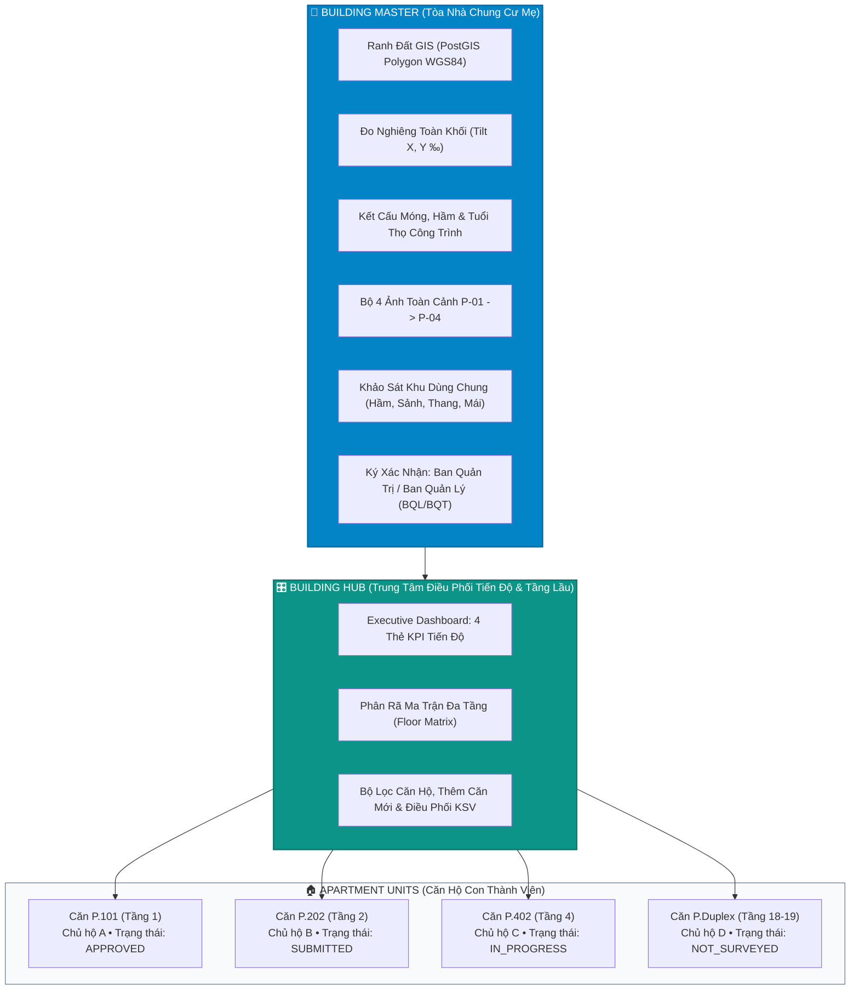

# BỘ ĐẶC TẢ KIẾN TRÚC & QUY TRÌNH TOÀN TRÌNH (E2E): KHẢO SÁT CHUNG CƯ & CÔNG TRÌNH ĐA HỘ
## (CONDOMINIUM & MULTI-UNIT BUILDING CONDITION SURVEY - PHASE 1 & 2)

> **Dự án:** Hệ thống Khảo sát Hiện trạng & Đánh giá Rủi ro Công trình Tuyến Metro Số 2 TP.HCM (Bến Thành – Tham Lương)  
> **Cơ quan Quản lý / Chủ Đầu Tư:** Ban Quản Lý Đường Sắt Đô Thị (MAUR)  
> **Tiêu chuẩn Báo cáo:** Hồ sơ kỹ thuật chuẩn Liên danh CRLG–CRSRI–TT  
> **Mục tiêu kỹ thuật:** Thiết lập kiến trúc hướng đối tượng (OOP Parent-Child Hierarchy), Module hóa Building Hub, biểu mẫu khảo sát căn hộ con tinh gọn (Condo Fast-Survey), máy trạng thái phân cấp và kết xuất 2 mẫu báo cáo pháp lý (Template 2 & Template 3), bảo toàn 100% tính tương thích ngược với hơn 7.000 thửa đất nhà dân (`STANDALONE`).

---

## 1. TỔNG QUAN KIẾN TRÚC & MÔ HÌNH THỰC THỂ (ARCHITECTURE SUMMARY)

Dọc hành lang ảnh hưởng khiên đào TBM Tuyến Metro Số 2 tồn tại nhiều tổ hợp công trình dạng chung cư cao tầng, khu phức hợp thương mại - căn hộ, và đặc biệt là hàng loạt cư xá cũ, chung cư 3–5 tầng được xây dựng từ trước năm 1975 hoặc giai đoạn 1980–1995.

Khác với nhà phố riêng lẻ (1 Thửa đất = 1 Hồ sơ = 1 Chủ hộ), chung cư có đặc thù phân quyền sở hữu phức tạp:
1. **Phần sở hữu chung (Master Building):** Hệ thống móng cọc khoan nhồi / cọc ép, tường vây và sàn tầng hầm, khung kết cấu bê tông cốt thép chịu lực chính, sảnh chính, buồng thang bộ thoát hiểm, hệ thống giếng thang máy, hệ thống PCCC, máy phát điện dự phòng, bể nước ngầm, sân thượng và mái kỹ thuật.
2. **Phần sở hữu riêng (Child Units):** Không gian phòng ốc bên trong từng căn hộ riêng lẻ (Phòng khách, Bếp, Phòng ngủ, Ban công / Logia riêng, WC), hoàn thiện bề mặt (gạch lát, trần thạch cao, tường ngăn) và các khuyết tật cục bộ phát sinh do sử dụng hoặc thấm dột từ tầng trên.

---

## 2. NGUYÊN TẮC KỸ THUẬT BẤT BIẾN (INVARIANT PRINCIPLES)

1. **Nguyên tắc Kế thừa Hướng đối tượng (100% Inheritance Engine):**
   * Căn hộ con kế thừa toàn bộ các chỉ số pháp lý và kết cấu nền tảng từ Tòa nhà mẹ: Toạ độ ranh đất WGS84, cự ly tim hầm Metro, lý trình chainage, hệ móng cọc, tầng hầm, độ nghiêng tổng thể tòa nhà (`buildingTilt`) và hồ sơ hoàn công master.
   * Khảo sát viên tại căn hộ con tuyệt đối **không khảo sát lại móng cọc hoặc đo lại độ nghiêng tổng thể**, giảm thời gian khảo sát từ 35 phút xuống còn **5–8 phút/căn**.
2. **Phân định Trách nhiệm Pháp lý & Đền bù khi xảy ra sự cố:**
   * Hư hỏng kết cấu chịu lực, lún nứt tầng hầm, nghiêng toàn khối $\rightarrow$ Căn cứ vào Báo cáo Master để đền bù/gia cố cho **Ban Quản trị / Quỹ bảo trì chung của tòa nhà**.
   * Nứt tường ngăn, bong tróc trần, vỡ gạch lát, thấm dột bên trong phòng $\rightarrow$ Căn cứ vào Báo cáo Căn hộ con (`UNIT_CHILD`) để bồi thường trực tiếp cho **Chủ sở hữu căn hộ**.
3. **Triệt tiêu 6 Lỗi Hệ thống Cốt lõi (Systemic Faults Prevention):**
   * *Đồng bộ Schema toàn trình:* Áp dụng đúng 7 chốt chặn từ TypeScript Type Contract $\rightarrow$ Migration SQL $\rightarrow$ Repository $\rightarrow$ Zod DTO $\rightarrow$ Zustand Store $\rightarrow$ Report Template $\rightarrow$ E2E Integration Audit.
   * *Bảo vệ bộ nhớ PWA:* Đóng dấu Watermark và chèn Crack Gauge trên Backend Server.
   * *CSS Paged Media:* Ngắt trang thông minh `break-inside: avoid;`, chống vỡ bảng khuyết tật và lưới ảnh khi in PDF.
   * *Bất biến dữ liệu:* Băm SHA-256 sau khi Zone Admin phê duyệt, khóa cứng 100% API sửa đổi.

---

## 3. MỤC LỤC BỘ ĐẶC TẢ CHI TIẾT (SPECIFICATION DIRECTORY)

Bộ tài liệu đặc tả được cấu trúc thành 5 tập chuyên môn hóa:

| Tập Tài Liệu | Đường Dẫn Tệp | Nội Dung Trọng Tâm |
| :--- | :--- | :--- |
| **Tập 1** | [01_E2E_USER_JOURNEY_AND_WORKFLOW.md](./01_E2E_USER_JOURNEY_AND_WORKFLOW.md) | Toàn trình hành trình người dùng (5 chặng: Tiếp cận GIS $\rightarrow$ Khởi tạo Hub $\rightarrow$ Khảo sát Master $\rightarrow$ Khảo sát Unit $\rightarrow$ Thẩm định & Lưu chiểu), kịch bản xử lý chủ hộ vắng mặt, từ chối, căn hộ thông tầng Duplex. |
| **Tập 2** | [02_BUILDING_HUB_AND_INHERITANCE_SPEC.md](./02_BUILDING_HUB_AND_INHERITANCE_SPEC.md) | Đặc tả trung tâm điều phối Building Hub, thanh điều hướng tự ẩn/hiện, 4 thẻ KPI Executive, quản lý đa tầng, tìm kiếm căn hộ tức thì, cơ chế kế thừa dữ liệu OOP và Master Warning Banner. |
| **Tập 3** | [03_CONDO_UNIT_SURVEY_SPEC.md](./03_CONDO_UNIT_SURVEY_SPEC.md) | Đặc tả biểu mẫu 7 bước khảo sát căn hộ con tinh gọn, bộ 4 ảnh căn hộ (`P-01` $\rightarrow$ `P-04`), đo võng cục bộ, ghi nhận thấm dột từ tầng trên, pinning mặt bằng CAD phòng ốc, chữ ký chủ hộ. |
| **Tập 4** | [04_DATABASE_API_AND_STATE_MACHINE.md](./04_DATABASE_API_AND_STATE_MACHINE.md) | Lược đồ CSDL PostgreSQL/PostGIS (`parcels`, `building_units`, `base_survey_reports`), danh mục API Endpoints, Zod DTOs, State Machine vòng đời hồ sơ, cơ chế khóa phiên và bàn giao ca trực. |
| **Tập 5** | [05_REPORT_EXPORT_TEMPLATES_SPEC.md](./05_REPORT_EXPORT_TEMPLATES_SPEC.md) | Quy chuẩn kết xuất Báo cáo PDF theo chuẩn CRLG–CRSRI–TT: Template 2 (Căn hộ con tinh gọn) và Template 3 (Chung cư mẹ & Bundle Ma trận đa tầng tích hợp). |

---

## 4. THUẬT NGỮ CHUẨN HÓA (GLOSSARY)

* **Building Master (`GisParcel` / `BuildingMaster`):** Khối tháp chung cư mẹ đại diện cho thửa đất quy hoạch, mang mã quản lý chuẩn Metro 2 `B-XXXXX-YYY` (VD: `B-00120-POR`, `B-00105-C&C`).
* **Building Unit (`BuildingUnit`):** Căn hộ thành viên trực thuộc tòa nhà mẹ, mang mã định danh mở rộng `B-XXXXX-YYY-U[SốPhòng]` (VD: `B-00120-POR-U402`).
* **Building Hub:** Giao diện điều phối tập trung cấp tòa nhà, quản lý danh sách căn hộ theo tầng và theo dõi tỷ lệ hoàn thành khảo sát.
* **Inheritance Engine:** Bộ máy kế thừa tự động truyền tải các thuộc tính nền tảng của tòa nhà mẹ vào từng căn hộ con mà không yêu cầu nhập liệu lại.
* **Floor Matrix:** Ma trận tổng hợp tiến độ khảo sát và phân loại mức độ an toàn kết cấu theo từng cao trình tầng lầu của khối tháp.
* **Template 2 (Child Unit BCS Report):** Mẫu báo cáo kỹ thuật độc lập dành riêng cho từng căn hộ con, phục vụ đền bù sở hữu riêng.
* **Template 3 (Master Tower & Multi-tier Bundle):** Mẫu báo cáo tổng hợp toàn khối tháp kèm ma trận đa tầng, phục vụ MAUR, Nhà thầu EPC và Ban Quản Trị tòa nhà.
