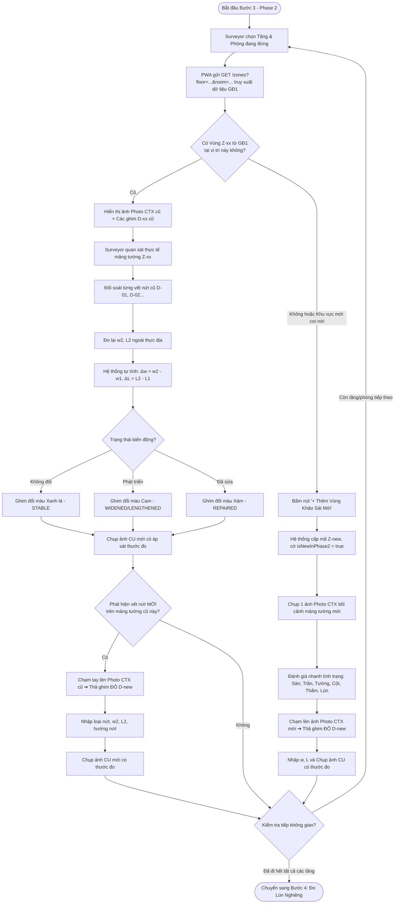
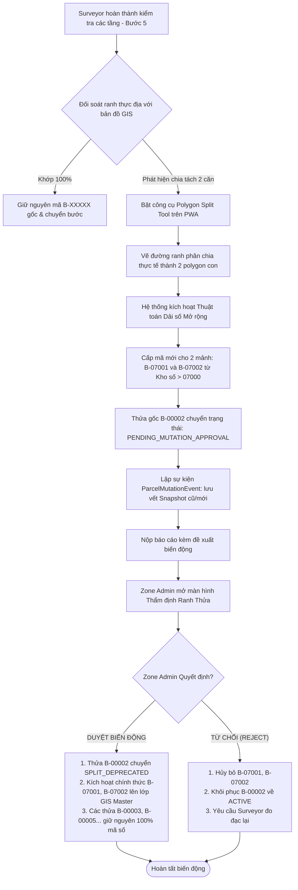
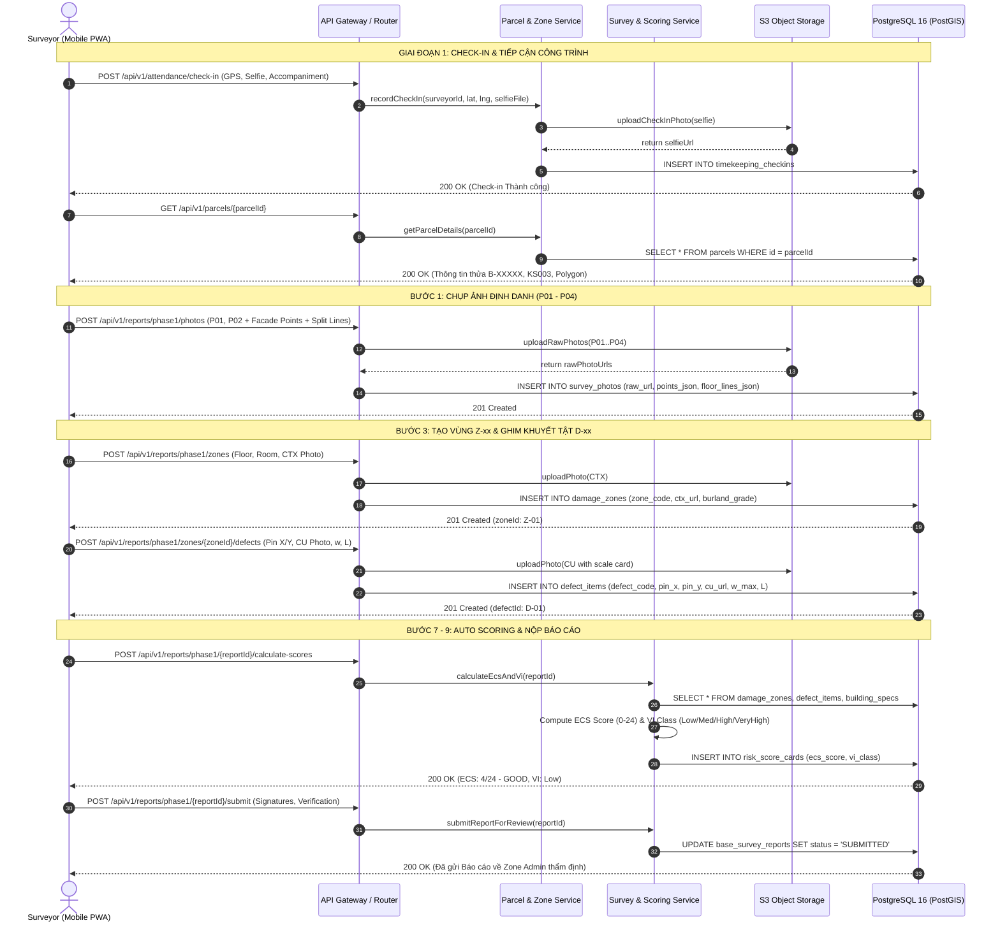
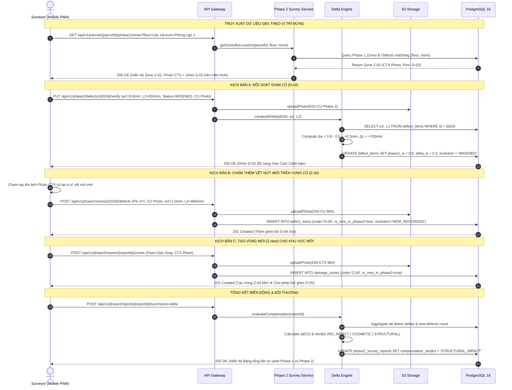
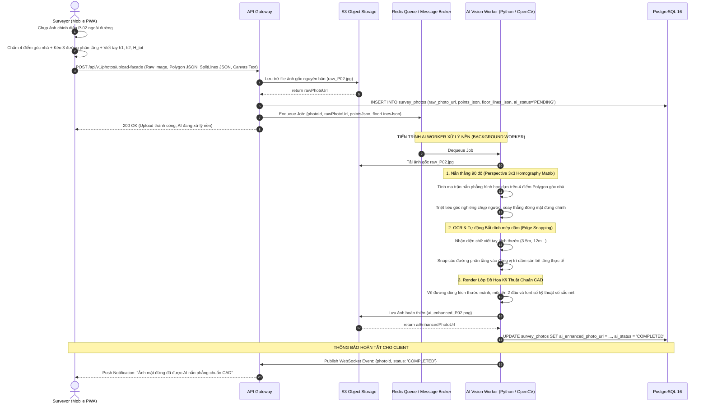
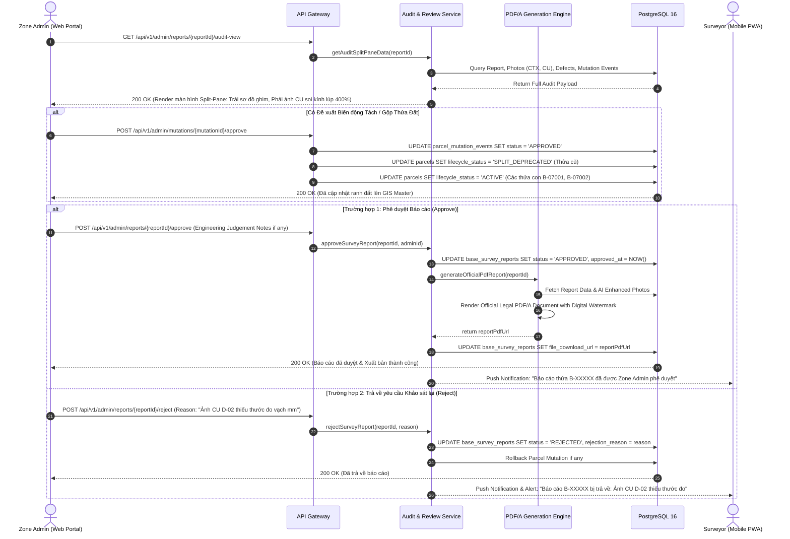
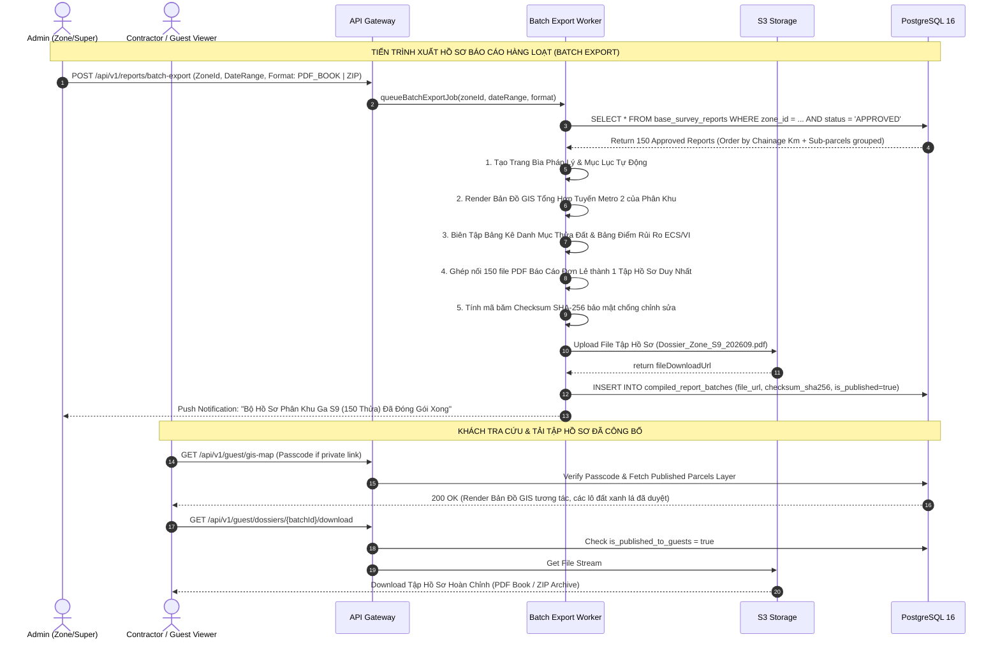

# Đặc Tả Sơ Đồ Hoạt Động & Sơ Đồ Tuần Tự (Activity & Sequence Diagrams)

> **MỤC ĐÍCH:** Tài liệu đặc tả toàn bộ luồng nghiệp vụ động học (**Dynamic Behavioral Modeling**) của Hệ thống Khảo sát Quy hoạch Hiện trạng Công trình Tuyến Metro 2. Bao gồm các **Sơ đồ Hoạt động (Activity Diagrams)** và **Sơ đồ Tuần tự (Sequence Diagrams)** chi tiết nhằm định hướng chính xác kiến trúc luồng dữ liệu, các hàm API, và vòng đời nghiệp vụ trước khi bước vào giai đoạn lập trình (Implementation).

---

## PHẦN 1: SƠ ĐỒ HOẠT ĐỘNG (ACTIVITY DIAGRAMS)

---

### 1.1. ACTIVITY DIAGRAM 1: Vòng Đời Toàn Diện Khảo Sát & Phê Duyệt Hồ Sơ (End-to-End Lifecycle)

Sơ đồ thể hiện luồng phối hợp giữa **Surveyor (Hiện trường)**, **Hệ Thống PWA/Backend**, và **Zone Admin (Văn phòng Thẩm định)**:

```mermaid
stateDiagram-v2
    [*] --> CheckInGPS: Surveyor đến công trình
    
    state "1. Check-in Chấm công" as CheckInGPS {
        [*] --> CaptureSelfie: Bắt tọa độ GPS & Chụp ảnh Selfie
        CaptureSelfie --> EnterWitness: Nhập danh sách người đi cùng
        EnterWitness --> [*]
    }
    
    CheckInGPS --> SelectParcel: Chọn Thửa đất trên bản đồ GIS
    
    state "2. Thực hiện Luồng 9 Bước Thực Địa" as SurveyFlow {
        [*] --> Step1_P01_P04: Bước 1 - Chụp ảnh P01-P04 (Chấm góc nhà + Line cắt tầng)
        Step1_P01_P04 --> Step2_Interview: Bước 2 - Phỏng vấn móng (CAT) & Kết cấu
        Step2_Interview --> Step3_Floors_Defects: Bước 3 - Khảo sát từng tầng & Ghim D-xx
        Step3_Floors_Defects --> Step4_Deformation: Bước 4 - Đo lún nghiêng X/Y
        Step4_Deformation --> Step5_CadastralCheck: Bước 5 - Đối soát ranh thửa GIS
        
        state Step5_CadastralCheck {
            [*] --> CheckBoundary: Kiểm tra ranh thực tế
            CheckBoundary --> SplitOrMerge: Có biến động (Tách/Gộp)?
            SplitOrMerge --> RedrawPolygon: [Có] Bật Polygon Tool vẽ lại ranh
            SplitOrMerge --> KeepBoundary: [Không] Giữ nguyên ranh gốc
            RedrawPolygon --> [*]
            KeepBoundary --> [*]
        }
        
        Step5_CadastralCheck --> Step6_QualityGate: Bước 6 - Cổng kiểm soát chất lượng (Checklist 10 mục)
        
        state Step6_QualityGate {
            [*] --> ValidateRules: Kiểm tra đủ ảnh CTX+CU, thước đo, tọa độ
            ValidateRules --> QualityPass: Đạt chuẩn 10/10 tiêu chí
            ValidateRules --> QualityFail: Thiếu ảnh / Thiếu kích thước
            QualityFail --> [*]: Yêu cầu bổ sung tại chỗ
            QualityPass --> [*]
        }
        
        Step6_QualityGate --> Step7_Scoring: Bước 7 - Auto Scoring ECS/VI (P1) hoặc Tổng kết Delta (P2)
        Step7_Scoring --> Step8_LegalCommitment: Bước 8 - Cam kết pháp lý & Ý kiến chủ hộ
        Step8_LegalCommitment --> Step9_SignOff: Bước 9 - Ký số / Chụp ảnh xác nhận 4 bên
        Step9_SignOff --> [*]
    }
    
    SurveyFlow --> SubmitReport: Bấm "Nộp Báo Cáo" (SUBMITTED)
    
    SubmitReport --> ZoneAdminAudit: Zone Admin mở Split-Pane thẩm định
    
    state "3. Thẩm Định & Ra Quyết Định" as ZoneAdminAudit {
        [*] --> ReviewDetails: Soi kính lúp 400% ảnh CU có thước
        ReviewDetails --> CheckMutation: Có biến động ranh đất?
        CheckMutation --> ApproveMutation: [Có] Duyệt đa giác ranh mới
        CheckMutation --> DirectReview: [Không]
        ApproveMutation --> DirectReview
        
        DirectReview --> DecisionFork: Quyết định thẩm định
        DecisionFork --> ApproveReport: ĐẠT ➔ Phê duyệt Báo cáo (APPROVED)
        DecisionFork --> RejectReport: KHÔNG ĐẠT ➔ Trả về (REJECTED)
        
        ApproveReport --> FreezeData: Đóng băng dữ liệu & Sinh PDF/A có chữ ký số
        RejectReport --> RollbackData: Rollback ranh đất & Mở quyền sửa cho Surveyor
    }
    
    RollbackData --> SurveyFlow: Surveyor nhận thông báo sửa đổi
    FreezeData --> PublishedToContractor: Công bố cho Contractor / Xuất báo cáo hàng loạt
    PublishedToContractor --> [*]
```

---

### 1.2. ACTIVITY DIAGRAM 2: Luồng Khảo Sát Phase 2 Theo Vị Trí Đứng & Mở Rộng Khuyết Tật

Sơ đồ mô tả chi tiết cơ chế thông minh tại **Bước 3 của Phase 2**: Tự động lọc khuyết tật theo vị trí đứng, đối soát biến động $\Delta w, \Delta L$ và mở rộng khu vực mới:

---

### 1.3. ACTIVITY DIAGRAM 3: Quy Trình Xử Lý Biến Động Thửa Đất & Dải Số Mở Rộng Bất Biến

Sơ đồ giải quyết bài toán chống xô lệch ID khi phát sinh tách/gộp thửa ngoài thực địa:

---

## PHẦN 2: SƠ ĐỒ TUẦN TỰ (SEQUENCE DIAGRAMS)

---

### 2.1. SEQUENCE DIAGRAM 1: Luồng Khảo Sát Hiện Trường Phase 1 (Baseline Survey Flow)

---

### 2.2. SEQUENCE DIAGRAM 2: Luồng Khảo Sát Phase 2 Theo Vị Trí Đứng & Đối Soát Delta

---

### 2.3. SEQUENCE DIAGRAM 3: Đường Ống Xử Lý Ảnh AI Nắn Thẳng Mặt Đứng (AI Facade Rectification Pipeline)

---

### 2.4. SEQUENCE DIAGRAM 4: Thẩm Định Báo Cáo Split-Pane & Ra Quyết Định (Zone Admin Audit & Approval)

---

### 2.5. SEQUENCE DIAGRAM 5: Xuất Bộ Hồ Sơ Hàng Loạt & Tra Cứu Khách (Batch Compilation & Guest Access)

---

## 3. DANH MỤC CÁC API ENDPOINTS ĐƯỢC CHUẨN HÓA TỪ SEQUENCE DIAGRAMS

| STT | Phương thức | Endpoint API | Chức năng nghiệp vụ | Tác nhân chính |
| :---: | :---: | :--- | :--- | :--- |
| 1 | `POST` | `/api/v1/attendance/check-in` | Check-in chấm công GPS + Ảnh Selfie | `SURVEYOR` |
| 2 | `GET` | `/api/v1/parcels/{parcelId}` | Lấy chi tiết thửa đất & polygon ranh | `SURVEYOR`, `ZONE_ADMIN` |
| 3 | `POST` | `/api/v1/reports/phase1/photos` | Upload ảnh P01-P04 + Chấm góc + Phân tầng | `SURVEYOR` |
| 4 | `POST` | `/api/v1/reports/phase1/zones` | Tạo Vùng khảo sát $Z-xx$ + Ảnh bối cảnh CTX | `SURVEYOR` |
| 5 | `POST` | `/api/v1/reports/phase1/zones/{id}/defects` | Thả ghim $D-xx$ + Ảnh cận cảnh CU có thước | `SURVEYOR` |
| 6 | `GET` | `/api/v1/parcels/{id}/phase2/zones` | Tự động lọc Vùng & Khuyết tật theo Tầng/Phòng | `SURVEYOR` (Phase 2) |
| 7 | `PUT` | `/api/v1/phase2/defects/{id}/verify` | Đối soát vết nứt cũ ($\Delta w, \Delta L$, trạng thái) | `SURVEYOR` (Phase 2) |
| 8 | `POST` | `/api/v1/reports/{id}/calculate-scores` | Tính điểm tự động ECS/24, VI, và $\Delta ECS$ | Hệ thống tự động |
| 9 | `POST` | `/api/v1/mutations/propose` | Đề xuất biến động tách/gộp thửa đất ranh GIS | `SURVEYOR` |
| 10 | `GET` | `/api/v1/admin/reports/{id}/audit-view` | Lấy dữ liệu đối soát Split-Pane kính lúp 400% | `ZONE_ADMIN` |
| 11 | `POST` | `/api/v1/admin/reports/{id}/approve` | Phê duyệt Báo cáo & Sinh PDF/A chính thức | `ZONE_ADMIN` |
| 12 | `POST` | `/api/v1/admin/reports/{id}/reject` | Trả về báo cáo kèm lý do cần khảo sát lại | `ZONE_ADMIN` |
| 13 | `POST` | `/api/v1/reports/batch-export` | Đóng gói xuất Báo cáo Hàng loạt (PDF Book/ZIP) | `ZONE_ADMIN`, `SUPER_ADMIN` |
| 14 | `GET` | `/api/v1/guest/gis-map` | Xem bản đồ quy hoạch GIS công khai cho khách | `CONTRACTOR/GUEST` |
