# Đặc Tả Chi Tiết Sơ Đồ Hoạt Động Theo Từng Đối Tượng (Activity Diagrams Specification)

> [!IMPORTANT]
> **LƯU Ý DÀNH CHO AI AGENT & DEVELOPER (TÀI LIỆU ĐANG TIẾP TỤC HOÀN THIỆN & MỞ RỘNG):**
> Tài liệu này là **bản đặc tả cơ sở (Baseline Specification)** nhằm định hướng luồng nghiệp vụ cốt lõi ban đầu. Tài liệu **CHƯA PHẢI LÀ BẢN ĐẦY ĐỦ 100% TUYỆT ĐỐI** và sẽ tiếp tục được bổ sung, đào sâu chi tiết trong quá trình code và phát triển sản phẩm. Khi triển khai code thực tế, Agent/Developer cần nắm vững rằng hệ thống sẽ phát sinh thêm các nhánh xử lý biên (Edge cases), tính năng mở rộng và cần chủ động hoàn thiện cả code lẫn cập nhật ngược lại tài liệu này.

> **MỤC ĐÍCH:** Tài liệu đặc tả chi tiết toàn bộ luồng hoạt động (**UML Activity Diagrams**) được phân chia rõ ràng theo từng đối tượng người dùng (**Actor / Role**): `SURVEYOR`, `ZONE_ADMIN`, `SUPER_ADMIN`, và `CONTRACTOR_GUEST`. Bám sát 100% các kịch bản sử dụng (Use Cases) trong `srs/ROLES_AND_USE_CASES.md`.

---

## 1. PHÂN HỆ CÁN BỘ KHẢO SÁT HIỆN TRƯỜNG (`SURVEYOR`)

---

### 1.1. Activity 1.1: Check-in Chấm Công & Bắt Tọa Độ GPS Hiện Trường (UC-02)

```mermaid
flowchart TD
    Start([Surveyor bắt đầu ngày làm việc]) --> OpenPWA[Mở ứng dụng Mobile PWA]
    OpenPWA --> ClickCheckin[Bấm 'Check-in Chấm Công Hiện Trường']
    ClickCheckin --> GetGPS[Thiết bị tự động lấy toạ độ GPS & Độ chính xác Accuracy]
    
    GetGPS --> CheckAccuracy{Độ chính xác GPS<br>có đạt chuẩn (<= 20m)?}
    CheckAccuracy -- Không --> ShowGpsWarning[Cảnh báo tín hiệu GPS yếu / Bật độ chính xác cao]
    ShowGpsWarning --> GetGPS
    
    CheckAccuracy -- Đạt chuẩn --> TakeSelfie[Chụp ảnh Selfie hiện trường có dập Watermark GPS & Giờ thực]
    TakeSelfie --> EnterMembers[Nhập danh sách cán bộ / nhân sự đi cùng]
    EnterMembers --> EnterNotes[Nhập ghi chú thời tiết / điều kiện thực địa nếu có]
    EnterNotes --> SubmitCheckin[Bấm 'Gửi Chấm Công']
    
    SubmitCheckin --> SyncServer[Gửi dữ liệu về Server ghi vào bảng timekeeping_checkins]
    SyncServer --> ShowSuccess[Hiển thị thông báo Chấm công Thành công]
    ShowSuccess --> EndCheckin([Chuyển sang Màn hình Danh sách Thửa Đất / Bản đồ GIS])
```

---

### 1.2. Activity 1.2: Luồng Khảo Sát Hiện Trường Giai Đoạn 1 (Phase 1 Baseline - 9 Bước Thực Địa)

```mermaid
flowchart TD
    StartP1([Bắt đầu Khảo sát Giai đoạn 1]) --> SelectParcel[Chọn Thửa đất B-XXXXX trên Bản đồ GIS]
    
    %% BƯỚC 1
    SelectParcel --> Step1[BƯỚC 1: Tiếp cận ngoài nhà & Chụp 4 ảnh định danh P01-P04]
    Step1 --> CheckNA{Công trình có đủ 4 mặt?}
    CheckNA -- Thiếu mặt hông/biển số --> TickNA[Tick chọn 'Không tồn tại (N/A)' & Nhập lý do]
    CheckNA -- Đủ ảnh --> SnapP02[Chụp ảnh mặt tiền P-02]
    TickNA --> SnapP02
    SnapP02 --> CanvasAnnotate[Chấm 4 điểm đa giác góc nhà + Kéo line phân tầng + Viết tay kích thước h1, h2, Htot, W]
    
    %% BƯỚC 2
    CanvasAnnotate --> Step2[BƯỚC 2: Phỏng vấn chủ hộ]
    Step2 --> EnterSpecs[Nhập thông tin kết cấu, số tầng, năm xây dựng]
    EnterSpecs --> ScoreCAT[Đánh giá thông tin móng CAT 1-5 & Lịch sử sự cố E5]
    
    %% BƯỚC 3
    ScoreCAT --> Step3[BƯỚC 3: Khảo sát chi tiết từng tầng & Mảng tường]
    Step3 --> LoopFloors[Đi từ Tầng trệt lên Tầng mái]
    LoopFloors --> SnapCTX[Chụp 1 ảnh bối cảnh Photo CTX ➔ Tạo Vùng Z-01, Z-02...]
    SnapCTX --> SetBurland[Chốt điểm Burland Grade 0-5 cho Vùng]
    SetBurland --> PinDefects[Chạm ngón tay lên ảnh Photo CTX để thả ghim D-01, D-02...]
    PinDefects --> SnapCU[Bấm vào từng ghim: Nhập w, L & Chụp ảnh cận cảnh CU có áp sát thước đo mm]
    SnapCU --> MoreZones{Còn mảng tường/phòng khác?}
    MoreZones -- Còn --> LoopFloors
    
    %% BƯỚC 4
    MoreZones -- Hết --> Step4[BƯỚC 4: Đo đạc Lún - Nghiêng - Biến dạng]
    Step4 --> MeasureTilt[Đo tỉ lệ nghiêng mặt trước X%, mặt hông Y%, nghiêng sàn%, võng dầm mm]
    
    %% BƯỚC 5
    MeasureTilt --> Step5[BƯỚC 5: Xác nhận phạm vi & Đối soát ranh thửa GIS]
    Step5 --> CheckBoundary{Ranh thực tế có biến động?}
    CheckBoundary -- Có chia tách / Gộp --> RedrawGIS[Bật Polygon Tool vẽ lại ranh ➔ Hệ thống cấp mã B-XXXXX từ dải số mở rộng]
    CheckBoundary -- Khớp ranh --> KeepGIS[Giữ nguyên ranh gốc]
    RedrawGIS --> Step6
    KeepGIS --> Step6
    
    %% BƯỚC 6 & 7
    Step6[BƯỚC 6: Cổng kiểm soát chất lượng Quality Gate] --> Check10Items{Hệ thống quét 10/10 tiêu chí?}
    Check10Items -- Thiếu ảnh CU có thước / Thiếu tọa độ --> PromptFix[Báo đỏ mục thiếu ➔ Bổ sung ngay tại chỗ]
    PromptFix --> Step6
    Check10Items -- Đạt chuẩn 10/10 --> Step7[BƯỚC 7: Hệ thống Tự động Tính Điểm ECS/24 & Phân nhóm Rủi ro VI]
    
    %% BƯỚC 8 & 9
    Step7 --> Step8[BƯỚC 8: Cam kết pháp lý mẫu & Ghi nhận ý kiến chủ hộ]
    Step8 --> Step9[BƯỚC 9: Ký tên xác nhận 4 bên / Chụp ảnh chữ ký trên biên bản giấy]
    Step9 --> SubmitReport[Bấm 'NỘP BÁO CÁO' ➔ Trạng thái chuyển sang SUBMITTED]
    SubmitReport --> EndP1([Hoàn tất khảo sát GĐ1])
```

---

### 1.3. Activity 1.3: Luồng Khảo Sát Giai Đoạn 2 Theo Vị Trí Đứng & Mở Rộng Khuyết Tật (Phase 2 Pre-Construction Delta)

```mermaid
flowchart TD
    StartP2([Surveyor mở Báo cáo Phase 2 của thửa B-XXXXX]) --> AutoSync[Hệ thống tự động đồng bộ toàn bộ dữ liệu GĐ1]
    AutoSync --> Step1_P2[BƯỚC 1: Xác nhận thông tin chung GĐ2, Đoạn thi công, Chụp ảnh P01-P02]
    Step1_P2 --> Step2_P2[BƯỚC 2: Phỏng vấn biến động sau GĐ1: cơi nới, sửa chữa, thay đổi tải trọng]
    
    %% BƯỚC 3 - PHASE 2
    Step2_P2 --> Step3_P2[BƯỚC 3: Khảo sát khuyết tật theo Vị trí đứng thực tế]
    Step3_P2 --> SelectLoc[Chọn Tầng & Phòng đang đứng thực tế]
    SelectLoc --> FetchP1Zones[PWA tự động GET danh sách Vùng Z-xx của GĐ1 tại phòng này]
    
    FetchP1Zones --> ZoneBranch{Vị trí đang đứng là Vùng cũ hay Khu vực mới?}
    
    %% NHÁNH A: VÙNG HIỆN HỮU
    ZoneBranch -- Vùng hiện hữu Z cũ --> OpenExistingZ[Mở ảnh Photo CTX cũ + Các ghim D cũ màu vàng]
    OpenExistingZ --> InspectOldPins[Chạm từng ghim cũ D-01, D-02...]
    InspectOldPins --> ReMeasure[Đo lại w2, L2 ngoài hiện trường]
    ReMeasure --> CalcDelta[Hệ thống tính: Δw = w2 - w1, ΔL = L2 - L1]
    CalcDelta --> PickStatus{Trạng thái biến động?}
    PickStatus -- Không đổi --> SetGreen[Ghim chuyển màu XANH LÁ]
    PickStatus -- Rộng/Dài thêm --> SetOrange[Ghim chuyển màu CAM CẢNH BÁO]
    PickStatus -- Đã trám bả --> SetGray[Ghim chuyển màu XÁM]
    SetGreen --> SnapCU2[Chụp ảnh CU Phase 2 có thước đo mm]
    SetOrange --> SnapCU2
    SetGray --> SnapCU2
    
    SnapCU2 --> CheckNewOnExisting{Có vết nứt MỚI phát sinh<br>trên mảng tường cũ này?}
    CheckNewOnExisting -- Có --> PinNewOnOld[Chạm tay lên ảnh Photo CTX cũ ➔ Thả ghim ĐỎ D-new]
    PinNewOnOld --> InputNewSpec[Nhập w2, L2, hướng nứt & Chụp ảnh CU có thước]
    InputNewSpec --> NextLocationCheck
    CheckNewOnExisting -- Không --> NextLocationCheck
    
    %% NHÁNH B: KHU VỰC MỚI XUẤT HIỆN
    ZoneBranch -- Khu vực mới cơi nới/mới mở cửa --> ClickNewZ[Bấm '+ Thêm Vùng Khảo Sát Mới']
    ClickNewZ --> GenZNew[Cấp mã Z-new, gán cờ isNewInPhase2 = true]
    GenZNew --> SnapNewCTX[Chụp ảnh Photo CTX bối cảnh mảng tường mới]
    SnapNewCTX --> QuickCheck[Đánh giá nhanh tình trạng cấu kiện sàn/trần/tường/cột/lún]
    QuickCheck --> PinNewOnNew[Chạm lên ảnh Photo CTX mới ➔ Thả các ghim ĐỎ D-new]
    PinNewOnNew --> SnapCUNewZ[Nhập w, L & Chụp ảnh CU có thước đo]
    SnapCUNewZ --> NextLocationCheck
    
    NextLocationCheck{Còn tầng / phòng khác?}
    NextLocationCheck -- Còn --> SelectLoc
    NextLocationCheck -- Hết các phòng --> Step4_P2[BƯỚC 4: Đo đạc biến dạng lún nghiêng ΔX, ΔY so với GĐ1]
    
    Step4_P2 --> Step5_P2[BƯỚC 5: Đối soát ranh thửa GIS nếu có xây lấn ranh]
    Step5_P2 --> Step6_P2[BƯỚC 6: Kiểm tra 10 tiêu chí Checklist Phụ lục A]
    Step6_P2 --> Step7_P2[BƯỚC 7: Tự động tổng hợp số lượng khuyết tật & Đề xuất Quan trắc / NDT]
    Step7_P2 --> Step8_P2[BƯỚC 8: Cam kết pháp lý mẫu chuẩn Phiếu 02 & Ý kiến chủ hộ]
    Step8_P2 --> Step9_P2[BƯỚC 9: Ký số / Chụp ảnh xác nhận 4 bên tại hiện trường]
    Step9_P2 --> SubmitP2[Bấm 'NỘP BÁO CÁO PHASE 2' ➔ Chờ duyệt]
    SubmitP2 --> EndP2([Hoàn tất khảo sát GĐ2])
```



---

## 2. PHÂN HỆ QUẢN TRỊ PHÂN KHU (`ZONE_ADMIN`)

---

### 2.1. Activity 2.1: Phân Công Nhiệm Vụ Khảo Sát Trên Bản Đồ GIS (Task Dispatching - UC-01)

```mermaid
flowchart TD
    StartZA([Zone Admin đăng nhập Web Portal]) --> OpenZoneMap[Mở Bản đồ Phân khu được phân công phụ trách]
    OpenZoneMap --> FilterParcels[Lọc các thửa đất theo trạng thái: Chưa khảo sát / Cần khảo sát Phase 2]
    FilterParcels --> SelectParcels[Chọn danh sách 1 hoặc nhiều thửa đất trên bản đồ GIS]
    SelectParcels --> OpenAssignModal[Bấm 'Phân Công Khảo Sát']
    OpenAssignModal --> PickSurveyor[Chọn Cán bộ Khảo sát (Surveyor) phụ trách]
    PickSurveyor --> SetDeadline[Thiết lập Hạn chót hoàn thành (Deadline) & Ghi chú nhiệm vụ]
    SetDeadline --> DispatchTask[Bấm 'Xác Nhận Giao Việc']
    DispatchTask --> SaveDB[Hệ thống ghi dữ liệu vào bảng task_assignments]
    SaveDB --> PushNotification[Gửi thông báo Push Notification tới điện thoại của Surveyor]
    PushNotification --> EndTask([Hoàn tất phân công])
```

---

### 2.2. Activity 2.2: Thẩm Định Hồ Sơ Báo Cáo Qua Màn Hình Split-Pane (Split-Pane Audit & Approval - UC-04)

```mermaid
flowchart TD
    StartAudit([Zone Admin mở danh sách Báo cáo chờ duyệt - PENDING_REVIEW]) --> SelectReport[Chọn 1 Báo cáo của thửa B-XXXXX]
    SelectReport --> RenderSplitPane[Hệ thống mở Giao diện Chia đôi Đối soát Split-Pane]
    
    RenderSplitPane --> LeftPane[NỬA TRÁI: Xem Thông tin móng CAT, Sơ đồ phác thảo có ghim D-xx]
    RenderSplitPane --> RightPane[NỬA PHẢI: Xem Cặp ảnh CTX bối cảnh + Ảnh cận cảnh CU]
    
    RightPane --> HoverMagnifier[Rê chuột kích hoạt KÍNH LÚP 400% soi vạch mm trên thước đo]
    
    LeftPane --> CheckMutationEvent{Có đề xuất Biến động Tách / Gộp thửa đất không?}
    CheckMutationEvent -- Có biến động --> OpenMutationTab[Mở Tab So sánh Đa giác Ranh đất Cũ vs Mới]
    OpenMutationTab --> DecideMutation{Duyệt ranh mới?}
    DecideMutation -- Đồng ý --> ApproveMut[Bấm 'Duyệt Biến Động Thửa' ➔ Cập nhật GIS Master]
    DecideMutation -- Không đồng ý --> RejectMut[Bấm 'Bác Bỏ Biến Động' ➔ Giữ ranh cũ]
    ApproveMut --> ReviewScores
    RejectMut --> ReviewScores
    CheckMutationEvent -- Không biến động --> ReviewScores[Xem điểm số tự động ECS/24, VI hoặc Biến động Delta]
    
    ReviewScores --> NeedJudgement{Có cần can thiệp Kỹ sư (Engineering Judgement)?}
    NeedJudgement -- Có --> InputDeltaScore[Nhập điểm điều chỉnh +/- kèm lý do kỹ thuật bắt buộc]
    NeedJudgement -- Không --> FinalAuditDecision
    InputDeltaScore --> FinalAuditDecision{Quyết định Thẩm định Báo cáo?}
    
    %% NHÁNH DUYỆT
    FinalAuditDecision -- PHÊ DUYỆT (Phím tắt 'A') --> ClickApprove[Bấm 'Phê Duyệt Báo Cáo']
    ClickApprove --> UpdateApproved[Cập nhật status = 'APPROVED']
    UpdateApproved --> TriggerPdfEngine[Kích hoạt Engine sinh Báo cáo PDF/A chính thức có chữ ký số]
    TriggerPdfEngine --> NotifySurveyorPass[Gửi thông báo chúc mừng tới Surveyor]
    NotifySurveyorPass --> EndAudit([Báo cáo đã xuất bản])
    
    %% NHÁNH TRẢ VỀ
    FinalAuditDecision -- TRẢ VỀ (Phím tắt 'R') --> ClickReject[Bấm 'Trả Về Yêu Cầu Khảo Sát Lại']
    ClickReject --> EnterRejectReason[Bắt buộc nhập Lý do trả về: VD 'Ảnh CU D-02 thiếu thước đo']
    EnterRejectReason --> RollbackState[Hệ thống Rollback dữ liệu & chuyển status = 'REJECTED']
    RollbackState --> NotifySurveyorFail[Gửi cảnh báo và yêu cầu sửa đổi tới điện thoại Surveyor]
    NotifySurveyorFail --> EndAudit
```

---

### 2.3. Activity 2.3: Đóng Gói & Xuất Bộ Hồ Sơ Báo Cáo Phân Khu Hàng Loạt (Batch Dossier Export - UC-06)

```mermaid
flowchart TD
    StartExport([Zone Admin truy cập mục 'Xuất Báo Cáo Hàng Loạt']) --> SelectScope[Chọn Phân khu / Nhà ga phụ trách (VD: Phân khu Ga S9 Bà Quẹo)]
    SelectScope --> PickDateRange[Lựa chọn Khoảng thời gian: Từ ngày... Đến ngày...]
    PickDateRange --> ChooseFormat[Chọn Định dạng xuất: PDF Book Compilation hoặc ZIP Archive]
    ChooseFormat --> ClickStartExport[Bấm 'Khởi Tạo Đóng Gói Hồ Sơ']
    
    ClickStartExport --> QueryApprovedReports[Hệ thống lọc toàn bộ các Báo cáo đã APPROVED trong phạm vi]
    QueryApprovedReports --> AutoSorting[Thuật toán sắp xếp tuần tự theo lý trình Km và Gom nhóm thửa phụ sinh do tách]
    
    AutoSorting --> BuildMasterTOC[1. Tự động sinh Trang bìa & Mục lục điện tử]
    BuildMasterTOC --> RenderGisOverview[2. Render Bản đồ GIS Phân khu tổng hợp vị trí các thửa]
    RenderGisOverview --> BuildParcelsTable[3. Lập Bảng kê danh mục thửa đất & Bảng điểm rủi ro ECS/VI]
    BuildParcelsTable --> MergeSinglePdfs[4. Ghép nối toàn bộ các file PDF báo cáo đơn lẻ thành 1 Tập Hồ Sơ Duy Nhất]
    MergeSinglePdfs --> CalcHash[5. Sinh mã băm kiểm tra tính toàn vẹn SHA-256]
    
    CalcHash --> SaveBatchDB[Lưu bản ghi vào bảng compiled_report_batches]
    SaveBatchDB --> UploadS3[Tải file hoàn chỉnh lên Object Storage S3]
    UploadS3 --> PushReadyNotice[Gửi thông báo: 'Tập hồ sơ 150 thửa đất đã đóng gói xong']
    PushReadyNotice --> DownloadOrPublish[Cho phép Tải về máy hoặc Bật cờ Công bố cho Nhà thầu Contractor]
    DownloadOrPublish --> EndExport([Hoàn tất xuất báo cáo])
```

---

## 3. PHÂN HỆ TỔNG QUẢN TRỊ TOÀN TUYẾN (`SUPER_ADMIN`)

---

### 3.1. Activity 3.1: Quản Trị Hệ Thống, Lớp Bản Đồ GIS & Phân Quyền Người Dùng

```mermaid
flowchart TD
    StartSA([Super Admin đăng nhập Web Master Portal]) --> ChooseMenu{Chọn chức năng quản trị?}
    
    %% Quản lý Người dùng
    ChooseMenu -- Quản lý Tài khoản --> OpenUserMgmt[Xem Danh sách Người dùng toàn hệ thống]
    OpenUserMgmt --> UserAction{Thao tác tài khoản?}
    UserAction -- Tạo mới --> InputUserData[Nhập họ tên, email, chức vụ, gán vai trò Role & Phân khu Zone]
    UserAction -- Khóa tài khoản --> ToggleLock[Chuyển trạng thái sang LOCKED ➔ Thu hồi quyền truy cập]
    InputUserData --> SaveUser[Lưu vào bảng users]
    ToggleLock --> SaveUser
    SaveUser --> EndSA
    
    %% Quản lý GIS Layers
    ChooseMenu -- Quản lý Lớp GIS Tuyến Metro 2 --> OpenGisMgmt[Mở Bản đồ Master GIS]
    OpenGisMgmt --> UploadGeoJson[Tải lên file GeoJSON mới: Tim tuyến, Ranh giải phóng mặt bằng, Vị trí 11 Nhà ga]
    UploadGeoJson --> ValidateGeometry[Hệ thống kiểm tra tính hợp lệ của toạ độ WGS84 / VN-2000]
    ValidateGeometry --> UpdateGisLayer[Cập nhật lớp dữ liệu GIS Master cho toàn hệ thống]
    UpdateGisLayer --> EndSA
    
    %% Giám sát & Audit Log
    ChooseMenu -- Giám sát & Nhật ký Kiểm toán --> OpenAuditLog[Xem Bảng Master Audit Logs]
    OpenAuditLog --> FilterAudit[Lọc theo Cán bộ, Thời gian, Hành vi: Đăng nhập, Duyệt, Trả về, Sửa đổi]
    FilterAudit --> ExportAuditExcel[Xuất file Excel báo cáo kiểm toán phục vụ thanh tra]
    ExportAuditExcel --> EndSA
    
    %% Xuất Hồ Sơ Toàn Tuyến
    ChooseMenu -- Xuất Hồ Sơ Toàn Tuyến --> OpenMasterExport[Chọn phạm vi Toàn bộ Tuyến Metro 2 (Ga S1 - Ga S11)]
    OpenMasterExport --> ExecMasterCompilation[Hệ thống kích hoạt Worker đóng gói Tập Báo cáo Toàn Tuyến]
    ExecMasterCompilation --> EndSA([Hoàn tất])
```

---

## 4. PHÂN HỆ NHÀ THẦU THI CÔNG & KHÁCH TRA CỨU (`CONTRACTOR_GUEST`)

---

### 4.1. Activity 4.1: Tra Cứu Bản Đồ GIS Quy Hoạch & Tải Tập Hồ Sơ Đã Công Bố (UC-05 & UC-06)

```mermaid
flowchart TD
    StartGuest([Nhà thầu / Khách truy cập vào đường link được chia sẻ]) --> CheckPasscode{Link có yêu cầu Mật mã bảo mật (Passcode)?}
    
    CheckPasscode -- Có --> EnterCode[Nhập Passcode 6 ký tự do Ban Dự án cấp]
    EnterCode --> VerifyCode{Passcode chính xác?}
    VerifyCode -- Sai --> ShowCodeError[Báo lỗi mật mã không đúng]
    ShowCodeError --> EnterCode
    VerifyCode -- Đúng --> RenderGuestGIS
    
    CheckPasscode -- Không (Public Link) --> RenderGuestGIS[Hiển thị Bản đồ GIS tương tác Tuyến Metro 2]
    
    RenderGuestGIS --> BrowseParcels[Quan sát các thửa đất với màu sắc trạng thái: Xanh lá = Đã duyệt, Vàng = Đang khảo sát]
    BrowseParcels --> ClickParcel[Nhấp chuột vào 1 thửa đất cụ thể trên bản đồ]
    
    ClickParcel --> ShowOverviewModal[Hiển thị Modal Tổng quan: Mã B-XXXXX, Địa chỉ, Chủ hộ, Cấp rủi ro VI]
    ShowOverviewModal --> GuestAction{Thao tác của Khách?}
    
    GuestAction -- Xem Báo cáo Đơn lẻ --> ViewSingleReport[Đọc trực tuyến Báo cáo Hiện trạng PDF/A có chữ ký số]
    ViewSingleReport --> DownloadSinglePdf[Tải file PDF báo cáo của thửa đất này]
    
    GuestAction -- Tải Tập Hồ Sơ Phân Khu --> OpenDossierList[Mở danh sách các Tập Hồ Sơ Đã Công Bố (Published Dossiers)]
    OpenDossierList --> DownloadFullBatch[Tải trọn bộ Tập Hồ Sơ (PDF Book / ZIP Archive) kèm Sơ đồ GIS & Bảng kê]
    
    DownloadSinglePdf --> EndGuest([Hoàn tất tra cứu])
    DownloadFullBatch --> EndGuest
```
