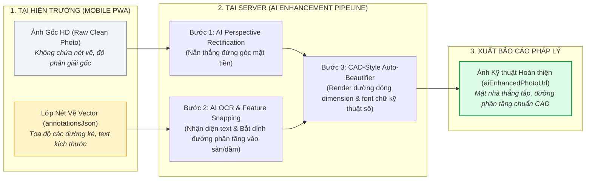

# Quy Tắc Nghiệp Vụ Hệ Thống (Business Logic Specification)

> Tài liệu đặc tả các Quy tắc Nghiệp vụ cốt lõi, Kiến trúc Mã kép Dual-ID, Cơ chế Quản lý Biến động Thửa đất, Bộ máy Tính điểm Kỹ thuật (ECS/VI), Quy trình Xuất Báo cáo Hàng loạt, và **Kiến trúc Lưu trữ Ảnh Phân lớp Tích hợp AI Nắn thẳng Phối cảnh & Chuẩn hóa Kích thước Mặt đứng**.

---

## 1. KIẾN TRÚC MÃ KÉP (DUAL-ID ARCHITECTURE) & CƠ CHẾ CẤP MÃ BẤT BIẾN `B-XXXXX`

### 1.1. Kiến trúc Định danh Kép cho Thửa Đất (Dual-ID System)
Mỗi thửa đất trong hệ thống được định danh đồng thời bởi **2 Mã (Dual-ID)** phục vụ 2 mục đích riêng biệt:

1. **`officialCadastralCode` (Mã Địa chính Gốc / Dữ liệu KS003):**
   - Mã định danh địa chính nhà nước thu thập từ dữ liệu cào ban đầu (`data/KS003`) hoặc thông tin Số tờ - Số thửa bản đồ địa chính của Bộ TN&MT (VD: `KS003-P1024`, `Tờ 15 - Thửa 89`).
   - Giúp đối soát và bảo đảm giá trị pháp lý với cơ sở dữ liệu đất đai của Nhà nước khi bàn giao đền bù giải phóng mặt bằng.

2. **`projectParcelCode` (Mã Quản lý Dự án Tuyến Metro 2 - `B-XXXXX`):**
   - Mã số được hệ thống sắp xếp (sort) tuần tự theo lý trình tim tuyến Metro 2 từ Ga S1 đến Ga S11 (từ `B-00001` đến `B-07000`) để phục vụ quản lý dự án, phân công task cho Surveyor và kiểm soát tiến độ khảo sát.
   - Kiểm soát biến động thực địa (Tách / Gộp thửa) theo cơ chế Dải số Phát sinh Mở rộng.

---

### 1.2. Nguyên tắc Bất biến của Mã Dự Án `B-XXXXX` (Immutability Principle)
- **Định dạng chuẩn:** Mã công trình/thửa đất cố định theo quy chuẩn **`B-XXXXX`** (Tiền tố `B-` và đúng 5 chữ số từ `B-00001` đến `B-99999`).
- **Nguyên tắc cốt lõi:** Khi một mã `B-XXXXX` đã được cấp phát và xuất Báo cáo Khảo sát gửi đi, mã này là **MÃ BẤT BIẾN (IMMUTABLE)**.
- **Quy tắc cấm:** Tuyệt đối **KHÔNG ĐƯỢC PHÉP chèn số vào giữa (Insert In-between)** làm tịnh tiến đẩy số $+1$ các thửa phía sau.

---

### 1.3. Cơ chế Dải số Phát sinh Mở rộng (High-Range Sequential Extension Pool)

Dữ liệu ban đầu cào về có $N$ thửa đất (Ví dụ: Tuyến Metro 2 có $N = 7.000$ thửa ban đầu, từ `B-00001` đến `B-07000`).

```
[ Dải số Ban đầu: B-00001 -> B-07000 ] ──> [ Dải số Phát sinh Thực địa: B-07001 -> B-99999 ]
```

#### A. Kịch bản Tách Thửa (Parcel Split)
Khi cán bộ khảo sát thực địa phát hiện 1 thửa gốc thực tế đã bị chia thành $k$ căn nhà độc lập:
1. **Mảnh 1 (Nhà chính/Địa chỉ gốc):** Giữ nguyên mã gốc **`B-00002`**.
2. **Mảnh 2 (Nhà phát sinh 1):** Hệ thống tự động lấy mã tiếp theo lớn nhất trong hệ thống: **`B-07001`**.
3. **Mảnh 3 (Nếu có - Nhà phát sinh 2):** Cấp tiếp mã **`B-07002`**.
4. **Liên kết Phả hệ (Lineage Metadata):** Thửa phát sinh `B-07001` lưu `parentParcelCode: "B-00002"`.
5. **Kết quả:** Thửa `B-00005` đã khảo sát hôm qua **VẪN LÀ `B-00005` MÃI MÃI, ZERO XÔ LỆCH**.

#### B. Kịch bản Gộp Thửa (Parcel Merge)
Khi 2 hoặc nhiều thửa đất liền kề (`B-00002` và `B-00003`) thực tế đã xây chung 1 toà nhà:
1. Sử dụng mã của **thửa có số nhỏ hơn làm mã đại diện chính: `B-00002`**.
2. Thửa `B-00003` chuyển trạng thái `MERGED_DEPRECATED`, trường `mergedIntoParcelCode = "B-00002"`.

---

## 2. QUY TRÌNH BIẾN ĐỘNG RANH THỬA TRÊN GIS (CADASTRAL WORKFLOW)

### 2.1. Vị trí thực hiện trong Luồng Khảo sát: **BƯỚC 5**
Cán bộ khảo sát **phải đi hết toàn bộ các tầng và không gian trong nhà (từ Bước 1 đến Bước 4)** rồi mới tiến hành đối soát và vẽ lại đường bao ranh đất tại **Bước 5** để cảm nhận diện tích và ranh giới đạt độ chính xác 100%.

### 2.2. Trình tự Thao tác & Cơ chế Hiển thị Phân lớp GIS (Multi-Layer GIS Display)
1. **Lớp Làm việc Tạm thời của Surveyor (Working Draft Layer):** Cập nhật ngay 2 thửa nét đứt cam trên máy Surveyor để tiếp tục tạo 2 báo cáo độc lập.
2. **Lớp Bản đồ Quy hoạch Chính thức (Official Master GIS Layer):** Chưa cập nhật chính thức, nhấp nháy cờ vàng `PENDING_MUTATION_APPROVAL` chờ Zone Admin duyệt.

### 2.3. Cơ chế Xử lý khi Bị Trả Về / Từ Chối (Rejection & Rollback Handling)
- **Cấp độ 1 (Reject Mutation):** Thửa gốc khôi phục `ACTIVE` với ranh ban đầu; Thửa phát sinh chuyển `MUTATION_VOID` (thu hồi mã về kho số); Hủy báo cáo tạm và trả task về để Surveyor gộp làm 1 báo cáo.
- **Cấp độ 2 (Approve Mutation nhưng Reject Report Data):** Ranh đất mới chính thức có hiệu lực trên Master GIS; chỉ trả về Báo cáo bị lỗi kỹ thuật để Surveyor chụp bổ sung.

---

## 3. BỘ MÁY TÍNH ĐIỂM KỸ THUẬT TỰ ĐỘNG (ECS & VI SCORING ENGINE)

### 3.1. Bảng Điểm Hiện Trạng ECS ($\Sigma E \le 24$)
- **$E1$ (Hư hỏng tường/khối xây):** Tự động từ **Burland Grade max** của các Vùng $Z-xx$ ($0 \to 4$đ).
- **$E2$ (Khuyết tật kết cấu cột/dầm/sàn):** Tự động từ **Ý nghĩa kết cấu max** của các ghim $D-xx$ ($0 \to 4$đ).
- **$E3$ (Lún/nghiêng/võng):** Tự động tính từ số liệu đo lún nghiêng tại Bước 4 ($0 \to 4$đ).
- **$E4$ (Suy giảm vật liệu/rỉ thép):** Tự động từ **Mức độ suy giảm max** của các ghim $D-xx$ ($0 \to 4$đ).
- **$E5$ (Lịch sử cơi nới/sự cố):** Tự động tính từ kết quả phỏng vấn Bước 2.2 ($0 \to 4$đ).
- **$E6$ (Tình trạng chức năng tổng thể):** Cán bộ đánh giá trực tiếp ($0 \to 4$đ).
- **Tổng điểm ECS ($\Sigma E$):** `GOOD` [0-5], `MEDIUM` [6-10], `DEFICIENT` [11-16], `CRITICAL` [17-24].

### 3.2. Quy tắc Can thiệp Kỹ sư (Engineering Judgement Rules)
- **Quy tắc Khoá an toàn (Safety Lock):** Nếu công trình có cờ kết cấu `Critical`, hệ thống **KHOÁ CHẶT chức năng Hạ hạng**.

---

## 4. QUY TRÌNH XUẤT BÁO CÁO TỔNG HỢP HÀNG LOẠT (COMPILED DOSSIER EXPORT)

- **`ZONE_ADMIN`:** Xuất Bộ Báo cáo Phân khu theo tuần/tháng báo cáo Ban QLĐS (MAUR).
- **`SUPER_ADMIN`:** Xuất Bộ Báo cáo Toàn tuyến (~7.000 căn) hoặc liên phân khu bàn giao cho Nhà thầu đào hầm TBM.
- **`CONTRACTOR / GUEST`:** Tải các Bộ Báo cáo đã công bố (`isPublishedToGuests = true`).

---

## 5. KIẾN TRÚC LƯU TRỮ ẢNH PHÂN LỚP & ĐỘNG CƠ AI NẮN THẲNG PHỐI CẢNH (LAYERED PHOTO STORAGE & AI FACADE RECTIFICATION)

### 5.1. Vấn đề Thực tế tại Hiện trường
Khi cán bộ khảo sát chụp ảnh mặt đứng chính ($P-02$) hoặc mặt bên ($P-03$):
- Cán bộ đứng từ dưới đường hẹp ngước lên chụp nên ảnh thường bị **méo góc phối cảnh (Keystone / Perspective Distortion)**.
- Cán bộ dùng ngón tay vẽ nét nguệch ngoạc lên màn hình điện thoại để kẻ đường phân tầng ($T_1, T_2, T_3\dots$) và viết kích thước sơ bộ ($h_1 = 3.8\text{m}, H_{tot} = 11.2\text{m}$).

> [!CAUTION]
> **Tuyệt đối KHÔNG ĐƯỢC "đè chết" (Burn/Bake) nét vẽ vào file ảnh gốc.**
> Nếu đè nét vẽ vào ảnh, pixel gốc bị phá hủy hoàn toàn, khiến AI sau này không thể nhận diện ranh giới cấu kiện, không thể nắn phẳng phối cảnh và không thể render lại bản vẽ đẹp mắt.

---

### 5.2. Mô hình Lưu trữ Phân Lớp Phi Hủy Diệt (Non-Destructive Layered Storage)

Mỗi bức ảnh định danh ($P-01 \to P-04$) được lưu trữ độc lập thành **3 Lớp Dữ liệu**:



---

### 5.3. Cấu trúc Thuộc tính Thực thể `SurveyIdentificationPhoto`

```typescript
class SurveyIdentificationPhoto {
    id: UUID;
    reportId: UUID;
    photoType: PhotoIdentTypeEnum; // P01, P02, P03, P04
    
    // --- 1. CÁC LỚP ẢNH LƯU TRỮ (NON-DESTRUCTIVE IMAGE LAYERS) ---
    rawPhotoUrl: String;             // 1. Ảnh gốc sạch 100% chưa vẽ nét
    annotatedPhotoUrl: String;       // 2. Ảnh hiển thị tạm thời nét vẽ tay của cán bộ
    aiEnhancedPhotoUrl: String;      // 3. Ảnh hoàn thiện sau khi AI nắn thẳng & gán kích thước CAD
    
### 5.3. Công Cụ Tương Tác Trên Giao Diện Mobile PWA & Xử Lý "Không Tồn Tại (N/A)"

#### A. 2 Công Cụ Đồ Họa Cốt Lõi Trên Ảnh Mặt Đứng ($P-02 / P-03$):
1. 🔴 **Icon Chấm Tròn (Polygon Corners / Đa giác đứng):**
   - Cán bộ chạm 4 điểm (hoặc nhiều điểm đỉnh góc) bao quanh mặt tiền ngôi nhà (Góc mái trái/phải, chân tường trái/phải).
   - Tọa độ các điểm được lưu vào `facadePolygonPointsJson` giúp AI trích xuất chính xác vùng mặt nhà cần nắn thẳng.
2. ➖ **Icon Line Ngang (Floor Split Lines / Cắt tầng):**
   - Cán bộ kéo các đường line ngang phân tách từng tầng (Tầng trệt, Lầu 1, Lầu 2, Mái...).
   - Tọa độ đường dóng được lưu vào `floorSplitLinesJson`.
3. ✏️ **Công cụ Ghi Kích Thước & Viết Tay:**
   - Cán bộ viết tay hoặc nhập số kích thước sơ bộ ($h_1, h_2...$, $H_{tot}$, $W$).

#### B. Xử lý Trường Hợp "Không Tồn Tại (N/A) / Bị Che Khuất":
- Trong thực tế đô thị, nhiều công trình:
  - Không có biển số nhà / biển tên cơ quan ($P-01$).
  - Không có mặt bên do 2 bên là nhà phố liền kề sát vách ($P-03$).
  - Mặt tiền bị che khuất bởi công trình phía trước hoặc hẻm quá hẹp ($P-02$).
- **Cơ chế:** Giao diện cung cấp nút tick chọn **`Không tồn tại (N/A)`** hoặc **`Bị che khuất`** (kèm lý do nhanh). Khi kích hoạt cờ `isNotApplicable = true`, hệ thống cho phép Surveyor **bấm Next chuyển bước ngay lập tức** mà không bị bắt buộc chụp ảnh, đảm bảo tiến độ khảo sát trơn tru.

---

### 5.4. Cấu trúc Thuộc tính Thực thể `SurveyIdentificationPhoto`

```typescript
class SurveyIdentificationPhoto {
    id: UUID;
    reportId: UUID;
    photoType: PhotoIdentTypeEnum; // P01, P02, P03, P04
    
    // --- 0. NGOẠI LỆ KHÔNG TỒN TẠI (N/A) ---
    isNotApplicable: Boolean;        // true nếu không có biển số / không có mặt hông
    naReason: String;                // "Nhà phố liền kề không có mặt bên"
    
    // --- 1. CÁC LỚP ẢNH LƯU TRỮ (NON-DESTRUCTIVE IMAGE LAYERS) ---
    rawPhotoUrl: String;             // 1. Ảnh gốc sạch 100% chưa vẽ nét
    annotatedPhotoUrl: String;       // 2. Ảnh hiển thị tạm thời nét vẽ tay của cán bộ
    aiEnhancedPhotoUrl: String;      // 3. Ảnh hoàn thiện sau khi AI nắn thẳng & gán kích thước CAD
    
    // --- 2. TỌA ĐỘ NÉT VẼ VECTOR TỪ MOBILE (CANVAS JSON) ---
    facadePolygonPointsJson: String; // Tọa độ các điểm chấm tròn góc đa giác đứng: [{"x":0.1,"y":0.2}, ...]
    floorSplitLinesJson: String;     // Tọa độ các đường line ngang cắt tầng: [{"y":0.35,"label":"T1"}, ...]
    annotationsJson: String;         // Vector stroke paths, text viết tay kích thước
    
    // --- 3. DỮ LIỆU TẦNG & KÍCH THƯỚC TRÍCH XUẤT ---
    floorCountEstimated: Int;        // Số tầng đánh dấu (VD: 3 tầng + 1 tum)
    floorHeightsJson: String;        // {"T1": 3.8, "T2": 3.4, "T3": 3.4, "Total": 10.6} (mét)
    facadeWidthM: Float;             // Chiều rộng mặt tiền ước tính
    totalHeightM: Float;             // Chiều cao tổng ước tính
    
    // --- 4. TRẠNG THÁI XỬ LÝ AI TẠI SERVER ---
    aiProcessingStatus: AIStatusEnum; // PENDING | PROCESSING | COMPLETED | FAILED
    aiPerspectiveMatrixJson: String;  // Ma trận biến đổi nắn phẳng phối cảnh (Perspective 3x3 Matrix)
    
    // Watermark Pháp lý
    watermarkLat: Float;
    watermarkLng: Float;
    watermarkTimestamp: DateTime;
    metadataJson: String;
}
```

---

### 5.5. Quy trình Tự Động Hóa 3 Bước của Server AI (AI Pipeline Workflow)

1. **Bước 1: Nắn thẳng phối cảnh (Perspective Rectification):**
   - AI sử dụng tọa độ đa giác `facadePolygonPointsJson` và các đường mép tường đứng (Vanishing Lines) để tính toán ma trận nắn phẳng hình học ($3 \times 3$ Homography Matrix), xoay chỉnh ảnh chụp ngước thành ảnh **chính diện thẳng đứng 90 độ (Orthogonal Facade View)**.
2. **Bước 2: Nhận diện chữ viết tay & Tự động bắt dính (OCR & Edge Snapping):**
   - AI đọc các con số kích thước viết tay ($3.5\text{m}, 12\text{m}\dots$).
   - Nhận diện vị trí dầm sàn/ban công thực tế và **bắt dính (snap)** các đường kẻ `floorSplitLinesJson` của cán bộ vào đúng vị trí dầm sàn.
3. **Bước 3: Render lớp đồ họa Kỹ thuật chuẩn CAD (CAD Beautifier Overlay):**
   - Thay thế nét vẽ tay bằng các đường dóng kích thước mảnh, thẳng tắp, mũi tên 2 đầu chuẩn kỹ thuật xây dựng và font chữ kỹ thuật số sắc nét.
   - File ảnh `aiEnhancedPhotoUrl` này được tự động chèn vào trang bìa của **Báo cáo Pháp lý PDF/A**.
