# Đặc Tả Chi Tiết Sơ Đồ Tuần Tự Theo Từng Đối Tượng (Sequence Diagrams Specification)

> [!IMPORTANT]
> **LƯU Ý DÀNH CHO AI AGENT & DEVELOPER (TÀI LIỆU ĐANG TIẾP TỤC HOÀN THIỆN & MỞ RỘNG):**
> Tài liệu này là **bản đặc tả cơ sở (Baseline Specification)** nhằm định hướng luồng tương tác API và vòng đời dữ liệu ban đầu. Tài liệu **CHƯA PHẢI LÀ BẢN ĐẦY ĐỦ 100% TUYỆT ĐỐI** và sẽ tiếp tục được bổ sung, đào sâu chi tiết trong quá trình code và phát triển sản phẩm. Khi triển khai code thực tế, Agent/Developer cần nắm vững rằng hệ thống sẽ phát sinh thêm các nhánh xử lý biên (Edge cases), tính năng mở rộng và cần chủ động hoàn thiện cả code lẫn cập nhật ngược lại tài liệu này.

> **MỤC ĐÍCH:** Tài liệu đặc tả chi tiết toàn bộ luồng tương tác tuần tự (**UML Sequence Diagrams**) giữa các Đối tượng người dùng (**Actors**), Giao diện (**Frontend Web/PWA**), Cổng giao tiếp (**API Gateway**), Dịch vụ nghiệp vụ (**Backend Services**), Hàng đợi xử lý nền (**Background AI Workers**), Kho lưu trữ file (**S3 Object Storage**), và Cơ sở dữ liệu (**PostgreSQL 16 + PostGIS**). Bám sát 100% các kịch bản sử dụng (Use Cases) trong `srs/ROLES_AND_USE_CASES.md`.

---

## 1. PHÂN HỆ CÁN BỘ KHẢO SÁT HIỆN TRƯỜNG (`SURVEYOR`)

---

### 1.1. Sequence 1.1: Check-in Chấm Công GPS Hiện Trường & Upload Ảnh Selfie (UC-02)

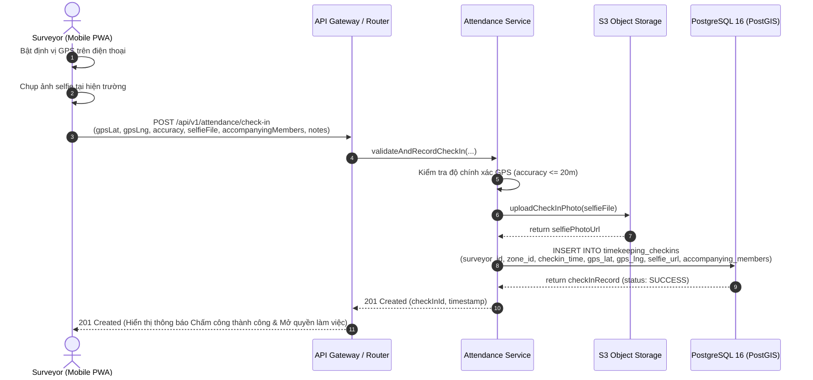

---

### 1.2. Sequence 1.2: Luồng Khảo Sát Hiện Trường Giai Đoạn 1 (Phase 1 Baseline - 9 Bước Thực Địa)

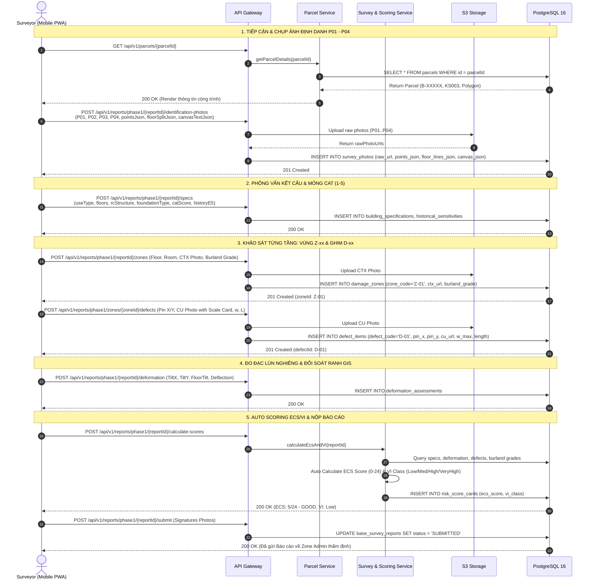

---

### 1.3. Sequence 1.3: Đường Ống AI Nắn Thẳng Phối Cảnh Mặt Đứng & Chuẩn CAD ($P-02$)

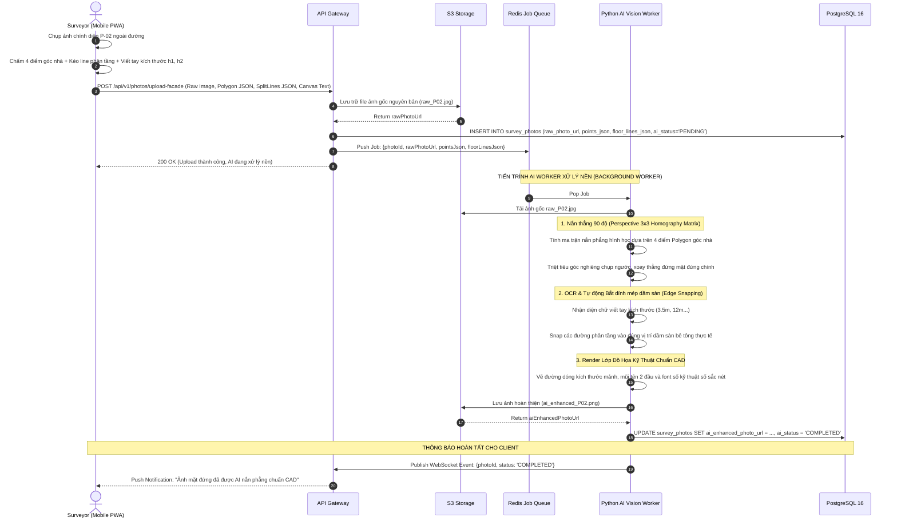

---

### 1.4. Sequence 1.4: Khảo Sát Phase 2 Theo Vị Trí Đứng & Động Cơ Đối Soát Delta ($\Delta$ Engine)

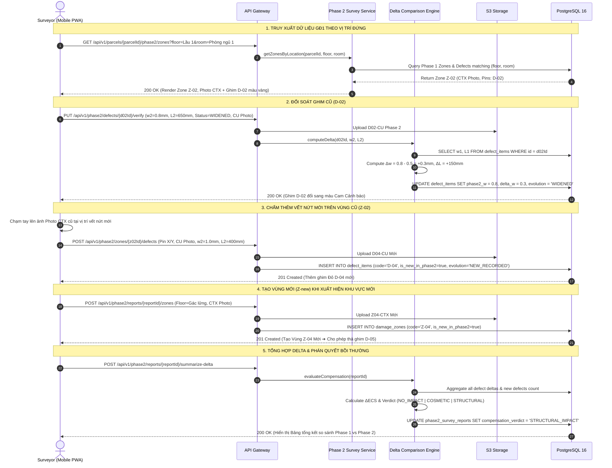

---

### 1.5. Sequence 1.5: Biến Động Ranh Thửa & Thuật Toán Cấp Dải Số Mở Rộng Bất Biến (UC-02)

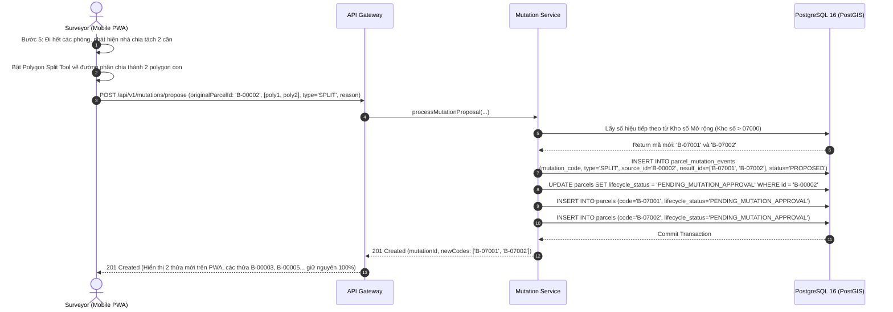

---

## 2. PHÂN HỆ QUẢN TRỊ PHÂN KHU (`ZONE_ADMIN`)

---

### 2.1. Sequence 2.1: Phân Công Nhiệm Vụ Khảo Sát Trên Bản Đồ GIS (Task Dispatching - UC-01)

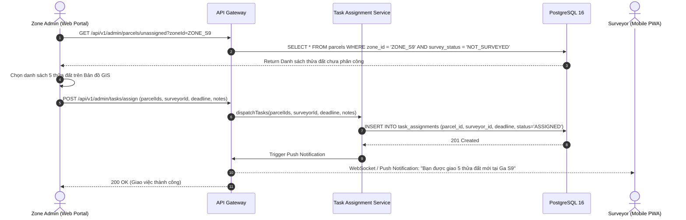

---

### 2.2. Sequence 2.2: Thẩm Định Hồ Sơ Split-Pane & Duyệt Biến Động Ranh Thửa (UC-04)

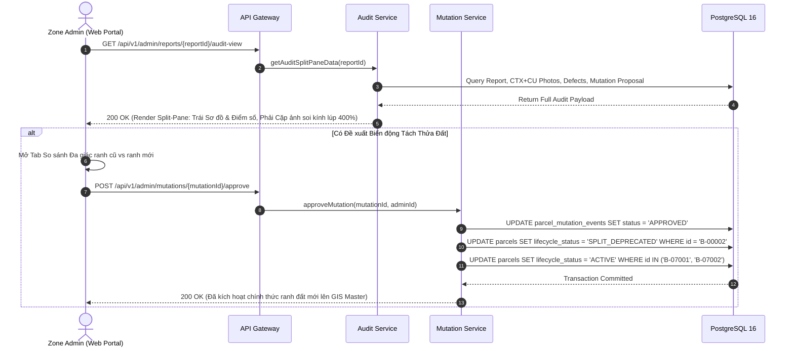

---

### 2.3. Sequence 2.3: Phê Duyệt Báo Cáo & Xuất Bản PDF/A Chính Thức (UC-04)

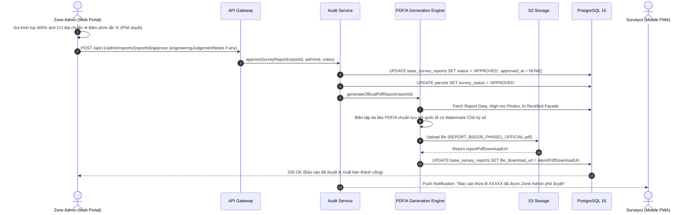

---

### 2.4. Sequence 2.4: Trả Về Báo Cáo & Tự Động Rollback Ranh Đất (UC-04)

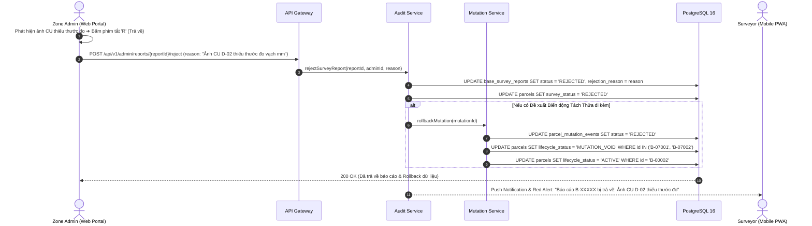

---

### 2.5. Sequence 2.5: Đóng Gói & Xuất Bộ Hồ Sơ Báo Cáo Phân Khu Hàng Loạt (UC-06)

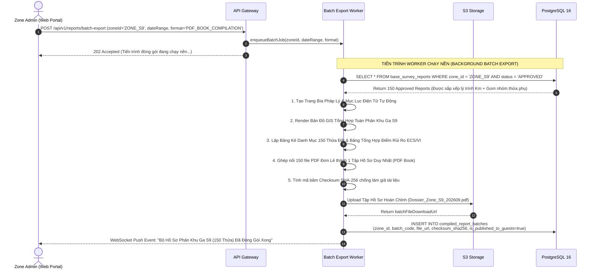

---

## 3. PHÂN HỆ TỔNG QUẢN TRỊ TOÀN TUYẾN (`SUPER_ADMIN`)

---

### 3.1. Sequence 3.1: Quản Trị Người Dùng & Cập Nhật Lớp Bản Đồ GIS Tim Tuyến

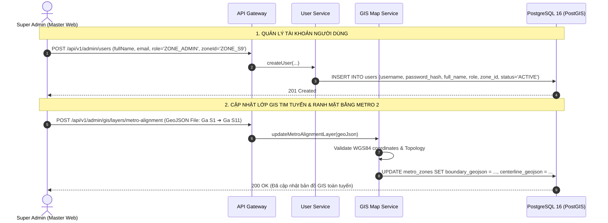

---

## 4. PHÂN HỆ NHÀ THẦU & KHÁCH TRA CỨU (`CONTRACTOR_GUEST`)

---

### 4.1. Sequence 4.1: Tra Cứu Bản Đồ GIS Quy Hoạch & Tải Tập Hồ Sơ Đã Công Bố (UC-05 & UC-06)

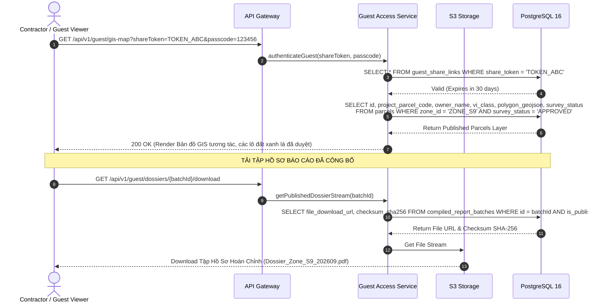

---

## 5. BẢNG ÁNH XẠ TOÀN BỘ 14 REST API ENDPOINTS

| STT | Method | Endpoint URL | Xử lý nghiệp vụ chính | Đối tượng sử dụng |
| :---: | :---: | :--- | :--- | :--- |
| 1 | `POST` | `/api/v1/attendance/check-in` | Check-in chấm công GPS + Chụp ảnh Selfie | `SURVEYOR` |
| 2 | `GET` | `/api/v1/parcels/{parcelId}` | Lấy chi tiết thửa đất & polygon ranh | `SURVEYOR`, `ZONE_ADMIN` |
| 3 | `POST` | `/api/v1/reports/phase1/photos` | Upload ảnh P01-P04 + Chấm góc + Phân tầng | `SURVEYOR` |
| 4 | `POST` | `/api/v1/reports/phase1/zones` | Tạo Vùng khảo sát $Z-xx$ + Ảnh bối cảnh CTX | `SURVEYOR` |
| 5 | `POST` | `/api/v1/reports/phase1/zones/{id}/defects` | Thả ghim $D-xx$ + Ảnh cận cảnh CU có thước | `SURVEYOR` |
| 6 | `GET` | `/api/v1/parcels/{id}/phase2/zones` | Tự động lọc Vùng & Khuyết tật theo Tầng/Phòng | `SURVEYOR` (Phase 2) |
| 7 | `PUT` | `/api/v1/phase2/defects/{id}/verify` | Đối soát vết nứt cũ ($\Delta w, \Delta L$, trạng thái) | `SURVEYOR` (Phase 2) |
| 8 | `POST` | `/api/v1/reports/{id}/calculate-scores` | Tính điểm tự động ECS/24, VI, và $\Delta ECS$ | Hệ thống tự động |
| 9 | `POST` | `/api/v1/mutations/propose` | Đề xuất biến động tách/gộp thửa đất ranh GIS | `SURVEYOR` |
| 10 | `GET` | `/api/v1/admin/reports/{id}/audit-view` | Lấy dữ liệu đối soát Split-Pane kính lúp 400% | `ZONE_ADMIN` |
| 11 | `POST` | `/api/v1/admin/reports/{id}/approve` | Phê duyệt Báo cáo & Sinh PDF/A chính thức | `ZONE_ADMIN` |
| 12 | `POST` | `/api/v1/admin/reports/{id}/reject` | Trả về báo cáo kèm lý do cần khảo sát lại | `ZONE_ADMIN` |
| 13 | `POST` | `/api/v1/reports/batch-export` | Đóng gói xuất Báo cáo Hàng loạt (PDF Book/ZIP) | `ZONE_ADMIN`, `SUPER_ADMIN` |
| 14 | `GET` | `/api/v1/guest/gis-map` | Xem bản đồ quy hoạch GIS công khai cho khách | `CONTRACTOR/GUEST` |
