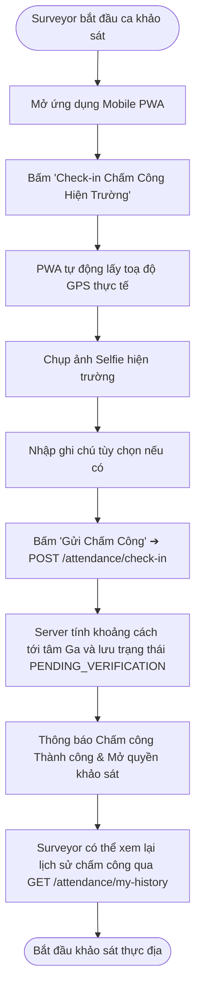
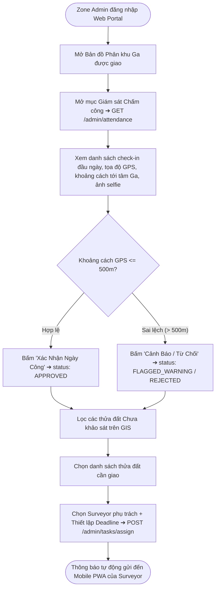

# Đặc Tả Chi Tiết Sơ Đồ Hoạt Động Theo Từng Đối Tượng (Activity Diagrams Specification)

> [!IMPORTANT]
> **TÀI LIỆU ĐẶC TẢ SƠ ĐỒ HOẠT ĐỘNG (UML ACTIVITY DIAGRAMS) ĐỒNG BỘ 100% VỚI HỆ THỐNG API & BUSINESS LOGIC:**
> Toàn bộ luồng hoạt động của 4 Vai trò (`SURVEYOR`, `ZONE_ADMIN`, `SUPER_ADMIN`, `CONTRACTOR_GUEST`) đã được chuẩn hóa chi tiết, tích hợp đầy đủ các quy trình: Khảo sát vắng nhà (Absentee Control Gate), Khảo sát và xuất báo cáo độc lập cho chung cư nhiều căn hộ (Multi-Unit Apartment Flow), tính toán toán học ECS/VI và quản lý trạng thái `EXPORTED`.

---

## 1. PHÂN HỆ CÁN BỘ KHẢO SÁT HIỆN TRƯỜNG (`SURVEYOR`)

---

### 1.1. Activity 1.1: Chấm Công GPS & Xem Lịch Sử Chấm Công (UC-02)



---

### 1.2. Activity 1.2: Quét Cạn Thửa Đất Ad-hoc & Quy Trình Khảo Sát Vắng Nhà (Absentee Control Gate)

```mermaid
flowchart TD
    StartAdhoc([Khảo sát thực tế ngoài hiện trường]) --> ArriveParcel[Đến trước công trình]
    ArriveParcel --> CheckPresence{Chủ nhà có mặt và mở cửa?}
    
    %% NHÁNH 1: VẮNG NHÀ / TỪ CHỐI
    CheckPresence -- Vắng nhà / Cửa khóa / Từ chối --> ClickAbsent[Bấm nút '🏠 Báo Vắng Nhà' tại Bước 1]
    ClickAbsent --> ActivateAbsentMode[Kích hoạt Chế độ Khảo Sát Vắng Nhà]
    ActivateAbsentMode --> FillStep1[Bắt buộc hoàn thành 100% dữ liệu ngoại quan Bước 1:<br>• Số nhà & Tuyến đường<br>• Nhóm đối tượng<br>• Tiếp giáp 3 hướng<br>• Đủ 4 ảnh P-01..P-04<br>• Lý do vắng mặt]
    
    FillStep1 --> CheckStep1Done{Đã hoàn thành đủ 100%?}
    CheckStep1Done -- Chưa đủ --> LockSubmit[Nút Nộp bị KHÓA (Disabled) & Cảnh báo các mục còn thiếu]
    LockSubmit --> FillStep1
    
    CheckStep1Done -- Đã đủ 100% --> UnlockSubmit[MỞ KHÓA nút '🚀 Nộp Báo Cáo Vắng Nhà Về Server']
    UnlockSubmit --> SubmitAbsent[Gửi POST /surveys/phase1/submit-absentee]
    SubmitAbsent --> UpdatePurple[Thửa đất chuyển sang Màu Tím POSTPONED_ABSENT & Tăng attemptCount += 1]
    
    UpdatePurple --> NeedSweep{Tiếp tục khảo sát nhà bên cạnh?}
    NeedSweep -- Có --> OpenNearMap[Mở bản đồ GIS hoặc danh sách GET /parcels/nearby]
    OpenNearMap --> TapNearbyParcel[Chạm vào ô thửa liền kề Màu Xám NOT_SURVEYED]
    TapNearbyParcel --> ClickClaim[Bấm 'Nhận & Khảo Sát Ngay' ➔ POST /parcels/{id}/start-survey]
    ClickClaim --> UpdateYellow[Thửa đất chuyển sang Màu Vàng IN_PROGRESS & Bắt đầu làm hồ sơ]
    
    %% NHÁNH 2: CÓ MẶT
    CheckPresence -- Có mặt --> OpenSurveyForm[Bắt đầu làm hồ sơ khảo sát 9 bước bình thường]
    UpdateYellow --> OpenSurveyForm
```

---

### 1.3. Activity 1.3: Luồng Khảo Sát Hiện Trường Giai Đoạn 1 (Phase 1 Baseline 9 Bước)

```mermaid
flowchart TD
    StartP1([Bắt đầu Khảo sát Giai đoạn 1]) --> Step1[BƯỚC 1: Tiếp cận ngoài nhà & Bộ 4 ảnh định danh P01-P04]
    
    %% BƯỚC 1
    Step1 --> SnapP02[Chụp ảnh toàn cảnh mặt đứng P-02]
    SnapP02 --> AnnotateP02[Chấm mảng N điểm đa giác ranh mặt tiền + Đường phân tầng]
    AnnotateP02 --> Step1_LundTilt[Khảo sát sơ bộ Lún chênh & Nghiêng mặt tiền theo 4 Level]
    
    %% BƯỚC 2
    Step1_LundTilt --> Step2[BƯỚC 2: Phỏng vấn kết cấu, số tầng, Móng CAT 1-5 & Lịch sử sự cố E5]
    Step2 --> CatTree[Cây quyết định CAT Móng: Có bản vẽ hoàn công (1-2đ) vs N/A (3-4đ) vs Chưa rõ (5đ)]
    CatTree --> E5Resonance[Tính E5: Max(5 câu hỏi). Nếu >=2 câu cùng >2 và bằng nhau thì E5 = 4đ]
    
    %% BƯỚC 3
    E5Resonance --> Step3[BƯỚC 3: Khảo sát chi tiết các tầng & Mảng tường]
    Step3 --> LoopFloors[Đi từ Tầng trệt lên Tầng mái]
    LoopFloors --> FloorSketch[Upload sơ đồ CAD tầng & Chấm ghim Vùng Z-01, Z-02...]
    FloorSketch --> SnapCTX[Chụp ảnh bối cảnh Photo CTX của từng Vùng Z & Đánh giá Burland]
    SnapCTX --> PinDefects[Chấm ghim D-01, D-02... trên ảnh CTX]
    PinDefects --> SnapCU[Nhập kích thước nứt & Chụp ảnh cận cảnh CU có thước đo mm + Điểm E2, E4]
    SnapCU --> MoreZones{Còn phòng / tầng khác?}
    MoreZones -- Còn --> LoopFloors
    
    %% BƯỚC 4
    MoreZones -- Hết --> Step4[BƯỚC 4: Tổng hợp Burland E1 & Cờ kết cấu E2]
    
    %% BƯỚC 5
    Step4 --> Step5[BƯỚC 5: Khảo sát Lún chênh, Nghiêng công trình ‰, Võng dầm mm (4 Level có popup ?)]
    
    %% BƯỚC 6
    Step5 --> Step6[BƯỚC 6: Phạm vi khảo sát & Biến động ranh GIS Match/Split/Merge]
    
    %% BƯỚC 7
    Step6 --> Step7[BƯỚC 7: Cổng kiểm tra đủ dữ liệu Gate & Tự động Tính Điểm ECS/24 và VI/4]
    
    %% BƯỚC 8 & 9
    Step7 --> Step8[BƯỚC 8: Dashboard Tổng hợp, Kết luận kỹ thuật & Khuyến nghị BRA]
    Step8 --> Step9[BƯỚC 9: Ký tên xác nhận 3 bên: Chủ hộ, Khảo sát viên, Trưởng nhóm ➔ NỘP HỒ SƠ]
    Step9 --> EndP1([Hồ sơ nộp lên server ➔ Chuyển trạng thái SUBMITTED Màu Xanh lơ])
```

---

### 1.4. Activity 1.4: Luồng Khảo Sát & Xuất Báo Cáo Chung Cư / Nhiều Căn Hộ (Multi-Unit Workflow)

```mermaid
flowchart TD
    StartApt([Surveyor mở Thửa đất Chung cư B-xxxxx]) --> LoadAptMatrix[Hệ thống hiển thị Sơ Đồ Ma Trận Căn Hộ Theo Tầng]
    
    LoadAptMatrix --> SelectUnit[Chọn Căn hộ cần khảo sát: VD Căn P-304]
    SelectUnit --> InheritMaster[Tự động kế thừa Dữ liệu chung Tòa nhà:<br>• Mã thửa B-xxxxx, Tên chung cư<br>• Bộ 4 ảnh P-01..P-04 mặt tiền & Đa giác Facade<br>• Hồ sơ móng, CAT Móng, Độ nghiêng E3]
    
    InheritMaster --> SurveyUnitInterior[Khảo sát nội bộ riêng Căn 304:<br>• Khảo sát các phòng Z-xx<br>• Ghim khuyết tật D-xx kèm ảnh CU có thước<br>• Đánh giá E1, E4, E6 riêng của căn 304]
    
    SurveyUnitInterior --> SignUnit[Chủ Căn 304 ký biên bản riêng tại Bước 9]
    SignUnit --> SubmitUnit[Bấm Nộp Hồ Sơ Căn ➔ POST /reports/phase1/units/{id}/submit]
    SubmitUnit --> UnitSubmitted[Căn 304 chuyển trạng thái SUBMITTED]
    
    UnitSubmitted --> AdminReview[Zone Admin thẩm định riêng căn 304 qua Split-Pane]
    AdminReview --> AdminApprove[Duyệt Căn 304 ➔ status: APPROVED]
    AdminApprove --> ExportUnitPdf[Admin bấm 'Xuất Báo Cáo Căn Hộ' ➔ POST /reports/units/{id}/export]
    ExportUnitPdf --> UnitExported[Căn 304 chuyển trạng thái EXPORTED Màu Xanh Ngọc & Khóa bất biến]
    
    UnitExported --> CheckAllUnitsDone{100% các căn hộ trong Chung cư đã EXPORTED?}
    CheckAllUnitsDone -- Chưa --> ShowProgress[Thửa đất trên GIS hiển thị Màu Vàng kèm tiến độ: VD 32/50 căn]
    CheckAllUnitsDone -- Đã đủ 100% --> MasterExported[Toàn bộ Lô đất Chung cư chuyển sang trạng thái EXPORTED hoàn tất]
```

---

## 2. PHÂN HỆ QUẢN TRỊ PHÂN KHU (`ZONE_ADMIN`)

---

### 2.1. Activity 2.1: Giám Sát Chấm Công & Phân Công Nhiệm Vụ Trên GIS



---

### 2.2. Activity 2.2: Động Cơ Cảnh Báo Bất Thường & Thẩm Định Split-Pane Phê Duyệt

```mermaid
flowchart TD
    StartAudit([Hồ sơ nộp về SUBMITTED]) --> AutoRuleEngine[Động cơ Audit Alert Engine tự động quét 5 quy tắc]
    
    AutoRuleEngine --> CheckAnomalies{Phát hiện bất thường?}
    CheckAnomalies -- Có: GPS lệch >50m / Khảo sát <5p / Nứt Critical / Thiếu thước mm --> FlagAlert[Gắn Cờ Cảnh Báo & Hiển thị ưu tiên tại /admin/reports/audit-alerts]
    CheckAnomalies -- Không --> NormalQueue[Xếp vào danh sách chờ duyệt chuẩn]
    
    FlagAlert --> OpenSplitPane[Zone Admin mở giao diện Split-Pane Đối soát]
    NormalQueue --> OpenSplitPane
    
    OpenSplitPane --> LeftPane[NỬA TRÁI: Cây cấu kiện, Điểm số ECS/VI, Đa giác ranh thửa Tách/Gộp]
    OpenSplitPane --> RightPane[NỬA PHẢI: Cặp ảnh CTX + Cận cảnh CU có thước đo mm]
    RightPane --> ZoomMagnifier[Rê chuột kích hoạt KÍNH LÚP 400% soi vạch milimet thước đo]
    
    LeftPane --> CheckMutation{Có đề xuất Tách thửa?}
    CheckMutation -- Có --> ReviewMutation[Xem so sánh ranh cũ/mới ➔ Duyệt hoặc Bác bỏ Tách thửa]
    CheckMutation -- Không --> AuditDecision
    ReviewMutation --> AuditDecision{Quyết định Phê duyệt?}
    
    %% DUYỆT
    AuditDecision -- DUYỆT (Phím 'A') --> ClickApprove[Bấm 'Phê Duyệt' ➔ POST /admin/reports/{id}/approve]
    ClickApprove --> GenPdfA[Hệ thống tự động sinh file PDF/A chính thức đóng dấu ký số điện tử]
    GenPdfA --> UpdateGreen[Thửa đất chuyển sang Màu Xanh Lá APPROVED_PHASE1]
    
    %% XUẤT BÁO CÁO BÀN GIAO (EXPORTED)
    UpdateGreen --> ClickExport[Bấm 'Xuất Báo Cáo Pháp Lý Bàn Giao' ➔ POST /reports/batch-export]
    ClickExport --> HashSha[Sinh mã Checksum SHA-256 & Khóa bất biến 100% dữ liệu]
    HashSha --> UpdateExported[Thửa đất chuyển sang Màu Xanh Ngọc EXPORTED]
    
    %% TRẢ VỀ
    AuditDecision -- TRẢ VỀ (Phím 'R') --> ClickReject[Bấm 'Trả Về' ➔ POST /admin/reports/{id}/reject]
    ClickReject --> EnterReason[Bắt buộc nhập Lý do kỹ thuật: VD 'Ảnh CU D-01 thiếu thước đo mm']
    EnterReason --> Rollback[Hệ thống rollback biến động & Thửa đất chuyển sang Màu Đỏ REJECTED]
    
    UpdateExported --> EndAudit([Hoàn tất quy trình])
    Rollback --> EndAudit
```

---

## 3. PHÂN HỆ TỔNG QUẢN TRỊ TOÀN TUYẾN (`SUPER_ADMIN`)

```mermaid
flowchart TD
    StartSA([Super Admin đăng nhập Web Master Portal]) --> ChooseAction{Chọn phân hệ quản trị?}
    
    %% QUẢN TRỊ NGƯỜI DÙNG
    ChooseAction -- Quản trị Người dùng --> UserOps{Thao tác tài khoản?}
    UserOps -- Cấp mới --> CreateUser[Tạo tài khoản Zone Admin / Surveyor ➔ POST /admin/users]
    UserOps -- Sửa / Điều chuyển Ga --> UpdateUser[Cập nhật chức vụ / Đổi Ga phụ trách ➔ PUT /admin/users/{id}]
    UserOps -- Khóa / Mở khóa --> LockUser[Khóa hoặc Kích hoạt tài khoản ➔ PUT /admin/users/{id}/status]
    UserOps -- Reset Mật khẩu --> ResetPass[Đặt lại mật khẩu bảo mật ➔ POST /admin/users/{id}/reset-password]
    
    %% QUẢN TRỊ GIS & XUẤT TOÀN TUYẾN
    ChooseAction -- Lớp Bản đồ GIS --> GisOps[Import Quy hoạch SQHKT KS003 mới, Cập nhật Tim tuyến & ZOI 50m]
    ChooseAction -- Xuất Báo cáo Toàn tuyến --> GlobalExport[Xuất Batch Báo cáo 11 Ga nộp UBND TP.HCM & MAUR ➔ Trạng thái EXPORTED]
```
