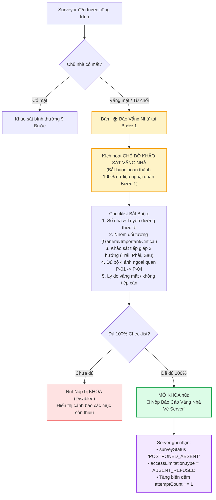
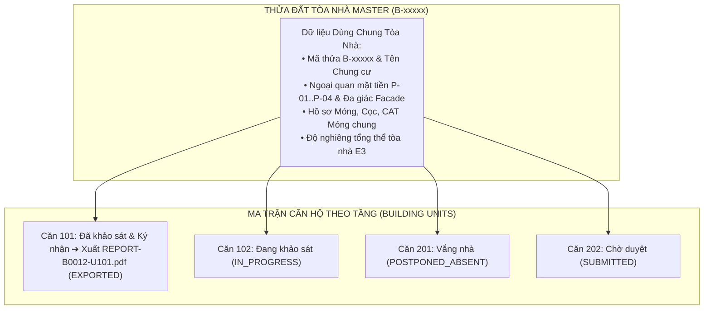
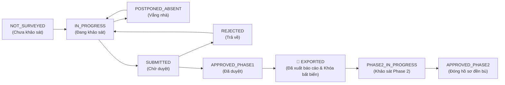

# Quy Tắc Nghiệp Vụ Hệ Thống (Business Logic Specification)

> [!IMPORTANT]
> **TÀI LIỆU ĐẶC TẢ QUY TẮC NGHIỆP VỤ LÕI (PRODUCTION BUSINESS LOGIC & STATE MACHINE):**
> Tài liệu này chuẩn hóa toàn bộ các quy tắc nghiệp vụ cốt lõi, kiến trúc định danh kép Dual-ID, cơ chế quản lý biến động không gian ranh thửa (Match/Split/Merge), bộ máy tính điểm tự động (ECS & VI), quy trình khảo sát vắng nhà (Absentee Control Gate), quy trình quản lý và xuất báo cáo độc lập cho chung cư nhiều căn hộ (Multi-Unit Apartment Workflow), hệ thống 7 trạng thái vòng đời khảo sát, và động cơ cảnh báo bất thường / gian lận hiện trường.

---

## 1. KIẾN TRÚC MÃ KÉP (DUAL-ID ARCHITECTURE) & CƠ CHẾ CẤP MÃ BẤT BIẾN `B-XXXXX`

### 1.1. Kiến trúc Định danh Kép cho Thửa Đất (Dual-ID System)
Mỗi thửa đất trong hệ thống được định danh đồng thời bởi **2 Mã (Dual-ID)**:
1. **`officialCadastralCode` (Mã Địa chính Gốc / Dữ liệu KS003):** Mã số tờ - số thửa bản đồ địa chính nhà nước (VD: `KS003-P1024`, `Tờ 15 - Thửa 89`) bảo đảm tính pháp lý khi giải phóng mặt bằng và bồi thường.
2. **`projectParcelCode` (Mã Quản lý Dự án Tuyến Metro 2 - `B-XXXXX`):** Mã số sắp xếp tuần tự theo lý trình tim tuyến Metro 2 từ Ga S1 đến Ga S11 (từ `B-00001` đến `B-07000`) để phục vụ quản lý dự án và kiểm soát tiến độ thi công.

---

### 1.2. Nguyên tắc Bất biến của Mã Dự Án `B-XXXXX` (Immutability Principle)
- **Quy chuẩn:** Cố định **`B-XXXXX`** (Tiền tố `B-` và đúng 5 chữ số từ `B-00001` đến `B-99999`).
- **Nguyên tắc:** Khi một mã `B-XXXXX` đã cấp phát, mã này là **BẤT BIẾN (IMMUTABLE)**, tuyệt đối không chèn số vào giữa làm xô lệch các thửa khác.

---

### 1.3. Cơ chế Dải số Phát sinh Mở rộng (High-Range Sequential Extension Pool)
```text
[ Dải số Ban đầu: B-00001 -> B-07000 ] ──> [ Dải số Phát sinh Thực địa: B-07001 -> B-99999 ]
```
- **Tách thửa (Split):** Thửa gốc giữ `B-00002`, các thửa mới phát sinh lấy mã tiếp theo từ kho số mở rộng `B-07001`, `B-07002`... theo thuật toán `SELECT MAX(substring(code from 3)::int) + 1`.
- **Gộp thửa (Merge):** Lấy mã nhỏ nhất trong nhóm gộp làm đại diện (`B-00002`), các thửa còn lại chuyển sang trạng thái `MERGED_DEPRECATED`.

---

## 2. QUY TRÌNH BIẾN ĐỘNG RANH THỬA TRÊN GIS (CADASTRAL MUTATION & VERIFICATION WORKFLOW)

- **Vị trí thực hiện:** **BƯỚC 6** (sau khi cán bộ khảo sát đã hoàn tất các tầng và nắm trọn vẹn hiện trạng không gian toà nhà).
- **Hiển thị Kích thước Thửa Ban Đầu:** Thẻ giao diện sáng (Light theme) hiển thị trực quan ranh thửa đất quy hoạch ban đầu với kích thước mặt tiền ($W$), chiều sâu ($D$), diện tích $S_{\text{đất}}\text{ m}^2$, địa chỉ, mã dự án (`B-XXXXX`) và mã địa chính (`KS003-XXXX`).
- **3 Chế độ Đối Soát Thực Địa:**
  1. **Khớp Ranh (MATCH) - Xác nhận 100% diện tích:**
     - Bản đồ Leaflet hiển thị duy nhất thửa đất hiện tại trên hệ tọa độ PostGIS thực tế.
     - Xác nhận ranh công trình xây dựng thực tế hoàn toàn trùng khớp 100% với ranh thửa đất địa chính ($S_{\text{xd}} = S_{\text{đất}}\text{ m}^2$).
  2. **Tách Thửa (SPLIT) & 2 Màu Phân Biệt & Metadata Đất Thừa:**
     - Bản đồ GIS hiển thị 2 màu phân biệt: **Màu 1 (Hổ phách `#f59e0b` cho Căn A / Đang khảo sát)** và **Màu 2 (Cam Đỏ `#ea580c` cho Căn B / Phần còn dư / Đất thừa)**.
     - 2 Option biên tập: Option 1 (Kéo nắn điểm mút / Trượt ranh phân cắt tính diện tích real-time) và Option 2 (Khuôn mẫu Nhà chữ L cắt góc, Chia trước/sau, Chia dọc, Đa giác tự do).
     - **Cấp mã động $B_{\max}$:** Mã dự án mới được cấp phát tuần tự dựa trên giá trị lớn nhất hiện hữu trong CSDL ($B_{\max} + 1, B_{\max} + 2 > 07000$).
     - **Đồng bộ công năng & Metadata Đất thừa:** Tùy chọn `⚠️ Đất thừa / Sai số biên ranh (RESIDUAL_SURPLUS)`. Khi chọn Đất thừa, hệ thống ghi chú metadata nguồn gốc `residualParentParcelCode`, `residualParentCadastralCode`, `residualMetadataNote`.
     - **Quy tắc xử lý mé sai số:** Mọi diện tích dôi dư thuộc về ô còn lại; khi khảo sát ô này chỉ vẽ đúng ranh của mình và phần mé thừa tự động tính là lô phụ.
  3. **Gộp Thửa (MERGE) & Multi-Select 10 Thửa Gần Nhất:**
     - Bản đồ Leaflet hiển thị **10 thửa đất thực tế gần nhất** từ CSDL.
     - Thửa hiện tại đang khảo sát **SÁNG ĐÈN NỔI BẬT** (Neon Cyan `#38bdf8` / `#0284c7`).
     - Cho phép **Multi-select chọn nhiều thửa liền kề** (2, 3 hoặc nhiều thửa) để gộp chung.
     - **Quy tắc Mã Đại Diện:** Hệ thống giữ mã nhỏ nhất làm Thửa đại diện chính ($B_{\min}$), các thửa phụ còn lại chuyển sang `MERGED_DEPRECATED`, tổng hợp diện tích $S_{\text{gộp}} = S_{\text{chính}} + \sum S_{\text{phụ}}\text{ m}^2$.
- **Transaction Safety & Rollback khi Reject:** Mọi thao tác biến động chạy trong Database Transaction an toàn. Nếu Zone Admin từ chối Đề xuất Tách thửa, CSDL tự động hoàn nguyên thửa gốc về `ACTIVE` và hủy các thửa phát sinh về `MUTATION_VOID`.

---

## 3. CẤP BẬC QUẢN LÝ KHẢO SÁT HIỆN TRẠNG 3 TẦNG (TẦNG > VÙNG Z > KHUYẾT TẬT D)

Hệ thống quản lý khảo sát theo 3 cấp bậc chặt chẽ:
1. **Cấp Tầng (Floor Level):**
   - Định danh tầng (Tầng trệt, Lầu 1, Lầu 2, Sân thượng, Mái, Hầm...).
   - **Ảnh tổng quan tầng (Floor Overview Photos):** Chụp nhiều ảnh bao quát không gian tầng.
   - **Bản vẽ phác thảo kỹ thuật / CAD tầng (Floor CAD Sketch):** Chụp hoặc tải lên sơ đồ mặt bằng kỹ thuật tầng và cho phép chạm chấm ghim các vị trí vùng **$Z-01, Z-02...$** trực tiếp lên sơ đồ để định vị không gian.
2. **Cấp Vùng Khảo Sát (Zone Level - $Z-xx$ thuộc Tầng):**
   - Định danh mã vùng $Z-01, Z-02...$ gắn liền với phòng/không gian cụ thể thuộc tầng.
   - Trường đánh giá: **Ảnh hưởng chức năng / Cần sửa chữa** (`functionalImpactRepairNeeded`: boolean).
   - Cấp độ Burland Grade sơ bộ (0 - 5) và Ảnh bối cảnh vùng (Photo CTX).
3. **Cấp Khuyết Tật / Điểm Hư Hỏng (Defect Level - $D-xx$ thuộc Vùng $Z-xx$):**
   - Chấm ghim trực tiếp $D-xx$ trên ảnh bối cảnh Photo CTX của vùng $Z-xx$.
   - **Mức độ Suy giảm Vật liệu / Bong tróc / Rỉ thép** (`materialDegradationE4`: $0 - 4$ điểm) $\rightarrow$ Tự động trích xuất giá trị lớn nhất đưa vào chỉ số $E4$ của bảng điểm ECS.
   - **Ý nghĩa kết cấu** (`structuralSignificanceE2`: $0 - 4$ điểm) $\rightarrow$ Trích xuất giá trị lớn nhất đưa vào chỉ số $E2$.
   - Kích thước vết nứt ($w_{\max}, L$), trạng thái hoạt động ($U/S/A$) và Ảnh cận cảnh kèm thước đo Crack Scale Card (Photo CU).

---

## 4. BỘ MÁY TÍNH ĐIỂM KỸ THUẬT TỰ ĐỘNG (ECS & VI SCORING ENGINE)

### 4.1. Bảng Điểm Hiện Hữu ECS (11. ECS – Existing Condition Score, Thang 0–24 Điểm)
- **$E_1$ (Hư hỏng tường/khối xây):** Trích xuất từ `Burland Grade Max` ở Bước 4: $B \le 1 \to 0\text{đ}$; $B=2 \to 1\text{đ}$; $B=3 \to 2\text{đ}$; $B=4 \to 3\text{đ}$; $B=5 \to 4\text{đ}$.
- **$E_2$ (Khuyết tật kết cấu cột/dầm/sàn/tường chịu lực):** $\max(\text{Cờ kết cấu Bước 4}, \max(D\text{-xx structuralSignificance}))$. Thang điểm $0 \to 4$đ.
- **$E_3$ (Biến dạng hình học / Lún / Nghiêng / Võng dầm sàn):**
  - Đánh giá theo thang chuẩn **4 Level (0đ - 4đ)** có popup `?` hướng dẫn biểu hiện vật lý:
    - `0đ`: Bình thường, không dấu hiệu.
    - `1đ`: Nghi ngờ / Rất nhẹ *(Chớm vi phạm thẩm mỹ)*.
    - `2đ`: Rõ nhưng ổn định *(Ảnh hưởng sử dụng)*.
    - `3đ`: Tiến triển / Nghiêm trọng *(Nguy hiểm kết cấu)*.
    - `4đ`: Mất ổn định / Nguy cấp *(Nguy cơ sập đổ)*.
  - Công thức: $E_3 = \min(4, \max(\text{Level Lún chênh}, \text{Level Nghiêng}, \text{Level Võng}))$.
- **$E_4$ (Suy giảm vật liệu / Ăn mòn cốt thép):** Quét giá trị lớn nhất từ trường `materialDegradationE4` của toàn bộ các Defect $D\text{-xx}$ ($0 \to 4$đ).
- **$E_5$ (Lịch sử sử dụng, cơi nới & Quy tắc cộng hưởng rủi ro):**
  - Khảo sát qua 5 câu hỏi lịch sử tại Bước 2.2 (thang 0, 1, 2, 3đ).
  - $\text{MaxScore} = \max(\text{5 câu hỏi})$.
  - **Quy tắc cộng hưởng rủi ro:** Nếu có từ **$\ge 2$ trường thông tin cùng $> 2$ (cùng đạt mức $3\text{đ}$) và bằng nhau** $\implies E_5 = 3 + 1 = 4\text{đ}$ *(Mức nguy cấp)*; ngược lại $E_5 = \text{MaxScore}$.
- **$E_6$ (Tình trạng chức năng / Tổng thể):** Quét từ mức độ Thấm dột, Kẹt cửa Bước 3.3 và số lượng Vùng $Z$ có cờ `functionalImpactRepairNeeded = true` tại Bước 3.2.
- **Tổng ECS:** $\Sigma E = E_1 + E_2 + E_3 + E_4 + E_5 + E_6$ (Thang 0–24).
  - Phân hạng: `GOOD` [0–5], `MEDIUM` [6–10], `DEFICIENT` [11–16], `CRITICAL` [17–24].
- **Safety Lock (Khóa an toàn can thiệp):** Nếu $E_2 \ge 3$ hoặc $E_3 \ge 3$, hệ thống khóa không cho phép Kỹ sư hạ hạng ECS.

---

### 4.2. Bảng Chỉ Số Dễ Tổn Thương VI (13. VI – Vulnerability Index, Thang 6–24 Điểm)
- **$V_1$ (Công năng & Quy mô):** Map từ Nhóm đối tượng Bước 1 (General $\to 1$đ, Important $\to 2$đ, Critical $\to 4$đ).
- **$V_2$ (Hệ kết cấu chịu lực):** BTCT toàn khối $\to 1$đ, BTCT chèn gạch $\to 2$đ, Tường gạch chịu lực $\to 3$đ, Kém ổn định $\to 4$đ.
- **$V_3$ (Độ tin cậy móng CAT Móng 1 - 5 Điểm):**
  - **Mức 1 (1đ):** Có bản vẽ hoàn công móng được chính quyền/cơ quan cấp phép thẩm duyệt xác nhận $\to V_3 = 1$đ.
  - **Mức 2 (2đ):** Có bản vẽ hoàn công móng do chủ nhà cung cấp qua phỏng vấn $\to V_3 = 1$đ.
  - **Mức 3 (3đ):** N/A Không có bản vẽ, nhưng chủ nhà nhớ rõ qua phỏng vấn $\to V_3 = 2$đ.
  - **Mức 4 (4đ):** N/A Không có bản vẽ, xác định qua suy luận kinh nghiệm khảo sát viên $\to V_3 = 3$đ.
  - **Mức 5 (5đ):** Hoàn toàn không có thông tin móng/cọc $\to V_3 = 4$đ.
- **$V_4$ (Tuổi đời / Cơi nới):** Tính theo năm xây dựng & cơi nới tải trọng ($1 \to 4$đ).
- **$V_5$ (Hiện trạng kỹ thuật ECS):** Ánh xạ từ phân hạng ECS Class ($1 \to 4$đ).
- **$V_6$ (Thiết bị nhạy cảm & Vận hành 24/7):** Trích xuất từ Bước 2.2 ($1 \to 4$đ).
- **Điểm trung bình $VI_{\text{avg}} = \Sigma V / 6$:** `LOW` [$\le 1.5$], `MEDIUM` [$1.51 - 2.5$], `HIGH` [$2.51 - 3.25$], `VERY_HIGH` [$> 3.25$].

---

## 5. QUY TRÌNH KHẢO SÁT VẮNG NHÀ (ABSENTEE SURVEY CONTROL GATE & WORKFLOW)

Để đảm bảo tính pháp lý nghiêm ngặt khi chủ nhà đi vắng hoặc không hợp tác, hệ thống thiết lập cơ chế **Cổng kiểm soát khảo sát vắng nhà (Gating)**:



### 5.1. Các Nguyên Tắc Bất Biến Của Khảo Sát Vắng Nhà:
1. **Không được phép báo vắng ngay lập tức:** Tuyệt đối không cho phép surveyor đứng từ xa bấm báo vắng mà không chụp ảnh và thu thập dữ liệu ngoại quan.
2. **Bộ 4 ảnh ngoại quan bắt buộc ($P\text{-}01 \to P\text{-}04$):**
   - $P\text{-}01$: Ảnh số nhà / biển tên công trình / ổ khóa niêm phong.
   - $P\text{-}02$: Ảnh toàn cảnh mặt đứng chính (Facade).
   - $P\text{-}03$: Ảnh tiếp cận hông / hẻm / sau nhà.
   - $P\text{-}04$: Bối cảnh tuyến đường và nhà láng giềng hai bên.
3. **Biến đếm số lần vắng mặt (`attemptCount`):** Mỗi lần nộp báo cáo vắng nhà, hệ thống tự động tăng `attemptCount += 1`. Khi `attemptCount >= 3`, hệ thống phát cờ cảnh báo `REPEATED_ABSENCE` để chuyển danh sách sang UBND Phường / Tổ dân phố hỗ trợ liên hệ.

---

## 6. QUY TRÌNH QUẢN LÝ & XUẤT BÁO CÁO CHUNG CƯ / NHIỀU CĂN HỘ (MULTI-UNIT APARTMENT WORKFLOW)

Đối với các công trình dạng **Chung cư, Nhà tập thể, Dãy nhà shoptop chia căn** (1 Thửa đất Master $B\text{-xxxxx}$ chứa $N$ Căn hộ `BuildingUnit`), hệ thống quản lý theo quy trình phân cấp chuyên biệt:



### 6.1. Nguyên Tắc Xuất Báo Cáo Độc Lập Cho Từng Căn Hộ:
1. **Xuất Báo Cáo Từng Căn Hộ Độc Lập:** Mỗi căn hộ được xuất 1 tập Báo cáo Hiện trạng độc lập (`REPORT-{ParcelCode}-{UnitCode}.pdf`, VD: `REPORT-B00128-U304.pdf`) để chủ căn hộ đó ký nhận độc lập phục vụ đền bù.
2. **Bộ Ghép Hồ Sơ Tự Động (Auto-Merge Engine):** Khi xuất báo cáo cho Căn 304, hệ thống tự động kế thừa dữ liệu chung của Tòa nhà (Mặt đứng, móng, độ nghiêng $E_3$) ghép với dữ liệu khảo sát riêng bên trong căn 304 (vết nứt $D\text{-xx}$, ảnh $CU$, $E_1, E_4, E_6$, chữ ký chủ căn hộ).
3. **Trạng thái `EXPORTED` Phân Cấp:**
   - Khi Admin bấm xuất báo cáo chính thức cho Căn 304 $\implies$ Trạng thái của Căn 304 chuyển sang `EXPORTED` (Màu Xanh ngọc lục bảo `#047857` kèm icon `📄 🔒`). Dữ liệu căn này bị **khóa cứng 100%**.
   - Khi **100% tất cả các căn hộ** trong tòa chung cư đều đã được xuất báo cáo (`EXPORTED`) $\implies$ Thửa đất trên bản đồ GIS đổi sang trạng thái hoàn tất toàn diện `EXPORTED`.

---

## 7. HỆ THỐNG 7 TRẠNG THÁI VÒNG ĐỜI KHẢO SÁT & BẢO TOÀN PHÁP LÝ



| STT | Mã Trạng Thái | Tên Hiển Thị | Mã Màu GIS | Ý Nghĩa Nghiệp Vụ & Pháp Lý |
| :---: | :--- | :--- | :---: | :--- |
| **1** | `NOT_SURVEYED` | Chưa khảo sát | ⚪ **Xám** (`#94a3b8`) | Thửa đất gốc ban đầu trên GIS, chưa có surveyor nhận việc. |
| **2** | `IN_PROGRESS` | Đang khảo sát | 🟡 **Vàng** (`#f59e0b`) | Surveyor đã check-in GPS và đang khảo sát (khóa tránh làm trùng). |
| **3** | `SUBMITTED` | Chờ duyệt | 🔵 **Xanh lơ** (`#0284c7`) | Đã gửi hồ sơ lên hệ thống, chờ Zone Admin thẩm định. |
| **4** | `APPROVED_PHASE1` | Đã duyệt Phase 1 | 🟢 **Xanh lá** (`#16a34a`) | Hồ sơ hoàn chỉnh đã được phê duyệt chữ ký số 3 bên. |
| **5** | `EXPORTED` | Đã xuất báo cáo | 🔷 **Xanh ngọc** (`#047857`) | Đã xuất file PDF đóng dấu/Checksum SHA-256 bàn giao MAUR. **Khóa bất biến 100% dữ liệu**. |
| **6** | `POSTPONED_ABSENT` | Vắng nhà / Tạm hoãn | 🟣 **Tím** (`#9333ea`) | Đã hoàn thành 100% ngoại quan Bước 1 và nộp báo cáo vắng nhà. |
| **7** | `REJECTED` | Bị trả về | 🔴 **Đỏ** (`#ef4444`) | Bị từ chối do thiếu ảnh, sai số liệu; yêu cầu khảo sát lại. |

---

## 8. ĐỘNG CƠ CẢNH BÁO BẤT THƯỜNG & GIAN LẬN HIỆN TRƯỜNG (AUDIT ALERT ENGINE)

Hệ thống tích hợp 5 quy tắc quét tự động phát hiện gian lận và rủi ro:

| Loại Cảnh Báo (`alertType`) | Mức Độ | Ngưỡng Kích Hoạt Tự Động | Hành Động Yêu Cầu Của Zone Admin |
| :--- | :---: | :--- | :--- |
| **`GPS_DISTANCE_DISCREPANCY`** | `HIGH` | Khoảng cách từ tọa độ chụp ảnh đến tâm thửa đất trên GIS **$> 50$ mét**. | Kiểm tra vị trí đứng của Surveyor trên bản đồ vệ tinh, nghi vấn chụp nhầm nhà bên cạnh. |
| **`ABNORMAL_DURATION`** | `MEDIUM` | Thời gian từ lúc chụp ảnh đầu tiên $P-01$ đến khi nộp hồ sơ **$< 5$ phút** (với nhà $\ge 2$ tầng). | Kiểm tra kỹ ảnh các phòng bên trong, nghi vấn Surveyor không vào nhà mà tự tích form. |
| **`STRUCTURAL_CRITICAL`** | `CRITICAL` | Hồ sơ có ghim $D-xx$ mang cờ kết cấu `Critical` hoặc $E_3 \ge 3$. | Bật cờ Đỏ khẩn cấp, thông báo ngay cho MAUR và Tư vấn giám sát để gia cố trước khi TBM đào qua. |
| **`MISSING_SCALE_CARD`** | `MEDIUM` | Ảnh cận cảnh $CU$ không áp sát thước đo khe nứt (Scale Card). | Yêu cầu trả về (`Reject`) để Surveyor chụp bù lại ảnh có thước đo vạch mm. |
| **`REPEATED_ABSENCE`** | `LOW` | Thửa đất đã có **$\ge 3$ lần đến liên hệ** nhưng đều ghi nhận vắng nhà. | Chuyển danh sách cho UBND Phường / Tổ dân phố để hỗ trợ đặt lịch hẹn ngoài giờ hành chính. |

---

## 9. QUY TRÌNH GIÁM SÁT & XÁC NHẬN CHẤM CÔNG THỰC ĐỊA (ATTENDANCE VERIFICATION)

1. **Check-in GPS:** Surveyor gửi tọa độ GPS thực tế (`gpsLat`, `gpsLng`), mã Ga (`zoneId`), và ảnh selfie hiện trường.
2. **Đối soát tự động:** Hệ thống PostGIS tự động tính khoảng cách từ vị trí check-in đến tâm phân khu Ga. Nếu khoảng cách $> 500m$, hệ thống tự động gán cờ cảnh báo `FLAGGED_WARNING`.
3. **Phê duyệt quản trị (`POST /api/v1/admin/attendance/{id}/verify`):** Zone Admin xem danh sách chấm công toàn Ga, xem ảnh selfie và xác nhận ngày công hợp lệ.

---

## 10. QUY TRÌNH QUẢN TRỊ NGƯỜI DÙNG & PHÂN QUYỀN TOÀN HỆ THỐNG (USER LIFECYCLE MANAGEMENT)

Super Admin nắm toàn quyền điều hành vòng đời tài khoản nhân sự:
1. **Cấp phát tài khoản (`POST /api/v1/admin/users`):** Tạo mới tài khoản cho `ZONE_ADMIN`, `SURVEYOR`, `GUEST` kèm phân công Ga cụ thể.
2. **Điều chuyển & Cập nhật (`PUT /api/v1/admin/users/{id}`):** Chuyển giao Surveyor giữa các Ga Metro, cập nhật chức danh, email, số điện thoại.
3. **Khóa & Mở khóa an toàn (`PUT /api/v1/admin/users/{id}/status`):** Khóa tạm thời (`SUSPENDED`), khóa vĩnh viễn (`LOCKED`), kích hoạt lại (`ACTIVE`).
4. **Vô hiệu hóa an toàn (`DELETE /api/v1/admin/users/{id}`):** Áp dụng Soft-delete, bảo toàn toàn bộ chữ ký điện tử và hồ sơ trong quá khứ.
