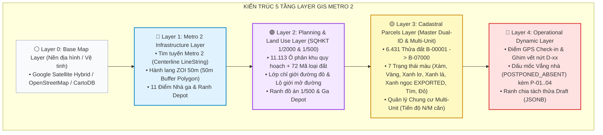

# Đặc Tả Kiến Trúc 5 Lớp Layer GIS & Quy Tắc Bảo Toàn Dữ Liệu Đa Vai Trò (GIS Layer Architecture & Non-Destructive Multi-Role Specification)

> [!IMPORTANT]
> **TÀI LIỆU ĐẶC TẢ KỸ THUẬT GIS METRO 2 & DỮ LIỆU QUY HOẠCH SQHKT (`KS003.xlsx`):**
> Tài liệu này chuẩn hóa toàn bộ cấu trúc 5 tầng Layer GIS không gian (Spatial Stacks), cơ chế hiển thị thửa đất đơn lẻ và chung cư nhiều căn hộ (Multi-Unit Parcels), ma trận phân quyền 4 vai trò (RBAC Role-Layer Matrix), mô hình dữ liệu PostGIS 16, các quy ước bảo toàn dữ liệu phi phá hủy (Non-destructive Multi-Role Integrity), và các API truy xuất lớp bản đồ.

---

## 1. TỔNG QUAN VỀ NGUỒN DỮ LIỆU & BỐI CẢNH DỰ ÁN

Hệ thống Khảo sát Hiện trạng Công trình Tuyến Metro Số 2 (Bến Thành – Tham Lương) tích hợp bộ dữ liệu không gian lớn từ:
1. **Dữ liệu Quy hoạch Đô thị SQHKT (`data/KS003/KS003.xlsx`):**
   - **6.431 Thửa đất địa chính** trải dài qua 6 quận (Tân Bình, Quận 3, Quận 10, Quận 1, Tân Phú, Quận 12).
   - **11.113 Ô quy hoạch phân khu chi tiết 1/2000** thuộc **72 loại mục đích sử dụng đất thô** của Sở QHKT.
   - **4.350 Thửa đất tiếp giáp lộ giới mở đường** (CMT8, Trường Chinh, v.v.).
   - **650 Bản ghi đồ án 1/500 & Điều chỉnh cục bộ (ĐCCB)**.
2. **Dữ liệu Hạ tầng Metro Số 2:**
   - Tim tuyến Metro 2 (Đoạn ngầm và đoạn trên cao).
   - Hành lang ảnh hưởng rung chấn/lún **ZOI 50 mét (Zone of Influence)**.
   - 11 Nhà ga hành khách & Ranh Ga Depot Tham Lương.
3. **Dữ liệu Nghiệp vụ Khảo sát Thực địa (Field Survey Data):**
   - Vị trí GPS & ảnh selfie chấm công thực địa của Surveyor.
   - Ghim khuyết tật nứt, lún, nghiêng ($D-xx$, $Z-xx$) kèm ảnh $CTX$ và $CU$.
   - Các biến động chia tách/gộp thửa phát sinh thực tế (`ParcelMutationEvent`).
   - Dữ liệu khảo sát độc lập từng căn hộ trong các tòa nhà Chung cư (`BuildingUnit`).

---

## 2. CẤU TRÚC 5 TẦNG LAYER GIS (5-LAYER SPATIAL SANDWICH)

Bản đồ được tổ chức thành 5 tầng layer tách biệt theo mô hình từ **Tĩnh/Bất biến** ở đáy lên **Động/Nghiệp vụ** ở trên cùng:



### Chi Tiết Từng Lớp Layer:

#### Layer 0: Base Map (Bản đồ nền)
- **Kiểu dữ liệu:** Raster / Vector Tile Server (XYZ Tiles).
- **Mục đích:** Cung cấp thông tin thị giác địa hình, đường sá, tòa nhà lân cận.
- **Tính chất:** **Read-Only 100%**.

#### Layer 1: Metro 2 Infrastructure (Hạ tầng tuyến Metro 2)
- **Bảng CSDL:** `metro_alignments`, `metro_zones`.
- **Dữ liệu:**
  - `centerline_geom`: `GEOMETRY(LineString, 4326)` - Tim tuyến Metro 2.
  - `zoi_polygon_geom`: `GEOMETRY(Polygon, 4326)` - Vùng đệm 50m tính từ tim tuyến (`ST_Buffer(centerline, 0.00045)`).
  - `boundary_geom`, `center_geom`: Ranh giới và tâm của 11 Nhà ga.
- **Tính chất:** **Bất biến (Immutable)** với hiện trường, chỉ cập nhật bởi `SUPER_ADMIN`.

#### Layer 2: Planning & Land Use (Quy hoạch Đô thị 1/2000 & 1/500)
- **Bảng CSDL:** `planning_zones`.
- **Dữ liệu trích từ `KS003.xlsx`:**
  - `zone_code`: Mã ô quy hoạch SQHKT (VD: `[III.9]`, `[II.25]`).
  - `land_use_name_raw`: Tên loại đất thô (72 danh mục SQHKT: `Đất ở hiện hữu`, `Đất giao thông`, `Đất phức hợp`...).
  - `land_use_category`: Nhóm chuẩn hóa (`RESIDENTIAL`, `COMMERCIAL`, `PUBLIC`, `TRANSPORT`, `INDUSTRIAL`, `GREEN`).
  - `max_building_height_floors`, `max_density_percent`, `max_fsi`: Chỉ tiêu quy hoạch.
  - `road_setback_meters`, `is_road_setback_affected`: Chỉ giới đường đỏ mở rộng đường.
  - `geom`: `GEOMETRY(Polygon/MultiPolygon, 4326)`.
- **Tính chất:** **Tham chiếu pháp lý (Read-Only)**.

#### Layer 3: Cadastral Parcels (Thửa đất Địa chính Dual-ID & Chung cư Multi-Unit)
- **Bảng CSDL:** `parcels`, `building_units`.
- **Dữ liệu:**
  - `official_cadastral_code`: Mã địa chính gốc SQHKT (VD: `KS003-P1024`, `Tờ 15 - Thửa 89`).
  - `project_parcel_code`: Mã dự án Metro 2 BẤT BIẾN (`B-00001` đến `B-07000`, mở rộng `B-07001` trở lên).
  - `location_geom`: `GEOMETRY(Point, 4326)` - Tọa độ tâm thửa.
  - `cadastral_polygon_geom`: `GEOMETRY(Polygon, 4326)` - Đa giác thửa đất gốc.
  - `footprint_polygon_geom`: `GEOMETRY(Polygon, 4326)` - Đa giác ranh công trình thực tế (Bước 6).
  - `is_multi_unit`: `BOOLEAN` - Cờ đánh dấu công trình Chung cư / Nhiều căn hộ.
  - `total_units`, `completed_units`, `exported_units`: Tiến độ khảo sát căn hộ nội bộ tòa nhà.
  - `survey_status`: 7 màu hiển thị chuẩn:
    - `NOT_SURVEYED` (Xám `#94a3b8`): Chưa nhận khảo sát.
    - `IN_PROGRESS` (Vàng `#f59e0b`): Đang thực hiện khảo sát.
    - `SUBMITTED` (Xanh lơ `#0284c7`): Đã nộp, chờ duyệt.
    - `APPROVED_PHASE1` (Xanh lá `#16a34a`): Đã duyệt Phase 1.
    - `EXPORTED` (Xanh ngọc `#047857`): **Đã xuất báo cáo pháp lý & Khóa bất biến**.
    - `POSTPONED_ABSENT` (Tím `#9333ea`): Vắng nhà (Đủ 100% ngoại quan Bước 1).
    - `REJECTED` (Đỏ `#ef4444`): Bị trả về làm lại.
- **Quy tắc hiển thị màu cho Chung cư:**
  - $0$ căn xong $\to$ Màu xám `NOT_SURVEYED`.
  - Đang khảo sát dở dang $\to$ Màu vàng `IN_PROGRESS` kèm huy hiệu tiến độ (VD: `32/50 căn`).
  - 100% căn đã duyệt $\to$ Màu xanh lá `APPROVED_PHASE1`.
  - 100% căn đã xuất báo cáo $\to$ Màu xanh ngọc `EXPORTED`.

#### Layer 4: Operational Dynamic Layer (Nghiệp vụ Hiện trường & Vắng Nhà)
- **Bảng CSDL:** `timekeeping_checkins`, `parcel_mutation_events`, `damage_zones`, `defect_items`, `absentee_logs`.
- **Dữ liệu:**
  - Vị trí GPS & ảnh selfie chấm công của Surveyor.
  - Tọa độ vết nứt $D-xx$ trên ảnh bối cảnh và định vị không gian.
  - Đa giác ranh đề xuất Tách/Gộp thửa dạng `JSONB` chờ Zone Admin duyệt.
  - Vết ghi nhận Vắng nhà: Tọa độ đứng chụp ảnh P-01..04, số lần đến `attemptCount`, lý do vắng.
- **Tính chất:** **Động hoàn toàn (Event Sourcing & Vector Overlays)**.

---

## 3. MA TRẬN PHÂN QUYỀN TRUY CẬP LAYER THEO 4 VAI TRÒ (RBAC ROLE-LAYER MATRIX)

| Vai Trò Người Dùng | Layer 0 (Nền) | Layer 1 (Tuyến & ZOI 50m) | Layer 2 (Quy hoạch 1/2000) | Layer 3 (Thửa đất Dual-ID & Chung cư) | Layer 4 (Nghiệp vụ / GPS / Nứt / Vắng) |
| :--- | :---: | :---: | :---: | :---: | :---: |
| **`SUPER_ADMIN`** *(Toàn tuyến)* | Bật / Tắt | **Full** (Import / Cập nhật ranh) | **Full** (Import SQHKT mới) | **Toàn tuyến 11 Ga** (Xem KPI ~7.000 căn) | **Full** (Xem toàn bộ GPS chấm công, Audit Alert) |
| **`ZONE_ADMIN`** *(Quản lý Ga)* | Bật / Tắt | Xem (Phạm vi Ga phụ trách) | Xem & Đối soát ranh quy hoạch | **Phân khu Ga** (Thẩm định Split-Pane, Xuất báo cáo EXPORTED) | **Phê duyệt / Từ chối** (Duyệt GPS, Duyệt Tách thửa, Duyệt Báo cáo) |
| **`SURVEYOR`** *(Hiện trường)* | Bật / Tắt | Xem mờ (Tham chiếu ranh 50m) | Tùy chọn Bật/Tắt (Tham chiếu chức năng đất) | **Tương tác trực tiếp** (Quét cạn, nhận P1/P2, xem sơ đồ Chung cư) | **Tạo mới & Gửi duyệt** (Ghim nứt $D-xx$, Check-in GPS, Báo vắng nhà, Đề xuất tách thửa) |
| **`CONTRACTOR`** *(Nhà thầu / Khách)* | Xem | Xem | Xem | **Chỉ xem thửa đã duyệt/export** (`APPROVED`, `EXPORTED`) | Chỉ xem các vết nứt & Báo cáo đã công bố |

---

## 4. 6 QUY TẮC BẢO TOÀN DỮ LIỆU ĐA VAI TRÒ (NON-DESTRUCTIVE INTEGRITY RULES)

### Quy tắc 1: Bất biến Phân tầng (Layer Isolation & Immutability)
- Layer 1 & Layer 2 là Read-Only tuyệt đối đối với Client của Surveyor và Zone Admin.
- API Backend từ chối mọi thao tác `POST/PUT/DELETE` từ Surveyor lên `planning_zones` và `metro_alignments`.

### Quy tắc 2: Kiến trúc Phủ đè Phi Phá hủy (Non-destructive Vector Overlay & CQRS)
- Khi Surveyor phát hiện nhà bị chia nhỏ (Tách thửa): Tuyệt đối KHÔNG xóa thửa cũ `B-00002` trên Layer 3.
- Tạo một bản ghi sự kiện `ParcelMutationEvent` lưu trên **Layer 4** với trạng thái `PROPOSED_BY_SURVEYOR`.
- Thửa gốc trên Layer 3 vẫn giữ nguyên trạng thái `ACTIVE` và chỉ mang cờ tạm `is_mutation_pending = true`.

### Quy tắc 3: Giao dịch PostGIS An toàn & Hoàn nguyên (ACID Transaction & Rollback)
```sql
-- Khi Zone Admin Phê duyệt Tách thửa:
BEGIN;
  UPDATE parcels SET lifecycle_status = 'SPLIT_DEPRECATED' WHERE id = :sourceParcelId;
  INSERT INTO parcels (zone_id, project_parcel_code, location_geom, cadastral_polygon_geom, ...)
  VALUES (...), (...);
  UPDATE parcel_mutation_events SET status = 'APPROVED', approved_at = NOW() WHERE id = :eventId;
COMMIT;
-- Nếu có lỗi hoặc Zone Admin Reject: ROLLBACK và Layer 3 hoàn toàn nguyên vẹn.
```

### Quy tắc 4: Phân Quyền Cấp Dòng Theo Ga (Row-Level Security by Zone)
- Backend tự động gán điều kiện `WHERE zone_id = req.user.assignedZoneId` cho mọi truy vấn dữ liệu của Surveyor và Zone Admin.
- Surveyor Ga S9 không thể truy cập, sửa đổi hay tạo ghim khuyết tật trên địa bàn của Ga S8 hoặc Ga S10.

### Quy tắc 5: Khóa Lạc Quan Tránh Tranh Chấp (Optimistic Locking & State Guards)
- Mọi bản ghi `parcels` và `building_units` đều có trường `survey_status` và `version`.
- Khi Surveyor A đã bấm nhận khảo sát (`status = IN_PROGRESS`), hệ thống khóa lại. Surveyor B nếu bấm vào cùng lúc sẽ nhận mã lỗi `409 CONFLICT: Parcel/Unit is currently being surveyed by another user`.

### Quy tắc 6: Khóa Đóng Băng Bất Biến Khi Xuất Báo Cáo (Data Freeze on EXPORTED)
- Khi hồ sơ đạt trạng thái `EXPORTED`, hệ thống kích hoạt trigger khóa cứng toàn bộ bảng `base_survey_reports`, `damage_zones`, `defect_items`. Mọi hành vi cập nhật hay xóa bỏ đều bị từ chối ở tầng Database.

---

## 5. ĐẶC TẢ CÁC API TRUY XUẤT LỚP LAYER GIS (GIS LAYER ENDPOINTS)

### 5.1. `GET /api/v1/gis/layers/overview` *(Metadata 5 Lớp Layer)*
- Trả về danh sách 5 layer, trạng thái hiển thị mặc định và số lượng đối tượng hình học theo từng Ga.

### 5.2. `GET /api/v1/gis/layers/parcels` *(Lớp Thửa Đất & Chung Cư)*
- **Query Params:** `zoneId`, `status`, `buildingType` (ALL / INDEPENDENT / APARTMENT), `isAbsentee` (true/false), `bbox`.
- **Phản hồi:** GeoJSON `FeatureCollection` kèm thông tin tiến độ căn hộ (`totalUnits`, `completedUnits`, `exportedUnits`).

### 5.3. `GET /api/v1/gis/parcels/{id}/units` *(Danh Sách Căn Hộ Chung Cư Theo Tầng)*
- **Query Params:** `parcelId`, `floorLevel`.
- **Phản hồi:** Danh sách căn hộ thuộc tòa nhà kèm trạng thái khảo sát của từng căn (`NOT_SURVEYED`, `IN_PROGRESS`, `SUBMITTED`, `APPROVED`, `EXPORTED`, `POSTPONED_ABSENT`).

### 5.4. `GET /api/v1/gis/layers/planning` *(Lớp Quy hoạch SQHKT 1/2000)*
- Trả về các ô quy hoạch kèm thông số lộ giới, tầng cao, mật độ xây dựng.

### 5.5. `GET /api/v1/gis/layers/metro-infrastructure` *(Tim tuyến & ZOI 50m)*
- Trả về GeoJSON Tim tuyến Metro 2 (`LineString`), Vùng đệm 50m (`Polygon`), 11 Nhà ga (`Point`).
