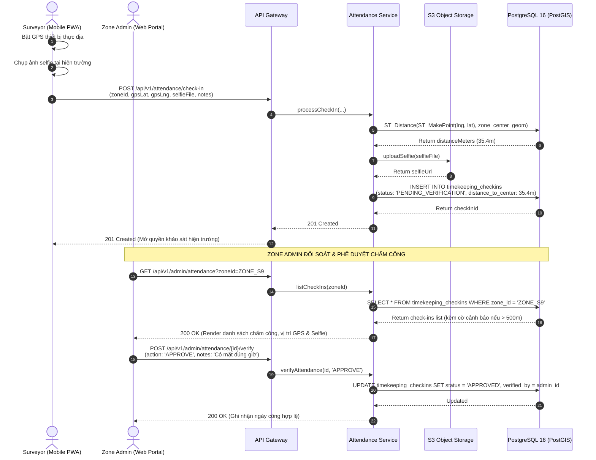
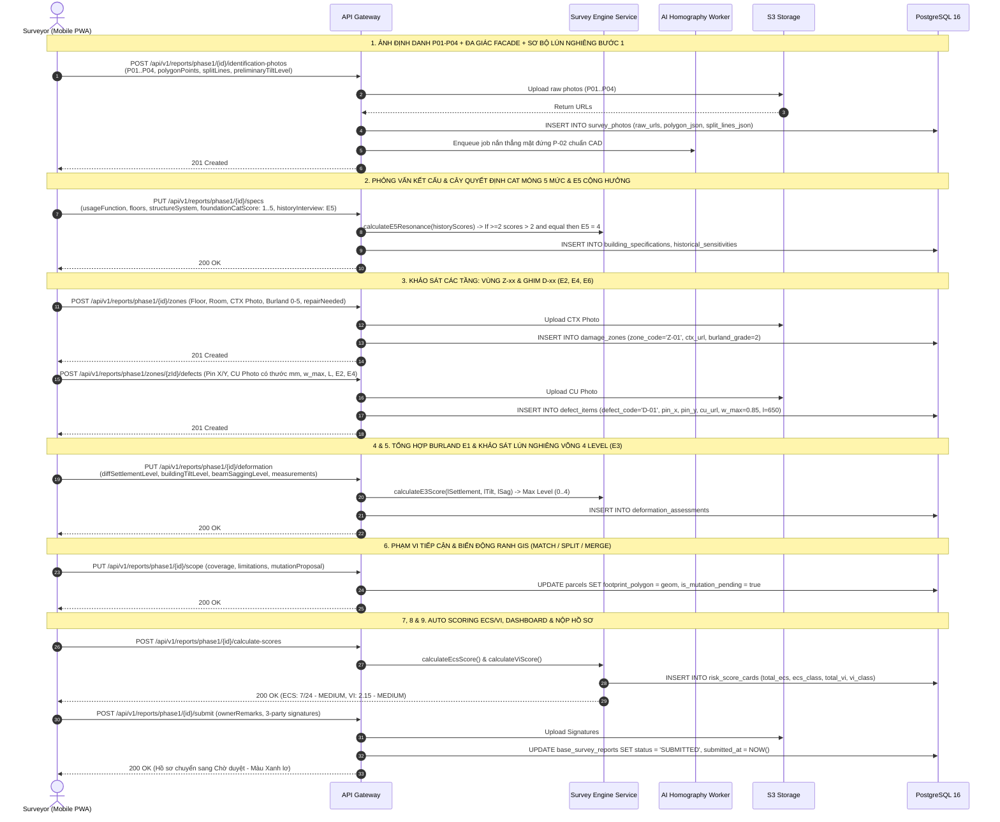
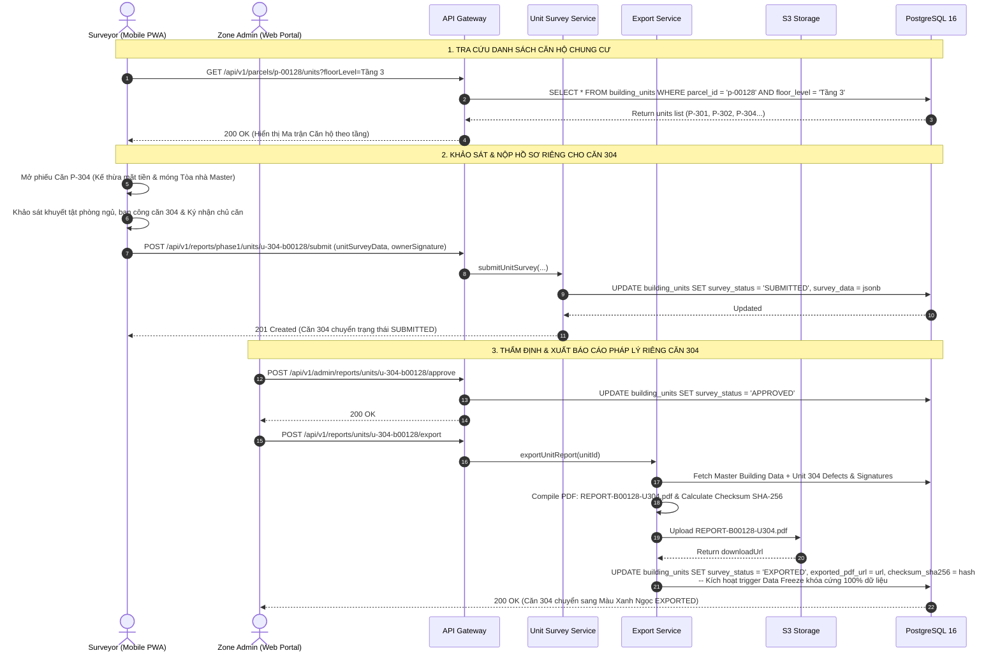

# Đặc Tả Chi Tiết Sơ Đồ Tuần Tự Theo Từng Đối Tượng (Sequence Diagrams Specification)

> [!IMPORTANT]
> **TÀI LIỆU ĐẶC TẢ SƠ ĐỒ TUẦN TỰ (UML SEQUENCE DIAGRAMS) ĐỒNG BỘ 100% VỚI HỆ THỐNG API & STATE MACHINE:**
> Toàn bộ luồng tương tác giữa Actors (`SURVEYOR`, `ZONE_ADMIN`, `SUPER_ADMIN`, `CONTRACTOR`), API Gateway, Backend Services, AI Workers, S3 Storage và PostgreSQL/PostGIS đã được cập nhật đầy đủ, bao gồm: Luồng kiểm soát Khảo sát Vắng nhà (Absentee Survey Control Gate), Khảo sát và xuất báo cáo độc lập cho Căn hộ Chung cư (Multi-Unit Flow), tính điểm kỹ thuật $E_1 \dots E_6, V_1 \dots V_6$ và quản lý trạng thái `EXPORTED`.

---

## 1. PHÂN HỆ CÁN BỘ KHẢO SÁT HIỆN TRƯỜNG (`SURVEYOR`)

---

### 1.1. Sequence 1.1: Chấm Công GPS Thực Địa & Phê Duyệt 2 Chiều (UC-02)



---

### 1.2. Sequence 1.2: Quét Cạn Thửa Đất Ad-hoc & Khảo Sát Vắng Nhà (Absentee Survey Control Gate)

```mermaid
sequenceDiagram
    autonumber
    actor S as Surveyor (Mobile PWA)
    participant GW as API Gateway
    participant PS as Parcel Service
    participant FS as S3 Storage
    participant DB as PostgreSQL 16 (PostGIS)

    Note over S,DB: TÌNH HUỐNG 1: CHỦ NHÀ ĐI VẮNG / KHÓA CỬA / TỪ CHỐI
    S->>S: Bấm '🏠 Báo Vắng Nhà' tại Bước 1 (Kích hoạt Chế độ Khảo sát Vắng)
    S->>S: Hoàn thành 100% dữ liệu ngoại quan Bước 1:<br>• Số nhà & Tuyến đường<br>• Nhóm đối tượng (General/Important/Critical)<br>• Khảo sát tiếp giáp 3 hướng<br>• Chụp đủ 4 ảnh P-01..P-04<br>• Nhập lý do vắng mặt
    
    S->>GW: POST /api/v1/surveys/phase1/submit-absentee<br>(parcelId, completeStep1SurveyData, photoP01..P04, absenteeReason)
    GW->>PS: validateAndSubmitAbsentee(surveyData)
    PS->>PS: Kiểm tra điều kiện Gate: Đã đủ 100% thông tin Bước 1?
    PS->>FS: Upload bộ 4 ảnh P01-P04
    FS-->>PS: Return photoUrls
    PS->>DB: UPDATE parcels SET survey_status = 'POSTPONED_ABSENT', attempt_count = attempt_count + 1<br>INSERT INTO survey_absence_logs (parcel_id, reason, is_step1_complete: true)
    DB-->>PS: Updated
    PS-->>S: 201 Created (Thửa đất chuyển sang Màu Tím POSTPONED_ABSENT trên bản đồ)

    Note over S,DB: TÌNH HUỐNG 2: TỰ NHẬN NHÀ LIỀN KỀ ĐỂ QUÉT CẠN (AD-HOC SWEEP PICK)
    S->>GW: GET /api/v1/parcels/nearby?lat=10.7981&lng=106.6456&radius=150
    GW->>PS: findNearbyUnsurveyedParcels(...)
    PS->>DB: ST_DWithin(geom, current_location, 150) AND status = 'NOT_SURVEYED'
    DB-->>PS: Return nearby parcels (B-00106, B-00107...)
    PS-->>S: 200 OK (Danh sách nhà lân cận có thể tự nhận)

    S->>GW: POST /api/v1/parcels/p-00106/start-survey<br>(phase: 'PHASE_1', claimReason: 'Nhà 00105 vắng mặt')
    GW->>PS: startAdHocSurvey(parcelId, surveyorId)
    PS->>DB: BEGIN TRANSACTION; Check lock; INSERT INTO base_survey_reports; UPDATE parcels SET status = 'IN_PROGRESS'; COMMIT;
    DB-->>PS: Return reportId: 'rep-p1-00106'
    PS-->>S: 201 Created (Thửa đất chuyển sang Màu Vàng & Mở form khảo sát 9 bước)
```

---

### 1.3. Sequence 1.3: Luồng Khảo Sát Giai Đoạn 1 (Phase 1 Baseline 9 Bước Chuẩn)



---

### 1.4. Sequence 1.4: Khảo Sát & Xuất Báo Cáo Căn Hộ Chung Cư (Multi-Unit Apartment Workflow)



---

## 2. PHÂN HỆ TỔ TRƯỞNG & QUẢN TRỊ PHÂN KHU (`ZONE_ADMIN`)

```mermaid
sequenceDiagram
    autonumber
    actor ZA as Zone Admin (Web Portal)
    participant GW as API Gateway
    participant AR as Audit Rules Engine
    participant PDF as PDF/A Digital Signature Engine
    participant FS as S3 Storage
    participant DB as PostgreSQL 16

    Note over AR,DB: HỒ SƠ NỘP VỀ -> TỰ ĐỘNG QUÉT CẢNH BÁO GIAN LẬN
    AR->>DB: Check GPS distance (Chụp cách tâm nhà > 50m?)
    AR->>DB: Check Duration (Thời gian làm < 5 phút?)
    AR->>DB: Check Structural Critical Flag / Thiếu thước đo mm
    AR->>DB: INSERT INTO audit_alert_items (severity: 'HIGH', type: 'GPS_DISTANCE_DISCREPANCY')

    ZA->>GW: GET /api/v1/admin/reports/{id}/audit-view
    GW->>DB: Query Report Full Tree (Left: Cấu kiện + ECS/VI, Right: Cặp ảnh CTX/CU)
    DB-->>ZA: 200 OK (Mở Split-Pane, kích hoạt Kính lúp 400% soi thước đo)

    Note over ZA,DB: ZONE ADMIN PHÊ DUYỆT BÁO CÁO (PHÍM 'A')
    ZA->>GW: POST /api/v1/admin/reports/{id}/approve (judgementNotes)
    GW->>PDF: generateOfficialPdfA(reportId)
    PDF->>PDF: Apply Digital Signature + Watermark + Embed Checksum SHA-256
    PDF->>FS: Upload REPORT_B00105_PHASE1_OFFICIAL.pdf
    FS-->>PDF: Return officialPdfUrl
    GW->>DB: UPDATE base_survey_reports SET status = 'APPROVED', official_pdf_url = url; UPDATE parcels SET status = 'APPROVED_PHASE1'
    DB-->>ZA: 200 OK (Thửa đất chuyển sang Màu Xanh Lá trên bản đồ GIS)
```
