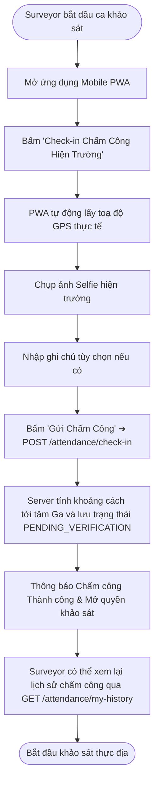
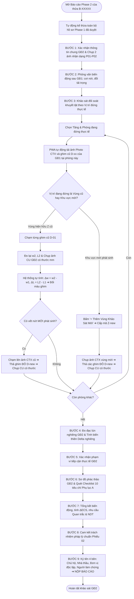
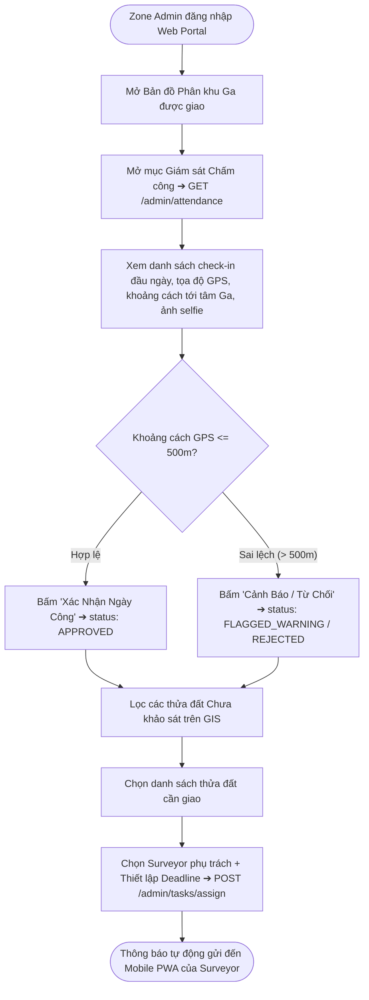
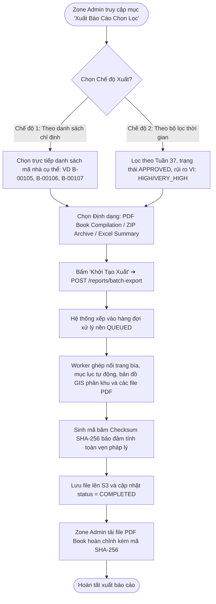
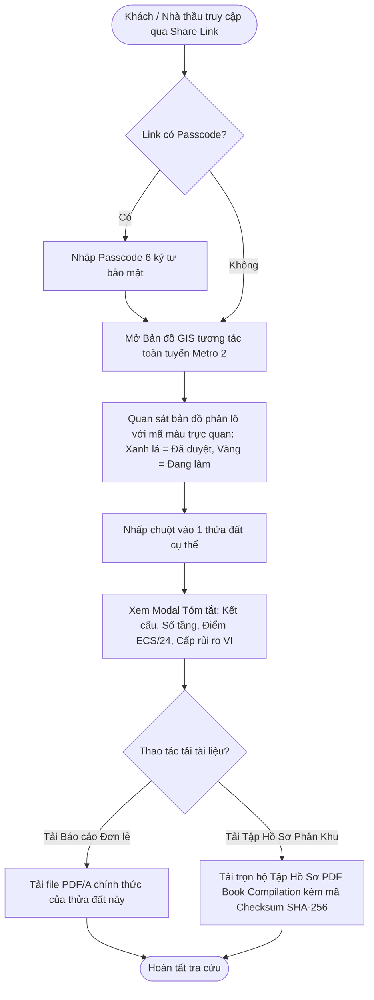

# Đặc Tả Chi Tiết Sơ Đồ Hoạt Động Theo Từng Đối Tượng (Activity Diagrams Specification)

> [!IMPORTANT]
> **TÀI LIỆU ĐẶC TẢ SƠ ĐỒ HOẠT ĐỘNG (UML ACTIVITY DIAGRAMS) ĐỒNG BỘ 100% VỚI HỆ THỐNG API:**
> Toàn bộ luồng hoạt động của 4 Vai trò (`SURVEYOR`, `ZONE_ADMIN`, `SUPER_ADMIN`, `CONTRACTOR_GUEST`) đã được chuẩn hóa chi tiết, loại bỏ hoàn toàn các hố đen chức năng.

---

## 1. PHÂN HỆ CÁN BỘ KHẢO SÁT HIỆN TRƯỜNG (`SURVEYOR`)

---

### 1.1. Activity 1.1: Chấm Công GPS & Xem Lịch Sử Chấm Công (UC-02)



---

### 1.2. Activity 1.2: Quét Cạn Thửa Đất Ad-hoc & Xử Lý Vắng Nhà (UC-03)

```mermaid
flowchart TD
    StartAdhoc([Khảo sát thực tế theo danh sách phân công]) --> ArriveParcel[Đến trước công trình được giao]
    ArriveParcel --> CheckPresence{Chủ nhà có mặt và mở cửa?}
    
    %% NHÁNH 1: VẮNG NHÀ
    CheckPresence -- Vắng nhà / Cửa khóa / Từ chối --> ClickAbsent[Bấm 'Ghi nhận Vắng Nhà']
    ClickAbsent --> SelectReason[Chọn lý do: HOMEOWNER_ABSENT / LOCKED_GATE / REFUSED_ACCESS]
    SelectReason --> SnapProof[Chụp ảnh cửa khóa làm bằng chứng]
    SnapProof --> SubmitAbsent[Gửi POST /parcels/{id}/record-absence]
    SubmitAbsent --> UpdatePurple[Thửa đất chuyển sang Màu Tím POSTPONED_ABSENT & Tăng attemptCount]
    
    UpdatePurple --> NeedSweep{Tiếp tục khảo sát nhà bên cạnh?}
    NeedSweep -- Có --> OpenNearMap[Mở bản đồ GIS hoặc danh sách GET /parcels/nearby]
    OpenNearMap --> TapNearbyParcel[Chạm vào ô thửa liền kề Màu Xám NOT_SURVEYED]
    TapNearbyParcel --> ClickClaim[Bấm 'Nhận & Khảo Sát Ngay' ➔ POST /parcels/{id}/start-survey]
    ClickClaim --> UpdateYellow[Thửa đất chuyển sang Màu Vàng IN_PROGRESS & Bắt đầu làm hồ sơ]
    
    %% NHÁNH 2: CÓ MẶT
    CheckPresence -- Có mặt --> OpenSurveyForm[Bắt đầu làm hồ sơ khảo sát 9 bước]
    UpdateYellow --> OpenSurveyForm
```

---

### 1.3. Activity 1.3: Luồng Khảo Sát Hiện Trường Giai Đoạn 1 (Phase 1 Baseline 9 Bước)

```mermaid
flowchart TD
    StartP1([Bắt đầu Khảo sát Giai đoạn 1]) --> Step1[BƯỚC 1: Tiếp cận ngoài nhà & Chụp 4 ảnh định danh P01-P04]
    
    %% BƯỚC 1
    Step1 --> SnapP02[Chụp ảnh toàn cảnh mặt đứng P-02]
    SnapP02 --> AnnotateP02[Chấm mảng N điểm đa giác góc nhà N>=3 + Kéo line phân tầng + Nhập kích thước dóng]
    AnnotateP02 --> PushAIQueue[Hệ thống tự động đẩy ảnh P-02 vào hàng đợi AI nắn thẳng mặt đứng chuẩn CAD]
    
    %% BƯỚC 2
    PushAIQueue --> Step2[BƯỚC 2: Phỏng vấn kết cấu, số tầng, móng CAT 1-5 & Lịch sử sự cố E5]
    
    %% BƯỚC 3
    Step2 --> Step3[BƯỚC 3: Khảo sát chi tiết từng tầng & Mảng tường]
    Step3 --> LoopFloors[Đi từ Tầng trệt lên Tầng mái]
    LoopFloors --> SnapCTX[Chụp 1 ảnh bối cảnh Photo CTX ➔ Tạo Vùng Z-01, Z-02... ➔ Chốt Burland 0-5]
    SnapCTX --> PinDefects[Chạm lên ảnh Photo CTX thả ghim D-01, D-02...]
    PinDefects --> SnapCU[Bấm từng ghim: Nhập w_max, L & Chụp ảnh cận cảnh CU có thước đo vạch mm]
    SnapCU --> MoreZones{Còn mảng tường/phòng khác?}
    MoreZones -- Còn --> LoopFloors
    
    %% BƯỚC 4
    MoreZones -- Hết --> Step4[BƯỚC 4: Đo đạc Lún - Nghiêng mặt trước X, hông Y, nghiêng sàn, võng dầm bằng laser]
    
    %% BƯỚC 5
    Step4 --> Step5[BƯỚC 5: Cập nhật Đa giác ranh nhà Footprint trên bản đồ GIS]
    Step5 --> CheckSplit{Phát hiện nhà thực tế chia nhỏ?}
    CheckSplit -- Có --> ProposeSplit[Đề xuất Tách thửa ➔ Tự động cấp mã B-07001, B-07002 từ dải mở rộng]
    CheckSplit -- Không --> Step6
    ProposeSplit --> Step6
    
    %% BƯỚC 6 & 7 & 8 & 9
    Step6[BƯỚC 6: Upload Sơ đồ phác thảo Damage Sketch / CAD] --> Step7[BƯỚC 7: Hệ thống Tự động Tính Điểm ECS/24 & Phân nhóm Rủi ro VI]
    Step7 --> Step8[BƯỚC 8: Kết luận kỹ thuật, kiến nghị mốc quan trắc & Đánh giá rủi ro BRA]
    Step8 --> Step9[BƯỚC 9: Ký tên xác nhận chủ hộ & cán bộ khảo sát ➔ Bấm NỘP HỒ SƠ ➔ SUBMITTED]
    Step9 --> EndP1([Chuyển trạng thái sang Chờ duyệt - Màu Cam])
```



---

### 1.4. Activity 1.4: Luồng Khảo Sát Giai Đoạn 2 (Phase 2 Pre-Construction Delta Verification)



---

## 2. PHÂN HỆ QUẢN TRỊ PHÂN KHU (`ZONE_ADMIN`)

---

### 2.1. Activity 2.1: Giám Sát Chấm Công & Phân Công Nhiệm Vụ Trên GIS



---

### 2.2. Activity 2.2: Động Cơ Cảnh Báo Bất Thường & Thẩm Định Split-Pane Phê Duyệt

```mermaid
flowchart TD
    StartAudit([Hồ sơ nộp về SUBMITTED]) --> AutoRuleEngine[Động cơ Audit Alert Engine tự động quét 5 quy tắc]
    
    AutoRuleEngine --> CheckAnomalies{Phát hiện bất thường?}
    CheckAnomalies -- Có: GPS lệch >50m / Khảo sát <5p / Nứt Critical / Thiếu thước mm --> FlagAlert[Gắn Cờ Cảnh Báo & Hiển thị ưu tiên tại /admin/reports/audit-alerts]
    CheckAnomalies -- Không --> NormalQueue[Xếp vào danh sách chờ duyệt chuẩn]
    
    FlagAlert --> OpenSplitPane[Zone Admin mở giao diện Split-Pane Đối soát]
    NormalQueue --> OpenSplitPane
    
    OpenSplitPane --> LeftPane[NỬA TRÁI: Cây cấu kiện, Điểm số ECS/VI, Đa giác ranh thửa Tách/Gộp]
    OpenSplitPane --> RightPane[NỬA PHẢI: Cặp ảnh CTX + Cận cảnh CU có thước đo mm]
    RightPane --> ZoomMagnifier[Rê chuột kích hoạt KÍNH LÚP 400% soi vạch milimet thước đo]
    
    LeftPane --> CheckMutation{Có đề xuất Tách thửa?}
    CheckMutation -- Có --> ReviewMutation[Xem so sánh ranh cũ/mới ➔ Duyệt hoặc Bác bỏ Tách thửa]
    CheckMutation -- Không --> AuditDecision
    ReviewMutation --> AuditDecision{Quyết định Phê duyệt?}
    
    %% DUYỆT
    AuditDecision -- DUYỆT (Phím 'A') --> ClickApprove[Bấm 'Phê Duyệt' ➔ POST /admin/reports/{id}/approve]
    ClickApprove --> GenPdfA[Hệ thống tự động sinh file PDF/A chính thức đóng dấu ký số điện tử]
    GenPdfA --> UpdateGreen[Thửa đất chuyển sang Màu Xanh Lá APPROVED]
    
    %% TRẢ VỀ
    AuditDecision -- TRẢ VỀ (Phím 'R') --> ClickReject[Bấm 'Trả Về' ➔ POST /admin/reports/{id}/reject]
    ClickReject --> EnterReason[Bắt buộc nhập Lý do kỹ thuật: VD 'Ảnh CU D-01 thiếu thước đo mm']
    EnterReason --> Rollback[Hệ thống rollback biến động & Thửa đất chuyển sang Màu Đỏ REJECTED]
    
    UpdateGreen --> EndAudit([Hoàn tất thẩm định])
    Rollback --> EndAudit
```

---

### 2.3. Activity 2.3: Xuất Báo Cáo Có Chọn Lọc (Zone Selective Batch Export)



---

## 3. PHÂN HỆ TỔNG QUẢN TRỊ TOÀN TUYẾN (`SUPER_ADMIN`)

---

### 3.1. Activity 3.1: Quản Trị Vòng Đời Người Dùng, Lớp Bản Đồ GIS & Trung Tâm Xuất Toàn Tuyến

```mermaid
flowchart TD
    StartSA([Super Admin đăng nhập Web Master Portal]) --> ChooseAction{Chọn phân hệ quản trị?}
    
    %% QUẢN TRỊ NGƯỜI DÙNG
    ChooseAction -- Quản trị Người dùng --> UserOps{Thao tác tài khoản?}
    UserOps -- Cấp mới --> CreateUser[Tạo tài khoản Zone Admin / Surveyor ➔ POST /admin/users]
    UserOps -- Sửa / Điều chuyển Ga --> UpdateUser[Cập nhật chức vụ / Đổi Ga phụ trách ➔ PUT /admin/users/{id}]
    UserOps -- Khóa / Mở khóa --> LockUser[Khóa hoặc Kích hoạt tài khoản ➔ PUT /admin/users/{id}/status]
    UserOps -- Reset Mật khẩu --> ResetPass[Đặt lại mật khẩu bảo mật ➔ POST /admin/users/{id}/reset-password]
    UserOps -- Xóa an toàn --> DeleteUser[Soft-delete tài khoản ➔ DELETE /admin/users/{id}]
    
    %% QUẢN LÝ GIS
    ChooseAction -- Quản lý Lớp GIS Tuyến Metro 2 --> ImportGis[Import hàng loạt thửa đất từ GeoJSON ➔ POST /admin/gis/import-parcels]
    ImportGis --> UpdateMetroLine[Cập nhật Tim tuyến Metro 2 & Tự động buffer ZOI 50m ➔ PUT /admin/gis/layers/metro-alignment]
    
    %% XUẤT TOÀN TUYẾN & QUẢN LÝ EXPORT
    ChooseAction -- Trung tâm Quản trị Xuất Báo cáo --> ExportOps{Thao tác Export Hub?}
    ExportOps -- Xuất Toàn Tuyến 11 Ga --> GlobalExport[Đóng gói toàn bộ 11 Ga (~7.000 căn) ➔ POST /admin/reports/batch-export]
    ExportOps -- Xem Lịch sử Export --> ViewExportHistory[Xem danh sách tất cả các đợt export của toàn hệ thống ➔ GET /admin/reports/exports]
    ExportOps -- Thu hồi / Hủy file --> RevokeExport[Thu hồi link tải và xóa file trên S3 ➔ DELETE /admin/reports/exports/{batchId}]
    
    CreateUser --> EndSA([Hoàn tất])
    UpdateUser --> EndSA
    LockUser --> EndSA
    ResetPass --> EndSA
    DeleteUser --> EndSA
    UpdateMetroLine --> EndSA
    GlobalExport --> EndSA
    ViewExportHistory --> EndSA
    RevokeExport --> EndSA
```

---

## 4. PHÂN HỆ NHÀ THẦU THI CÔNG & KHÁCH TRA CỨU (`CONTRACTOR_GUEST`)

---

### 4.1. Activity 4.1: Tra Cứu Bản Đồ GIS Quy Hoạch & Tải Tập Hồ Sơ Đã Công Bố


