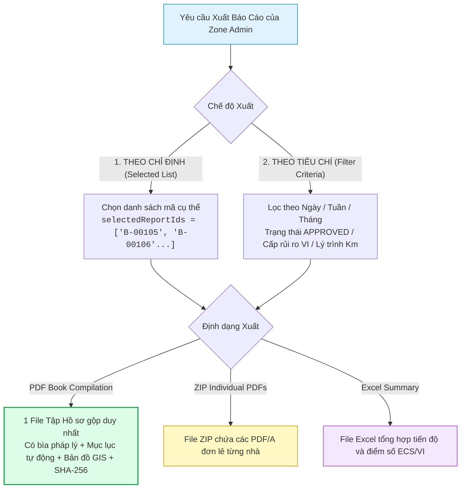
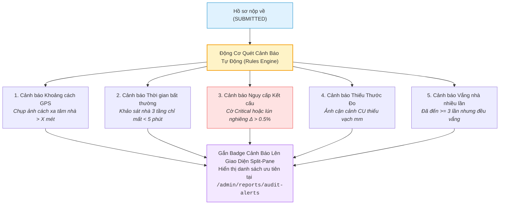
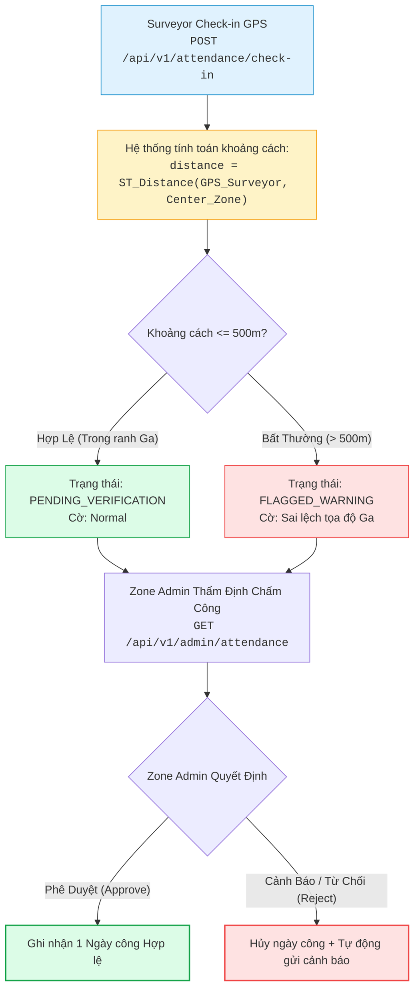
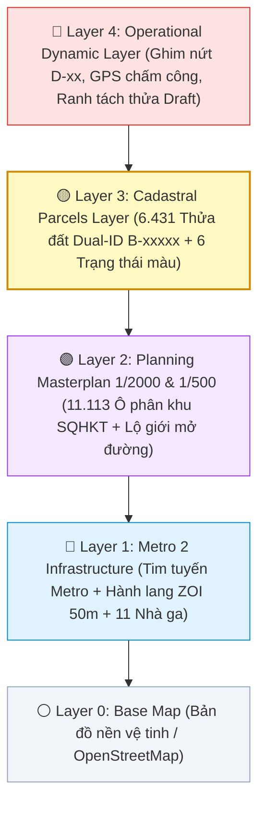

# Quy Tắc Nghiệp Vụ Hệ Thống (Business Logic Specification)

> [!IMPORTANT]
> **LƯU Ý DÀNH CHO AI AGENT & DEVELOPER (TÀI LIỆU ĐANG TIẾP TỤC HOÀN THIỆN & MỞ RỘNG):**
> Tài liệu này là **bản đặc tả cơ sở (Baseline Specification)** cho các thuật toán và logic nghiệp vụ cốt lõi. Tài liệu **CHƯA PHẢI LÀ BẢN ĐẦY ĐỦ 100% TUYỆT ĐỐI** và sẽ tiếp tục được mở rộng chi tiết trong quá trình code và phát triển sản phẩm. Khi triển khai code thực tế, Agent/Developer cần nắm vững rằng hệ thống sẽ phát sinh thêm các quy tắc nghiệp vụ biên, công thức hiệu chỉnh và cần chủ động hoàn thiện cả code lẫn cập nhật ngược lại tài liệu này.

> Tài liệu đặc tả các Quy tắc Nghiệp vụ cốt lõi, Kiến trúc Mã kép Dual-ID, Cơ chế Quản lý Biến động Thửa đất, Bộ máy Tính điểm Kỹ thuật (ECS/VI), Quy trình Xuất Báo cáo Có Chọn lọc, Kiến trúc Lưu trữ Ảnh Phân lớp Tích hợp AI, Quy trình Quét cạn linh hoạt & Xử lý Vắng nhà, và **Động Cơ Cảnh Báo Bất Thường / Gian Lận Hiện Trường (Audit Alert Engine)**.

---

## 1. KIẾN TRÚC MÃ KÉP (DUAL-ID ARCHITECTURE) & CƠ CHẾ CẤP MÃ BẤT BIẾN `B-XXXXX`

### 1.1. Kiến trúc Định danh Kép cho Thửa Đất (Dual-ID System)
Mỗi thửa đất trong hệ thống được định danh đồng thời bởi **2 Mã (Dual-ID)**:
1. **`officialCadastralCode` (Mã Địa chính Gốc / Dữ liệu KS003):** Mã số tờ - số thửa bản đồ địa chính nhà nước (VD: `KS003-P1024`, `Tờ 15 - Thửa 89`) bảo đảm tính pháp lý khi giải phóng mặt bằng.
2. **`projectParcelCode` (Mã Quản lý Dự án Tuyến Metro 2 - `B-XXXXX`):** Mã số sắp xếp tuần tự theo lý trình tim tuyến Metro 2 từ Ga S1 đến Ga S11 (từ `B-00001` đến `B-07000`) để phục vụ quản lý dự án và kiểm soát tiến độ.

---

### 1.2. Nguyên tắc Bất biến của Mã Dự Án `B-XXXXX` (Immutability Principle)
- **Quy chuẩn:** Cố định **`B-XXXXX`** (Tiền tố `B-` và đúng 5 chữ số từ `B-00001` đến `B-99999`).
- **Nguyên tắc:** Khi một mã `B-XXXXX` đã cấp phát, mã này là **BẤT BIẾN (IMMUTABLE)**, tuyệt đối không chèn số vào giữa làm xô lệch các thửa khác.

---

### 1.3. Cơ chế Dải số Phát sinh Mở rộng (High-Range Sequential Extension Pool)
```text
[ Dải số Ban đầu: B-00001 -> B-07000 ] ──> [ Dải số Phát sinh Thực địa: B-07001 -> B-99999 ]
```
- **Tách thửa (Split):** Thửa gốc giữ `B-00002`, các thửa mới phát sinh lấy mã tiếp theo từ kho số mở rộng `B-07001`, `B-07002`...
- **Gộp thửa (Merge):** Lấy mã nhỏ hơn làm đại diện (`B-00002`), thửa còn lại chuyển `MERGED_DEPRECATED`.

---

## 2. QUY TRÌNH BIẾN ĐỘNG RANH THỬA TRÊN GIS (CADASTRAL MUTATION & VERIFICATION WORKFLOW)

- **Vị trí thực hiện:** **BƯỚC 5** sau khi cán bộ khảo sát đã đi hết toàn bộ các tầng và nắm trọn vẹn hiện trạng không gian toà nhà.
- **Hiển thị Kích thước Thửa Ban Đầu:** Thẻ giao diện sáng (Light theme) hiển thị trực quan ranh thửa đất quy hoạch ban đầu với kích thước mặt tiền ($W$), chiều sâu ($D$), diện tích $S_{\text{đất}}\text{ m}^2$, địa chỉ, mã dự án (`B-XXXXX`) và mã địa chính (`KS003-XXXX`).
- **3 Chế độ Đối Soát Thực Địa:**
  1. **Khớp Ranh (MATCH) - Xác nhận 100% diện tích:**
     - Bản đồ Leaflet hiển thị duy nhất 1 mình thửa đất hiện tại trên hệ tọa độ PostGIS thực tế.
     - Xác nhận ranh công trình xây dựng thực tế hoàn toàn trùng khớp 100% với ranh thửa đất địa chính ($S_{\text{xd}} = S_{\text{đất}}\text{ m}^2$), không cần các nút chọn thừa.
  2. **Tách Thửa (SPLIT) & 2 Màu Phân Biệt & Metadata Đất Thừa:**
     - Bản đồ GIS hiển thị 2 màu phân biệt: **Màu 1 (Hổ phách `#f59e0b` cho Căn A / Đang khảo sát)** và **Màu 2 (Cam Đỏ `#ea580c` cho Căn B / Phần còn dư / Đất thừa)**.
     - 2 Option biên tập: Option 1 (Kéo nắn điểm mút / Trượt ranh phân cắt tính diện tích real-time) và Option 2 (Khuôn mẫu Nhà chữ L cắt góc, Chia trước/sau, Chia dọc, Đa giác tự do).
     - **Cấp mã động $B_{\max}$:** Mã dự án mới được cấp phát tuần tự dựa trên giá trị lớn nhất hiện hữu trong CSDL ($B_{\max} + 1, B_{\max} + 2 > 07000$) theo thuật toán `SELECT MAX(substring(code from 3)::int)`.
     - **Đồng bộ công năng & Metadata Đất thừa:** Đồng bộ 100% danh mục công năng hệ thống và tùy chọn `⚠️ Đất thừa / Sai số biên ranh (RESIDUAL_SURPLUS)`. Khi chọn Đất thừa, hệ thống ghi chú metadata nguồn gốc `residualParentParcelCode`, `residualParentCadastralCode`, `residualMetadataNote` phục vụ kiểm tra và hồi tố.
     - **Quy tắc xử lý mé sai số:** Mọi diện tích dôi dư thuộc về ô còn lại; khi khảo sát ô này chỉ vẽ đúng ranh của mình và phần mé thừa tự động tính là lô phụ.
  3. **Gộp Thửa (MERGE) & Multi-Select 10 Thửa Gần Nhất:**
     - Bản đồ Leaflet hiển thị **10 thửa đất thực tế gần nhất** từ CSDL.
     - Thửa hiện tại đang khảo sát **SÁNG ĐÈN NỔI BẬT** (Neon Cyan `#38bdf8` / `#0284c7`).
     - Cho phép **Multi-select chọn nhiều thửa liền kề** (2, 3 hoặc nhiều thửa) để gộp chung mà không gây che đè UI.
     - **Quy tắc Mã Đại Diện:** Hệ thống tự động so sánh, giữ mã nhỏ nhất trong nhóm gộp làm Thửa đại diện chính, các thửa phụ còn lại chuyển sang trạng thái `MERGED_DEPRECATED`, và tổng hợp diện tích $S_{\text{gộp}} = S_{\text{chính}} + \sum S_{\text{phụ}}\text{ m}^2$.
- **Transaction Safety & Rollback khi Reject:** Mọi thao tác biến động chạy trong Database Transaction an toàn. Nếu Zone Admin từ chối Đề xuất Tách thửa, CSDL tự động hoàn nguyên thửa gốc về `ACTIVE` và hủy các thửa phát sinh về `MUTATION_VOID`.


---

## 2.1. CẤP BẬC QUẢN LÝ KHẢO SÁT HIỆN TRẠNG 3 TẦNG (TẦNG > VÙNG Z > KHUYẾT TẬT D)

Để phản ánh chính xác kết cấu công trình đô thị tuyến Metro 2, hệ thống quản lý khảo sát theo 3 cấp bậc chặt chẽ:
1. **Cấp Tầng (Floor Level):**
   - Định danh tầng (Tầng trệt, Lầu 1, Lầu 2, Sân thượng, Mái, Hầm...).
   - **Ảnh tổng quan tầng (Floor Overview Photos):** Chụp nhiều ảnh bao quát không gian tầng.
   - **Bản vẽ phác thảo kỹ thuật / CAD tầng (Floor CAD Sketch):** Chụp hoặc tải lên sơ đồ mặt bằng kỹ thuật tầng (bố trí phòng ngủ, phòng khách, WC, cầu thang...) và cho phép chạm chấm ghim các vị trí vùng **$Z-01, Z-02...$** trực tiếp lên sơ đồ để định vị không gian.
2. **Cấp Vùng Khảo Sát (Zone Level - $Z-xx$ thuộc Tầng):**
   - Định danh mã vùng $Z-01, Z-02...$ gắn liền với phòng/không gian cụ thể thuộc tầng.
   - Trường đánh giá: **Ảnh hưởng chức năng / Cần sửa chữa** (`functionalImpactRepairNeeded`: boolean). Nếu `true`, tự động cộng $2$ điểm vào chỉ số $E6$ (Đánh giá chức năng tổng thể).
   - Cấp độ Burland Grade sơ bộ (0 - 5) và Ảnh bối cảnh vùng (Photo CTX).
3. **Cấp Khuyết Tật / Điểm Hư Hỏng (Defect Level - $D-xx$ thuộc Vùng $Z-xx$):**
   - Chấm ghim trực tiếp $D-xx$ trên ảnh bối cảnh Photo CTX của vùng $Z-xx$.
   - **Mức độ Suy giảm Vật liệu / Bong tróc / Rỉ thép** (`materialDegradationE4`: $0 - 4$ điểm) $\rightarrow$ Tự động trích xuất giá trị lớn nhất đưa vào chỉ số $E4$ của bảng điểm ECS.
   - Ý nghĩa kết cấu (`structuralSignificanceE2`: $0 - 4$ điểm) $\rightarrow$ Trích xuất giá trị lớn nhất đưa vào chỉ số $E2$.
   - Kích thước vết nứt ($w_{\max}, L$), trạng thái hoạt động ($U/S/A$) và Ảnh cận cảnh kèm thước đo Crack Scale Card (Photo CU).

---

## 3. BỘ MÁY TÍNH ĐIỂM KỸ THUẬT TỰ ĐỘNG (ECS & VI SCORING ENGINE)

- **Điểm ECS ($\Sigma E \le 24$):** Tự động tổng hợp từ:
  - $E1$: Điểm Burland Grade cao nhất giữa các Vùng $Z$ ($\max(E1) \le 4$).
  - $E2$: Ý nghĩa kết cấu cao nhất của các vết nứt $D$ ($\max(E2) \le 4$).
  - $E3$: Điểm lún nghiêng - võng dầm lớn nhất tại Bước 4 ($\max(E3) \le 4$).
  - $E4$: Mức độ suy giảm vật liệu / bong tróc / rỉ thép lớn nhất tại các điểm $D$ ($\max(E4) \le 4$).
  - $E5$: Lịch sử cơi nới, biến dạng hoặc sự cố công trình tại Bước 2 ($\max(E5) \le 4$).
  - $E6$: Đánh giá ảnh hưởng chức năng / cần sửa chữa từ các Vùng $Z$ ($0$đ nếu không có, $2$đ nếu có bất kỳ Vùng $Z$ nào ghi nhận ảnh hưởng chức năng).
- **Phân hạng ECS:** `GOOD` [0-5], `MEDIUM` [6-10], `DEFICIENT` [11-16], `CRITICAL` [17-24].
- **Safety Lock:** Khóa không cho phép Hạ hạng ECS nếu công trình có cờ kết cấu `Critical`.

---

## 4. QUY TRÌNH XUẤT BÁO CÁO CÓ CHỌN LỌC (SELECTIVE DOSSIER EXPORT)

Hệ thống cho phép Zone Admin và Super Admin đóng gói và xuất báo cáo linh hoạt theo 2 chế độ:



1. **Chế độ 1: Xuất Theo Danh Sách Chỉ Định (`SELECTED_LIST`):**
   - Phục vụ các tình huống khẩn cấp tại hiện trường: Ví dụ nhà thầu chuẩn bị đóng cừ larsen tại vị trí Km 8+250, Zone Admin chỉ định đúng 3 căn nhà mặt tiền `B-00105, B-00106, B-00107` để xuất hồ sơ bàn giao ngay.
2. **Chế độ 2: Xuất Tổng Hợp Theo Thời Gian & Tiêu Chí (`FILTER_CRITERIA`):**
   - Lọc theo khoảng thời gian: Ngày (`DAILY`), Tuần (`WEEKLY`), Tháng (`MONTHLY`), hoặc Khoảng ngày tùy biến (`startDate` $\to$ `endDate`).
   - Lọc theo Phân khu Ga, trạng thái duyệt (`APPROVED`), hoặc nhóm rủi ro cao (`VI Class: HIGH, VERY_HIGH`).
3. **Tính Toàn Vẹn & Pháp Lý:** Mọi file tập hồ sơ xuất ra đều được hệ thống tính toán mã băm **Checksum SHA-256** để chống làm giả hoặc chỉnh sửa tài liệu.

---

## 5. KIẾN TRÚC LƯU TRỮ ẢNH PHÂN LỚP & ĐỘNG CƠ AI NẮN THẲNG PHỐI CẢNH

- **Lớp 1 (Ảnh Gốc HD):** Không chứa nét vẽ đè, giữ nguyên độ phân giải quang học.
- **Lớp 2 (Vector JSON Đa đỉnh $N$ góc & Cắt tầng):** Tọa độ nét vẽ, đa giác $N$ đỉnh tùy biến ($N \ge 3$), đường cắt tầng.
- **Lớp 3 (Ảnh AI Nắn Thẳng Chuẩn CAD):** Ma trận 3x3 Homography triệt tiêu góc nghiêng, tự động bắt dính dầm sàn và vẽ đường dóng kỹ thuật số sắc nét.

---

## 6. CHUỖI PHÁT SINH ĐỘNG HỌC & ĐỘNG CƠ ĐỐI SOÁT DELTA (PHASE 1 VS PHASE 2)

- **Truy xuất theo vị trí đứng:** Tự động lọc ảnh $CTX$ và ghim $D-xx$ cũ của đúng Tầng & Phòng.
- **Động cơ Delta:** Tính toán $\Delta w = w_2 - w_1$, $\Delta L = L_2 - L_1$, $\Delta ECS = ECS_2 - ECS_1 \rightarrow$ Đưa ra Phán quyết đền bù: `NO_IMPACT` (Khước từ), `NEGLIGIBLE_COSMETIC` (Hỗ trợ sơn bả), `STRUCTURAL_IMPACT` (Bồi thường kết cấu).

---

## 7. QUY TRÌNH QUÉT CẠN LINH HOẠT TRÊN BẢN ĐỒ GIS & XỬ LÝ VẮNG NHÀ (AD-HOC SWEEP SURVEY)

- **Xử lý vắng nhà (`POST /parcels/{id}/record-absence`):** Ghi nhận lý do, chuyển trạng thái sang `POSTPONED_ABSENT` (Màu Tím) và tăng bộ đếm số lần đến vắng mặt.
- **Tự nhận thửa lân cận (`POST /parcels/{id}/start-survey`):** Surveyor chạm vào ô thửa đất màu xám (`NOT_SURVEYED`) trên bản đồ GIS của PWA để nhận và khảo sát ngay lập tức.
- **Tra cứu Nearby (`GET /parcels/nearby`):** Lọc các căn nhà lân cận trong bán kính 50m - 200m từ vị trí GPS hiện tại.

---

## 8. ĐỘNG CƠ CẢNH BÁO BẤT THƯỜNG & GIAN LẬN HIỆN TRƯỜNG (AUDIT ALERT & FRAUD DETECTION ENGINE)

Để hỗ trợ Zone Admin kiểm soát chất lượng dữ liệu giữa hàng nghìn công trình, hệ thống tích hợp **Động cơ quét tự động (Automated Audit Rules Engine)** phát hiện các dấu hiệu bất thường trước khi duyệt:



### 8.1. Danh mục 5 Cờ Cảnh Báo Tự Động:

| Loại Cảnh Báo (`alertType`) | Mức Độ | Ngưỡng Kích Hoạt Tự Động | Hành Động Yêu Cầu Của Zone Admin |
| :--- | :---: | :--- | :--- |
| **`GPS_DISTANCE_DISCREPANCY`** | `HIGH` | Khoảng cách từ tọa độ chụp ảnh đến tâm thửa đất trên GIS **$> 50$ mét**. | Kiểm tra lại vị trí đứng của Surveyor trên bản đồ vệ tinh, nghi vấn chụp nhầm nhà bên cạnh. |
| **`ABNORMAL_DURATION`** | `MEDIUM` | Thời gian từ lúc chụp ảnh đầu tiên $P-01$ đến khi nộp hồ sơ **$< 5$ phút** (đối với nhà $\ge 2$ tầng). | Kiểm tra kỹ ảnh các phòng bên trong, nghi vấn Surveyor không vào nhà mà tự tích form. |
| **`STRUCTURAL_CRITICAL`** | `CRITICAL` | Hồ sơ có ghim $D-xx$ mang cờ kết cấu `Critical` hoặc biến dạng lún nghiêng $\Delta > 0.5\%$. | Bật cờ Đỏ khẩn cấp, thông báo ngay cho MAUR và Tư vấn giám sát để có biện pháp gia cố trước khi TBM đào qua. |
| **`MISSING_SCALE_CARD`** | `MEDIUM` | Ảnh cận cảnh $CU$ không áp sát thước đo khe nứt (Scale Card). | Yêu cầu trả về (`Reject`) để Surveyor chụp bù lại ảnh có thước đo vạch mm. |
| **`REPEATED_ABSENCE`** | `LOW` | Thửa đất đã có **$\ge 3$ lần đến liên hệ** nhưng đều ghi nhận vắng nhà. | Chuyển danh sách cho UBND Phường / Tổ dân phố để hỗ trợ đặt lịch hẹn ngoài giờ hành chính. |

---

- **Thống kê 7 trạng thái khảo sát:** Đã xuất báo cáo pháp lý (`EXPORTED`), Đã duyệt (`APPROVED`), Chờ duyệt (`SUBMITTED`), Đang làm (`IN_PROGRESS`), Vắng nhà (`POSTPONED_ABSENT`), Bị trả về (`REJECTED`), Chưa khảo sát (`NOT_SURVEYED`).
- **Quy trình Khảo sát & Xuất báo cáo Chung cư / Nhiều căn hộ (Multi-Unit Apartment Workflow):**
  - Đối với tòa nhà Chung cư / Khu tập thể (1 Thửa đất có $N$ Căn hộ `BuildingUnit`), hệ thống quản lý trạng thái khảo sát và xuất báo cáo riêng biệt cho **từng căn hộ**.
  - Mỗi căn hộ được xuất 1 tập Báo cáo Hiện trạng độc lập (`REPORT-{ParcelCode}-{UnitCode}.pdf`) kèm chữ ký của Chủ căn hộ đó và mã băm Checksum SHA-256.
  - Khi xuất báo cáo cho từng căn, trạng thái của căn đó chuyển sang `EXPORTED`. Khi toàn bộ 100% các căn hộ trong tòa nhà đều đã `EXPORTED`, thửa đất trên GIS sẽ chuyển sang trạng thái hoàn tất toàn diện `EXPORTED`.
- **Năng suất Cán bộ (Surveyor Productivity):** Đo lường số lượng hồ sơ hoàn thành và thời gian khảo sát trung bình của từng cán bộ để điều phối nhân sự hợp lý.

---

## 9. QUY TRÌNH GIÁM SÁT & XÁC NHẬN CHẤM CÔNG THỰC ĐỊA (ATTENDANCE VERIFICATION WORKFLOW)

Để đảm bảo kỷ luật hiện trường và chống gian lận chấm công, hệ thống thiết lập cơ chế **Chấm công & Phê duyệt 2 chiều**:



1. **Thu thập dữ liệu:** Surveyor gửi tọa độ GPS thực tế (`gpsLat`, `gpsLng`), mã Ga (`zoneId`), và ảnh selfie hiện trường.
2. **Đối soát tự động:** Hệ thống PostGIS tự động tính khoảng cách từ vị trí check-in đến tâm phân khu Ga. Nếu khoảng cách $> 500m$, hệ thống tự động gán cờ cảnh báo `FLAGGED_WARNING`.
3. **Phê duyệt quản trị (`POST /api/v1/admin/attendance/{id}/verify`):** Zone Admin xem danh sách chấm công toàn Ga, xem ảnh selfie và nhấn xác nhận ngày công hoặc từ chối.
4. **Báo cáo chuyên cần (`GET /api/v1/admin/attendance/summary`):** Thống kê tỷ lệ chuyên cần theo từng tháng để phục vụ đánh giá năng suất và tính lương.

---

## 10. QUY TRÌNH QUẢN TRỊ NGƯỜI DÙNG & PHÂN QUYỀN TOÀN HỆ THỐNG (USER LIFECYCLE MANAGEMENT)

Super Admin là cấp quản trị cao nhất toàn tuyến Metro 2, nắm toàn quyền điều hành vòng đời tài khoản nhân sự:

1. **Cấp phát tài khoản (`POST /api/v1/admin/users`):** Tạo mới tài khoản cho `ZONE_ADMIN`, `SURVEYOR`, `GUEST` kèm phân công Ga cụ thể.
2. **Điều chuyển & Cập nhật (`PUT /api/v1/admin/users/{id}`):** Chuyển giao Surveyor giữa các Ga Metro (ví dụ điều chuyển từ Ga S9 sang Ga S10), cập nhật chức danh, email, số điện thoại.
3. **Khóa & Mở khóa an toàn (`PUT /api/v1/admin/users/{id}/status`):** Khóa tài khoản tạm thời (`SUSPENDED`) khi phát hiện vi phạm quy chế hoặc nhân sự tạm nghỉ; khóa vĩnh viễn (`LOCKED`); kích hoạt lại (`ACTIVE`).
4. **Đặt lại mật khẩu (`POST /api/v1/admin/users/{id}/reset-password`):** Cấp lại mật khẩu bảo mật và yêu cầu đổi mật khẩu ở lần đăng nhập tiếp theo.
5. **Vô hiệu hóa an toàn (`DELETE /api/v1/admin/users/{id}`):** Áp dụng cơ chế Soft-delete, bảo toàn toàn bộ chữ ký điện tử và hồ sơ mà nhân sự này đã lập trong quá khứ.

---

## 11. TRUNG TÂM QUẢN TRỊ XUẤT BÁO CÁO TOÀN TUYẾN (GLOBAL EXPORT MANAGEMENT HUB)

Hệ thống cung cấp cho Super Admin quyền kiểm soát toàn bộ dữ liệu đầu ra:

1. **Xuất báo cáo toàn tuyến 11 Ga (`POST /api/v1/admin/reports/batch-export`):** Cho phép xuất tập hồ sơ tổng hợp toàn tuyến hoặc cụm liên Ga phục vụ báo cáo UBND TP.HCM, Ban Quản lý Đường sắt Đô thị (MAUR) và Ngân hàng Tái thiết Đức (KfW).
2. **Giám sát lịch sử xuất (`GET /api/v1/admin/reports/exports`):** Theo dõi ai đã xuất file gì, vào thời điểm nào, mã băm Checksum SHA-256 là gì, trạng thái xử lý nền (Queued $\to$ Processing $\to$ Completed $\to$ Failed).
3. **Thu hồi & Hủy file xuất (`DELETE /api/v1/admin/reports/exports/{batchId}`):** Thu hồi quyền tải file và xóa dữ liệu tạm trên Cloud Storage S3 khi phát hiện dữ liệu cần cập nhật lại.

---

## 12. QUY CHUẨN KIẾN TRÚC PHÂN TẦNG GIS 5 LỚP & BẢO TOÀN DỮ LIỆU ĐA VAI TRÒ (GIS 5-LAYER STACK & DATA INTEGRITY)

Hệ thống tích hợp dữ liệu quy hoạch đô thị SQHKT (`KS003.xlsx` - 6.431 thửa đất, 11.113 ô quy hoạch 1/2000, 4.350 thửa dính lộ giới) và dữ liệu hạ tầng Metro 2 thành **5 Lớp Layer Không Gian**:



### 12.1. 6 Nguyên Tắc Bảo Toàn Dữ Liệu Đa Vai Trò (Non-destructive Multi-Role Integrity):
1. **Bất biến Phân tầng (Layer Isolation):** Layer 1 và Layer 2 là Read-Only tuyệt đối đối với Surveyor và Zone Admin.
2. **Kiến trúc Phủ đè Phi Phá hủy (Non-destructive Vector Overlay & CQRS):** Khi có biến động tách thửa, không xóa hoặc sửa trực tiếp đa giác gốc trên Layer 3. Sự kiện tách thửa tạo bản ghi `ParcelMutationEvent` ở Layer 4 với ranh mới dạng JSONB và thửa gốc chỉ mang cờ tạm `is_mutation_pending = true`.
3. **Giao dịch PostGIS ACID & Hoàn nguyên (Rollback Safety):** Mọi thao tác phê duyệt tách thửa chạy trong 1 Database Transaction duy nhất. Khi Reject, CSDL rollback hoàn nguyên Layer 3 về nguyên bản.
4. **Phân quyền Dữ liệu Cấp Dòng Theo Ga (Row-Level Multi-Tenancy):** Backend tự động gán `WHERE zone_id = req.user.assignedZoneId` vào mọi câu lệnh Query, ngăn chặn ghi đè chéo giữa các Ga.
5. **Khóa Lạc quan Chống Tranh chấp (Optimistic Locking & State Guards):** Thửa đất mang cờ `IN_PROGRESS` sẽ khóa, không cho phép Surveyor khác nhận trùng lặp.
6. **Lịch sử Không gian (Spatial Time-Travel Audit Trail):** Mọi biến động đa giác đều được tự động lưu vào bảng `cadastral_history_logs`, hỗ trợ khôi phục ranh về mọi mốc thời gian.

