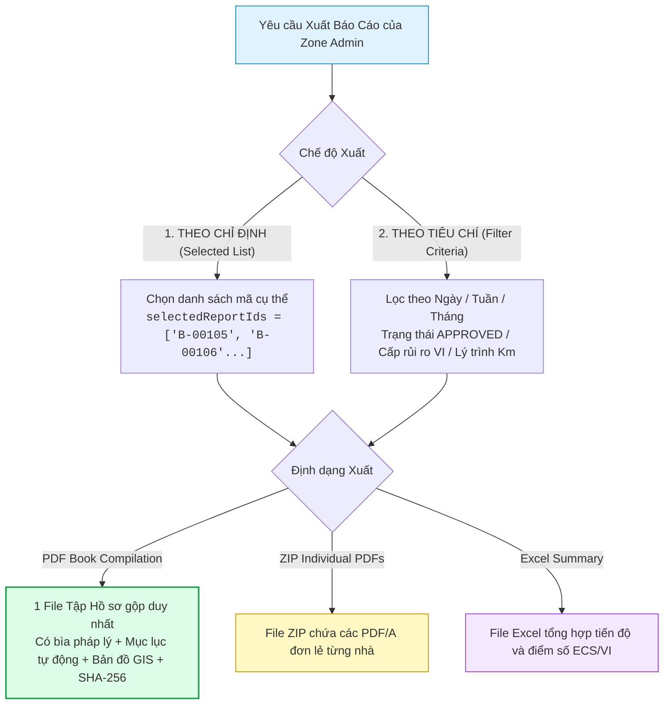
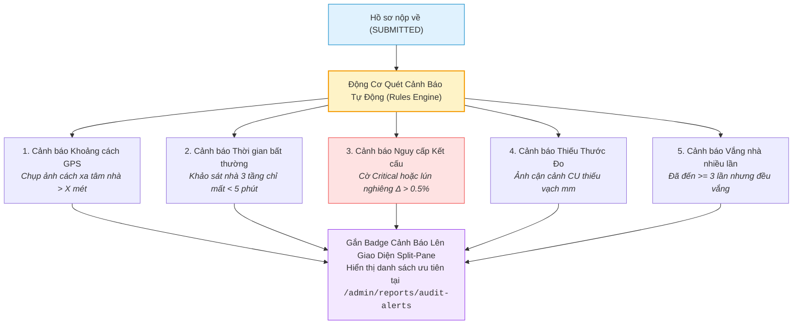

# Quy Tắc Nghiệp Vụ Hệ Thống (Business Logic Specification)

> [!IMPORTANT]
> **LƯU Ý DÀNH CHO AI AGENT & DEVELOPER (TÀI LIỆU ĐANG TIẾP TỤC HOÀN THIỆN & MỞ RỘNG):**
> Tài liệu này là **bản đặc tả cơ sở (Baseline Specification)** cho các thuật toán và logic nghiệp vụ cốt lõi. Tài liệu **CHƯA PHẢI LÀ BẢN ĐẦY ĐỦ 100% TUYỆT ĐỐI** và sẽ tiếp tục được mở rộng chi tiết trong quá trình code và phát triển sản phẩm. Khi triển khai code thực tế, Agent/Developer cần nắm vững rằng hệ thống sẽ phát sinh thêm các quy tắc nghiệp vụ biên, công thức hiệu chỉnh và cần chủ động hoàn thiện cả code lẫn cập nhật ngược lại tài liệu này.

> Tài liệu đặc tả các Quy tắc Nghiệp vụ cốt lõi, Kiến trúc Mã kép Dual-ID, Cơ chế Quản lý Biến động Thửa đất, Bộ máy Tính điểm Kỹ thuật (ECS/VI), Quy trình Xuất Báo cáo Có Chọn lọc, Kiến trúc Lưu trữ Ảnh Phân lớp Tích hợp AI, Quy trình Quét cạn linh hoạt & Xử lý Vắng nhà, và **Động Cơ Cảnh Báo Bất Thường / Gian Lận Hiện Trường (Audit Alert Engine)**.

---

## 1. KIẾN TRÚC MÃ KÉP (DUAL-ID ARCHITECTURE) & CƠ CHẾ CẤP MÃ BẤT BIẾN `B-XXXXX`

### 1.1. Kiến trúc Định danh Kép cho Thửa Đất (Dual-ID System)
Mỗi thửa đất trong hệ thống được định danh đồng thời bởi **2 Mã (Dual-ID)**:
1. **`officialCadastralCode` (Mã Địa chính Gốc / Dữ liệu KS003):** Mã số tờ - số thửa bản đồ địa chính nhà nước (VD: `KS003-P1024`, `Tờ 15 - Thửa 89`) bảo đảm tính pháp lý khi giải phóng mặt bằng.
2. **`projectParcelCode` (Mã Quản lý Dự án Tuyến Metro 2 - `B-XXXXX`):** Mã số sắp xếp tuần tự theo lý trình tim tuyến Metro 2 từ Ga S1 đến Ga S11 (từ `B-00001` đến `B-07000`) để phục vụ quản lý dự án và kiểm soát tiến độ.

---

### 1.2. Nguyên tắc Bất biến của Mã Dự Án `B-XXXXX` (Immutability Principle)
- **Quy chuẩn:** Cố định **`B-XXXXX`** (Tiền tố `B-` và đúng 5 chữ số từ `B-00001` đến `B-99999`).
- **Nguyên tắc:** Khi một mã `B-XXXXX` đã cấp phát, mã này là **BẤT BIẾN (IMMUTABLE)**, tuyệt đối không chèn số vào giữa làm xô lệch các thửa khác.

---

### 1.3. Cơ chế Dải số Phát sinh Mở rộng (High-Range Sequential Extension Pool)
```text
[ Dải số Ban đầu: B-00001 -> B-07000 ] ──> [ Dải số Phát sinh Thực địa: B-07001 -> B-99999 ]
```
- **Tách thửa (Split):** Thửa gốc giữ `B-00002`, các thửa mới phát sinh lấy mã tiếp theo từ kho số mở rộng `B-07001`, `B-07002`...
- **Gộp thửa (Merge):** Lấy mã nhỏ hơn làm đại diện (`B-00002`), thửa còn lại chuyển `MERGED_DEPRECATED`.

---

## 2. QUY TRÌNH BIẾN ĐỘNG RANH THỬA TRÊN GIS (CADASTRAL WORKFLOW)

- **Vị trí thực hiện:** **BƯỚC 5** sau khi đã đi hết toàn bộ các tầng và phòng.
- **Rollback khi Reject:** Nếu Zone Admin từ chối Đề xuất Tách thửa, CSDL tự động hoàn nguyên thửa gốc về `ACTIVE` và hủy các thửa phát sinh về `MUTATION_VOID`.

---

## 3. BỘ MÁY TÍNH ĐIỂM KỸ THUẬT TỰ ĐỘNG (ECS & VI SCORING ENGINE)

- **Điểm ECS ($\Sigma E \le 24$):** Tự động tổng hợp từ $E1$ (Burland max), $E2$ (Ý nghĩa kết cấu max), $E3$ (Lún nghiêng Bước 4), $E4$ (Suy giảm vật liệu max), $E5$ (Lịch sử phỏng vấn), $E6$ (Đánh giá chức năng).
- **Phân hạng ECS:** `GOOD` [0-5], `MEDIUM` [6-10], `DEFICIENT` [11-16], `CRITICAL` [17-24].
- **Safety Lock:** Khóa không cho phép Hạ hạng ECS nếu công trình có cờ kết cấu `Critical`.

---

## 4. QUY TRÌNH XUẤT BÁO CÁO CÓ CHỌN LỌC (SELECTIVE DOSSIER EXPORT)

Hệ thống cho phép Zone Admin và Super Admin đóng gói và xuất báo cáo linh hoạt theo 2 chế độ:



1. **Chế độ 1: Xuất Theo Danh Sách Chỉ Định (`SELECTED_LIST`):**
   - Phục vụ các tình huống khẩn cấp tại hiện trường: Ví dụ nhà thầu chuẩn bị đóng cừ larsen tại vị trí Km 8+250, Zone Admin chỉ định đúng 3 căn nhà mặt tiền `B-00105, B-00106, B-00107` để xuất hồ sơ bàn giao ngay.
2. **Chế độ 2: Xuất Tổng Hợp Theo Thời Gian & Tiêu Chí (`FILTER_CRITERIA`):**
   - Lọc theo khoảng thời gian: Ngày (`DAILY`), Tuần (`WEEKLY`), Tháng (`MONTHLY`), hoặc Khoảng ngày tùy biến (`startDate` $\to$ `endDate`).
   - Lọc theo Phân khu Ga, trạng thái duyệt (`APPROVED`), hoặc nhóm rủi ro cao (`VI Class: HIGH, VERY_HIGH`).
3. **Tính Toàn Vẹn & Pháp Lý:** Mọi file tập hồ sơ xuất ra đều được hệ thống tính toán mã băm **Checksum SHA-256** để chống làm giả hoặc chỉnh sửa tài liệu.

---

## 5. KIẾN TRÚC LƯU TRỮ ẢNH PHÂN LỚP & ĐỘNG CƠ AI NẮN THẲNG PHỐI CẢNH

- **Lớp 1 (Ảnh Gốc HD):** Không chứa nét vẽ đè, giữ nguyên độ phân giải quang học.
- **Lớp 2 (Vector JSON Đa đỉnh $N$ góc & Cắt tầng):** Tọa độ nét vẽ, đa giác $N$ đỉnh tùy biến ($N \ge 3$), đường cắt tầng.
- **Lớp 3 (Ảnh AI Nắn Thẳng Chuẩn CAD):** Ma trận 3x3 Homography triệt tiêu góc nghiêng, tự động bắt dính dầm sàn và vẽ đường dóng kỹ thuật số sắc nét.

---

## 6. CHUỖI PHÁT SINH ĐỘNG HỌC & ĐỘNG CƠ ĐỐI SOÁT DELTA (PHASE 1 VS PHASE 2)

- **Truy xuất theo vị trí đứng:** Tự động lọc ảnh $CTX$ và ghim $D-xx$ cũ của đúng Tầng & Phòng.
- **Động cơ Delta:** Tính toán $\Delta w = w_2 - w_1$, $\Delta L = L_2 - L_1$, $\Delta ECS = ECS_2 - ECS_1 \rightarrow$ Đưa ra Phán quyết đền bù: `NO_IMPACT` (Khước từ), `NEGLIGIBLE_COSMETIC` (Hỗ trợ sơn bả), `STRUCTURAL_IMPACT` (Bồi thường kết cấu).

---

## 7. QUY TRÌNH QUÉT CẠN LINH HOẠT TRÊN BẢN ĐỒ GIS & XỬ LÝ VẮNG NHÀ (AD-HOC SWEEP SURVEY)

- **Xử lý vắng nhà (`POST /parcels/{id}/record-absence`):** Ghi nhận lý do, chuyển trạng thái sang `POSTPONED_ABSENT` (Màu Tím) và tăng bộ đếm số lần đến vắng mặt.
- **Tự nhận thửa lân cận (`POST /parcels/{id}/start-survey`):** Surveyor chạm vào ô thửa đất màu xám (`NOT_SURVEYED`) trên bản đồ GIS của PWA để nhận và khảo sát ngay lập tức.
- **Tra cứu Nearby (`GET /parcels/nearby`):** Lọc các căn nhà lân cận trong bán kính 50m - 200m từ vị trí GPS hiện tại.

---

## 8. ĐỘNG CƠ CẢNH BÁO BẤT THƯỜNG & GIAN LẬN HIỆN TRƯỜNG (AUDIT ALERT & FRAUD DETECTION ENGINE)

Để hỗ trợ Zone Admin kiểm soát chất lượng dữ liệu giữa hàng nghìn công trình, hệ thống tích hợp **Động cơ quét tự động (Automated Audit Rules Engine)** phát hiện các dấu hiệu bất thường trước khi duyệt:



### 8.1. Danh mục 5 Cờ Cảnh Báo Tự Động:

| Loại Cảnh Báo (`alertType`) | Mức Độ | Ngưỡng Kích Hoạt Tự Động | Hành Động Yêu Cầu Của Zone Admin |
| :--- | :---: | :--- | :--- |
| **`GPS_DISTANCE_DISCREPANCY`** | `HIGH` | Khoảng cách từ tọa độ chụp ảnh đến tâm thửa đất trên GIS **$> 50$ mét**. | Kiểm tra lại vị trí đứng của Surveyor trên bản đồ vệ tinh, nghi vấn chụp nhầm nhà bên cạnh. |
| **`ABNORMAL_DURATION`** | `MEDIUM` | Thời gian từ lúc chụp ảnh đầu tiên $P-01$ đến khi nộp hồ sơ **$< 5$ phút** (đối với nhà $\ge 2$ tầng). | Kiểm tra kỹ ảnh các phòng bên trong, nghi vấn Surveyor không vào nhà mà tự tích form. |
| **`STRUCTURAL_CRITICAL`** | `CRITICAL` | Hồ sơ có ghim $D-xx$ mang cờ kết cấu `Critical` hoặc biến dạng lún nghiêng $\Delta > 0.5\%$. | Bật cờ Đỏ khẩn cấp, thông báo ngay cho MAUR và Tư vấn giám sát để có biện pháp gia cố trước khi TBM đào qua. |
| **`MISSING_SCALE_CARD`** | `MEDIUM` | Ảnh cận cảnh $CU$ không áp sát thước đo khe nứt (Scale Card). | Yêu cầu trả về (`Reject`) để Surveyor chụp bù lại ảnh có thước đo vạch mm. |
| **`REPEATED_ABSENCE`** | `LOW` | Thửa đất đã có **$\ge 3$ lần đến liên hệ** nhưng đều ghi nhận vắng nhà. | Chuyển danh sách cho UBND Phường / Tổ dân phố để hỗ trợ đặt lịch hẹn ngoài giờ hành chính. |

---

### 8.2. Cơ Chế Thống Kê Tiến Độ Thời Gian Thực (`GET /api/v1/admin/analytics/progress`)
- **Phân tích theo chu kỳ:** Cho phép lọc theo Ngày (`DAILY`), Tuần (`WEEKLY`), Tháng (`MONTHLY`), hoặc Khoảng ngày tùy biến.
- **Thống kê 6 trạng thái:** Hoàn tất (`APPROVED`), Chờ duyệt (`SUBMITTED`), Đang làm (`IN_PROGRESS`), Vắng nhà (`POSTPONED_ABSENT`), Bị trả về (`REJECTED`), Chưa khảo sát (`NOT_SURVEYED`).
- **Năng suất Cán bộ (Surveyor Productivity):** Đo lường số lượng hồ sơ hoàn thành và thời gian khảo sát trung bình của từng cán bộ để điều phối nhân sự hợp lý.
