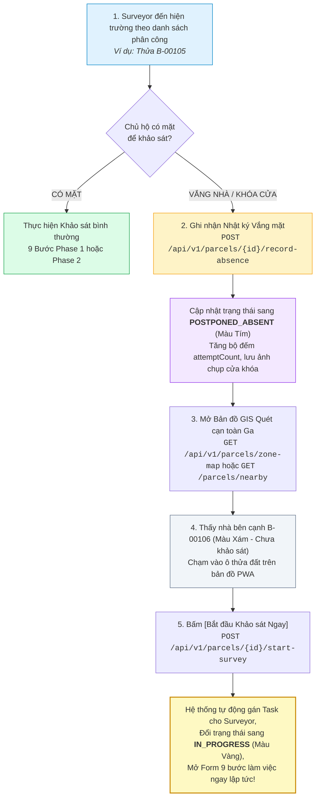

# Quy Tắc Nghiệp Vụ Hệ Thống (Business Logic Specification)

> [!IMPORTANT]
> **LƯU Ý DÀNH CHO AI AGENT & DEVELOPER (TÀI LIỆU ĐANG TIẾP TỤC HOÀN THIỆN & MỞ RỘNG):**
> Tài liệu này là **bản đặc tả cơ sở (Baseline Specification)** cho các thuật toán và logic nghiệp vụ cốt lõi. Tài liệu **CHƯA PHẢI LÀ BẢN ĐẦY ĐỦ 100% TUYỆT ĐỐI** và sẽ tiếp tục được mở rộng chi tiết trong quá trình code và phát triển sản phẩm. Khi triển khai code thực tế, Agent/Developer cần nắm vững rằng hệ thống sẽ phát sinh thêm các quy tắc nghiệp vụ biên, công thức hiệu chỉnh và cần chủ động hoàn thiện cả code lẫn cập nhật ngược lại tài liệu này.

> Tài liệu đặc tả các Quy tắc Nghiệp vụ cốt lõi, Kiến trúc Mã kép Dual-ID, Cơ chế Quản lý Biến động Thửa đất, Bộ máy Tính điểm Kỹ thuật (ECS/VI), Quy trình Xuất Báo cáo Hàng loạt, Kiến trúc Lưu trữ Ảnh Phân lớp Tích hợp AI, và **Quy trình Quét cạn linh hoạt trên Bản đồ GIS & Xử lý Vắng nhà (Ad-hoc Sweep Survey)**.

---

## 1. KIẾN TRÚC MÃ KÉP (DUAL-ID ARCHITECTURE) & CƠ CHẾ CẤP MÃ BẤT BIẾN `B-XXXXX`

### 1.1. Kiến trúc Định danh Kép cho Thửa Đất (Dual-ID System)
Mỗi thửa đất trong hệ thống được định danh đồng thời bởi **2 Mã (Dual-ID)** phục vụ 2 mục đích riêng biệt:

1. **`officialCadastralCode` (Mã Địa chính Gốc / Dữ liệu KS003):**
   - Mã định danh địa chính nhà nước thu thập từ dữ liệu cào ban đầu (`data/KS003`) hoặc thông tin Số tờ - Số thửa bản đồ địa chính của Bộ TN&MT (VD: `KS003-P1024`, `Tờ 15 - Thửa 89`).
   - Giúp đối soát và bảo đảm giá trị pháp lý với cơ sở dữ liệu đất đai của Nhà nước khi bàn giao đền bù giải phóng mặt bằng.

2. **`projectParcelCode` (Mã Quản lý Dự án Tuyến Metro 2 - `B-XXXXX`):**
   - Mã số được hệ thống sắp xếp (sort) tuần tự theo lý trình tim tuyến Metro 2 từ Ga S1 đến Ga S11 (từ `B-00001` đến `B-07000`) để phục vụ quản lý dự án, phân công task cho Surveyor và kiểm soát tiến độ khảo sát.
   - Kiểm soát biến động thực địa (Tách / Gộp thửa) theo cơ chế Dải số Phát sinh Mở rộng.

---

### 1.2. Nguyên tắc Bất biến của Mã Dự Án `B-XXXXX` (Immutability Principle)
- **Định dạng chuẩn:** Mã công trình/thửa đất cố định theo quy chuẩn **`B-XXXXX`** (Tiền tố `B-` và đúng 5 chữ số từ `B-00001` đến `B-99999`).
- **Nguyên tắc cốt lõi:** Khi một mã `B-XXXXX` đã được cấp phát và xuất Báo cáo Khảo sát gửi đi, mã này là **MÃ BẤT BIẾN (IMMUTABLE)**.
- **Quy tắc cấm:** Tuyệt đối **KHÔNG ĐƯỢC PHÉP chèn số vào giữa (Insert In-between)** làm tịnh tiến đẩy số $+1$ các thửa phía sau.

---

### 1.3. Cơ chế Dải số Phát sinh Mở rộng (High-Range Sequential Extension Pool)

Dữ liệu ban đầu cào về có $N$ thửa đất (Ví dụ: Tuyến Metro 2 có $N = 7.000$ thửa ban đầu, từ `B-00001` đến `B-07000`).

```text
[ Dải số Ban đầu: B-00001 -> B-07000 ] ──> [ Dải số Phát sinh Thực địa: B-07001 -> B-99999 ]
```

#### A. Kịch bản Tách Thửa (Parcel Split)
Khi cán bộ khảo sát thực địa phát hiện 1 thửa gốc thực tế đã bị chia thành $k$ căn nhà độc lập:
1. **Mảnh 1 (Nhà chính/Địa chỉ gốc):** Giữ nguyên mã gốc **`B-00002`**.
2. **Mảnh 2 (Nhà phát sinh 1):** Hệ thống tự động lấy mã tiếp theo lớn nhất trong hệ thống: **`B-07001`**.
3. **Mảnh 3 (Nếu có - Nhà phát sinh 2):** Cấp tiếp mã **`B-07002`**.
4. **Liên kết Phả hệ (Lineage Metadata):** Thửa phát sinh `B-07001` lưu `parentParcelCode: "B-00002"`.
5. **Kết quả:** Thửa `B-00005` đã khảo sát hôm qua **VẪN LÀ `B-00005` MÃI MÃI, ZERO XÔ LỆCH**.

#### B. Kịch bản Gộp Thửa (Parcel Merge)
Khi 2 hoặc nhiều thửa đất liền kề (`B-00002` và `B-00003`) thực tế đã xây chung 1 toà nhà:
1. Sử dụng mã của **thửa có số nhỏ hơn làm mã đại diện chính: `B-00002`**.
2. Thửa `B-00003` chuyển trạng thái `MERGED_DEPRECATED`, trường `mergedIntoParcelCode = "B-00002"`.

---

## 2. QUY TRÌNH BIẾN ĐỘNG RANH THỬA TRÊN GIS (CADASTRAL WORKFLOW)

### 2.1. Vị trí thực hiện trong Luồng Khảo sát: **BƯỚC 5**
Cán bộ khảo sát **phải đi hết toàn bộ các tầng và không gian trong nhà (từ Bước 1 đến Bước 4)** rồi mới tiến hành đối soát và vẽ lại đường bao ranh đất tại **Bước 5** để cảm nhận diện tích và ranh giới đạt độ chính xác 100%.

### 2.2. Trình tự Thao tác & Cơ chế Hiển thị Phân lớp GIS (Multi-Layer GIS Display)
1. **Lớp Làm việc Tạm thời của Surveyor (Working Draft Layer):** Cập nhật ngay 2 thửa nét đứt cam trên máy Surveyor để tiếp tục tạo 2 báo cáo độc lập.
2. **Lớp Bản đồ Quy hoạch Chính thức (Official Master GIS Layer):** Chưa cập nhật chính thức, nhấp nháy cờ vàng `PENDING_MUTATION_APPROVAL` chờ Zone Admin duyệt.

### 2.3. Cơ chế Xử lý khi Bị Trả Về / Từ Chối (Rejection & Rollback Handling)
- **Cấp độ 1 (Reject Mutation):** Thửa gốc khôi phục `ACTIVE` với ranh ban đầu; Thửa phát sinh chuyển `MUTATION_VOID` (thu hồi mã về kho số); Hủy báo cáo tạm và trả task về để Surveyor gộp làm 1 báo cáo.
- **Cấp độ 2 (Approve Mutation nhưng Reject Report Data):** Ranh đất mới chính thức có hiệu lực trên Master GIS; chỉ trả về Báo cáo bị lỗi kỹ thuật để Surveyor chụp bổ sung.

---

## 3. BỘ MÁY TÍNH ĐIỂM KỸ THUẬT TỰ ĐỘNG (ECS & VI SCORING ENGINE)

### 3.1. Bảng Điểm Hiện Trạng ECS ($\Sigma E \le 24$)
- **$E1$ (Hư hỏng tường/khối xây):** Tự động từ **Burland Grade max** của các Vùng $Z-xx$ ($0 \to 4$đ).
- **$E2$ (Khuyết tật kết cấu cột/dầm/sàn):** Tự động từ **Ý nghĩa kết cấu max** của các ghim $D-xx$ ($0 \to 4$đ).
- **$E3$ (Lún/nghiêng/võng):** Tự động tính từ số liệu đo lún nghiêng tại Bước 4 ($0 \to 4$đ).
- **$E4$ (Suy giảm vật liệu/rỉ thép):** Tự động từ **Mức độ suy giảm max** của các ghim $D-xx$ ($0 \to 4$đ).
- **$E5$ (Lịch sử cơi nới/sự cố):** Tự động tính từ kết quả phỏng vấn Bước 2.2 ($0 \to 4$đ).
- **$E6$ (Tình trạng chức năng tổng thể):** Cán bộ đánh giá trực tiếp ($0 \to 4$đ).
- **Tổng điểm ECS ($\Sigma E$):** `GOOD` [0-5], `MEDIUM` [6-10], `DEFICIENT` [11-16], `CRITICAL` [17-24].

### 3.2. Quy tắc Can thiệp Kỹ sư (Engineering Judgement Rules)
- **Quy tắc Khoá an toàn (Safety Lock):** Nếu công trình có cờ kết cấu `Critical`, hệ thống **KHOÁ CHẶT chức năng Hạ hạng**.

---

## 4. QUY TRÌNH XUẤT BÁO CÁO TỔNG HỢP HÀNG LOẠT (COMPILED DOSSIER EXPORT)

- **`ZONE_ADMIN`:** Xuất Bộ Báo cáo Phân khu theo tuần/tháng báo cáo Ban QLĐS (MAUR).
- **`SUPER_ADMIN`:** Xuất Bộ Báo cáo Toàn tuyến (~7.000 căn) hoặc liên phân khu bàn giao cho Nhà thầu đào hầm TBM.
- **`CONTRACTOR / GUEST`:** Tải các Bộ Báo cáo đã công bố (`isPublishedToGuests = true`).

---

## 5. KIẾN TRÚC LƯU TRỮ ẢNH PHÂN LỚP & ĐỘNG CƠ AI NẮN THẲNG PHỐI CẢNH

### 5.1. Vấn đề Thực tế tại Hiện trường
Khi cán bộ khảo sát chụp ảnh mặt đứng chính ($P-02$) hoặc mặt bên ($P-03$):
- Cán bộ đứng từ dưới đường hẹp ngước lên chụp nên ảnh thường bị **méo góc phối cảnh (Keystone / Perspective Distortion)**.
- Cán bộ dùng ngón tay vẽ nét nguệch ngoạc lên màn hình điện thoại để kẻ đường phân tầng ($T_1, T_2, T_3\dots$) và viết kích thước sơ bộ ($h_1 = 3.8\text{m}, H_{tot} = 11.2\text{m}$).

> [!CAUTION]
> **Tuyệt đối KHÔNG ĐƯỢC "đè chết" (Burn/Bake) nét vẽ vào file ảnh gốc.**
> Nếu đè nét vẽ vào ảnh, pixel gốc bị phá hủy hoàn toàn, khiến AI sau này không thể nhận diện ranh giới cấu kiện, không thể nắn phẳng phối cảnh và không thể render lại bản vẽ đẹp mắt.

---

### 5.2. Mô hình Lưu trữ Phân Lớp Phi Hủy Diệt (Non-Destructive Layered Storage)

Mỗi bức ảnh định danh ($P-01 \to P-04$) được lưu trữ độc lập thành **3 Lớp Dữ liệu**:
1. **Lớp 1: Ảnh Gốc HD (Raw Clean Photo):** Không chứa nét vẽ, giữ nguyên độ phân giải cảm biến camera.
2. **Lớp 2: Tọa độ Vector Đa giác Đa đỉnh $N$ góc ($N \ge 3$) & Đường phân tầng:** Lưu trong trường JSON `facadePolygonPointsJson`, `floorSplitLinesJson`, `dimensionsJson`.
3. **Lớp 3: Ảnh Kỹ thuật Hoàn thiện (AI Enhanced CAD-Style Photo):** Render từ ma trận biến đổi phối cảnh 3x3 Homography và đường dóng dimension chuẩn CAD.

---

## 6. CHUỖI PHÁT SINH ĐỘNG HỌC & ĐỘNG CƠ ĐỐI SOÁT DELTA (PHASE 1 VS PHASE 2)

### 6.1. Cơ Chế Truy Xuất Theo Vị Trí Đứng Trong Phase 2
Khi cán bộ chọn vị trí đứng thực tế (VD: `Lầu 1 ➔ Phòng ngủ 1`), Mobile PWA tự động thực hiện truy vấn:
`GET /api/v1/parcels/{parcelId}/phase2/zones?floor=Lầu 1&room=Phòng ngủ 1`
Giao diện lập tức hiển thị toàn bộ các Vùng `Z-xx` đã lập tại GĐ1, bao gồm ảnh bối cảnh `Photo CTX` và vị trí tọa độ các ghim khuyết tật cũ ($D-01, D-02\dots$).

---

### 6.2. Động Cơ Đối Soát Delta & Phán Quyết Bồi Thường ($\Delta$ Engine)
1. **Tổng hợp Biến động Định lượng:** $\Delta w = w_2 - w_1$, $\Delta L = L_2 - L_1$, $\Delta \text{Tilt} = \text{Tilt}_2 - \text{Tilt}_1$.
2. **Phán quyết Tác động (`CompensationVerdictEnum`):**
   - **`NO_IMPACT`:** $\Delta ECS = 0$, không có vết nứt mới $\rightarrow$ Khước từ đền bù (Có chứng cứ pháp lý vững chắc).
   - **`NEGLIGIBLE_COSMETIC`:** Nứt vữa trát hoàn thiện $\le 1$mm $\rightarrow$ Hỗ trợ kinh phí sơn bả hoàn thiện.
   - **`STRUCTURAL_IMPACT`:** Xuất hiện nứt kết cấu dầm/cột hoặc lún nghiêng $\Delta > 0.5\%$ $\rightarrow$ Lập hồ sơ bồi thường thiệt hại theo quy định.

---

## 7. QUY TRÌNH QUÉT CẠN LINH HOẠT TRÊN BẢN ĐỒ GIS & XỬ LÝ VẮNG NHÀ (AD-HOC SWEEP SURVEY & ABSENCE WORKFLOW)



### 7.1. Ý Nghĩa Thực Tế của Cơ Chế Quét Cạn Linh Hoạt (Ad-Hoc Sweep Survey)
- **Thực tế hiện trường:** Trong các khu dân cư đô thị dọc tuyến Metro 2, tỷ lệ chủ hộ vắng nhà ban ngày hoặc đi làm xa có thể chiếm 15% - 25%. Nếu Surveyor bị khóa chặt trong danh sách giao việc cứng nhắc, năng suất khảo sát sẽ bị đình trệ.
- **Giải pháp:** Surveyor được trao quyền chủ động **chạm chọn các ô thửa đất chưa khảo sát trực tiếp trên bản đồ số GIS** trong phân khu Ga của mình để tiến hành khảo sát quét cạn liên tục, tối đa hóa thời gian tại hiện trường.

---

### 7.2. Logic Nghiệp Vụ Tự Nhận Thửa Đất (`POST /api/v1/parcels/{parcelId}/start-survey`)
1. **Kiểm tra Thẩm quyền (Jurisdiction Check):** Thửa đất phải nằm trong Phân khu Ga (`zoneId`) mà Surveyor được phân công.
2. **Kiểm tra Trạng thái Thửa đất (Status Check):**
   - Thửa đất đang ở trạng thái `NOT_SURVEYED` (Chưa ai làm) hoặc `POSTPONED_ABSENT` (Lần trước vắng nhà, nay chủ hộ đã về).
   - Nếu thửa đất đang bị Surveyor khác khảo sát (`IN_PROGRESS`), hệ thống trả về cảnh báo `409 Conflict`.
3. **Cập nhật Giao dịch Tự động (Atomic Claiming Transaction):**
   - Đổi trạng thái `survey_status = 'IN_PROGRESS'`.
   - Gán `assigned_surveyor_id = currentSurveyor.id`.
   - Khởi tạo bản ghi `base_survey_reports` ở trạng thái `DRAFT`.
   - Ghi nhật ký vào `task_assignment_history` với lý do: `"Ad-hoc pick from GIS map"`.

---

### 7.3. Logic Ghi Nhận Vắng Mặt & Tạm Hoãn (`POST /api/v1/parcels/{parcelId}/record-absence`)
1. **Phân loại Lý do Vắng mặt (`AbsenceReasonEnum`):**
   - `HOMEOWNER_ABSENT`: Chủ nhà đi vắng / không có người đại diện.
   - `LOCKED_GATE`: Cổng/cửa khóa ngoài hoàn toàn.
   - `REFUSED_ACCESS`: Chủ nhà từ chối tiếp cận hoặc hẹn ca khác.
2. **Cơ chế Nhật Ký (Absence Audit Trail):**
   - Tăng bộ đếm `absence_attempt_count = absence_attempt_count + 1`.
   - Lưu thời điểm, tọa độ GPS lúc đến bấm chuông và ảnh chụp cửa khóa (nếu có).
   - Chuyển `survey_status = 'POSTPONED_ABSENT'`.
3. **Báo cáo Lên Zone Admin:**
   - Trên Web Admin Portal của Zone Admin, các thửa đất bị vắng nhà sẽ hiển thị cờ màu **Tím** kèm thông tin số lần đã đến liên hệ để Zone Admin phối hợp với Tổ dân phố / UBND Phường hỗ trợ liên lạc chủ hộ.

---

### 7.4. Mã Màu Trạng Thái Thửa Đất Đồng Bộ Trên GIS Master (Unified GIS Status Palette)

| Mã màu Hex | Tên trạng thái (`survey_status`) | Ý nghĩa hiển thị trên Mobile PWA & Web Admin |
| :---: | :--- | :--- |
| `#9E9E9E` ⚪ | `NOT_SURVEYED` | Thửa đất chưa khảo sát (Surveyor có thể chạm vào để nhận ngay). |
| `#2196F3` 🔵 | `ASSIGNED_TO_ME` | Thửa đất được Zone Admin giao cụ thể cho Surveyor trong ca làm việc. |
| `#FFC107` 🟡 | `IN_PROGRESS` | Thửa đất đang được mở Form nhập liệu khảo sát thực địa. |
| `#9C27B0` 🟣 | `POSTPONED_ABSENT` | Đã đến hiện trường nhưng chủ nhà vắng mặt / khóa cửa (Tạm hoãn). |
| `#FF9800` 🟠 | `SUBMITTED` | Đã nộp báo cáo hoàn tất, đang chờ Zone Admin thẩm định Split-Pane. |
| `#4CAF50` 🟢 | `APPROVED` | Báo cáo đã được phê duyệt chính thức & Xuất bản PDF/A. |
| `#F44336` 🔴 | `REJECTED` | Báo cáo bị trả về kèm lý do cần khảo sát lại. |
