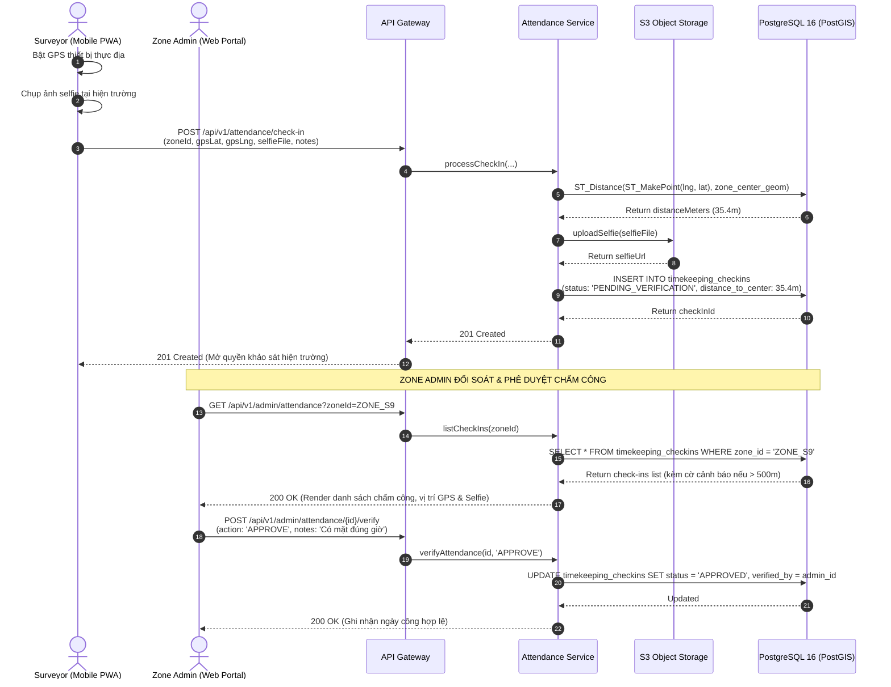
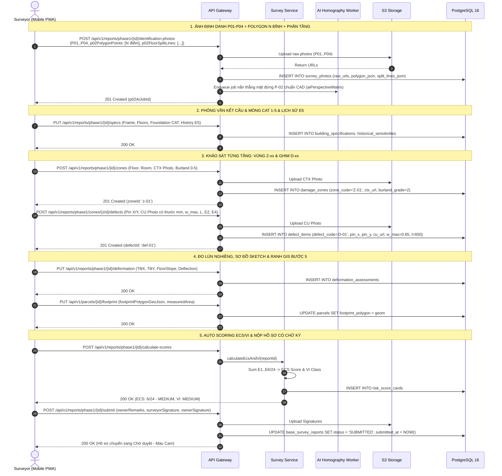
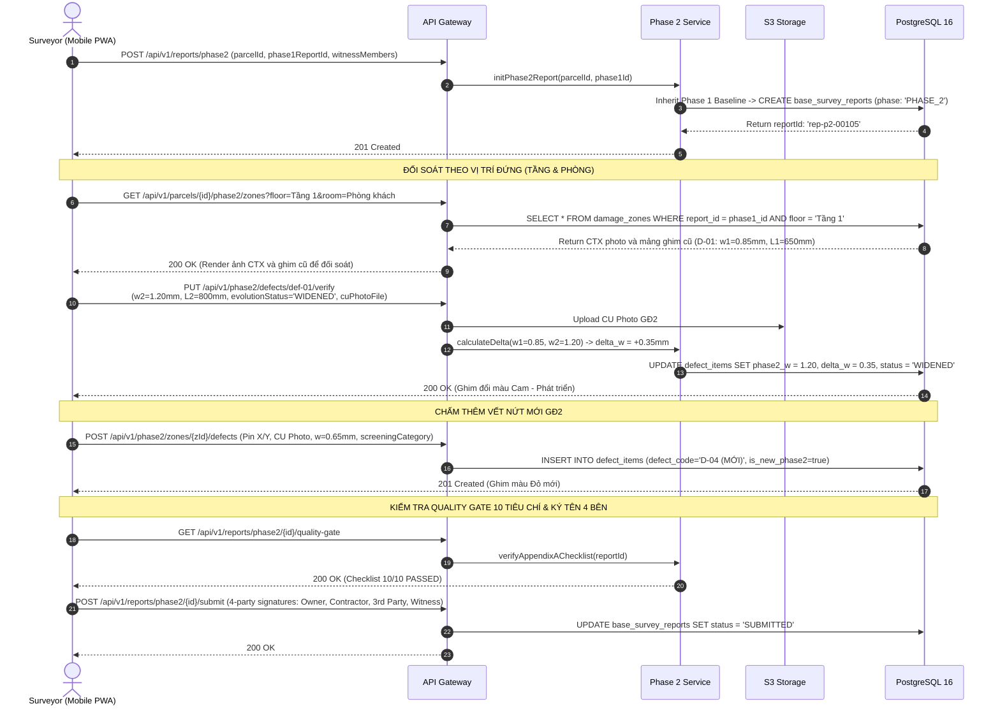
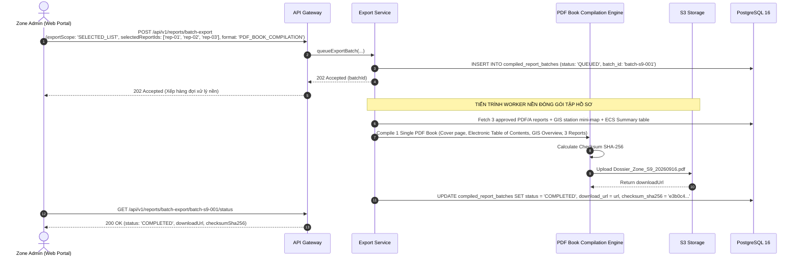
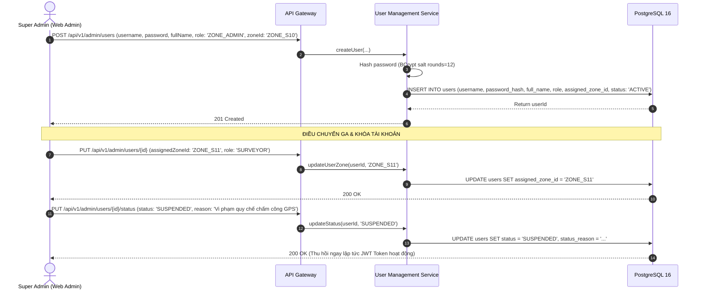
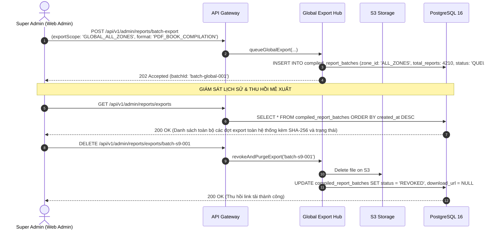

# Đặc Tả Chi Tiết Sơ Đồ Tuần Tự Theo Từng Đối Tượng (Sequence Diagrams Specification)

> [!IMPORTANT]
> **TÀI LIỆU ĐẶC TẢ SƠ ĐỒ TUẦN TỰ (UML SEQUENCE DIAGRAMS) ĐỒNG BỘ 100% VỚI HỆ THỐNG API:**
> Toàn bộ luồng tương tác giữa Actors (`SURVEYOR`, `ZONE_ADMIN`, `SUPER_ADMIN`, `CONTRACTOR`), API Gateway, Backend Services, AI Workers, S3 Storage và PostgreSQL/PostGIS đã được cập nhật đầy đủ, loại bỏ các hố đen nghiệp vụ.

---

## 1. PHÂN HỆ CÁN BỘ KHẢO SÁT HIỆN TRƯỜNG (`SURVEYOR`)

---

### 1.1. Sequence 1.1: Chấm Công GPS Thực Địa & Phê Duyệt 2 Chiều (UC-02)



---

### 1.2. Sequence 1.2: Quét Cạn Thửa Đất Ad-hoc & Ghi Nhận Vắng Nhà (UC-03)

```mermaid
sequenceDiagram
    autonumber
    actor S as Surveyor (Mobile PWA)
    participant GW as API Gateway
    participant PS as Parcel Service
    participant FS as S3 Storage
    participant DB as PostgreSQL 16 (PostGIS)

    Note over S,DB: TÌNH HUỐNG 1: CHỦ NHÀ ĐƯỢC GIAO ĐI VẮNG / KHÓA CỬA
    S->>S: Chụp ảnh cửa khóa / hiện trạng vắng nhà
    S->>GW: POST /api/v1/parcels/{id}/record-absence<br>(absenceReason: 'HOMEOWNER_ABSENT', photoProofFile, notes)
    GW->>PS: recordAbsence(...)
    PS->>FS: Upload proof photo
    FS-->>PS: Return proofPhotoUrl
    PS->>DB: INSERT INTO survey_absence_logs, UPDATE parcels SET status = 'POSTPONED_ABSENT', attempt_count = attempt_count + 1
    DB-->>PS: Updated
    PS-->>S: 201 Created (Thửa đất chuyển sang Màu Tím trên bản đồ GIS)

    Note over S,DB: TÌNH HUỐNG 2: TỰ NHẬN NHÀ LIỀN KỀ ĐỂ QUÉT CẠN (AD-HOC PICK)
    S->>GW: GET /api/v1/parcels/nearby?lat=10.7981&lng=106.6456&radius=150
    GW->>PS: findNearbyUnsurveyedParcels(...)
    PS->>DB: ST_DWithin(geom, current_location, 150) AND status = 'NOT_SURVEYED'
    DB-->>PS: Return nearby parcels (B-00106, B-00107...)
    PS-->>S: 200 OK (Danh sách nhà lân cận có thể tự nhận)

    S->>GW: POST /api/v1/parcels/p-00106/start-survey<br>(phase: 'PHASE_1', claimReason: 'Nhà 00105 vắng mặt')
    GW->>PS: startAdHocSurvey(parcelId, surveyorId)
    PS->>DB: BEGIN TRANSACTION; Check lock; INSERT INTO base_survey_reports; UPDATE parcels SET status = 'IN_PROGRESS'; COMMIT;
    DB-->>PS: Return reportId: 'rep-p1-00106'
    PS-->>S: 201 Created (Thửa đất chuyển sang Màu Vàng & Mở form khảo sát ngay)
```

---

### 1.3. Sequence 1.3: Luồng Khảo Sát Giai Đoạn 1 (Phase 1 Baseline 9 Bước)



---

### 1.4. Sequence 1.4: Khảo Sát Giai Đoạn 2 (Phase 2 Pre-Construction Delta Verification)



---

## 2. PHÂN HỆ TỔ TRƯỞNG & QUẢN TRỊ PHÂN KHU (`ZONE_ADMIN`)

---

### 2.1. Sequence 2.1: Động Cơ Cảnh Báo Bất Thường & Thẩm Định Split-Pane Phê Duyệt (UC-06)

```mermaid
sequenceDiagram
    autonumber
    actor ZA as Zone Admin (Web Portal)
    participant GW as API Gateway
    participant AR as Audit Rules Engine
    participant PDF as PDF/A Digital Signature Engine
    participant FS as S3 Storage
    participant DB as PostgreSQL 16

    Note over AR,DB: HỒ SƠ NỘP VỀ -> TỰ ĐỘNG QUÉT CẢNH BÁO
    AR->>DB: Check GPS distance (Chụp cách tâm nhà > 50m?)
    AR->>DB: Check Duration (Thời gian làm < 5 phút?)
    AR->>DB: Check Structural Critical Flag / Thiếu thước đo mm
    AR->>DB: INSERT INTO audit_alert_items (severity: 'HIGH', type: 'GPS_DISTANCE_DISCREPANCY')

    ZA->>GW: GET /api/v1/admin/reports/audit-alerts?zoneId=ZONE_S9
    GW->>DB: SELECT * FROM audit_alert_items WHERE is_resolved = false
    DB-->>ZA: 200 OK (Danh sách hồ sơ có cờ cảnh báo ưu tiên thẩm định)

    ZA->>GW: GET /api/v1/admin/reports/{id}/audit-view
    GW->>DB: Query Report Full Tree (Left: Cây cấu kiện + ECS/VI, Right: Cặp ảnh CTX/CU)
    DB-->>ZA: 200 OK (Mở giao diện Split-Pane, kích hoạt Kính lúp 400% soi thước đo)

    Note over ZA,DB: ZONE ADMIN PHÊ DUYỆT BÁO CÁO (PHÍM 'A')
    ZA->>GW: POST /api/v1/admin/reports/{id}/approve (judgementNotes)
    GW->>PDF: generateOfficialPdfA(reportId)
    PDF->>PDF: Apply Digital Signature + Watermark + Embed Checksum
    PDF->>FS: Upload REPORT_B00105_PHASE1_OFFICIAL.pdf
    FS-->>PDF: Return officialPdfUrl
    GW->>DB: UPDATE base_survey_reports SET status = 'APPROVED', official_pdf_url = url; UPDATE parcels SET status = 'APPROVED'
    DB-->>ZA: 200 OK (Thửa đất chuyển sang Màu Xanh Lá trên bản đồ GIS)
```

---

### 2.2. Sequence 2.2: Xuất Báo Cáo Có Chọn Lọc (Zone Selective Batch Export - UC-08)



---

## 3. PHÂN HỆ TỔNG QUẢN TRỊ TOÀN TUYẾN (`SUPER_ADMIN`)

---

### 3.1. Sequence 3.1: Quản Trị Vòng Đời Người Dùng & Điều Chuyển Ga (UC-07)



---

### 3.2. Sequence 3.2: Trung Tâm Quản Trị Xuất Báo Cáo Toàn Tuyến 11 Ga (UC-09)


