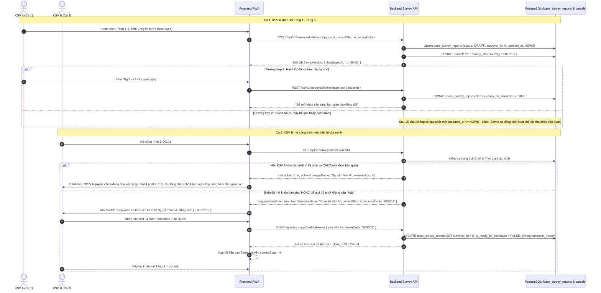
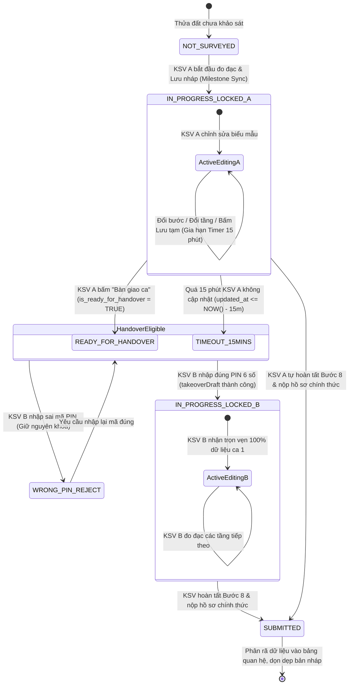

# QUY CHUẨN NGHIỆP VỤ & KIẾN TRÚC HỆ THỐNG: ĐỒNG BỘ BẢN NHÁP SERVER & TIẾP QUẢN CA KHẢO SÁT

- **Ngày ban hành:** 28/09/2026
- **Tài liệu tham chiếu:** Hệ thống BCR Metro Tuyến 2 (Bến Thành - Tham Lương)
- **Phạm vi áp dụng:**
  - Khảo sát Hiện trạng Nhà Dân / Công trình đơn lẻ (Phase 1 Standalone)
  - Khảo sát Hiện trạng Toà Nhà Chung Cư Tổng Thể (Condo Master)
  - Khảo sát Hiện trạng Căn Hộ Con (Condo Child Unit)
- **Tác giả:** Đội ngũ Kỹ sư Công nghệ BCR Metro 2

---

## 1. TỔNG QUAN BÀI TOÁN & MỤC TIÊU THIẾT KẾ

### 1.1. Hiện trạng trước đây và vấn đề phát sinh
Trước đây, toàn bộ dữ liệu đang làm dở của kỹ sư khảo sát (KSV) chỉ được lưu trữ cục bộ trong bộ nhớ trình duyệt thiết bị (`localStorage` / `IndexedDB`) của KSV đó. Điều này tạo ra các rủi ro nghiệp vụ nghiêm trọng:
1. **Mất an toàn dữ liệu khi chia ca:** Các toà nhà nhiều tầng (4–10 tầng) hoặc chung cư có khối lượng khảo sát rất lớn, thường phải chia làm 2 ca làm việc (ca sáng / ca chiều) hoặc kéo dài sang ngày hôm sau. Khi KSV A nghỉ giữa chừng, KSV B đến tiếp quản ca không thể thấy dữ liệu KSV A đã đo đạc, buộc phải đo lại từ đầu.
2. **Trạng thái trên bản đồ không phản ánh thực tế:** Hồ sơ đang khảo sát dở nhưng trên Web GIS của Zone Admin và Trung tâm chỉ huy vẫn hiển thị `ASSIGNED` hoặc `PENDING`, không chuyển sang `IN_PROGRESS`.
3. **Nguy cơ xung đột ghi đè (Race Condition):** Nếu hai kỹ sư cùng mở một thửa đất và cùng gửi dữ liệu, người gửi sau sẽ vô tình đè nát kết quả đo đạc của người gửi trước.

### 1.2. Mục tiêu hệ thống
- **Đồng bộ bản nháp lên máy chủ theo thời gian thực:** Cập nhật ngay trạng thái thửa đất sang `IN_PROGRESS` trong CSDL trung tâm.
- **Cơ chế khóa cửa sổ làm việc 15 phút (15-Minute Working Window Lock):** Bảo vệ phiên làm việc của KSV hiện tại, ngăn ngừa KSV khác can thiệp khi chưa có sự đồng ý.
- **Mở khóa bàn giao sớm (Early Handover Release):** Cho phép KSV chủ động bấm nút *"Bàn giao ca / Nghỉ ca"* để nhường quyền ngay lập tức mà không cần đợi hết 15 phút.
- **Tiếp quản an toàn bằng mã PIN 6 số (6-Digit Security Handover):** KSV ca sau nhập đúng mã PIN bảo mật ngẫu nhiên để tiếp quản trọn vẹn 100% dữ liệu đo đạc của ca trước.
- **Bảo toàn 60fps & Tiết kiệm băng thông 4G:** Không spam debounce 4-5s khi người dùng đang gõ phím. Đồng bộ theo mốc sự kiện (Milestone Sync) và nền định kỳ 2 phút. Ảnh hiện trường được đẩy ngầm lên Server Storage để bản nháp chỉ truyền URL nhẹ (< 35KB).

---

## 2. LUỒNG NGHIỆP VỤ & MÁY TRẠNG THÁI BÀN GIAO CA (SEQUENCE & STATE MACHINE)

### 2.1. Biểu đồ Tuần tự Giao ca & Tiếp quản (Sequence Diagram)



### 2.2. Biểu đồ Máy Trạng thái Bản nháp (State Machine Diagram)



---

## 3. KIẾN TRÚC DỮ LIỆU & CHIẾN LƯỢC LƯU TRỮ

```
                      +------------------------------------------+
                      |           Trình duyệt KSV A              |
                      |  - IndexedDB (Fast offline storage)      |
                      |  - Zustand Store (In-memory reactive)    |
                      +--------------------+---------------------+
                                           |
                [Milestone Sync: Đổi bước, | [Chụp ảnh: Đẩy nền lấy URL]
                 đổi tầng, lưu tạm, 2 phút]|
                                           v
                       +---------------------------------------+
                       |        Backend Node.js / Express       |
                       |  - Authentication (JWT Bearer)         |
                       |  - Lock Window Evaluation (15 mins)   |
                       |  - Security PIN Verification          |
                       +-------------------+-------------------+
                                           |
                                [Single SQL UPSERT (3-8ms)]
                                           |
                                           v
+----------------------------------------------------------------------------------------+
|                     PostgreSQL 16 + PostGIS (metro2_gis_db)                            |
|                                                                                        |
|  BẢNG: base_survey_reports                                                             |
|  +--------------------+---------------------+---------------------------------------+  |
|  | Cột                | Kiểu dữ liệu        | Ý nghĩa nghiệp vụ                     |  |
|  +--------------------+---------------------+---------------------------------------+  |
|  | status             | VARCHAR(50)         | Luôn là 'DRAFT' khi đang khảo sát     |  |
|  | sync_version       | INTEGER             | Số phiên bản đồng bộ tăng tuần tiến   |  |
|  | last_edited_by_id  | UUID                | ID của KSV đang giữ quyền sửa bản nháp|  |
|  | handover_sec_code  | VARCHAR(10)         | Mã bảo mật ngẫu nhiên 6 chữ số       |  |
|  | is_ready_for_handover| BOOLEAN           | Cờ TRUE khi KSV bấm "Bàn giao ca"     |  |
|  | survey_data_json   | JSONB               | Toàn bộ snapshot biểu mẫu (floors,    |  |
|  |                    |                     | zones, defects, scores, photos)       |  |
|  | handover_history   | JSONB               | Nhật ký các lần bàn giao ca           |  |
|  +--------------------+---------------------+---------------------------------------+  |
|                                                                                        |
|  BẢNG: parcels / building_units                                                        |
|  + survey_status = 'IN_PROGRESS' (Hiển thị ngay lập tức trên bản đồ số GIS)            |
+----------------------------------------------------------------------------------------+
```

### 3.1. Tại sao dùng `survey_data_json` (JSONB) cho bản nháp thay vì ghi trực tiếp vào các bảng quan hệ?
1. **Tránh lỗi ràng buộc dữ liệu chưa hoàn thiện:** Khi KSV mới làm đến Bước 3 (khảo sát tầng), họ chưa có chữ ký biên bản Bước 8 hay phân loại Burland Bước 4. Nếu ghi vào bảng quan hệ chuẩn hóa (`defects`, `signatures`), câu lệnh sẽ vướng các ràng buộc `NOT NULL`, `FOREIGN KEY` hoặc schema validation.
2. **Hiệu năng vượt trội (3-8ms):** Lưu một snapshot JSONB chỉ tốn 1 câu lệnh `UPDATE base_survey_reports SET survey_data_json = $1`, không gây phân mảnh CSDL và không tạo ra hàng nghìn dead tuples trong bảng chi tiết.
3. **Phân rã quan hệ chuẩn chỉ diễn ra khi NỘP HỒ SƠ:** Khi KSV hoàn thành Bước 8 và bấm *"Nộp hồ sơ chính thức"*, backend mới phân rã dữ liệu từ `survey_data_json` vào các bảng `damage_zones`, `defect_items`, `building_specs`, `floor_surveys` và đổi `status` thành `SUBMITTED`.

### 3.2. Chiến lược Tối ưu Hóa Ảnh (Lightweight Payload Strategy)
- Khi chụp ảnh hoặc vẽ đánh dấu hư hỏng trên ảnh (Canvas), component `PhotoCaptureInput` dập Watermark logo + mã định danh, hiển thị ngay trên UI để KSV không bị gián đoạn.
- Đồng thời, ảnh được tải ngầm lên máy chủ qua endpoint `POST /api/v1/storage/upload-base64`.
- Sau khi tải lên thành công, đường dẫn ảnh base64 dài hàng triệu ký tự được thay thế bằng đường dẫn URL ngắn gọn (ví dụ `/uploads/surveys/photo_123.jpg`).
- Nhờ đó, payload bản nháp `survey_data_json` chỉ có kích thước **15–35 KB**, truyền tải cực nhanh kể cả khi sóng 4G chập chờn.

---

## 4. CÁC QUY TRÌNH NGHIỆP VỤ CHUẨN (CORE WORKFLOWS)

### Quy trình 1: Lưu nháp theo mốc sự kiện (Milestone Sync)
Hệ thống **không tự động gửi request sau mỗi 4-5s gõ phím** nhằm tránh lãng phí tài nguyên và làm nghẽn mạng 4G. Thay vào đó, đồng bộ chỉ diễn ra tại các mốc:
1. Khi KSV bấm nút chuyển bước: `nextStep()`, `prevStep()`, `setCurrentStep()`.
2. Khi KSV chuyển đổi qua lại giữa các tầng khảo sát ở Bước 3.
3. Khi KSV chủ động bấm nút *"Lưu tạm"* trên thanh tiêu đề `SyncStatusBadge`.
4. Định kỳ **2 phút một lần**, hệ thống kiểm tra nếu cờ `isDirty === true` (có dữ liệu thay đổi chưa gửi) thì mới phát lệnh đồng bộ ngầm.
5. Khi người dùng đóng tab / rời trang (`beforeunload`), dữ liệu được tự động gửi lưu lần cuối.

> **Quy chuẩn Rendering Isolation:** Khi client nhận phản hồi thành công từ máy chủ `{ success: true, syncVersion, lastSavedAt }`, client chỉ cập nhật nhãn hiển thị và thời gian đồng bộ, **tuyệt đối không reset hoặc re-render lại form** để đảm bảo trải nghiệm người dùng mượt mà 60fps.

---

### Quy trình 2: Cơ chế Khóa cửa sổ làm việc 15 phút (15-Minute Working Window Lock)
Khi KSV B mở một thửa đất đang có bản nháp trên hệ thống:
1. **Nếu KSV B chính là người vừa chỉnh sửa gần nhất (`last_edited_by_id === userB.id`):**
   - Hệ thống tự động nạp bản nháp từ server, giải nén vào form và đưa KSV B đến bước đang làm dở.
2. **Nếu bản nháp thuộc về KSV A và lần cập nhật gần nhất cách đây DƯỚI 15 PHÚT:**
   - Hệ thống đánh giá đây là phiên làm việc còn hiệu lực của KSV A.
   - KSV B bị chặn truy cập bằng modal cảnh báo an toàn `ActiveSurveyorLockedModal`.
   - Modal hiển thị rõ: *Họ tên KSV A, số điện thoại, thời gian cập nhật gần nhất (x phút trước)* và hướng dẫn KSV B liên hệ KSV A bấm bàn giao ca hoặc đợi đủ 15 phút.

---

### Quy trình 3: Mở khóa bàn giao ca sớm (Early Handover Release)
Khi KSV A đến giờ giao ca, nghỉ trưa hoặc kết thúc ngày làm việc:
1. KSV A bấm nút **"Bàn giao ca"** trên thanh tiêu đề `SyncStatusBadge`.
2. Client gửi yêu cầu `POST /api/v1/surveys/draft/release-lock`.
3. Server đánh dấu cờ `is_ready_for_handover = TRUE` trong CSDL.
4. Ngay lập tức, bất kỳ KSV nào khác mở thửa đất này sẽ không bị khóa 15 phút nữa, mà được chuyển thẳng sang màn hình Tiếp quản ca.

---

### Quy trình 4: Tiếp quản ca khảo sát bằng mã PIN 6 số (6-Digit Security Handover Takeover)
Khi thửa đất đã đủ điều kiện tiếp quản (đã qua 15 phút không hoạt động HOẶC KSV A đã bấm *"Bàn giao ca"*):
1. KSV B mở thửa đất $\rightarrow$ Modal `HandoverTakeoverModal` xuất hiện.
2. Modal hiển thị:
   - Tên kỹ sư ca trước (KSV A) và số điện thoại.
   - Vị trí bước khảo sát đang làm dở (ví dụ Bước 3).
   - Thời gian cập nhật gần nhất.
   - **Mã xác thực bảo mật 6 số ngẫu nhiên** (được sinh tự động trên server và lưu trong CSDL).
3. KSV B nhập mã 6 số hiển thị trên màn hình, điền ghi chú ca tiếp quản (ví dụ: *"Tiếp tục khảo sát từ Tầng 4"*) và bấm *"Xác nhận Tiếp Quản Ca"*.
4. Client gửi yêu cầu `POST /api/v1/surveys/draft/takeover`.
5. Server kiểm tra tính hợp lệ của mã:
   - Nếu sai mã: Báo lỗi và từ chối.
   - Nếu đúng mã:
     - Chuyển `last_edited_by_id` sang ID của KSV B.
     - Reset cờ `is_ready_for_handover = FALSE` (kích hoạt lại khóa an toàn cho KSV B).
     - Ghi thêm một bản ghi vào mảng `handover_history` (lưu vết ai bàn giao cho ai, lúc mấy giờ, ghi chú gì).
     - Sinh mã PIN 6 số ngẫu nhiên mới sẵn sàng cho lần giao ca tiếp theo.
     - Trả về toàn bộ dữ liệu đo đạc `surveyData` cho KSV B.
6. Client của KSV B nhận dữ liệu, tự động tính toán lại điểm số ECS/VI, đưa KSV B đến đúng bước đang làm dở và ghi đè an toàn vào IndexedDB cục bộ của máy KSV B.

---

### Quy trình 5: Nộp hồ sơ chính thức (Final Submission & Cleanup)
1. Khi hồ sơ hoàn thành đến Bước 8 và các bên ký xác nhận xong:
2. KSV bấm nút *"Nộp hồ sơ chính thức"*.
3. Client gửi `POST /api/v1/surveys/phase1/submit`.
4. Server phân rã dữ liệu từ JSON vào các bảng chi tiết, đổi `status = 'COMPLETED'` (hoặc `'SUBMITTED'`) và cập nhật trạng thái thửa đất trên GIS sang `'SUBMITTED'`.
5. Client gọi hàm `clearDraft()`, xóa sạch bản nháp trong `localStorage` và `IndexedDB`, bảo lưu trạng thái thành công và kích hoạt hiệu ứng pháo hoa chúc mừng.

---

## 5. CHI TIẾT ĐẶC TẢ REST API CONTRACTS

### 5.1. Lấy trạng thái & Dữ liệu bản nháp
- **Endpoint:** `GET /api/v1/surveys/draft/:parcelId?unitId={optional}`
- **Quyền:** `FIELD_SURVEYOR`, `ZONE_ADMIN`, `SUPER_ADMIN`
- **Các kịch bản phản hồi:**
  - *Trường hợp 1: Không có bản nháp:*
    ```json
    { "success": true, "data": { "hasDraft": false } }
    ```
  - *Trường hợp 2: Bị khóa do KSV khác đang làm việc (< 15 phút):*
    ```json
    {
      "success": true,
      "data": {
        "hasDraft": true,
        "isLocked": true,
        "activeSurveyorName": "Nguyễn Văn A",
        "activeSurveyorPhone": "0901234567",
        "minutesAgo": 4,
        "message": "Công trình đang được Kỹ sư Nguyễn Văn A khảo sát..."
      }
    }
    ```
  - *Trường hợp 3: Đủ điều kiện bàn giao ca:*
    ```json
    {
      "success": true,
      "data": {
        "hasDraft": true,
        "isLocked": false,
        "requiresHandover": true,
        "fromSurveyorName": "Nguyễn Văn A",
        "fromSurveyorPhone": "0901234567",
        "currentStep": 3,
        "securityCode": "749201",
        "updatedAt": "2026-09-28T10:30:00.000Z",
        "syncVersion": 4
      }
    }
    ```
  - *Trường hợp 4: Của chính mình:*
    ```json
    {
      "success": true,
      "data": {
        "hasDraft": true,
        "isLocked": false,
        "requiresHandover": false,
        "draft": {
          "reportId": "867f050a-c12b-40dd-aaf9-cb9657be246c",
          "currentStep": 3,
          "syncVersion": 4,
          "surveyData": { ... }
        }
      }
    }
    ```

### 5.2. Lưu nháp đồng bộ lên máy chủ
- **Endpoint:** `POST /api/v1/surveys/draft/save`
- **Body:**
  ```json
  {
    "parcelId": "d0db9929-5a24-4bed-bc36-4feb895878de",
    "unitId": null,
    "reportType": "STANDALONE",
    "currentStep": 3,
    "syncVersion": 4,
    "surveyData": { ... }
  }
  ```
- **Response:**
  ```json
  {
    "success": true,
    "data": {
      "reportId": "867f050a-c12b-40dd-aaf9-cb9657be246c",
      "syncVersion": 5,
      "lastSavedAt": "2026-09-28T11:45:00.000Z",
      "message": "Đã đồng bộ bản nháp lên máy chủ thành công"
    }
  }
  ```

### 5.3. Mở khóa bàn giao ca sớm
- **Endpoint:** `POST /api/v1/surveys/draft/release-lock`
- **Body:**
  ```json
  {
    "parcelId": "d0db9929-5a24-4bed-bc36-4feb895878de",
    "unitId": null
  }
  ```

### 5.4. Xác nhận tiếp quản ca
- **Endpoint:** `POST /api/v1/surveys/draft/takeover`
- **Body:**
  ```json
  {
    "parcelId": "d0db9929-5a24-4bed-bc36-4feb895878de",
    "unitId": null,
    "handoverCode": "749201",
    "note": "Tiếp quản ca chiều"
  }
  ```
- **Response:**
  ```json
  {
    "success": true,
    "data": {
      "message": "Tiếp quản ca khảo sát thành công",
      "draft": {
        "reportId": "867f050a-c12b-40dd-aaf9-cb9657be246c",
        "currentStep": 3,
        "syncVersion": 6,
        "surveyData": { ... }
      }
    }
  }
  ```

---

## 6. CÁC THÀNH PHẦN GIAO DIỆN (UI COMPONENTS)

1. **`SyncStatusBadge`:**
   - Đặt trên thanh tiêu đề điều hướng của wizard (`StepWizardNav`).
   - Hiển thị 5 trạng thái động: `IDLE` (Đã lưu), `SYNCING` (Đang đồng bộ), `SAVED` (Đã đồng bộ lúc HH:mm), `OFFLINE` (Mất mạng, lưu bộ nhớ máy), `ERROR` (Lỗi mạng).
   - Nút bấm *"Lưu tạm"* (icon đĩa mềm) giúp KSV chủ động bấm lưu bất cứ lúc nào.
   - Nút bấm *"Bàn giao ca"* (icon chia sẻ) giúp KSV mở khóa ngay cho đồng đội.
2. **`HandoverTakeoverModal`:**
   - Hộp thoại nổi bật, hiển thị đầy đủ thông tin ca trước và vị trí bước dở dang.
   - Ô nhập mã PIN 6 số với định dạng font Monospace to rõ ràng, tự động lọc ký tự số.
   - Ô nhập ghi chú bàn giao ca giúp lưu vết nhật ký quản lý.
3. **`ActiveSurveyorLockedModal`:**
   - Hộp thoại cảnh báo bảo mật khi có người khác đang sửa hồ sơ trong 15 phút.
   - Cung cấp số điện thoại KSV đang làm để gọi trực tiếp, nút *"Kiểm tra lại"* và nút *"Quay lại"*.

---

## 7. KẾT LUẬN & CAM KẾT VẬN HÀNH
Hệ thống đồng bộ bản nháp và bàn giao ca giải quyết triệt để vấn đề gián đoạn công việc khảo sát thực địa của dự án Metro Tuyến 2. Quy trình đảm bảo tính toàn vẹn 100% dữ liệu kỹ thuật, minh bạch hóa tiến độ trên bản đồ Web GIS và ngăn chặn tuyệt đối tình trạng xung đột ghi đè.
